# 插件安装管理器

<cite>
**本文档引用的文件**
- [pluginInstallationHelpers.ts](file://src/utils/plugins/pluginInstallationHelpers.ts)
- [installedPluginsManager.ts](file://src/utils/plugins/installedPluginsManager.ts)
- [dependencyResolver.ts](file://src/utils/plugins/dependencyResolver.ts)
- [pluginLoader.ts](file://src/utils/plugins/pluginLoader.ts)
- [pluginAutoupdate.ts](file://src/utils/plugins/pluginAutoupdate.ts)
- [pluginDirectories.ts](file://src/utils/plugins/pluginDirectories.ts)
- [schemas.ts](file://src/utils/plugins/schemas.ts)
- [plugin.ts](file://src/types/plugin.ts)
- [BrowseMarketplace.tsx](file://src/commands/plugin/BrowseMarketplace.tsx)
- [DiscoverPlugins.tsx](file://src/commands/plugin/DiscoverPlugins.tsx)
- [usePluginRecommendationBase.tsx](file://src/hooks/usePluginRecommendationBase.tsx)
</cite>

## 目录
1. [简介](#简介)
2. [项目结构](#项目结构)
3. [核心组件](#核心组件)
4. [架构概览](#架构概览)
5. [详细组件分析](#详细组件分析)
6. [依赖关系分析](#依赖关系分析)
7. [性能考虑](#性能考虑)
8. [故障排除指南](#故障排除指南)
9. [结论](#结论)

## 简介

插件安装管理器是 Claude Code 中负责管理插件生命周期的核心系统。该系统提供了完整的插件安装、卸载、更新和依赖解析功能，支持多种安装源（官方市场、第三方市场、本地路径）和安装范围（用户级、项目级、本地级）。

本系统采用模块化设计，通过清晰的职责分离实现了高可维护性和扩展性。系统不仅处理插件的物理安装和缓存，还管理插件的元数据、版本控制和自动更新机制。

## 项目结构

插件安装管理器位于 `src/utils/plugins/` 目录下，包含以下核心模块：

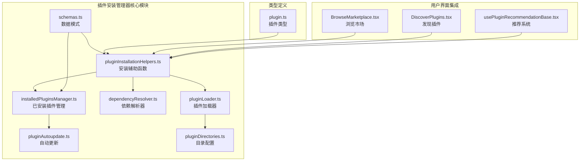

**图表来源**
- [pluginInstallationHelpers.ts:1-596](file://src/utils/plugins/pluginInstallationHelpers.ts#L1-L596)
- [installedPluginsManager.ts:1-800](file://src/utils/plugins/installedPluginsManager.ts#L1-L800)
- [dependencyResolver.ts:1-306](file://src/utils/plugins/dependencyResolver.ts#L1-L306)

**章节来源**
- [pluginInstallationHelpers.ts:1-596](file://src/utils/plugins/pluginInstallationHelpers.ts#L1-L596)
- [installedPluginsManager.ts:1-800](file://src/utils/plugins/installedPluginsManager.ts#L1-L800)

## 核心组件

### 安装辅助系统

安装辅助系统提供了插件安装的核心功能，包括缓存管理、路径验证和注册机制。

**主要功能：**
- 缓存插件到版本化目录结构
- 验证路径安全性防止路径遍历攻击
- 注册插件到安装数据库
- 处理本地和远程插件源

### 已安装插件管理系统

负责维护插件的安装状态和元数据，支持多版本和多范围的插件管理。

**核心特性：**
- 版本化缓存结构管理
- 多范围安装支持（用户、项目、本地）
- 插件迁移和清理机制
- 内存缓存优化

### 依赖解析器

实现复杂的依赖解析算法，确保插件安装时的依赖完整性。

**算法特点：**
- 深度优先搜索（DFS）遍历
- 循环依赖检测
- 跨市场依赖限制
- 递归闭包计算

**章节来源**
- [pluginInstallationHelpers.ts:128-226](file://src/utils/plugins/pluginInstallationHelpers.ts#L128-L226)
- [installedPluginsManager.ts:406-443](file://src/utils/plugins/installedPluginsManager.ts#L406-L443)
- [dependencyResolver.ts:95-159](file://src/utils/plugins/dependencyResolver.ts#L95-L159)

## 架构概览

插件安装管理器采用分层架构设计，每层都有明确的职责分工：

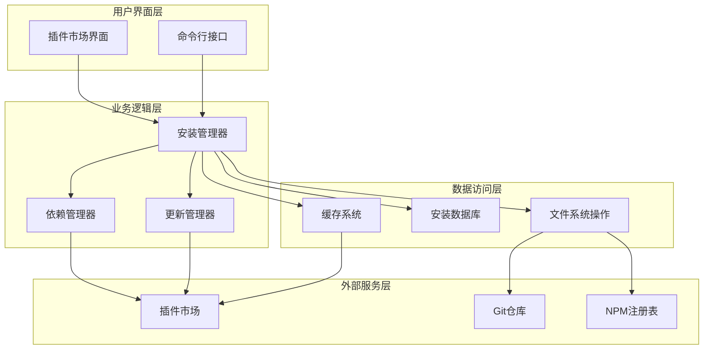

**图表来源**
- [pluginInstallationHelpers.ts:348-481](file://src/utils/plugins/pluginInstallationHelpers.ts#L348-L481)
- [pluginAutoupdate.ts:227-284](file://src/utils/plugins/pluginAutoupdate.ts#L227-L284)

## 详细组件分析

### 安装流程组件

安装流程是插件管理器的核心，负责协调整个安装过程的各个步骤。

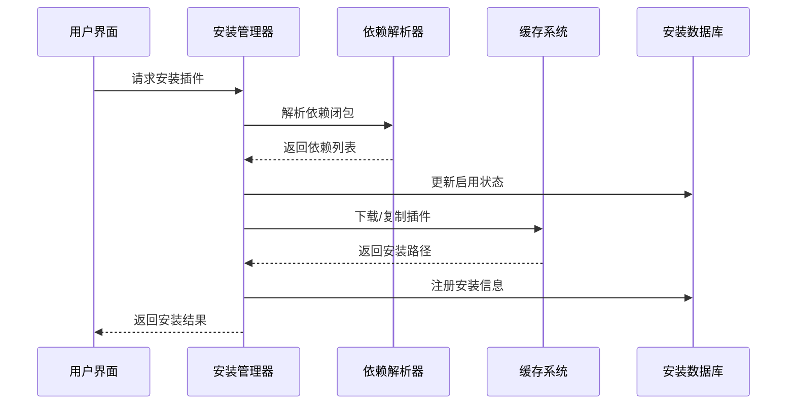

**图表来源**
- [pluginInstallationHelpers.ts:348-481](file://src/utils/plugins/pluginInstallationHelpers.ts#L348-L481)

#### 安装核心算法

安装流程的核心算法实现了高效的依赖解析和缓存管理：

**依赖解析算法：**
1. 验证插件策略限制
2. 解析依赖闭包（DFS遍历）
3. 检查跨市场依赖限制
4. 写入设置文件
5. 材料化缓存（下载/复制）

**缓存管理策略：**
- 版本化缓存目录结构
- 支持ZIP缓存模式
- 种子缓存预取机制
- 清理过期缓存

**章节来源**
- [pluginInstallationHelpers.ts:348-481](file://src/utils/plugins/pluginInstallationHelpers.ts#L348-L481)
- [pluginLoader.ts:365-465](file://src/utils/plugins/pluginLoader.ts#L365-L465)

### 依赖解析算法

依赖解析器实现了复杂的图算法来确保插件安装的正确性。

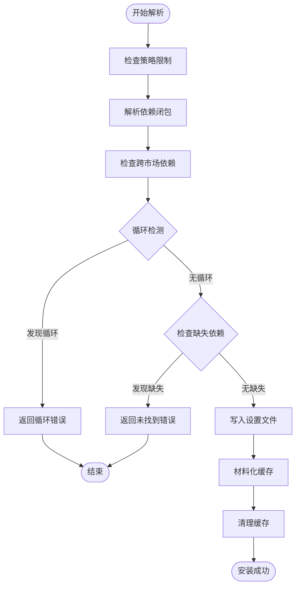

**图表来源**
- [dependencyResolver.ts:95-159](file://src/utils/plugins/dependencyResolver.ts#L95-L159)

#### 算法复杂度分析

- **时间复杂度：** O(V + E)，其中 V 是插件数量，E 是依赖关系数量
- **空间复杂度：** O(V) 用于存储访问状态和调用栈
- **依赖解析：** 使用深度优先搜索确保所有依赖都被正确处理

**章节来源**
- [dependencyResolver.ts:95-159](file://src/utils/plugins/dependencyResolver.ts#L95-L159)

### 版本冲突处理机制

系统实现了智能的版本冲突检测和解决机制：

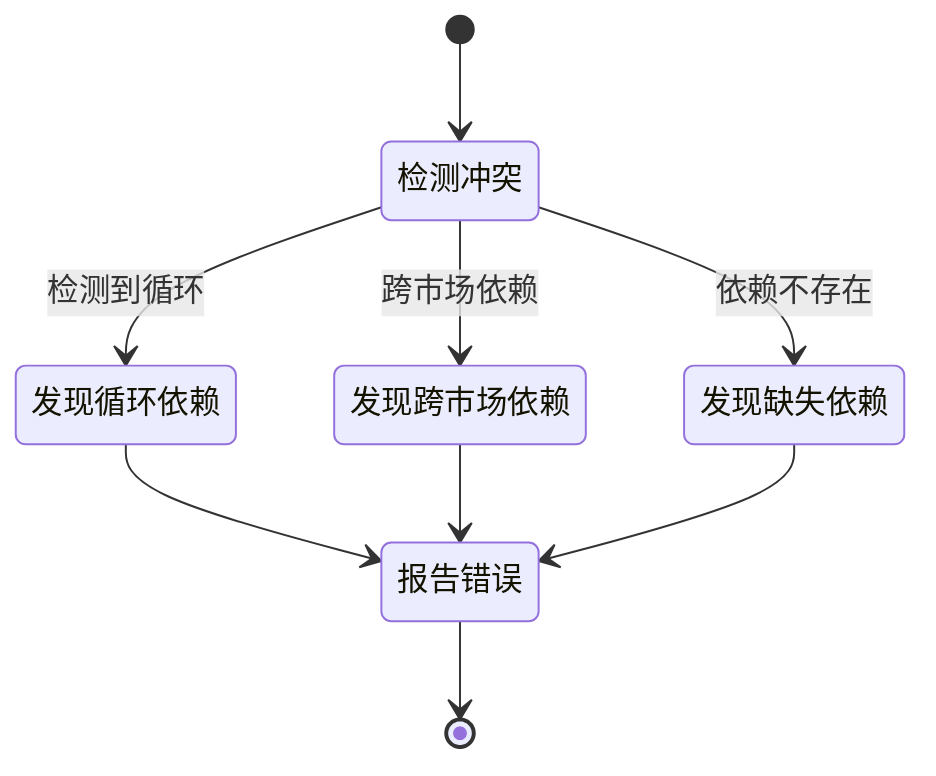

**图表来源**
- [dependencyResolver.ts:122-132](file://src/utils/plugins/dependencyResolver.ts#L122-L132)

#### 冲突处理策略

1. **循环依赖：** 自动检测并阻止安装
2. **跨市场依赖：** 默认阻止，允许通过策略配置
3. **缺失依赖：** 提供详细的错误信息和解决方案

**章节来源**
- [dependencyResolver.ts:122-132](file://src/utils/plugins/dependencyResolver.ts#L122-L132)

### 回滚机制

系统提供了完整的回滚机制来处理安装失败的情况：

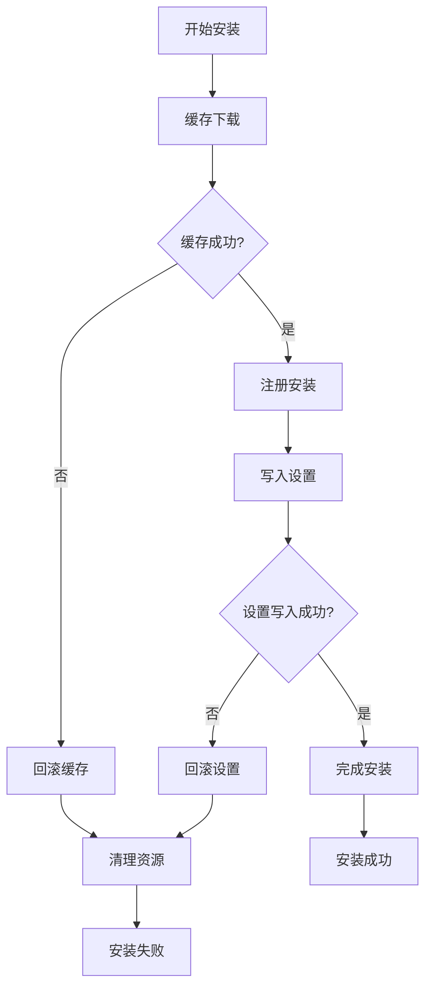

**图表来源**
- [pluginInstallationHelpers.ts:430-444](file://src/utils/plugins/pluginInstallationHelpers.ts#L430-L444)

#### 回滚触发条件

- 缓存下载失败
- 设置文件写入失败
- 安装过程中断
- 文件系统权限问题

**章节来源**
- [pluginInstallationHelpers.ts:430-444](file://src/utils/plugins/pluginInstallationHelpers.ts#L430-L444)

### 状态管理与进度跟踪

系统实现了完整的状态管理和进度跟踪机制：

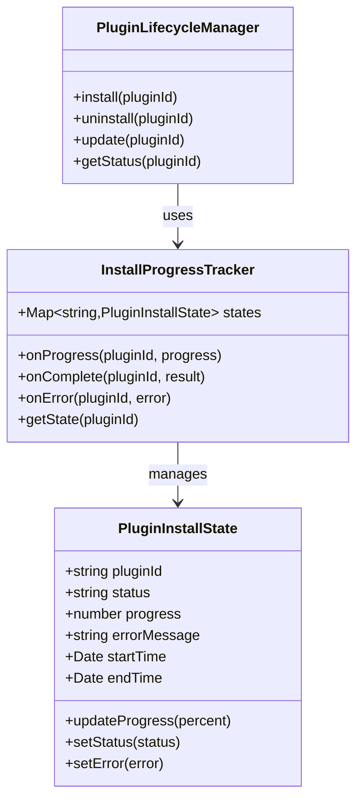

**图表来源**
- [pluginInstallationHelpers.ts:506-595](file://src/utils/plugins/pluginInstallationHelpers.ts#L506-L595)

#### 状态转换

- **待处理** → **进行中** → **完成** 或 **失败**
- **进行中** → **暂停** → **继续** 或 **取消**
- **失败** → **重试** → **最终失败**

**章节来源**
- [pluginInstallationHelpers.ts:506-595](file://src/utils/plugins/pluginInstallationHelpers.ts#L506-L595)

### 错误恢复策略

系统提供了多层次的错误恢复策略：

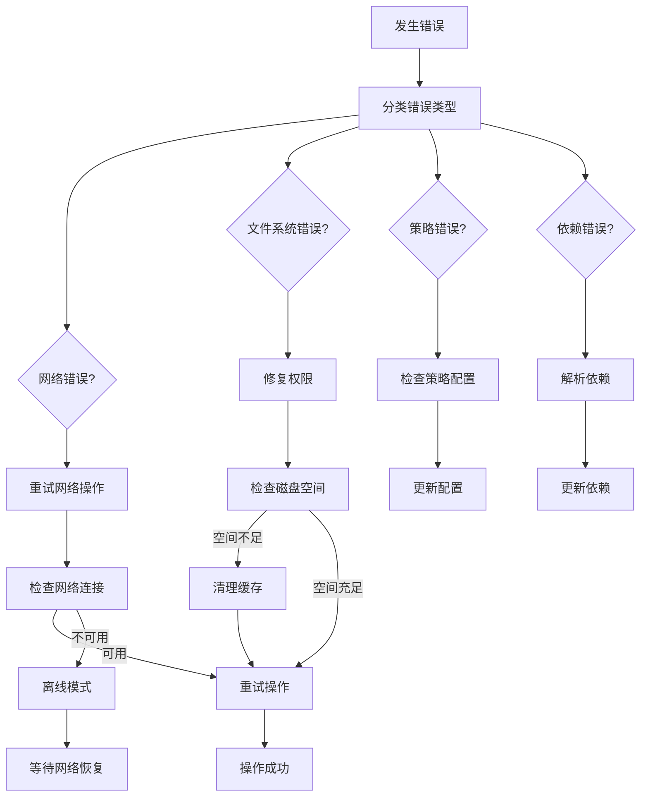

**图表来源**
- [pluginInstallationHelpers.ts:590-595](file://src/utils/plugins/pluginInstallationHelpers.ts#L590-L595)

**章节来源**
- [pluginInstallationHelpers.ts:590-595](file://src/utils/plugins/pluginInstallationHelpers.ts#L590-L595)

### 插件缓存机制

系统实现了高效的缓存机制来优化插件安装性能：

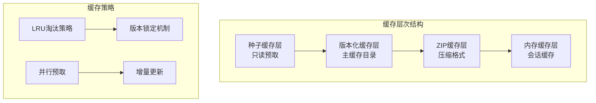

**图表来源**
- [pluginLoader.ts:195-238](file://src/utils/plugins/pluginLoader.ts#L195-L238)
- [pluginLoader.ts:365-465](file://src/utils/plugins/pluginLoader.ts#L365-L465)

#### 缓存优化技术

- **种子缓存：** 预先填充的只读缓存层
- **版本化存储：** 按版本组织的缓存结构
- **ZIP压缩：** 减少磁盘占用和I/O开销
- **并行预取：** 提升缓存命中率

**章节来源**
- [pluginLoader.ts:195-238](file://src/utils/plugins/pluginLoader.ts#L195-L238)
- [pluginLoader.ts:365-465](file://src/utils/plugins/pluginLoader.ts#L365-L465)

### 下载优化

系统采用了多种下载优化技术来提升安装性能：

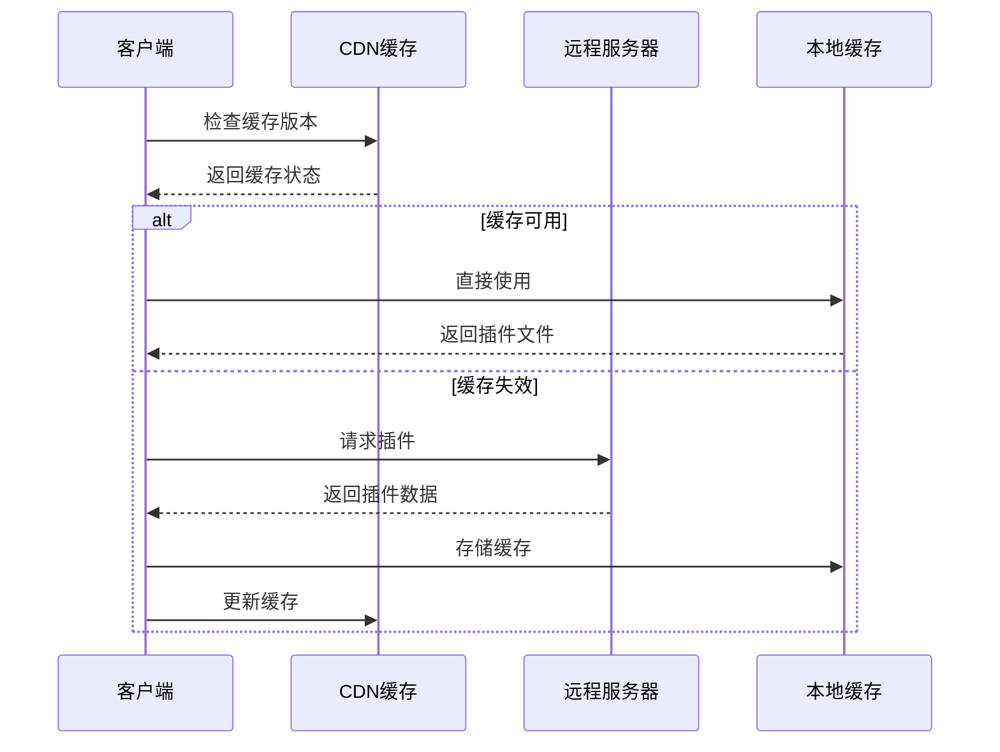

**图表来源**
- [pluginLoader.ts:534-640](file://src/utils/plugins/pluginLoader.ts#L534-L640)

#### 优化策略

- **智能缓存检测：** 避免不必要的下载
- **增量更新：** 只下载变更部分
- **并行下载：** 多个插件同时下载
- **断点续传：** 支持网络中断后的恢复

**章节来源**
- [pluginLoader.ts:534-640](file://src/utils/plugins/pluginLoader.ts#L534-L640)

### 网络异常处理

系统实现了完善的网络异常处理机制：

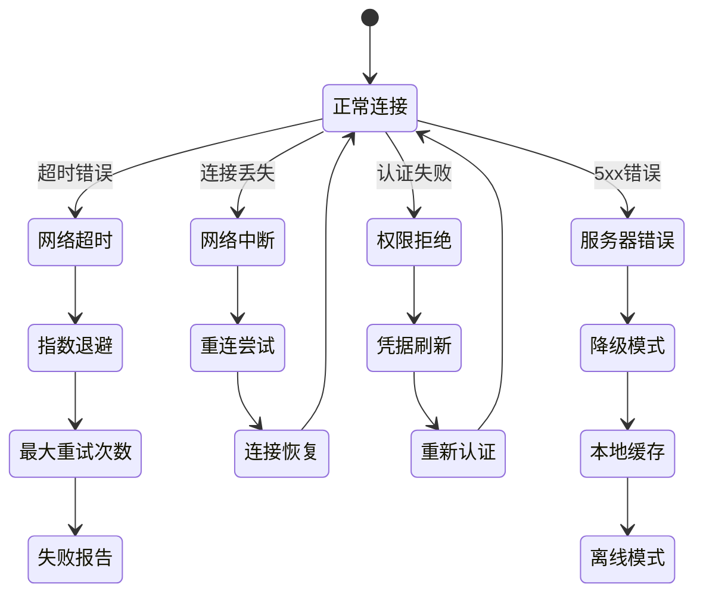

**图表来源**
- [pluginLoader.ts:562-640](file://src/utils/plugins/pluginLoader.ts#L562-L640)

**章节来源**
- [pluginLoader.ts:562-640](file://src/utils/plugins/pluginLoader.ts#L562-L640)

## 依赖关系分析

插件安装管理器的依赖关系体现了清晰的分层架构：

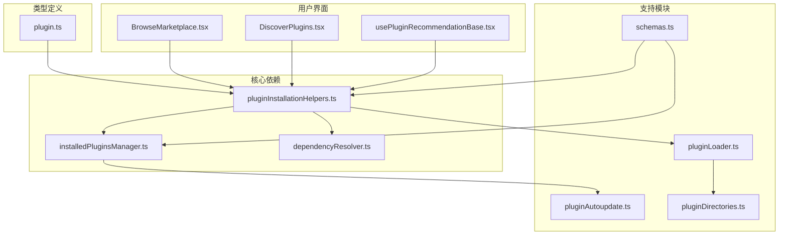

**图表来源**
- [pluginInstallationHelpers.ts:1-60](file://src/utils/plugins/pluginInstallationHelpers.ts#L1-L60)
- [installedPluginsManager.ts:1-50](file://src/utils/plugins/installedPluginsManager.ts#L1-L50)

### 耦合度分析

- **低耦合：** 各模块职责单一，接口清晰
- **高内聚：** 相关功能集中在同一模块
- **依赖方向：** 单向依赖，避免循环引用

**章节来源**
- [pluginInstallationHelpers.ts:1-60](file://src/utils/plugins/pluginInstallationHelpers.ts#L1-L60)
- [installedPluginsManager.ts:1-50](file://src/utils/plugins/installedPluginsManager.ts#L1-L50)

## 性能考虑

插件安装管理器在设计时充分考虑了性能优化：

### 缓存策略优化

- **多级缓存：** 种子缓存、版本化缓存、ZIP缓存
- **并行处理：** 多插件并发安装
- **智能预取：** 基于使用模式的预测性缓存

### 内存管理

- **懒加载：** 插件数据按需加载
- **内存池：** 复用对象减少GC压力
- **流式处理：** 大文件的分块处理

### I/O优化

- **批量操作：** 批量写入设置文件
- **异步处理：** 非阻塞的文件操作
- **压缩传输：** 网络传输的压缩优化

## 故障排除指南

### 常见问题诊断

**安装失败排查：**
1. 检查网络连接和代理设置
2. 验证磁盘空间和权限
3. 查看依赖解析错误信息
4. 检查插件策略配置

**缓存问题处理：**
1. 清理损坏的缓存文件
2. 检查缓存目录权限
3. 验证缓存完整性
4. 重新生成缓存索引

**依赖冲突解决：**
1. 分析依赖树结构
2. 检查版本兼容性
3. 验证跨市场依赖规则
4. 寻找替代依赖方案

### 调试工具和日志

系统提供了丰富的调试工具：

- **详细日志记录：** 每个步骤的执行日志
- **性能监控：** 关键操作的耗时统计
- **错误追踪：** 完整的错误堆栈信息
- **状态查询：** 实时的系统状态查看

**章节来源**
- [pluginInstallationHelpers.ts:590-595](file://src/utils/plugins/pluginInstallationHelpers.ts#L590-L595)
- [installedPluginsManager.ts:354-363](file://src/utils/plugins/installedPluginsManager.ts#L354-L363)

## 结论

插件安装管理器是一个设计精良、功能完备的系统，它通过模块化的架构和高效的算法实现了可靠的插件生命周期管理。系统的主要优势包括：

1. **可靠性：** 完善的错误处理和回滚机制
2. **性能：** 多级缓存和并行处理优化
3. **可扩展性：** 清晰的接口设计支持功能扩展
4. **用户体验：** 直观的进度跟踪和状态反馈

该系统为 Claude Code 的插件生态提供了坚实的基础，支持从简单的本地插件到复杂的多市场插件的全场景需求。通过持续的优化和改进，插件安装管理器将继续为用户提供优秀的插件管理体验。