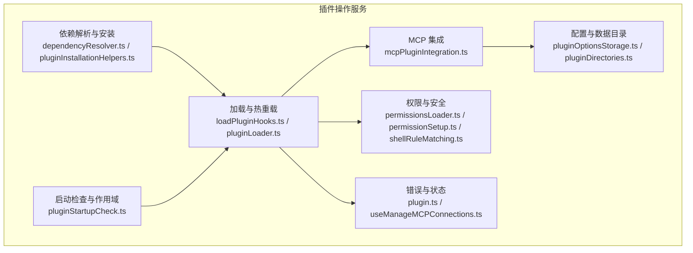
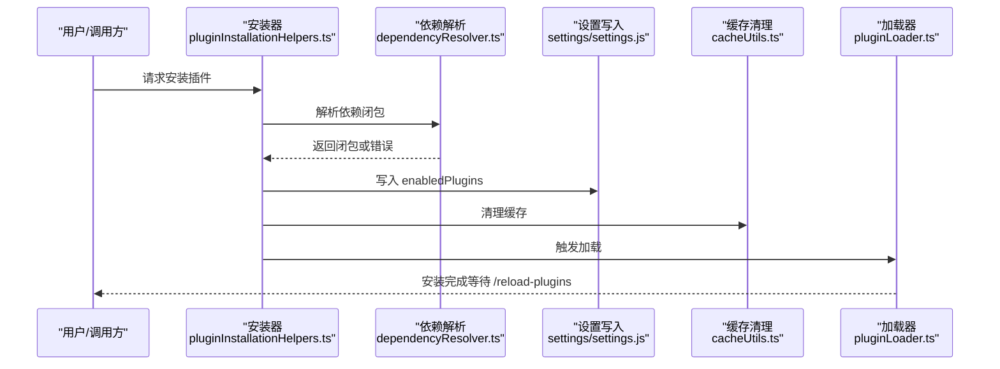
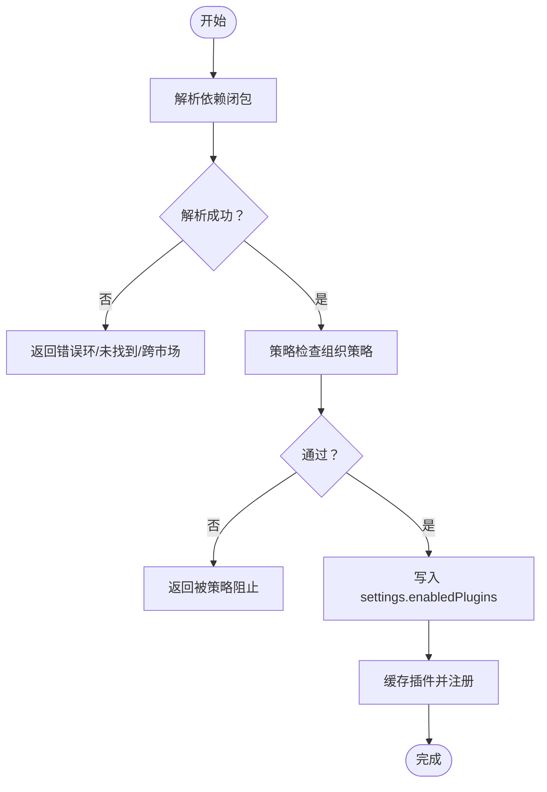
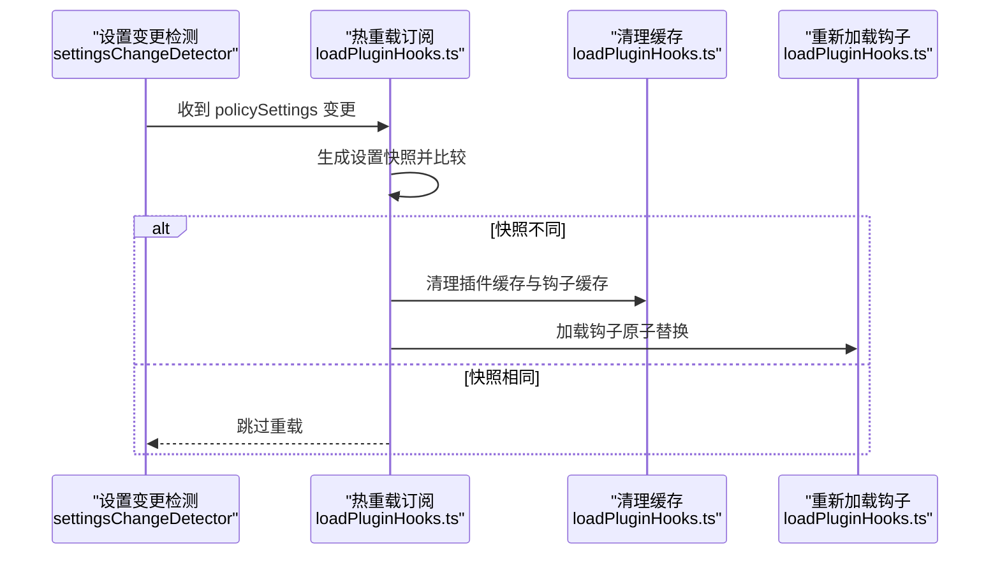
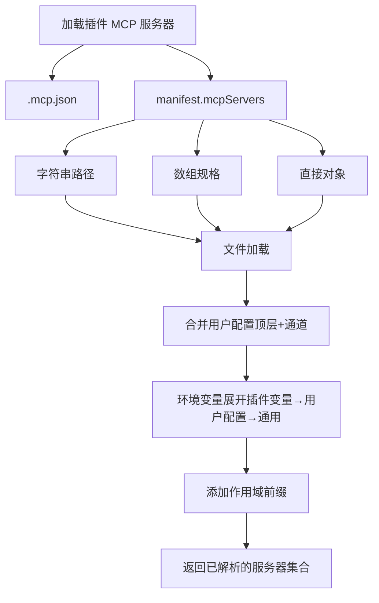
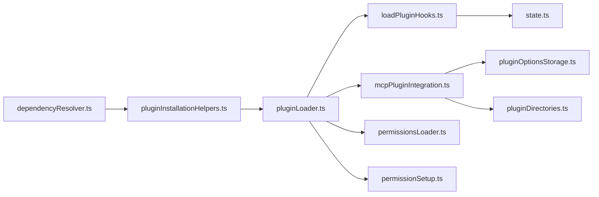

# 插件操作服务

<cite>
**本文引用的文件**
- [loadPluginHooks.ts](file://src/utils/plugins/loadPluginHooks.ts)
- [dependencyResolver.ts](file://src/utils/plugins/dependencyResolver.ts)
- [pluginInstallationHelpers.ts](file://src/utils/plugins/pluginInstallationHelpers.ts)
- [pluginStartupCheck.ts](file://src/utils/plugins/pluginStartupCheck.ts)
- [mcpPluginIntegration.ts](file://src/utils/plugins/mcpPluginIntegration.ts)
- [pluginLoader.ts](file://src/utils/plugins/pluginLoader.ts)
- [pluginDirectories.ts](file://src/utils/plugins/pluginDirectories.ts)
- [pluginOptionsStorage.ts](file://src/utils/plugins/pluginOptionsStorage.ts)
- [plugin.ts](file://src/types/plugin.ts)
- [state.ts](file://src/bootstrap/state.ts)
- [permissionsLoader.ts](file://src/utils/permissions/permissionsLoader.ts)
- [permissionSetup.ts](file://src/utils/permissions/permissionSetup.ts)
- [shellRuleMatching.ts](file://src/utils/permissions/shellRuleMatching.ts)
- [useManageMCPConnections.ts](file://src/services/mcp/useManageMCPConnections.ts)
</cite>

## 目录
1. [简介](#简介)
2. [项目结构](#项目结构)
3. [核心组件](#核心组件)
4. [架构总览](#架构总览)
5. [详细组件分析](#详细组件分析)
6. [依赖分析](#依赖分析)
7. [性能考虑](#性能考虑)
8. [故障排查指南](#故障排查指南)
9. [结论](#结论)
10. [附录](#附录)

## 简介
本文件系统性阐述插件操作服务的设计与实现，覆盖插件的动态加载、卸载与热重载机制；插件依赖关系的解析与验证、循环依赖检测与策略；插件配置管理、环境变量注入与权限控制；插件生命周期钩子、事件监听与状态同步；以及错误处理、日志记录与性能监控的实现要点。目标是帮助开发者在不深入源码的前提下，理解并正确使用与扩展插件系统。

## 项目结构
插件操作服务主要由以下模块构成：
- 依赖解析与安装：负责依赖闭包计算、跨市场依赖限制、安装策略与设置写入。
- 启动检查与作用域：负责合并策略来源、确定可编辑范围、缺失插件识别与批量安装。
- 加载与热重载：负责插件清单加载、组件发现、缓存与注册、钩子热重载。
- MCP 集成：负责从插件加载 MCP 服务器、用户配置注入、环境变量展开与作用域命名。
- 配置与数据目录：负责选项存储（含敏感信息）、插件数据目录、种子缓存与清理。
- 权限与安全：负责权限规则加载、危险规则恢复、规则匹配与建议生成。
- 错误与状态：负责统一错误模型、错误去重与状态上报。

图表来源
- [dependencyResolver.ts:95-159](file://src/utils/plugins/dependencyResolver.ts#L95-L159)
- [pluginInstallationHelpers.ts:348-481](file://src/utils/plugins/pluginInstallationHelpers.ts#L348-L481)
- [pluginStartupCheck.ts:39-72](file://src/utils/plugins/pluginStartupCheck.ts#L39-L72)
- [loadPluginHooks.ts:91-157](file://src/utils/plugins/loadPluginHooks.ts#L91-L157)
- [mcpPluginIntegration.ts:366-429](file://src/utils/plugins/mcpPluginIntegration.ts#L366-L429)
- [pluginOptionsStorage.ts:56-81](file://src/utils/plugins/pluginOptionsStorage.ts#L56-L81)
- [pluginDirectories.ts:119-123](file://src/utils/plugins/pluginDirectories.ts#L119-L123)
- [permissionsLoader.ts:140-145](file://src/utils/permissions/permissionsLoader.ts#L140-L145)
- [permissionSetup.ts:561-579](file://src/utils/permissions/permissionSetup.ts#L561-L579)
- [shellRuleMatching.ts:159-184](file://src/utils/permissions/shellRuleMatching.ts#L159-L184)
- [plugin.ts:101-284](file://src/types/plugin.ts#L101-L284)
- [useManageMCPConnections.ts:103-132](file://src/services/mcp/useManageMCPConnections.ts#L103-L132)

章节来源
- [loadPluginHooks.ts:1-288](file://src/utils/plugins/loadPluginHooks.ts#L1-L288)
- [dependencyResolver.ts:1-306](file://src/utils/plugins/dependencyResolver.ts#L1-L306)
- [pluginInstallationHelpers.ts:1-596](file://src/utils/plugins/pluginInstallationHelpers.ts#L1-L596)
- [pluginStartupCheck.ts:1-342](file://src/utils/plugins/pluginStartupCheck.ts#L1-L342)
- [mcpPluginIntegration.ts:1-635](file://src/utils/plugins/mcpPluginIntegration.ts#L1-L635)
- [pluginLoader.ts:1-200](file://src/utils/plugins/pluginLoader.ts#L1-L200)
- [pluginDirectories.ts:1-179](file://src/utils/plugins/pluginDirectories.ts#L1-L179)
- [pluginOptionsStorage.ts:1-200](file://src/utils/plugins/pluginOptionsStorage.ts#L1-L200)
- [plugin.ts:1-364](file://src/types/plugin.ts#L1-L364)
- [state.ts:166-167](file://src/bootstrap/state.ts#L166-L167)
- [permissionsLoader.ts:129-177](file://src/utils/permissions/permissionsLoader.ts#L129-L177)
- [permissionSetup.ts:555-579](file://src/utils/permissions/permissionSetup.ts#L555-L579)
- [shellRuleMatching.ts:153-228](file://src/utils/permissions/shellRuleMatching.ts#L153-L228)
- [useManageMCPConnections.ts:87-132](file://src/services/mcp/useManageMCPConnections.ts#L87-L132)

## 核心组件
- 依赖解析与安装
  - 依赖闭包计算与循环检测：通过深度优先遍历收集闭包，并在遇到栈中已访问节点时判定环。
  - 跨市场依赖限制：根市场允许白名单放行，否则阻止自动安装。
  - 安装流程：策略性地写入 settings、缓存插件、清理缓存并返回结果。
- 启动检查与作用域
  - 合并策略来源，确定“是否启用”的权威判断。
  - 计算可编辑范围，确保写回位置正确。
  - 批量安装与进度回调，支持本地/外部插件路径校验。
- 加载与热重载
  - 统一加载入口，按组件类型发现与验证。
  - 原子化替换注册表，避免并发加载导致的钩子丢失。
  - 基于设置快照的热重载订阅，仅在实际变更时触发。
- MCP 集成
  - 从插件加载 MCP 服务器配置，支持 .mcp.json、manifest、MCPB。
  - 用户配置与环境变量展开，作用域命名避免冲突。
- 配置与数据目录
  - 选项存储拆分敏感/非敏感两类，分别写入安全存储与 settings。
  - 插件数据目录持久化，随插件更新保留，卸载清理。
- 权限与安全
  - 规则来源聚合，危险规则暂存与恢复。
  - 命令匹配与建议生成，辅助用户快速修复权限问题。
- 错误与状态
  - 统一错误模型，便于 UI 展示与日志追踪。
  - 错误去重与状态上报，避免重复告警。

章节来源
- [dependencyResolver.ts:95-159](file://src/utils/plugins/dependencyResolver.ts#L95-L159)
- [pluginInstallationHelpers.ts:348-481](file://src/utils/plugins/pluginInstallationHelpers.ts#L348-L481)
- [pluginStartupCheck.ts:39-163](file://src/utils/plugins/pluginStartupCheck.ts#L39-L163)
- [loadPluginHooks.ts:91-157](file://src/utils/plugins/loadPluginHooks.ts#L91-L157)
- [mcpPluginIntegration.ts:366-429](file://src/utils/plugins/mcpPluginIntegration.ts#L366-L429)
- [pluginOptionsStorage.ts:56-194](file://src/utils/plugins/pluginOptionsStorage.ts#L56-L194)
- [pluginDirectories.ts:119-123](file://src/utils/plugins/pluginDirectories.ts#L119-L123)
- [permissionsLoader.ts:140-145](file://src/utils/permissions/permissionsLoader.ts#L140-L145)
- [permissionSetup.ts:561-579](file://src/utils/permissions/permissionSetup.ts#L561-L579)
- [shellRuleMatching.ts:159-184](file://src/utils/permissions/shellRuleMatching.ts#L159-L184)
- [plugin.ts:101-284](file://src/types/plugin.ts#L101-L284)
- [useManageMCPConnections.ts:103-132](file://src/services/mcp/useManageMCPConnections.ts#L103-L132)

## 架构总览
插件操作服务围绕“加载—注册—运行—热重载”闭环构建，关键路径如下：
- 安装阶段：解析依赖闭包 → 写入 settings → 缓存插件 → 清理缓存。
- 运行阶段：加载插件清单 → 注册钩子 → 解析 MCP 服务器 → 注入环境变量 → 作用域命名。
- 热重载阶段：基于设置快照对比 → 清理缓存 → 重新加载钩子。
- 权限阶段：聚合规则 → 危险规则恢复 → 匹配与建议生成。

图表来源
- [pluginInstallationHelpers.ts:348-481](file://src/utils/plugins/pluginInstallationHelpers.ts#L348-L481)
- [dependencyResolver.ts:95-159](file://src/utils/plugins/dependencyResolver.ts#L95-L159)
- [pluginLoader.ts:1-200](file://src/utils/plugins/pluginLoader.ts#L1-L200)

## 详细组件分析

### 依赖解析与安装
- 依赖闭包计算
  - 使用 DFS 收集闭包，跳过已启用依赖以避免意外写入 settings。
  - 跨市场依赖默认禁止，根市场可通过 allowlist 放行。
  - 发现环时返回环链路，便于提示用户修正。
- 安装核心流程
  - 策略性写入 settings 的 enabledPlugins 字段，一次性提交整个闭包。
  - 对每个闭包成员执行缓存与注册，支持本地/外部插件路径校验。
  - 完成后清理所有相关缓存，确保后续加载一致性。
- 错误格式化
  - 将解析失败映射为用户可读消息，包含跨市场依赖提示与 marketplace 添加建议。

图表来源
- [dependencyResolver.ts:95-159](file://src/utils/plugins/dependencyResolver.ts#L95-L159)
- [pluginInstallationHelpers.ts:348-481](file://src/utils/plugins/pluginInstallationHelpers.ts#L348-L481)

章节来源
- [dependencyResolver.ts:95-159](file://src/utils/plugins/dependencyResolver.ts#L95-L159)
- [pluginInstallationHelpers.ts:348-481](file://src/utils/plugins/pluginInstallationHelpers.ts#L348-L481)

### 启动检查与作用域
- 启用状态权威判断
  - 合并策略来源（policy > local > project > user），并叠加 --add-dir 会话级插件。
- 可编辑范围解析
  - 从高到低优先级确定写回位置，排除不可编辑的 managed 源。
- 批量安装
  - 支持进度回调，本地插件路径校验，外部插件缓存注册，最终写回 settings。

章节来源
- [pluginStartupCheck.ts:39-163](file://src/utils/plugins/pluginStartupCheck.ts#L39-L163)
- [pluginStartupCheck.ts:272-341](file://src/utils/plugins/pluginStartupCheck.ts#L272-L341)

### 加载与热重载
- 加载与注册
  - 统一加载入口，按组件类型发现与验证，支持 hooks、commands、agents、skills、output-styles 等。
  - 原子化替换注册表：先清空再注册，避免并发加载导致的钩子丢失。
- 钩子热重载
  - 基于设置快照比较，仅当实际变更时触发清理缓存与重新加载。
  - 支持存活钩子筛选，确保禁用插件不再触发。
- 状态与调试
  - 日志记录注册数量与来源插件，便于诊断。

图表来源
- [loadPluginHooks.ts:255-287](file://src/utils/plugins/loadPluginHooks.ts#L255-L287)
- [loadPluginHooks.ts:159-167](file://src/utils/plugins/loadPluginHooks.ts#L159-L167)
- [loadPluginHooks.ts:179-207](file://src/utils/plugins/loadPluginHooks.ts#L179-L207)

章节来源
- [loadPluginHooks.ts:91-157](file://src/utils/plugins/loadPluginHooks.ts#L91-L157)
- [loadPluginHooks.ts:179-207](file://src/utils/plugins/loadPluginHooks.ts#L179-L207)
- [loadPluginHooks.ts:255-287](file://src/utils/plugins/loadPluginHooks.ts#L255-L287)

### MCP 集成
- 配置来源
  - 支持 .mcp.json、manifest.mcpServers、MCPB 文件，多来源合并。
- 用户配置与环境变量
  - 合并顶层 manifest.userConfig 与通道级 userConfig，优先通道级。
  - 依次进行插件变量、用户配置变量、通用环境变量展开。
- 作用域命名与冲突避免
  - 为服务器名添加前缀“plugin:{name}:{server}”，避免跨插件冲突。
- 错误收集
  - 下载/解压/清单校验失败等错误分类记录，便于 UI 提示。

图表来源
- [mcpPluginIntegration.ts:131-212](file://src/utils/plugins/mcpPluginIntegration.ts#L131-L212)
- [mcpPluginIntegration.ts:366-429](file://src/utils/plugins/mcpPluginIntegration.ts#L366-L429)
- [mcpPluginIntegration.ts:440-458](file://src/utils/plugins/mcpPluginIntegration.ts#L440-L458)
- [mcpPluginIntegration.ts:465-582](file://src/utils/plugins/mcpPluginIntegration.ts#L465-L582)
- [mcpPluginIntegration.ts:589-634](file://src/utils/plugins/mcpPluginIntegration.ts#L589-L634)

章节来源
- [mcpPluginIntegration.ts:131-212](file://src/utils/plugins/mcpPluginIntegration.ts#L131-L212)
- [mcpPluginIntegration.ts:366-429](file://src/utils/plugins/mcpPluginIntegration.ts#L366-L429)
- [mcpPluginIntegration.ts:440-458](file://src/utils/plugins/mcpPluginIntegration.ts#L440-L458)
- [mcpPluginIntegration.ts:465-582](file://src/utils/plugins/mcpPluginIntegration.ts#L465-L582)
- [mcpPluginIntegration.ts:589-634](file://src/utils/plugins/mcpPluginIntegration.ts#L589-L634)

### 配置与数据目录
- 选项存储
  - 敏感字段写入安全存储，非敏感字段写入 settings.json。
  - 写入时对另一侧进行键集合清洗，避免泄露。
- 数据目录
  - 插件数据目录持久化，随插件更新保留，卸载最后清理。
- 种子缓存
  - 支持只读种子目录层叠，提升冷启动与离线可用性。

章节来源
- [pluginOptionsStorage.ts:56-81](file://src/utils/plugins/pluginOptionsStorage.ts#L56-L81)
- [pluginOptionsStorage.ts:90-194](file://src/utils/plugins/pluginOptionsStorage.ts#L90-L194)
- [pluginDirectories.ts:119-123](file://src/utils/plugins/pluginDirectories.ts#L119-L123)
- [pluginDirectories.ts:130-179](file://src/utils/plugins/pluginDirectories.ts#L130-L179)

### 权限与安全
- 规则聚合
  - 从可编辑来源加载规则，形成最终规则集。
- 危险规则恢复
  - 在模式切换时恢复之前暂存的危险规则，保证用户体验连续性。
- 规则匹配与建议
  - 支持前缀、通配符与精确匹配，生成添加规则的建议。

章节来源
- [permissionsLoader.ts:140-145](file://src/utils/permissions/permissionsLoader.ts#L140-L145)
- [permissionSetup.ts:561-579](file://src/utils/permissions/permissionSetup.ts#L561-L579)
- [shellRuleMatching.ts:159-184](file://src/utils/permissions/shellRuleMatching.ts#L159-L184)
- [shellRuleMatching.ts:189-206](file://src/utils/permissions/shellRuleMatching.ts#L189-L206)
- [shellRuleMatching.ts:211-228](file://src/utils/permissions/shellRuleMatching.ts#L211-L228)

### 错误与状态
- 统一错误模型
  - 为各类插件错误定义结构化类型，便于 UI 与日志处理。
- 错误去重与状态上报
  - 在应用状态中对错误进行去重，避免重复告警。
- 状态同步
  - 钩子注册表保存在全局状态中，供 SDK 回调与插件原生钩子共享。

章节来源
- [plugin.ts:101-284](file://src/types/plugin.ts#L101-L284)
- [useManageMCPConnections.ts:95-132](file://src/services/mcp/useManageMCPConnections.ts#L95-L132)
- [state.ts:166-167](file://src/bootstrap/state.ts#L166-L167)

## 依赖分析
- 组件耦合
  - 依赖解析与安装模块与加载器存在强耦合：安装流程依赖加载器的缓存与注册能力。
  - 钩子热重载依赖设置变更检测与加载器缓存清理。
  - MCP 集成依赖选项存储与目录模块，确保用户配置与数据目录一致。
- 外部依赖
  - 设置系统（settings/settings.js）用于读写 enabledPlugins 与 pluginConfigs。
  - 安全存储（secureStorage）用于敏感选项持久化。
  - OpenTelemetry 提供指标与日志（在状态模块中定义）。

图表来源
- [dependencyResolver.ts:95-159](file://src/utils/plugins/dependencyResolver.ts#L95-L159)
- [pluginInstallationHelpers.ts:348-481](file://src/utils/plugins/pluginInstallationHelpers.ts#L348-L481)
- [pluginLoader.ts:1-200](file://src/utils/plugins/pluginLoader.ts#L1-L200)
- [loadPluginHooks.ts:91-157](file://src/utils/plugins/loadPluginHooks.ts#L91-L157)
- [mcpPluginIntegration.ts:366-429](file://src/utils/plugins/mcpPluginIntegration.ts#L366-L429)
- [pluginOptionsStorage.ts:56-81](file://src/utils/plugins/pluginOptionsStorage.ts#L56-L81)
- [pluginDirectories.ts:119-123](file://src/utils/plugins/pluginDirectories.ts#L119-L123)
- [state.ts:166-167](file://src/bootstrap/state.ts#L166-L167)
- [permissionsLoader.ts:140-145](file://src/utils/permissions/permissionsLoader.ts#L140-L145)
- [permissionSetup.ts:561-579](file://src/utils/permissions/permissionSetup.ts#L561-L579)

章节来源
- [pluginLoader.ts:1-200](file://src/utils/plugins/pluginLoader.ts#L1-L200)
- [state.ts:166-167](file://src/bootstrap/state.ts#L166-L167)

## 性能考虑
- 缓存与懒加载
  - 选项加载与钩子加载采用记忆化缓存，减少重复 I/O 与系统调用。
  - 插件数据目录惰性创建，仅在需要时初始化。
- 并行处理
  - 多来源 MCP 配置加载采用 Promise.all 并行，提升启动速度。
- 增量更新
  - 热重载仅在设置快照变化时触发，避免不必要的全量重载。
- I/O 优化
  - 支持 ZIP 缓存与种子目录，降低网络与磁盘压力。

章节来源
- [pluginOptionsStorage.ts:56-81](file://src/utils/plugins/pluginOptionsStorage.ts#L56-L81)
- [pluginDirectories.ts:119-123](file://src/utils/plugins/pluginDirectories.ts#L119-L123)
- [mcpPluginIntegration.ts:176-204](file://src/utils/plugins/mcpPluginIntegration.ts#L176-L204)
- [loadPluginHooks.ts:255-287](file://src/utils/plugins/loadPluginHooks.ts#L255-L287)

## 故障排查指南
- 依赖相关
  - 循环依赖：根据环链路定位冲突插件，调整依赖声明。
  - 跨市场依赖：在根市场允许列表中添加目标 marketplace，或手动安装依赖后再安装。
  - 依赖未满足：检查依赖是否已启用或存在于任何 marketplace。
- 安装相关
  - 设置写入失败：检查权限与磁盘空间，确认 settings.json 可写。
  - 本地源无安装位置：交互式安装需提供 marketplace 安装位置。
- 运行相关
  - MCP 配置无效：检查环境变量是否完整，确认用户配置与 manifest.userConfig 一致。
  - 钩子未触发：确认插件已启用且未被热重载剔除；查看注册表状态。
- 权限相关
  - 规则不生效：使用建议生成工具生成添加规则的更新指令。
  - 危险规则被移除：在退出自动模式时恢复暂存规则。

章节来源
- [dependencyResolver.ts:133-135](file://src/utils/plugins/dependencyResolver.ts#L133-L135)
- [pluginInstallationHelpers.ts:304-327](file://src/utils/plugins/pluginInstallationHelpers.ts#L304-L327)
- [mcpPluginIntegration.ts:560-582](file://src/utils/plugins/mcpPluginIntegration.ts#L560-L582)
- [loadPluginHooks.ts:179-207](file://src/utils/plugins/loadPluginHooks.ts#L179-L207)
- [shellRuleMatching.ts:189-228](file://src/utils/permissions/shellRuleMatching.ts#L189-L228)
- [permissionSetup.ts:561-579](file://src/utils/permissions/permissionSetup.ts#L561-L579)

## 结论
插件操作服务通过清晰的职责划分与严格的边界控制，实现了从依赖解析、安装、加载、热重载到 MCP 集成与权限安全的完整闭环。其设计兼顾了安全性（跨市场依赖限制、敏感配置分离）、可观测性（统一错误模型、日志与状态）、与性能（缓存、并行与增量更新）。遵循本文档的实践建议，可在保证稳定性的同时高效扩展插件生态。

## 附录
- 关键流程图与类图请参考前述章节中的可视化内容。
- 如需进一步了解错误类型的扩展与实现，请参考插件错误模型定义与 UI 映射函数。