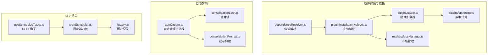
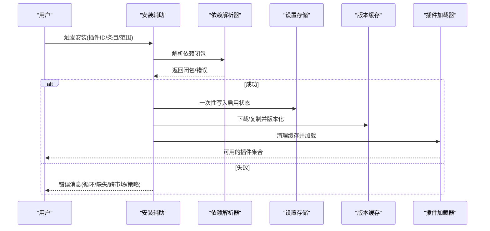
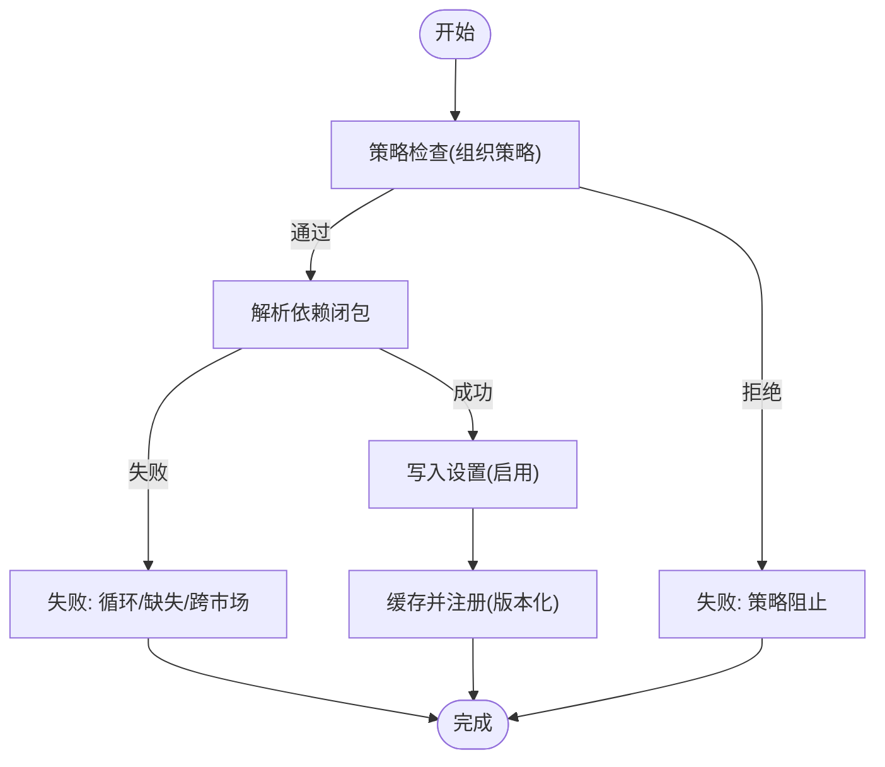
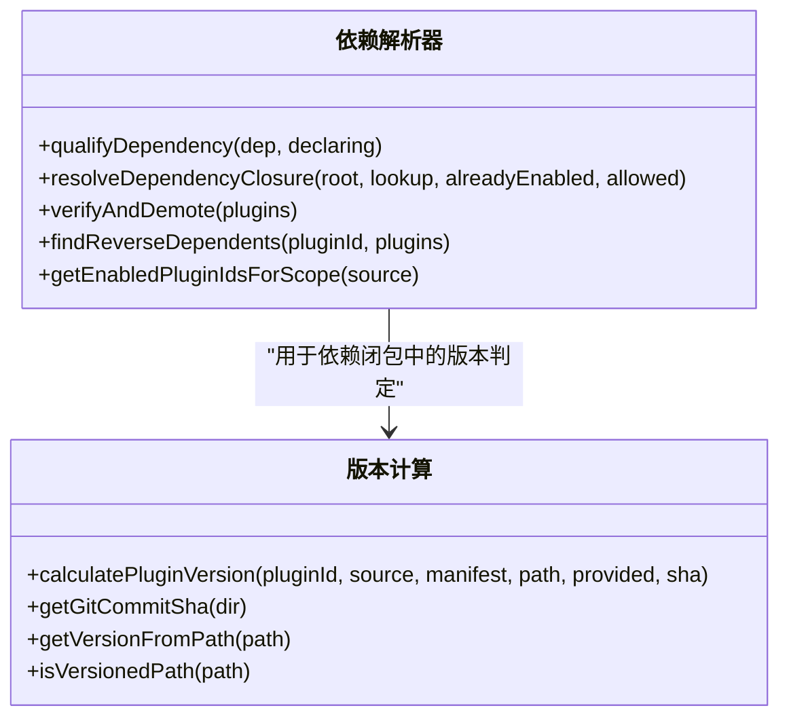
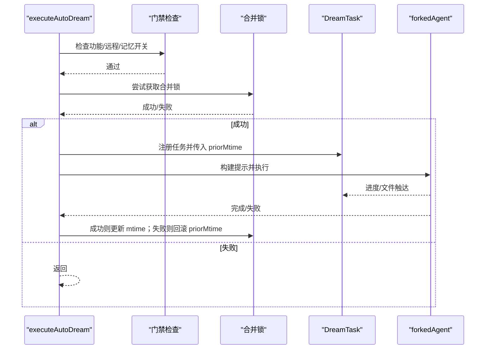
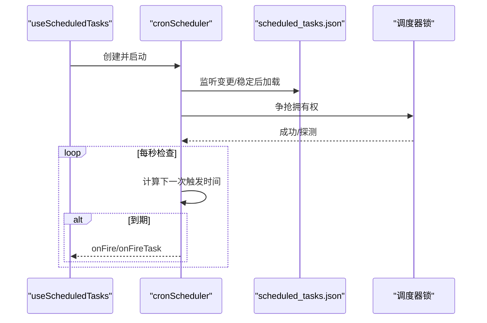
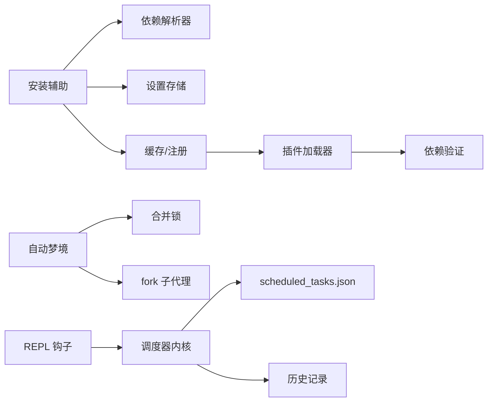

# 插件管理

<cite>
**本文引用的文件**
- [src/utils/plugins/dependencyResolver.ts](file://src/utils/plugins/dependencyResolver.ts)
- [src/utils/plugins/pluginInstallationHelpers.ts](file://src/utils/plugins/pluginInstallationHelpers.ts)
- [src/utils/plugins/pluginLoader.ts](file://src/utils/plugins/pluginLoader.ts)
- [src/utils/plugins/pluginVersioning.ts](file://src/utils/plugins/pluginVersioning.ts)
- [src/utils/plugins/marketplaceManager.ts](file://src/utils/plugins/marketplaceManager.ts)
- [src/services/autoDream/autoDream.ts](file://src/services/autoDream/autoDream.ts)
- [src/services/autoDream/consolidationLock.ts](file://src/services/autoDream/consolidationLock.ts)
- [src/services/autoDream/consolidationPrompt.ts](file://src/services/autoDream/consolidationPrompt.ts)
- [src/hooks/useScheduledTasks.ts](file://src/hooks/useScheduledTasks.ts)
- [src/utils/cronScheduler.ts](file://src/utils/cronScheduler.ts)
- [src/history.ts](file://src/history.ts)
- [src/hooks/usePluginRecommendationBase.tsx](file://src/hooks/usePluginRecommendationBase.tsx)
</cite>

## 目录
1. [简介](#简介)
2. [项目结构](#项目结构)
3. [核心组件](#核心组件)
4. [架构总览](#架构总览)
5. [详细组件分析](#详细组件分析)
6. [依赖关系分析](#依赖关系分析)
7. [性能考量](#性能考量)
8. [故障排查指南](#故障排查指南)
9. [结论](#结论)
10. [附录](#附录)

## 简介
本文件系统性阐述插件管理服务，覆盖插件安装管理、依赖解析与版本控制、自动梦境（AutoDream）服务、提示调度器（Cron）与历史记录管理，并给出生命周期管理、错误处理与性能监控的实现要点及最佳实践。目标是帮助开发者、运维人员与高级用户理解并高效使用插件生态。

## 项目结构
围绕插件管理的关键模块分布如下：
- 插件安装与依赖：依赖解析、安装辅助、加载器、版本计算、市场管理
- 自动梦境：时间门禁、会话聚合、合并锁、提示构建
- 提示调度：Cron 调度器、任务持久化、文件锁、错过任务提醒
- 历史记录：命令历史写入、锁与清理、回滚与跳过策略

**图表来源**
- [src/utils/plugins/dependencyResolver.ts:1-306](file://src/utils/plugins/dependencyResolver.ts#L1-L306)
- [src/utils/plugins/pluginInstallationHelpers.ts:1-596](file://src/utils/plugins/pluginInstallationHelpers.ts#L1-L596)
- [src/utils/plugins/pluginLoader.ts:1-800](file://src/utils/plugins/pluginLoader.ts#L1-L800)
- [src/utils/plugins/pluginVersioning.ts:1-158](file://src/utils/plugins/pluginVersioning.ts#L1-L158)
- [src/utils/plugins/marketplaceManager.ts:1-800](file://src/utils/plugins/marketplaceManager.ts#L1-L800)
- [src/services/autoDream/autoDream.ts:1-325](file://src/services/autoDream/autoDream.ts#L1-L325)
- [src/services/autoDream/consolidationLock.ts:1-141](file://src/services/autoDream/consolidationLock.ts#L1-L141)
- [src/services/autoDream/consolidationPrompt.ts:1-66](file://src/services/autoDream/consolidationPrompt.ts#L1-L66)
- [src/hooks/useScheduledTasks.ts:1-140](file://src/hooks/useScheduledTasks.ts#L1-L140)
- [src/utils/cronScheduler.ts:1-566](file://src/utils/cronScheduler.ts#L1-L566)
- [src/history.ts:275-464](file://src/history.ts#L275-L464)

**章节来源**
- [src/utils/plugins/dependencyResolver.ts:1-306](file://src/utils/plugins/dependencyResolver.ts#L1-L306)
- [src/utils/plugins/pluginInstallationHelpers.ts:1-596](file://src/utils/plugins/pluginInstallationHelpers.ts#L1-L596)
- [src/utils/plugins/pluginLoader.ts:1-800](file://src/utils/plugins/pluginLoader.ts#L1-L800)
- [src/utils/plugins/pluginVersioning.ts:1-158](file://src/utils/plugins/pluginVersioning.ts#L1-L158)
- [src/utils/plugins/marketplaceManager.ts:1-800](file://src/utils/plugins/marketplaceManager.ts#L1-L800)
- [src/services/autoDream/autoDream.ts:1-325](file://src/services/autoDream/autoDream.ts#L1-L325)
- [src/services/autoDream/consolidationLock.ts:1-141](file://src/services/autoDream/consolidationLock.ts#L1-L141)
- [src/services/autoDream/consolidationPrompt.ts:1-66](file://src/services/autoDream/consolidationPrompt.ts#L1-L66)
- [src/hooks/useScheduledTasks.ts:1-140](file://src/hooks/useScheduledTasks.ts#L1-L140)
- [src/utils/cronScheduler.ts:1-566](file://src/utils/cronScheduler.ts#L1-L566)
- [src/history.ts:275-464](file://src/history.ts#L275-L464)

## 核心组件
- 依赖解析器：对根插件进行 DFS 遍历，检测环、缺失与跨市场依赖；支持“已启用插件跳过”以避免意外设置写入；支持按允许列表放行跨市场依赖。
- 安装辅助：统一安装入口，执行策略检查、依赖闭包解析、一次性写入设置、缓存与注册、清理缓存；提供结构化结果与错误格式化。
- 插件加载器：发现与加载插件，支持市场、内联与种子目录；处理清单校验、重复名检测、启用状态与错误收集；支持 NPM、Git/GitHub、子目录克隆等源类型。
- 版本计算：优先使用清单版本或显式版本，其次使用 Git 提交 SHA（含 git-subdir 的路径哈希），最后回退到未知版本。
- 市场管理：维护已知市场、缓存市场清单、拉取更新、增强错误信息、注册种子市场。
- 自动梦境：基于时间与会话数的门禁，尝试获取合并锁，fork 子代理执行记忆整合，失败时回滚锁并记录事件。
- 提示调度：REPL 钩子挂载调度器，监听文件变更与锁竞争；支持错过任务提醒、抖动配置、会话任务与文件任务区分。
- 历史记录：命令历史写入磁盘，带文件锁与清理逻辑，支持撤销最近一次提交。

**章节来源**
- [src/utils/plugins/dependencyResolver.ts:95-159](file://src/utils/plugins/dependencyResolver.ts#L95-L159)
- [src/utils/plugins/pluginInstallationHelpers.ts:348-481](file://src/utils/plugins/pluginInstallationHelpers.ts#L348-L481)
- [src/utils/plugins/pluginLoader.ts:1-800](file://src/utils/plugins/pluginLoader.ts#L1-L800)
- [src/utils/plugins/pluginVersioning.ts:36-106](file://src/utils/plugins/pluginVersioning.ts#L36-L106)
- [src/utils/plugins/marketplaceManager.ts:264-350](file://src/utils/plugins/marketplaceManager.ts#L264-L350)
- [src/services/autoDream/autoDream.ts:122-273](file://src/services/autoDream/autoDream.ts#L122-L273)
- [src/services/autoDream/consolidationLock.ts:46-108](file://src/services/autoDream/consolidationLock.ts#L46-L108)
- [src/hooks/useScheduledTasks.ts:40-127](file://src/hooks/useScheduledTasks.ts#L40-L127)
- [src/utils/cronScheduler.ts:142-531](file://src/utils/cronScheduler.ts#L142-L531)
- [src/history.ts:292-434](file://src/history.ts#L292-L434)

## 架构总览
插件管理由“安装—加载—运行”三阶段构成，贯穿依赖解析、版本控制与市场同步；自动梦境与提示调度作为后台能力在合适时机触发，历史记录保障可审计与可恢复。

**图表来源**
- [src/utils/plugins/pluginInstallationHelpers.ts:348-481](file://src/utils/plugins/pluginInstallationHelpers.ts#L348-L481)
- [src/utils/plugins/dependencyResolver.ts:95-159](file://src/utils/plugins/dependencyResolver.ts#L95-L159)
- [src/utils/plugins/pluginLoader.ts:1-800](file://src/utils/plugins/pluginLoader.ts#L1-L800)

**章节来源**
- [src/utils/plugins/pluginInstallationHelpers.ts:348-481](file://src/utils/plugins/pluginInstallationHelpers.ts#L348-L481)
- [src/utils/plugins/dependencyResolver.ts:95-159](file://src/utils/plugins/dependencyResolver.ts#L95-L159)
- [src/utils/plugins/pluginLoader.ts:1-800](file://src/utils/plugins/pluginLoader.ts#L1-L800)

## 详细组件分析

### 插件安装管理器工作流
- 入口参数：插件ID、市场条目、安装范围（用户/项目/本地）、触发来源（建议/用户）。
- 策略与安全：
  - 组织策略拦截：安装前检查是否被策略阻止。
  - 依赖闭包：调用依赖解析器，支持跨市场白名单放行。
  - 依赖策略拦截：遍历闭包中的依赖，若被策略阻止则中止。
- 写入设置：一次性写入启用状态，避免中间态。
- 材料化：逐个缓存并注册，支持本地源路径校验与 zip 缓存模式。
- 结果返回：结构化成功/失败信息，UI 层负责通知与分析事件上报。

**图表来源**
- [src/utils/plugins/pluginInstallationHelpers.ts:348-481](file://src/utils/plugins/pluginInstallationHelpers.ts#L348-L481)
- [src/utils/plugins/dependencyResolver.ts:95-159](file://src/utils/plugins/dependencyResolver.ts#L95-L159)

**章节来源**
- [src/utils/plugins/pluginInstallationHelpers.ts:506-595](file://src/utils/plugins/pluginInstallationHelpers.ts#L506-L595)

### 依赖解析与版本控制
- 依赖解析：
  - 名称规范化：裸名称继承声明者的市场后缀；内联插件例外。
  - DFS 遍历：检测环、缺失、跨市场依赖；已启用依赖跳过。
  - 跨市场放行：仅根市场允许列表有效，且不传递信任。
- 版本计算：
  - 优先级：清单版本 > 显式版本 > Git 提交 SHA（含 git-subdir 路径哈希）> 未知。
  - 路径提取：从版本化缓存路径提取版本号，判断是否为版本化路径。

**图表来源**
- [src/utils/plugins/dependencyResolver.ts:38-306](file://src/utils/plugins/dependencyResolver.ts#L38-L306)
- [src/utils/plugins/pluginVersioning.ts:36-158](file://src/utils/plugins/pluginVersioning.ts#L36-L158)

**章节来源**
- [src/utils/plugins/dependencyResolver.ts:95-159](file://src/utils/plugins/dependencyResolver.ts#L95-L159)
- [src/utils/plugins/pluginVersioning.ts:36-106](file://src/utils/plugins/pluginVersioning.ts#L36-L106)

### 自动梦境服务（AutoDream）
- 门禁条件：
  - 功能开关、远程模式关闭、自动记忆开启。
  - 时间门：自上次合并时刻起超过阈值小时。
  - 会话门：自上次合并时刻以来有足够数量的新会话。
- 合并锁：
  - mtime 记录最后合并时间；PID 写入锁文件；死进程或解析失败时回收。
  - 失败时回滚 mtime 并延迟下次触发。
- 执行流程：
  - 获取会话列表、构建提示、fork 子代理执行、进度收集、完成/失败事件上报。
- 进度与产物：
  - 收集编辑/写入文件路径，向主对话补充“保存记忆”摘要。

**图表来源**
- [src/services/autoDream/autoDream.ts:122-273](file://src/services/autoDream/autoDream.ts#L122-L273)
- [src/services/autoDream/consolidationLock.ts:46-108](file://src/services/autoDream/consolidationLock.ts#L46-L108)

**章节来源**
- [src/services/autoDream/autoDream.ts:122-273](file://src/services/autoDream/autoDream.ts#L122-L273)
- [src/services/autoDream/consolidationLock.ts:29-108](file://src/services/autoDream/consolidationLock.ts#L29-L108)
- [src/services/autoDream/consolidationPrompt.ts:10-65](file://src/services/autoDream/consolidationPrompt.ts#L10-L65)

### 提示调度器（Cron）与历史管理
- 调度器：
  - 文件稳定性检测、锁竞争、错过任务提醒、抖动配置、会话任务与文件任务区分。
  - 递归任务老化删除、批量写入 lastFiredAt、守护定时器。
- 历史记录：
  - 异步批量写入、文件锁、清理钩子、撤销最近条目（跳过已落盘项）。

**图表来源**
- [src/hooks/useScheduledTasks.ts:40-127](file://src/hooks/useScheduledTasks.ts#L40-L127)
- [src/utils/cronScheduler.ts:142-531](file://src/utils/cronScheduler.ts#L142-L531)

**章节来源**
- [src/hooks/useScheduledTasks.ts:40-127](file://src/hooks/useScheduledTasks.ts#L40-L127)
- [src/utils/cronScheduler.ts:179-394](file://src/utils/cronScheduler.ts#L179-L394)
- [src/history.ts:292-434](file://src/history.ts#L292-L434)

### 插件生命周期管理、错误处理与性能监控
- 生命周期：
  - 发现与加载：市场/内联/种子目录；清单校验、重复名检测、启用状态。
  - 运行期：依赖验证与降级（verifyAndDemote），反向依赖查询，卸载/禁用警告。
- 错误处理：
  - 安装：路径越界保护、跨市场依赖阻断、策略拦截、设置写入失败。
  - 市场：Git 拉取增强错误消息（超时、主机密钥变化、认证失败、网络问题）。
  - 调度：错过任务提醒、批处理 lastFiredAt、锁探测与接管。
- 性能监控：
  - 安装：一次性写入设置、缓存清理、zip 缓存模式。
  - 自动梦境：fork 子代理统计缓存读取/创建令牌用量。
  - 调度：抖动配置动态调整、守护定时器、批处理减少 IO。

**章节来源**
- [src/utils/plugins/dependencyResolver.ts:177-234](file://src/utils/plugins/dependencyResolver.ts#L177-L234)
- [src/utils/plugins/pluginInstallationHelpers.ts:87-107](file://src/utils/plugins/pluginInstallationHelpers.ts#L87-L107)
- [src/utils/plugins/marketplaceManager.ts:528-709](file://src/utils/plugins/marketplaceManager.ts#L528-L709)
- [src/services/autoDream/autoDream.ts:252-271](file://src/services/autoDream/autoDream.ts#L252-L271)
- [src/utils/cronScheduler.ts:230-394](file://src/utils/cronScheduler.ts#L230-L394)

## 依赖关系分析
- 安装路径依赖链：安装辅助 → 依赖解析器 → 设置存储 → 缓存/注册 → 插件加载器。
- 运行路径依赖链：插件加载器 → 依赖验证（verifyAndDemote）→ 反向依赖查询 → 卸载/禁用提示。
- 自动梦境依赖链：自动梦境 → 合并锁 → 会话扫描 → fork 子代理 → 任务状态更新。
- 调度器依赖链：REPL 钩子 → 调度器内核 → 文件监听/锁 → 任务执行 → 历史记录。

**图表来源**
- [src/utils/plugins/pluginInstallationHelpers.ts:348-481](file://src/utils/plugins/pluginInstallationHelpers.ts#L348-L481)
- [src/utils/plugins/dependencyResolver.ts:95-159](file://src/utils/plugins/dependencyResolver.ts#L95-L159)
- [src/utils/plugins/pluginLoader.ts:1-800](file://src/utils/plugins/pluginLoader.ts#L1-L800)
- [src/services/autoDream/autoDream.ts:122-273](file://src/services/autoDream/autoDream.ts#L122-L273)
- [src/services/autoDream/consolidationLock.ts:46-108](file://src/services/autoDream/consolidationLock.ts#L46-L108)
- [src/hooks/useScheduledTasks.ts:40-127](file://src/hooks/useScheduledTasks.ts#L40-L127)
- [src/utils/cronScheduler.ts:142-531](file://src/utils/cronScheduler.ts#L142-L531)
- [src/history.ts:292-434](file://src/history.ts#L292-L434)

**章节来源**
- [src/utils/plugins/pluginInstallationHelpers.ts:348-481](file://src/utils/plugins/pluginInstallationHelpers.ts#L348-L481)
- [src/utils/plugins/dependencyResolver.ts:95-159](file://src/utils/plugins/dependencyResolver.ts#L95-L159)
- [src/utils/plugins/pluginLoader.ts:1-800](file://src/utils/plugins/pluginLoader.ts#L1-L800)
- [src/services/autoDream/autoDream.ts:122-273](file://src/services/autoDream/autoDream.ts#L122-L273)
- [src/hooks/useScheduledTasks.ts:40-127](file://src/hooks/useScheduledTasks.ts#L40-L127)
- [src/utils/cronScheduler.ts:142-531](file://src/utils/cronScheduler.ts#L142-L531)
- [src/history.ts:292-434](file://src/history.ts#L292-L434)

## 性能考量
- 缓存与压缩：版本化缓存与 zip 缓存模式减少 IO 与磁盘占用。
- 批处理：调度器批量写入 lastFiredAt、安装一次性写入启用状态。
- 抖动与节流：调度器抖动配置动态调整，自动梦境扫描节流避免频繁扫描。
- Git 操作优化：浅克隆、稀疏检出、子模块懒加载与无交互参数。

[本节为通用指导，无需特定文件引用]

## 故障排查指南
- 安装失败
  - 跨市场依赖被阻断：检查根市场的允许列表。
  - 依赖循环/缺失：查看解析错误消息并修正依赖图。
  - 策略拦截：确认组织策略是否阻止该插件或其依赖。
  - 设置写入失败：检查磁盘权限与配置文件完整性。
- 市场更新失败
  - Git 超时/网络/主机密钥变化/认证失败：根据增强错误消息定位原因并修复。
- 自动梦境未触发
  - 检查功能开关、远程模式、自动记忆开关与时间/会话门限。
  - 合并锁被其他进程持有：等待或重启后重试。
- 提示调度未生效
  - scheduled_tasks.json 是否存在且稳定；锁是否被其他会话持有。
  - 错过任务提醒：确认错过任务是否被正确删除与提示。

**章节来源**
- [src/utils/plugins/pluginInstallationHelpers.ts:506-595](file://src/utils/plugins/pluginInstallationHelpers.ts#L506-L595)
- [src/utils/plugins/marketplaceManager.ts:649-709](file://src/utils/plugins/marketplaceManager.ts#L649-L709)
- [src/services/autoDream/consolidationLock.ts:46-108](file://src/services/autoDream/consolidationLock.ts#L46-L108)
- [src/utils/cronScheduler.ts:179-228](file://src/utils/cronScheduler.ts#L179-L228)

## 结论
插件管理服务通过严格的依赖解析、版本控制与市场同步，确保安装过程的安全与可追踪；自动梦境与提示调度提供后台自动化能力，结合历史记录与锁机制保证一致性与可观测性。遵循本文最佳实践，可在复杂场景中保持高可靠性与高性能。

[本节为总结，无需特定文件引用]

## 附录
- 最佳实践
  - 使用版本化缓存与 zip 模式提升加载效率。
  - 在安装前明确依赖闭包，避免跨市场依赖导致的阻断。
  - 合理设置调度抖动与门限，平衡负载与实时性。
  - 对于组织策略，预先在根市场配置允许列表，减少运行期阻断。
  - 使用合并锁与批处理减少并发冲突与 IO 压力。

[本节为通用指导，无需特定文件引用]