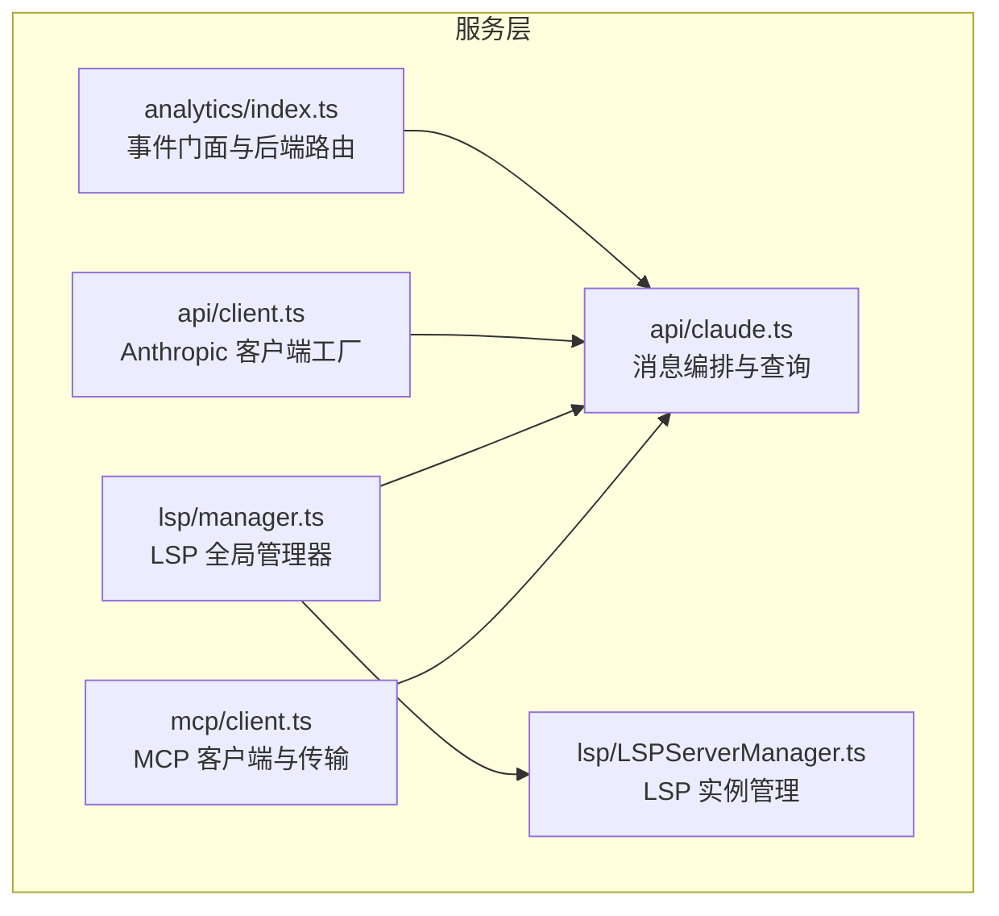
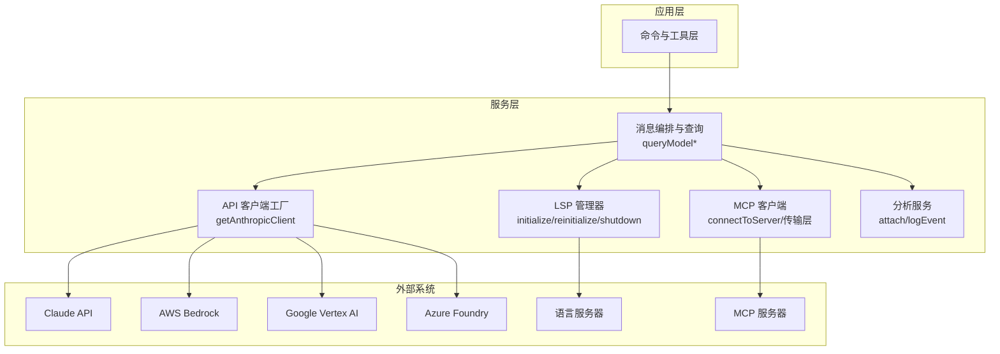
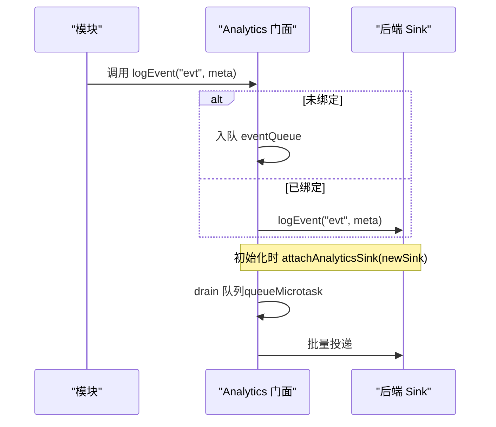
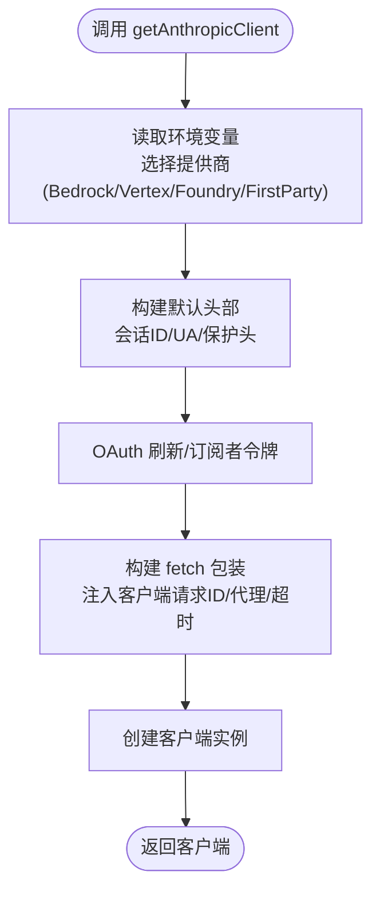
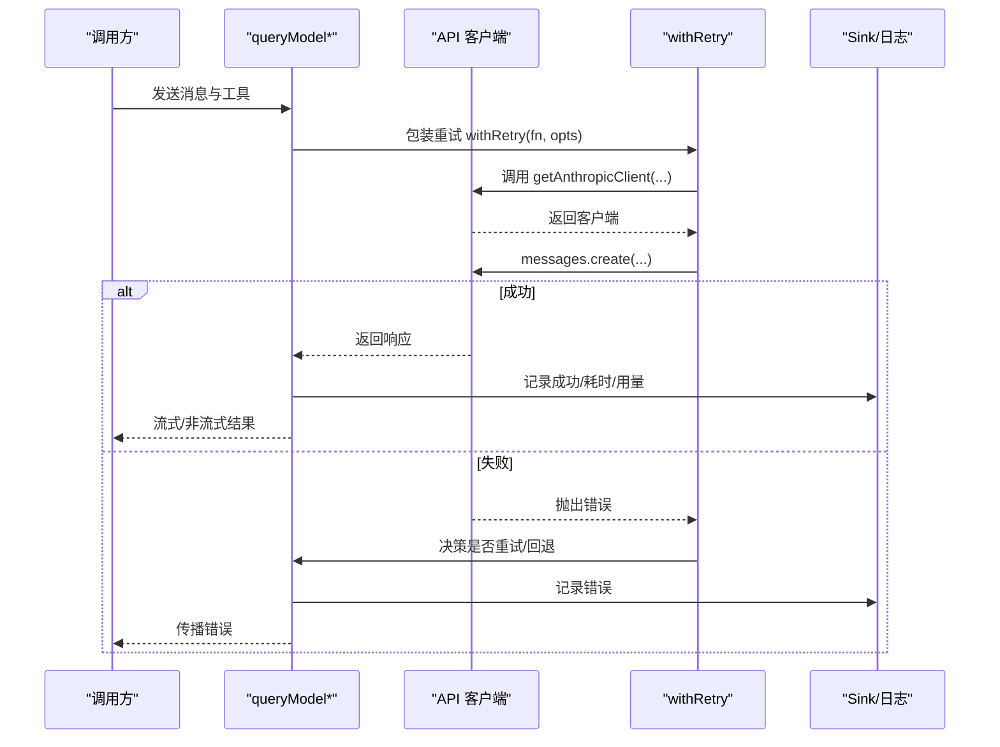
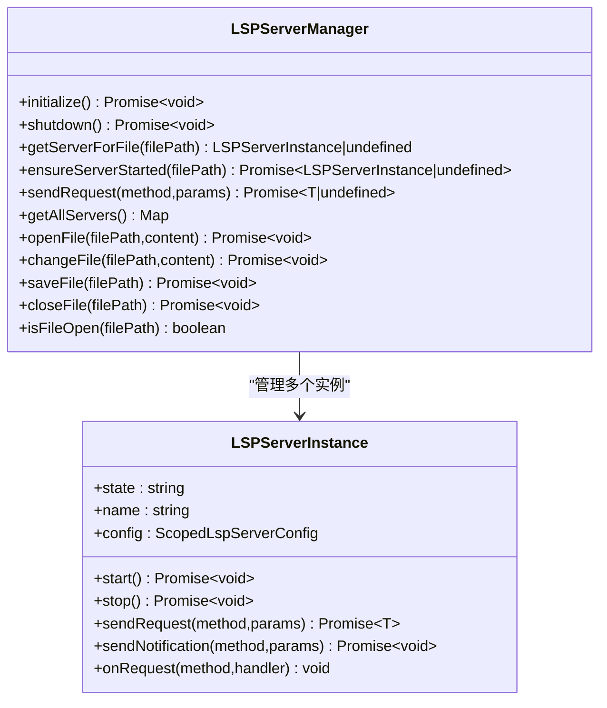
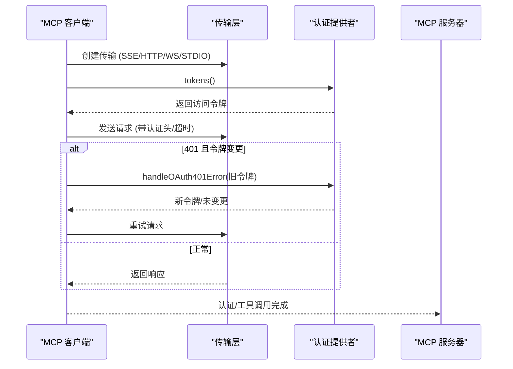
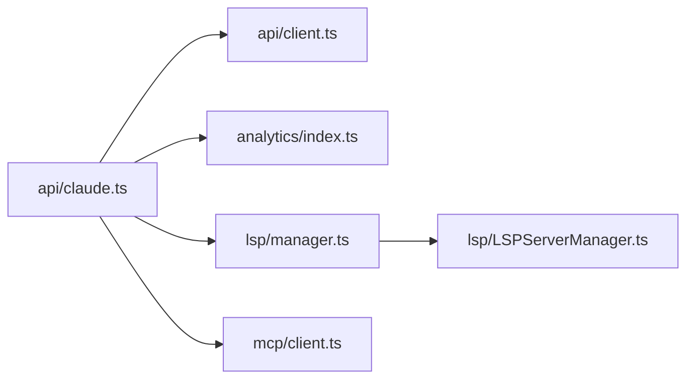

# 服务层

<cite>
**本文引用的文件**
- [src/services/analytics/index.ts](file://src/services/analytics/index.ts)
- [src/services/api/client.ts](file://src/services/api/client.ts)
- [src/services/api/claude.ts](file://src/services/api/claude.ts)
- [src/services/lsp/manager.ts](file://src/services/lsp/manager.ts)
- [src/services/lsp/LSPServerManager.ts](file://src/services/lsp/LSPServerManager.ts)
- [src/services/mcp/client.ts](file://src/services/mcp/client.ts)
</cite>

## 目录
1. [引言](#引言)
2. [项目结构](#项目结构)
3. [核心组件](#核心组件)
4. [架构总览](#架构总览)
5. [详细组件分析](#详细组件分析)
6. [依赖分析](#依赖分析)
7. [性能考虑](#性能考虑)
8. [故障排查指南](#故障排查指南)
9. [结论](#结论)
10. [附录](#附录)

## 引言
本文件系统性梳理 Claude Code 的服务层设计与实现，聚焦以下方面：
- API 服务：统一的 Claude API 客户端封装、认证与传输、重试与超时策略、元数据与可观测性。
- 分析服务：事件日志门面与后端路由，支持延迟绑定与队列 draining。
- 语言服务器（LSP）集成：全局单例管理器、异步初始化、健康检查与资源回收。
- MCP 服务：多传输协议连接、认证与授权、会话过期检测、输出持久化与安全头信息。
- 外部 API 集成：Claude API、GitHub API（通过插件与工具）、以及代理与凭据刷新。
- 错误处理、重试与监控告警：统一的错误类型、重试上下文、指标记录与告警键。
- 生命周期管理：启动、运行、重初始化、关闭的完整流程。
- 安全机制与权限控制：认证令牌注入、自定义头部、敏感信息脱敏、会话过期与缓存。
- 最佳实践与性能优化：连接批大小、请求超时、缓存 TTL、并发与内存管理。

## 项目结构
服务层位于 src/services 下，按功能域划分：
- analytics：事件日志门面与后端路由
- api：Claude API 客户端、消息编排、重试与日志
- lsp：LSP 服务器管理器与实例
- mcp：MCP 协议客户端与传输适配

图表来源
- [src/services/analytics/index.ts:1-174](file://src/services/analytics/index.ts#L1-L174)
- [src/services/api/client.ts:1-390](file://src/services/api/client.ts#L1-L390)
- [src/services/api/claude.ts:1-800](file://src/services/api/claude.ts#L1-L800)
- [src/services/lsp/manager.ts:1-290](file://src/services/lsp/manager.ts#L1-L290)
- [src/services/lsp/LSPServerManager.ts:1-421](file://src/services/lsp/LSPServerManager.ts#L1-L421)
- [src/services/mcp/client.ts:1-800](file://src/services/mcp/client.ts#L1-L800)

章节来源
- [src/services/analytics/index.ts:1-174](file://src/services/analytics/index.ts#L1-L174)
- [src/services/api/client.ts:1-390](file://src/services/api/client.ts#L1-L390)
- [src/services/api/claude.ts:1-800](file://src/services/api/claude.ts#L1-L800)
- [src/services/lsp/manager.ts:1-290](file://src/services/lsp/manager.ts#L1-L290)
- [src/services/lsp/LSPServerManager.ts:1-421](file://src/services/lsp/LSPServerManager.ts#L1-L421)
- [src/services/mcp/client.ts:1-800](file://src/services/mcp/client.ts#L1-L800)

## 核心组件
- 分析服务（Analytics）
  - 提供事件门面：attachAnalyticsSink、logEvent、logEventAsync；支持延迟绑定与队列 draining。
  - 支持标记类型与字段剥离，确保日志安全。
- API 服务（Anthropic 客户端）
  - 工厂函数 getAnthropicClient：根据环境变量选择第一方或第三方提供商（Bedrock/Vertex/Foundry），自动注入默认头部、会话标识、用户代理、保护头等。
  - 统一 fetch 包装：注入客户端请求 ID、调试日志、代理与超时设置。
  - 认证与凭据：OAuth 刷新、API Key 注入、AWS/GCP 凭据刷新。
- 查询服务（消息编排）
  - 消息参数转换、提示缓存控制、思考模式与任务预算、工具权限上下文、流式与非流式查询。
  - 统一错误处理与重试包装，支持降级模型与回退。
- LSP 服务
  - 全局单例管理器：initialize/reinitialize/shutdown 生命周期，状态机与 generation 控制，被动通知注册。
  - 实例管理器：按扩展名映射到服务器、懒启动、didOpen/didChange/didSave/didClose 同步。
- MCP 服务
  - 多传输：SSE/HTTP/WebSocket/stdio/SSE-IDE/WS-IDE，统一超时与 Accept 规范。
  - 认证与授权：ClaudeAuthProvider、OAuth 401 自动刷新、needs-auth 缓存与事件上报。
  - 输出持久化与图像压缩、内容截断与尺寸估算、会话过期检测。

章节来源
- [src/services/analytics/index.ts:1-174](file://src/services/analytics/index.ts#L1-L174)
- [src/services/api/client.ts:88-316](file://src/services/api/client.ts#L88-L316)
- [src/services/api/claude.ts:530-586](file://src/services/api/claude.ts#L530-L586)
- [src/services/lsp/manager.ts:145-208](file://src/services/lsp/manager.ts#L145-L208)
- [src/services/lsp/LSPServerManager.ts:59-421](file://src/services/lsp/LSPServerManager.ts#L59-L421)
- [src/services/mcp/client.ts:595-800](file://src/services/mcp/client.ts#L595-L800)

## 架构总览
服务层围绕“客户端工厂 + 查询编排 + 传输适配 + 生命周期管理”展开，形成清晰的分层与职责边界。

图表来源
- [src/services/api/client.ts:153-316](file://src/services/api/client.ts#L153-L316)
- [src/services/api/claude.ts:709-780](file://src/services/api/claude.ts#L709-L780)
- [src/services/lsp/manager.ts:145-208](file://src/services/lsp/manager.ts#L145-L208)
- [src/services/mcp/client.ts:595-800](file://src/services/mcp/client.ts#L595-L800)
- [src/services/analytics/index.ts:95-164](file://src/services/analytics/index.ts#L95-L164)

## 详细组件分析

### 分析服务（Analytics）
- 设计要点
  - 无依赖门面：避免循环导入，事件先入队，后在 attachAnalyticsSink 时 drain。
  - 字段安全：stripProtoFields 去除 _PROTO_ 前缀键，防止 PII 泄露。
  - 标记类型：强制验证日志元数据不包含代码/路径等敏感信息。
- 关键接口
  - attachAnalyticsSink(newSink)：延迟绑定后批量投递队列。
  - logEvent / logEventAsync：同步/异步写入，采样与队列。
  - _resetForTesting：测试重置。
- 使用场景
  - 在应用初始化阶段 attach，随后各模块只管 log，无需关心后端细节。

图表来源
- [src/services/analytics/index.ts:95-164](file://src/services/analytics/index.ts#L95-L164)

章节来源
- [src/services/analytics/index.ts:1-174](file://src/services/analytics/index.ts#L1-L174)

### API 服务（Anthropic 客户端）
- 客户端工厂
  - getAnthropicClient：根据环境变量选择 Bedrock/Vertex/Foundry 或第一方 API；自动注入默认头、会话 ID、用户代理、保护头。
  - fetch 包装：注入客户端请求 ID、调试日志、代理选项；支持自定义头部解析。
- 认证与凭据
  - OAuth 刷新与 Claude.ai 订阅者令牌；API Key 辅助工具；AWS/GCP 凭据刷新与缓存。
- 传输与超时
  - 统一超时与代理；可覆盖 fetch；调试日志输出 SDK 日志。
- 使用场景
  - 任何需要调用 Claude API 的模块均通过该工厂创建客户端，保证一致性与可观测性。

图表来源
- [src/services/api/client.ts:88-316](file://src/services/api/client.ts#L88-L316)

章节来源
- [src/services/api/client.ts:1-390](file://src/services/api/client.ts#L1-L390)

### 查询服务（消息编排与重试）
- 消息编排
  - userMessageToMessageParam/assistantMessageToMessageParam：支持提示缓存控制与内容克隆。
  - 提示缓存 TTL：按用户类型、订阅状态、查询来源与环境变量动态决定。
  - 思考模式、任务预算、工具权限上下文、输出格式、快速模式等。
- 查询执行
  - queryModelWithStreaming/queryModelWithoutStreaming：统一流式与非流式入口。
  - 统一错误处理：APIUserAbortError、CannotRetryError、529 回退。
- 重试与降级
  - withRetry：统一重试包装，支持最大重试次数、模型与思考配置。
  - 降级模型与回退通知钩子，保障可用性。

图表来源
- [src/services/api/claude.ts:709-780](file://src/services/api/claude.ts#L709-L780)
- [src/services/api/claude.ts:252-257](file://src/services/api/claude.ts#L252-L257)
- [src/services/api/client.ts:141-152](file://src/services/api/client.ts#L141-L152)

章节来源
- [src/services/api/claude.ts:1-800](file://src/services/api/claude.ts#L1-L800)

### LSP 服务（语言服务器管理）
- 全局管理器
  - initializeLspServerManager：幂等初始化，异步加载配置，generation 控制防止陈旧初始化更新状态。
  - reinitializeLspServerManager：在插件刷新后强制重新加载配置。
  - shutdownLspServerManager：优雅关闭所有服务器，清理状态。
  - isLspConnected：健康检查，至少一个服务器连接且状态非 error。
- 实例管理器
  - createLSPServerManager：按扩展名映射到服务器，懒启动，didOpen/didChange/didSave/didClose 同步。
  - onRequest 注册：对 workspace/configuration 请求返回空配置以满足协议。

图表来源
- [src/services/lsp/LSPServerManager.ts:16-421](file://src/services/lsp/LSPServerManager.ts#L16-L421)

章节来源
- [src/services/lsp/manager.ts:145-208](file://src/services/lsp/manager.ts#L145-L208)
- [src/services/lsp/LSPServerManager.ts:1-421](file://src/services/lsp/LSPServerManager.ts#L1-L421)

### MCP 服务（模型上下文协议）
- 连接与传输
  - connectToServer：基于服务器配置与类型选择 SSE/HTTP/WebSocket/stdio/SSE-IDE/WS-IDE。
  - wrapFetchWithTimeout：为 POST 请求注入超时，保证长连接 SSE 不被超时中断。
  - 传输层：SSEClientTransport、StreamableHTTPClientTransport、WebSocketTransport、StdioClientTransport。
- 认证与授权
  - ClaudeAuthProvider：统一认证提供；OAuth 401 自动刷新与重试。
  - handleRemoteAuthFailure：记录 needs-auth 事件，写入缓存，返回 needs-auth 结果。
  - clearMcpAuthCache：清空 needs-auth 缓存。
- 输出与内容
  - 图像压缩、二进制内容持久化、内容尺寸估算与截断、元数据安全记录。
- 会话与安全
  - isMcpSessionExpiredError：检测会话过期（HTTP 404 + JSON-RPC -32001）。
  - getServerCacheKey：连接缓存键生成，避免重复连接。

图表来源
- [src/services/mcp/client.ts:372-422](file://src/services/mcp/client.ts#L372-L422)
- [src/services/mcp/client.ts:595-800](file://src/services/mcp/client.ts#L595-L800)

章节来源
- [src/services/mcp/client.ts:1-800](file://src/services/mcp/client.ts#L1-L800)

## 依赖分析
- 模块耦合
  - 查询服务依赖 API 客户端工厂与分析服务；LSP 管理器与 MCP 客户端作为外部集成点参与查询链路。
  - 分析服务无外部依赖，仅通过门面接口与后端交互，降低耦合。
- 外部依赖
  - Claude API（第一方/Bedrock/Vertex/Foundry）
  - LSP 服务器（本地/远程）
  - MCP 服务器（SSE/HTTP/WebSocket/stdio）
- 循环依赖规避
  - 分析服务采用门面与延迟绑定，避免导入循环。
  - LSP 管理器使用单例与 generation 控制，避免陈旧初始化覆盖。

图表来源
- [src/services/api/claude.ts:1-800](file://src/services/api/claude.ts#L1-L800)
- [src/services/api/client.ts:1-390](file://src/services/api/client.ts#L1-L390)
- [src/services/analytics/index.ts:1-174](file://src/services/analytics/index.ts#L1-L174)
- [src/services/lsp/manager.ts:1-290](file://src/services/lsp/manager.ts#L1-L290)
- [src/services/lsp/LSPServerManager.ts:1-421](file://src/services/lsp/LSPServerManager.ts#L1-L421)
- [src/services/mcp/client.ts:1-800](file://src/services/mcp/client.ts#L1-L800)

章节来源
- [src/services/api/claude.ts:1-800](file://src/services/api/claude.ts#L1-L800)
- [src/services/api/client.ts:1-390](file://src/services/api/client.ts#L1-L390)
- [src/services/analytics/index.ts:1-174](file://src/services/analytics/index.ts#L1-L174)
- [src/services/lsp/manager.ts:1-290](file://src/services/lsp/manager.ts#L1-L290)
- [src/services/lsp/LSPServerManager.ts:1-421](file://src/services/lsp/LSPServerManager.ts#L1-L421)
- [src/services/mcp/client.ts:1-800](file://src/services/mcp/client.ts#L1-L800)

## 性能考虑
- 连接与并发
  - MCP 连接批大小：本地与远程分别支持环境变量配置，平衡吞吐与资源占用。
  - LSP 懒启动：仅在首次访问对应扩展名文件时启动，减少冷启动成本。
- 超时与重试
  - 请求超时：独立于连接超时，避免信号复用导致的“立即超时”问题。
  - 重试策略：统一 withRetry，支持最大重试次数与模型/思考配置。
- 缓存与提示
  - 提示缓存 TTL：按用户类型、订阅状态、查询来源与环境变量动态决定，兼顾成本与效果。
  - 缓存击穿防护：记录提示状态与缓存编辑，避免频繁切换导致的缓存抖动。
- 资源回收
  - LSP shutdown：清理所有服务器与映射，防止进程泄漏。
  - MCP needs-auth 缓存：15 分钟 TTL，避免大规模 401 导致的阻塞。

## 故障排查指南
- API 调用失败
  - 检查认证：确认 OAuth 是否刷新成功、API Key 是否正确注入。
  - 查看重试：确认是否触发 CannotRetryError/FallbackTriggeredError。
  - 日志定位：启用调试日志，观察 fetch 包装后的请求头与客户端请求 ID。
- LSP 无法连接
  - 初始化状态：使用 getInitializationStatus 区分 pending/not-started/failed。
  - 健康检查：isLspConnected 用于工具启用判断。
  - 重启：调用 reinitializeLspServerManager 以加载最新插件配置。
- MCP 认证问题
  - needs-auth：查看 tengu_mcp_server_needs_auth 事件与缓存文件，确认 15 分钟内不再重复弹出。
  - 会话过期：捕获 isMcpSessionExpiredError 并提示重新获取客户端。
- 监控与告警
  - 事件上报：attachAnalyticsSink 后，所有事件进入统一通道；注意 stripProtoFields 与标记类型。
  - 错误分类：区分用户中止（APIUserAbortError）、认证错误、网络错误与业务错误。

章节来源
- [src/services/api/claude.ts:252-257](file://src/services/api/claude.ts#L252-L257)
- [src/services/lsp/manager.ts:76-94](file://src/services/lsp/manager.ts#L76-L94)
- [src/services/mcp/client.ts:340-361](file://src/services/mcp/client.ts#L340-L361)

## 结论
服务层通过“门面 + 工厂 + 管理器 + 传输适配”的架构，实现了对外部系统的统一接入与内部模块的低耦合协作。分析服务提供一致的日志体验，API 服务确保认证与传输的一致性，LSP 与 MCP 服务分别承载编辑器与工具生态的集成能力。配合完善的错误处理、重试与监控，服务层在可用性、可观测性与安全性上达到较高水准。

## 附录
- 配置与扩展指南
  - 添加新 MCP 服务器：在配置中新增条目，选择合适传输类型；客户端将自动处理认证与超时。
  - 自定义头部：通过 ANTHROPIC_CUSTOM_HEADERS 注入；注意不要包含敏感信息。
  - 提示缓存：根据查询来源与用户类型调整 TTL；必要时禁用特定模型的缓存。
- 安全机制
  - 认证：优先使用 OAuth；API Key 通过辅助工具注入；订阅者使用令牌直连。
  - 头部与日志：自动注入保护头；日志中对 Authorization 进行脱敏。
  - 会话与缓存：needs-auth 缓存与会话过期检测，避免长期无效连接。
- 最佳实践
  - 启动阶段：先 attachAnalyticsSink，再初始化 LSP 与 MCP。
  - 查询阶段：合理设置工具权限上下文与思考模式，避免不必要的重试。
  - 监控阶段：关注 tengu_mcp_server_needs_auth、tengu_mcp_claudeai_proxy_401 等关键事件。