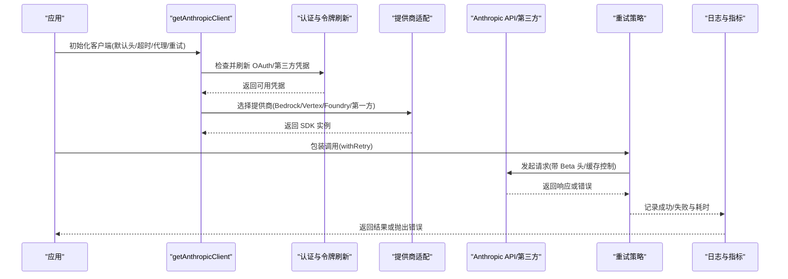
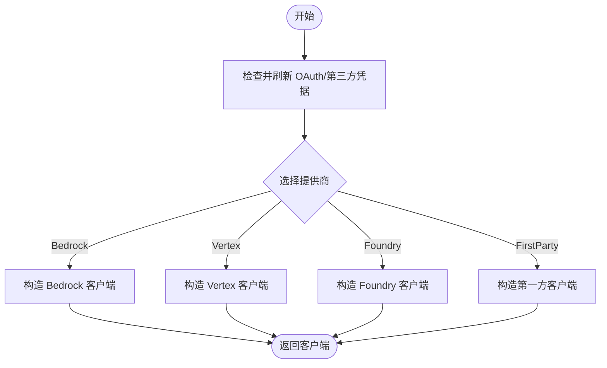
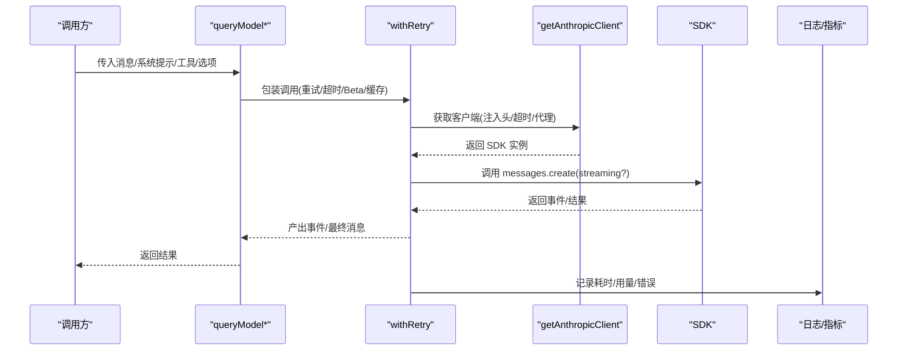
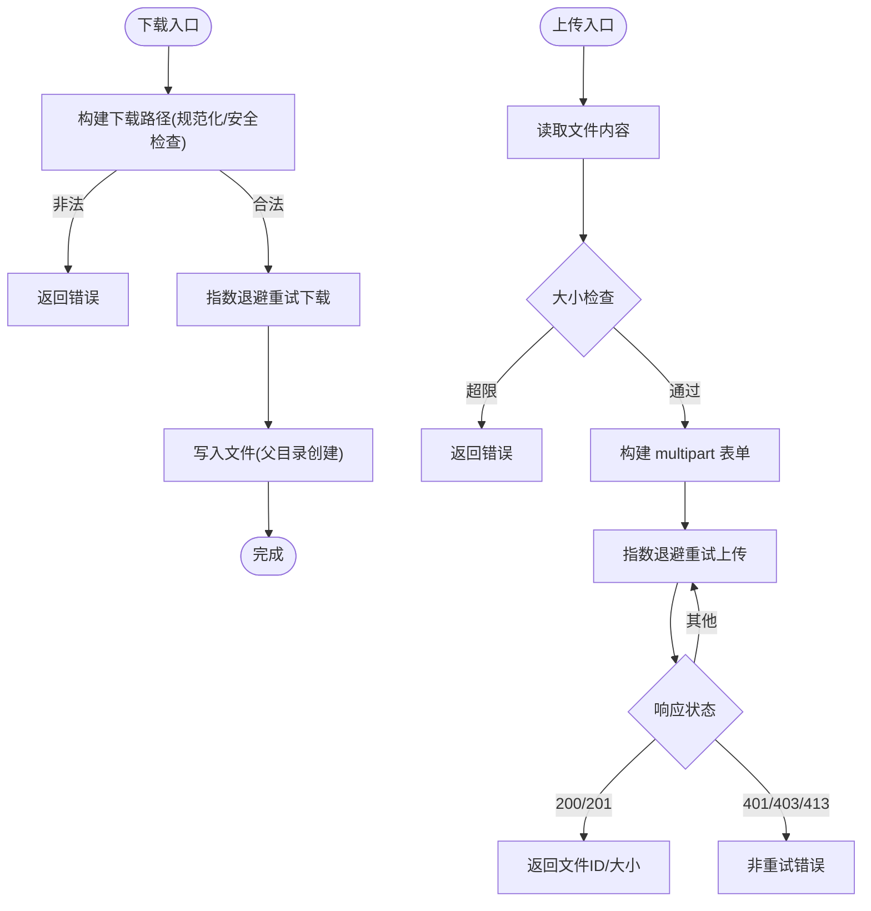
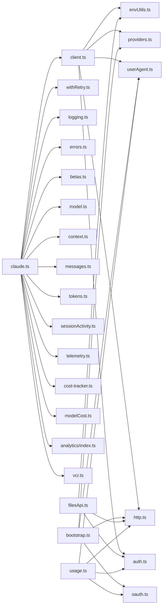

# API 服务

<cite>
**本文引用的文件**
- [client.ts](file://src/services/api/client.ts)
- [bootstrap.ts](file://src/services/api/bootstrap.ts)
- [claude.ts](file://src/services/api/claude.ts)
- [filesApi.ts](file://src/services/api/filesApi.ts)
- [usage.ts](file://src/services/api/usage.ts)
- [withRetry.ts](file://src/services/api/withRetry.ts)
- [logging.ts](file://src/services/api/logging.ts)
- [errors.ts](file://src/services/api/errors.ts)
- [errorUtils.ts](file://src/services/api/errorUtils.ts)
- [emptyUsage.ts](file://src/services/api/emptyUsage.ts)
- [metricsOptOut.ts](file://src/services/api/metricsOptOut.ts)
- [firstTokenDate.ts](file://src/services/api/firstTokenDate.ts)
- [promptCacheBreakDetection.ts](file://src/services/api/promptCacheBreakDetection.ts)
- [apiLimits.ts](file://src/constants/apiLimits.ts)
- [oauth.ts](file://src/constants/oauth.ts)
- [providers.ts](file://src/utils/model/providers.ts)
- [envUtils.ts](file://src/utils/envUtils.ts)
- [http.ts](file://src/utils/http.ts)
- [userAgent.ts](file://src/utils/userAgent.ts)
- [auth.ts](file://src/utils/auth.ts)
- [model.ts](file://src/utils/model/model.ts)
- [context.ts](file://src/utils/context.ts)
- [betas.ts](file://src/utils/betas.ts)
- [messages.ts](file://src/utils/messages.ts)
- [tokens.ts](file://src/utils/tokens.ts)
- [sessionActivity.ts](file://src/utils/sessionActivity.ts)
- [telemetry.ts](file://src/utils/telemetry/sessionTracing.ts)
- [cost-tracker.ts](file://src/cost-tracker.ts)
- [modelCost.ts](file://src/utils/modelCost.ts)
- [state.ts](file://src/bootstrap/state.ts)
- [analytics/index.ts](file://src/services/analytics/index.ts)
- [vcr.ts](file://src/services/vcr.ts)
</cite>

## 目录
1. [简介](#简介)
2. [项目结构](#项目结构)
3. [核心组件](#核心组件)
4. [架构总览](#架构总览)
5. [详细组件分析](#详细组件分析)
6. [依赖关系分析](#依赖关系分析)
7. [性能考量](#性能考量)
8. [故障排查指南](#故障排查指南)
9. [结论](#结论)
10. [附录](#附录)

## 简介
本文件系统性梳理 API 服务模块，覆盖以下主题：
- API 客户端初始化与多提供商适配（Anthropic、AWS Bedrock、Google Vertex、Microsoft Foundry）
- 认证机制（API Key、OAuth、第三方凭据刷新）
- 请求管理与重试策略、超时与代理配置
- Bootstrap API 启动流程与配置缓存
- Claude API 集成、模型调用、流式与非流式响应处理
- 文件 API 的上传/下载、并发控制、路径安全与权限校验
- 使用统计 API 的计费查询与用量跟踪
- 错误处理、可观测性与最佳实践

## 项目结构
API 服务模块位于 src/services/api 下，围绕客户端工厂、Claude 模型调用、文件操作与用量查询等职责划分清晰，同时通过工具层（环境变量、HTTP、用户代理、认证）实现横切关注点。

```mermaid
graph TB
subgraph "API 服务"
C["client.ts<br/>客户端工厂与多提供商适配"]
B["bootstrap.ts<br/>Bootstrap 配置拉取与缓存"]
CL["claude.ts<br/>模型调用、流式/非流式、重试与日志"]
F["filesApi.ts<br/>文件上传/下载/列举"]
U["usage.ts<br/>用量查询"]
WR["withRetry.ts<br/>重试策略"]
LG["logging.ts<br/>API 日志与指标"]
ER["errors.ts<br/>错误定义与映射"]
EU["errorUtils.ts<br/>错误工具"]
EM["emptyUsage.ts<br/>空用量占位"]
MO["metricsOptOut.ts<br/>指标上报开关"]
FD["firstTokenDate.ts<br/>首 token 时间"]
PC["promptCacheBreakDetection.ts<br/>提示缓存断链检测"]
end
subgraph "工具与常量"
OA["oauth.ts<br/>OAuth 配置"]
PV["providers.ts<br/>API 提供商判定"]
EV["envUtils.ts<br/>环境变量工具"]
HT["http.ts<br/>HTTP 工具与重试"]
UA["userAgent.ts<br/>User-Agent 生成"]
AU["auth.ts<br/>认证与令牌刷新"]
MD["model.ts<br/>模型名称与上下文"]
CT["context.ts<br/>上下文与配额"]
BT["betas.ts<br/>Beta 头与能力检测"]
MS["messages.ts<br/>消息归一化"]
TK["tokens.ts<br/>Token 统计"]
SA["sessionActivity.ts<br/>会话活动"]
TL["telemetry.ts<br/>会话追踪"]
CT2["cost-tracker.ts<br/>成本追踪"]
MC["modelCost.ts<br/>模型计费"]
ST["state.ts<br/>会话状态"]
AN["analytics/index.ts<br/>事件上报"]
VC["vcr.ts<br/>录制回放"]
end
C --> AU
C --> PV
C --> HT
C --> UA
C --> EV
C --> ST
CL --> C
CL --> WR
CL --> LG
CL --> ER
CL --> AU
CL --> BT
CL --> MD
CL --> CT
CL --> MS
CL --> TK
CL --> SA
CL --> TL
CL --> CT2
CL --> MC
CL --> AN
CL --> VC
B --> OA
B --> PV
B --> HT
B --> UA
F --> HT
F --> EV
F --> AU
U --> OA
U --> AU
U --> HT
U --> UA
```

图表来源
- [client.ts:1-390](file://src/services/api/client.ts#L1-L390)
- [bootstrap.ts:1-142](file://src/services/api/bootstrap.ts#L1-L142)
- [claude.ts:1-800](file://src/services/api/claude.ts#L1-L800)
- [filesApi.ts:1-749](file://src/services/api/filesApi.ts#L1-L749)
- [usage.ts:1-64](file://src/services/api/usage.ts#L1-L64)

章节来源
- [client.ts:1-390](file://src/services/api/client.ts#L1-L390)
- [bootstrap.ts:1-142](file://src/services/api/bootstrap.ts#L1-L142)
- [claude.ts:1-800](file://src/services/api/claude.ts#L1-L800)
- [filesApi.ts:1-749](file://src/services/api/filesApi.ts#L1-L749)
- [usage.ts:1-64](file://src/services/api/usage.ts#L1-L64)

## 核心组件
- 客户端工厂：统一创建 Anthropic SDK 客户端，支持第一方与第三方提供商（Bedrock/Vertex/Foundry），自动注入头、超时、代理与重试参数，并在需要时刷新 OAuth 或第三方凭据。
- Claude 调用：封装消息序列、工具、思考模式、缓存控制、Beta 头、任务预算、成本计算与日志记录；提供流式与非流式两种调用路径。
- Bootstrap：从 OAuth 基础 API 拉取客户端数据与额外模型选项，进行本地缓存与去重写入。
- 文件 API：支持 BYOC（上传）与 1P/Cloud（下载/列举）两种模式，内置指数退避重试、并发限制、路径规范化与安全检查。
- 使用统计：基于 OAuth 获取订阅者用量信息，含小时/周级配额与额外额度。

章节来源
- [client.ts:88-316](file://src/services/api/client.ts#L88-L316)
- [claude.ts:709-780](file://src/services/api/claude.ts#L709-L780)
- [bootstrap.ts:114-142](file://src/services/api/bootstrap.ts#L114-L142)
- [filesApi.ts:132-345](file://src/services/api/filesApi.ts#L132-L345)
- [usage.ts:33-63](file://src/services/api/usage.ts#L33-L63)

## 架构总览
下图展示从应用到 API 的关键交互路径，包括认证、重试、日志与错误处理。

图表来源
- [client.ts:131-152](file://src/services/api/client.ts#L131-L152)
- [withRetry.ts:1-200](file://src/services/api/withRetry.ts#L1-L200)
- [logging.ts:1-200](file://src/services/api/logging.ts#L1-L200)

章节来源
- [client.ts:88-316](file://src/services/api/client.ts#L88-L316)
- [withRetry.ts:1-200](file://src/services/api/withRetry.ts#L1-L200)
- [logging.ts:1-200](file://src/services/api/logging.ts#L1-L200)

## 详细组件分析

### 客户端初始化与多提供商适配
- 默认头与元数据：注入 User-Agent、会话 ID、容器/远程会话标识、自定义头与附加保护头。
- 认证优先级：OAuth（需 profile 权限）优先于 API Key；第三方提供商按需刷新 AWS/GCP/Azure 凭据。
- 超时与代理：统一超时（可由环境变量覆盖）、代理选项透传至 SDK；第一方 API 注入客户端请求 ID 便于关联日志。
- 提供商选择：根据环境变量自动切换 Bedrock/Vertex/Foundry 或第一方 Anthropic；支持跳过认证用于测试场景。

图表来源
- [client.ts:153-315](file://src/services/api/client.ts#L153-L315)

章节来源
- [client.ts:88-316](file://src/services/api/client.ts#L88-L316)

### 认证机制与令牌刷新
- OAuth：优先使用具备 profile 权限的访问令牌；支持刷新后重试；可设置基础 API URL。
- API Key：在非订阅者场景下作为后备；支持从辅助工具读取。
- 第三方凭据：Bedrock 支持 Bearer Token 或凭据刷新；Vertex 在无项目/密钥文件时提供项目 ID 回退以避免元数据服务器超时；Foundry 支持 Azure AD 令牌提供者或 API Key。

章节来源
- [client.ts:131-152](file://src/services/api/client.ts#L131-L152)
- [client.ts:171-187](file://src/services/api/client.ts#L171-L187)
- [client.ts:221-297](file://src/services/api/client.ts#L221-L297)
- [client.ts:299-315](file://src/services/api/client.ts#L299-L315)
- [auth.ts:1-200](file://src/utils/auth.ts#L1-L200)

### 请求管理与重试策略
- 重试包装：统一的 withRetry 接口，支持最大重试次数、模型与思考配置等上下文；对 529/连接错误等进行指数退避重试。
- 流式与非流式：提供 queryModelWithStreaming 与 queryModelWithoutStreaming 两种路径，内部均通过 withRetry 包裹。
- 超时与代理：客户端默认超时可配置；代理选项透传；第一方 API 注入客户端请求 ID 便于日志关联。
- 日志与指标：记录请求/响应、耗时、用量、错误类型；支持 VCR 录制回放。

章节来源
- [claude.ts:709-780](file://src/services/api/claude.ts#L709-L780)
- [withRetry.ts:1-200](file://src/services/api/withRetry.ts#L1-L200)
- [logging.ts:1-200](file://src/services/api/logging.ts#L1-L200)
- [vcr.ts:1-200](file://src/services/vcr.ts#L1-L200)

### Bootstrap API 启动流程与配置加载
- 触发条件：仅在允许非必要流量且为第一方提供商时执行；需要可用 OAuth（含 profile 权限）或 API Key。
- 请求头：OAuth 时携带 beta 头；API Key 时使用专用头部；UA 与超时固定。
- 缓存策略：对比本地缓存，若未变更则不写盘；变更时持久化 client_data 与额外模型选项。

章节来源
- [bootstrap.ts:42-109](file://src/services/api/bootstrap.ts#L42-L109)
- [bootstrap.ts:114-142](file://src/services/api/bootstrap.ts#L114-L142)

### Claude API 集成、模型调用与响应处理
- 消息序列：支持用户/助手消息归一化、内容块缓存控制、思考块与工具引用剥离。
- 工具与思考：根据模型能力启用思考/自适应思考；支持工具选择与延迟加载；工具搜索与延迟 delta。
- Beta 头与配额：动态合并 Beta 头；根据提供商与模型能力决定是否包含结构化输出、上下文管理等。
- 输出格式与任务预算：支持 JSON 结构化输出；任务预算通过输出配置传递给 API。
- 成本与用量：记录 Token 使用、估算 USD 成本并累计会话成本；支持首 token 时间与会话活动追踪。

图表来源
- [claude.ts:709-780](file://src/services/api/claude.ts#L709-L780)
- [client.ts:141-152](file://src/services/api/client.ts#L141-L152)
- [logging.ts:1-200](file://src/services/api/logging.ts#L1-L200)

章节来源
- [claude.ts:588-674](file://src/services/api/claude.ts#L588-L674)
- [claude.ts:709-780](file://src/services/api/claude.ts#L709-L780)
- [claude.ts:272-331](file://src/services/api/claude.ts#L272-L331)
- [claude.ts:436-501](file://src/services/api/claude.ts#L436-L501)
- [claude.ts:503-528](file://src/services/api/claude.ts#L503-L528)

### 文件 API：上传/下载/列举与权限控制
- 下载（1P/Cloud）：支持单文件与会话批量下载，指数退避重试、并发限制、路径规范化与安全检查（禁止路径穿越）。
- 上传（BYOC）：支持单文件与批量上传，大小限制、边界构建、取消信号、非重试错误分类（认证/权限/过大）。
- 列举（1P/Cloud）：基于时间戳分页列举，支持 after_id 游标。
- 权限控制：OAuth 令牌校验，401/403 明确区分；路径合法性检查防止越权访问。

图表来源
- [filesApi.ts:187-210](file://src/services/api/filesApi.ts#L187-L210)
- [filesApi.ts:132-180](file://src/services/api/filesApi.ts#L132-L180)
- [filesApi.ts:219-267](file://src/services/api/filesApi.ts#L219-L267)
- [filesApi.ts:378-552](file://src/services/api/filesApi.ts#L378-L552)
- [filesApi.ts:570-593](file://src/services/api/filesApi.ts#L570-L593)
- [filesApi.ts:617-709](file://src/services/api/filesApi.ts#L617-L709)

章节来源
- [filesApi.ts:132-345](file://src/services/api/filesApi.ts#L132-L345)
- [filesApi.ts:378-593](file://src/services/api/filesApi.ts#L378-L593)
- [filesApi.ts:617-709](file://src/services/api/filesApi.ts#L617-L709)

### 使用统计 API：计费查询与用量跟踪
- 适用对象：仅订阅者且具备 profile 权限时生效；若 OAuth 过期则跳过请求。
- 请求头：使用认证头；UA 固定；超时 5 秒。
- 返回结构：包含小时/周级配额与额外额度利用率等字段。

章节来源
- [usage.ts:33-63](file://src/services/api/usage.ts#L33-L63)

## 依赖关系分析
- 横切依赖：环境变量工具、HTTP 工具、用户代理、认证与令牌刷新、模型与上下文、Beta 头与能力检测、消息归一化、Token 统计、会话活动、遥测与成本追踪。
- 内聚性：各模块职责明确，客户端工厂集中处理提供商差异；Claude 调用聚合工具与日志；文件 API 与用量 API 分离独立。

图表来源
- [client.ts:1-390](file://src/services/api/client.ts#L1-L390)
- [claude.ts:1-800](file://src/services/api/claude.ts#L1-L800)
- [bootstrap.ts:1-142](file://src/services/api/bootstrap.ts#L1-L142)
- [filesApi.ts:1-749](file://src/services/api/filesApi.ts#L1-L749)
- [usage.ts:1-64](file://src/services/api/usage.ts#L1-L64)

章节来源
- [client.ts:1-390](file://src/services/api/client.ts#L1-L390)
- [claude.ts:1-800](file://src/services/api/claude.ts#L1-L800)
- [bootstrap.ts:1-142](file://src/services/api/bootstrap.ts#L1-L142)
- [filesApi.ts:1-749](file://src/services/api/filesApi.ts#L1-L749)
- [usage.ts:1-64](file://src/services/api/usage.ts#L1-L64)

## 性能考量
- 并发与限速：文件 API 默认并发 5，可根据网络状况调整；Claude 调用通过 withRetry 控制重试节奏。
- 超时与代理：统一超时与代理透传，避免长尾阻塞；第一方 API 注入客户端请求 ID 便于定位。
- 缓存与断链：提示缓存 TTL 与断链检测，结合 GrowthBook 配置与用户资格控制，减少重复计算。
- 成本估算：按模型单价估算 USD 成本，累计到会话成本，便于预算控制。

章节来源
- [filesApi.ts:269-307](file://src/services/api/filesApi.ts#L269-L307)
- [claude.ts:393-434](file://src/services/api/claude.ts#L393-L434)
- [promptCacheBreakDetection.ts:1-200](file://src/services/api/promptCacheBreakDetection.ts#L1-L200)
- [modelCost.ts:1-200](file://src/utils/modelCost.ts#L1-L200)
- [cost-tracker.ts:1-200](file://src/cost-tracker.ts#L1-L200)

## 故障排查指南
- 认证失败（401/403）：检查 OAuth 是否具备 profile 权限、令牌是否过期；确认 API Key 是否正确；文件上传/下载的认证错误为非重试类，需修正凭据。
- 路径问题：下载路径必须在工作区范围内，禁止路径穿越；若返回非法路径，检查相对路径规范。
- 重试与超时：查看 withRetry 的重试次数与指数退避；确认代理与超时设置；第一方 API 可通过客户端请求 ID 关联服务端日志。
- 用量查询：订阅者且具备 profile 权限时才返回数据；若 OAuth 过期则跳过请求。
- 错误映射与日志：使用 errors.ts 中的错误前缀与映射，结合 logging.ts 的日志输出定位问题。

章节来源
- [filesApi.ts:161-178](file://src/services/api/filesApi.ts#L161-L178)
- [filesApi.ts:193-198](file://src/services/api/filesApi.ts#L193-L198)
- [withRetry.ts:1-200](file://src/services/api/withRetry.ts#L1-L200)
- [logging.ts:1-200](file://src/services/api/logging.ts#L1-L200)
- [errors.ts:1-200](file://src/services/api/errors.ts#L1-L200)
- [usage.ts:33-42](file://src/services/api/usage.ts#L33-L42)

## 结论
该 API 服务模块通过统一的客户端工厂与完善的重试/日志/认证机制，实现了对多提供商与多场景（模型调用、文件操作、用量查询）的一致支持。建议在生产环境中：
- 明确提供商与认证方式，确保凭据有效与权限充足；
- 合理设置超时与重试参数，结合并发限制优化吞吐；
- 使用缓存与断链检测降低重复开销；
- 通过用量与成本追踪实现预算控制与成本优化。

## 附录
- 环境变量与配置要点：API 提供商选择、超时、代理、自定义头、附加保护、模型区域与项目 ID、Beta 头等。
- 常用工具：环境变量解析、HTTP 工具、用户代理、认证与令牌刷新、模型与上下文、消息归一化、Token 统计、会话活动、遥测与成本追踪。

章节来源
- [envUtils.ts:1-200](file://src/utils/envUtils.ts#L1-L200)
- [http.ts:1-200](file://src/utils/http.ts#L1-L200)
- [userAgent.ts:1-200](file://src/utils/userAgent.ts#L1-L200)
- [auth.ts:1-200](file://src/utils/auth.ts#L1-L200)
- [model.ts:1-200](file://src/utils/model/model.ts#L1-L200)
- [context.ts:1-200](file://src/utils/context.ts#L1-L200)
- [messages.ts:1-200](file://src/utils/messages.ts#L1-L200)
- [tokens.ts:1-200](file://src/utils/tokens.ts#L1-L200)
- [sessionActivity.ts:1-200](file://src/utils/sessionActivity.ts#L1-L200)
- [telemetry.ts:1-200](file://src/utils/telemetry/sessionTracing.ts#L1-L200)
- [cost-tracker.ts:1-200](file://src/cost-tracker.ts#L1-L200)