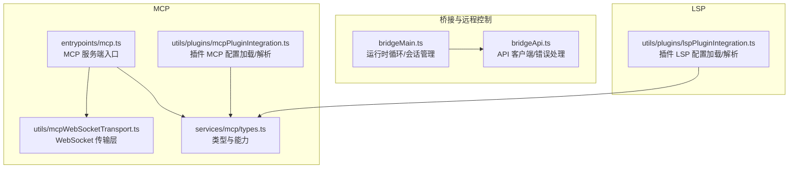
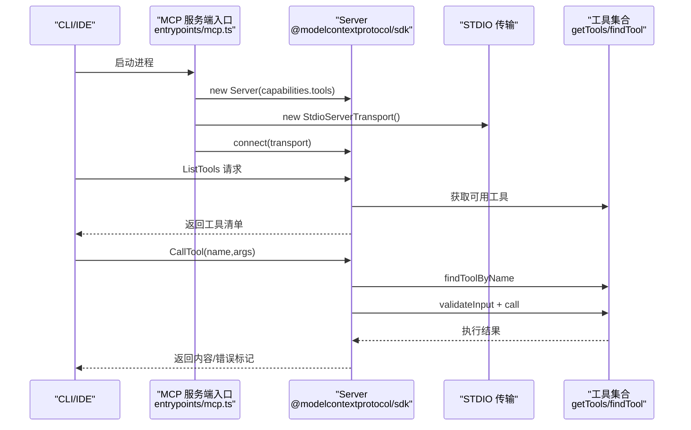
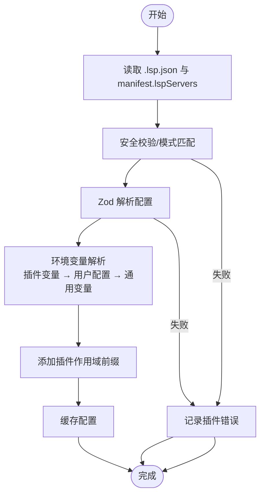
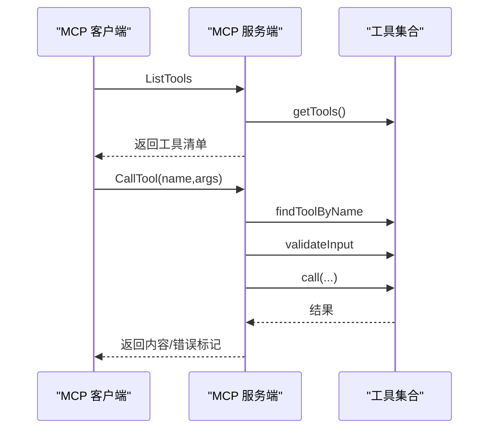
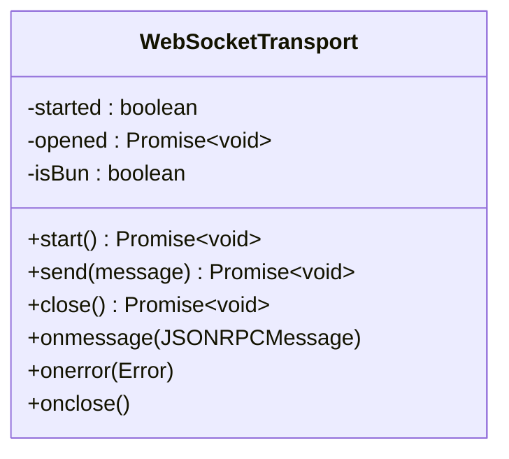
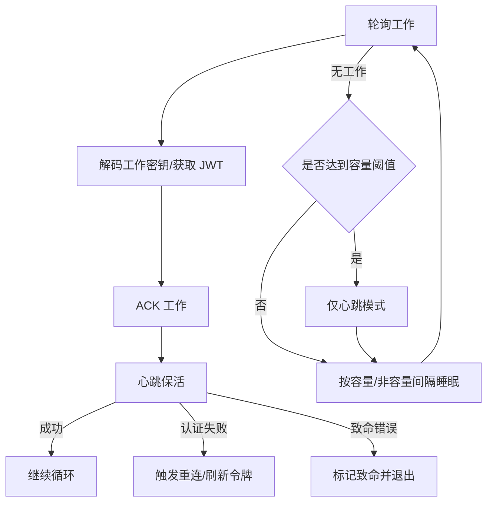
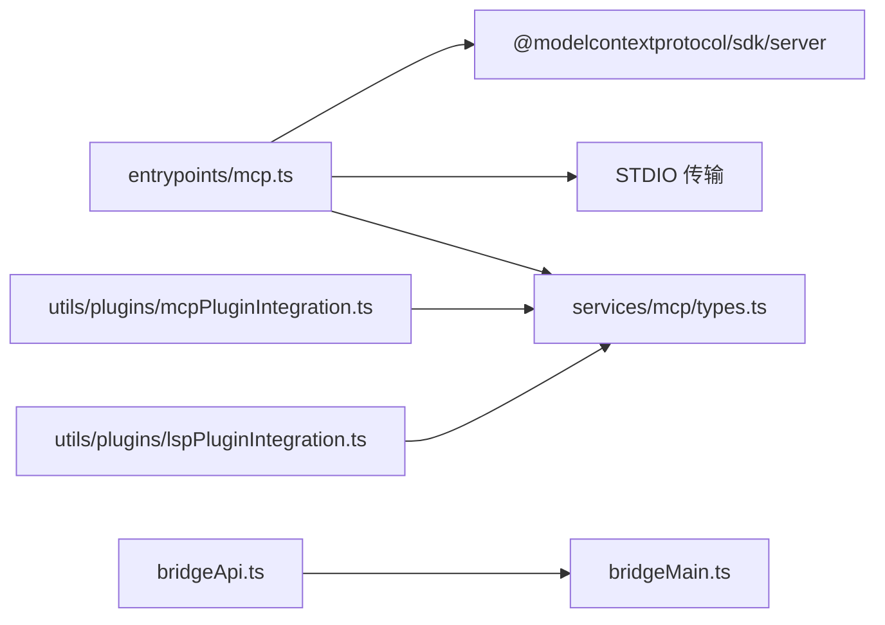

# LSP 和 MCP 服务

<cite>
**本文引用的文件**
- [bridgeMain.ts](file://src/bridge/bridgeMain.ts)
- [bridgeApi.ts](file://src/bridge/bridgeApi.ts)
- [mcp.ts](file://src/entrypoints/mcp.ts)
- [lspPluginIntegration.ts](file://src/utils/plugins/lspPluginIntegration.ts)
- [mcpPluginIntegration.ts](file://src/utils/plugins/mcpPluginIntegration.ts)
- [types.ts](file://src/services/mcp/types.ts)
- [mcpWebSocketTransport.ts](file://src/utils/mcpWebSocketTransport.ts)
</cite>

## 目录
1. [简介](#简介)
2. [项目结构](#项目结构)
3. [核心组件](#核心组件)
4. [架构总览](#架构总览)
5. [详细组件分析](#详细组件分析)
6. [依赖关系分析](#依赖关系分析)
7. [性能考量](#性能考量)
8. [故障排查指南](#故障排查指南)
9. [结论](#结论)
10. [附录](#附录)

## 简介
本文件面向 LSP（语言服务器协议）与 MCP（Model Context Protocol，模型上下文协议）服务模块，系统性梳理其在本仓库中的实现与使用方式，重点覆盖以下方面：
- LSP 服务器管理：插件加载、环境变量解析、作用域隔离与生命周期整合
- MCP 连接管理：多连接支持、传输层抽象、状态同步与错误恢复
- 协议实现与客户端行为：MCP 服务端入口、请求处理、工具暴露与调用
- 配置管理与安全：环境变量扩展、用户配置注入、跨应用访问（XAA/OAuth）与权限控制
- 性能监控与故障诊断：心跳与重连、退避策略、日志与遥测
- 调试技巧：常见问题定位、日志路径与诊断开关

## 项目结构
围绕 LSP/MCP 的相关代码主要分布在以下位置：
- 桥接与远程控制循环：bridgeMain.ts、bridgeApi.ts
- MCP 服务端入口：entrypoints/mcp.ts
- 插件侧 LSP/MCP 集成：utils/plugins 下的 lspPluginIntegration.ts、mcpPluginIntegration.ts
- MCP 类型与能力定义：services/mcp/types.ts
- MCP 传输层（WebSocket）：utils/mcpWebSocketTransport.ts

**图表来源**
- [bridgeMain.ts:141-800](file://src/bridge/bridgeMain.ts#L141-L800)
- [bridgeApi.ts:68-452](file://src/bridge/bridgeApi.ts#L68-L452)
- [mcp.ts:35-197](file://src/entrypoints/mcp.ts#L35-L197)
- [mcpWebSocketTransport.ts:22-201](file://src/utils/mcpWebSocketTransport.ts#L22-L201)
- [types.ts:1-259](file://src/services/mcp/types.ts#L1-L259)
- [lspPluginIntegration.ts:57-388](file://src/utils/plugins/lspPluginIntegration.ts#L57-L388)
- [mcpPluginIntegration.ts:131-635](file://src/utils/plugins/mcpPluginIntegration.ts#L131-L635)

**章节来源**
- [bridgeMain.ts:141-800](file://src/bridge/bridgeMain.ts#L141-L800)
- [bridgeApi.ts:68-452](file://src/bridge/bridgeApi.ts#L68-L452)
- [mcp.ts:35-197](file://src/entrypoints/mcp.ts#L35-L197)
- [lspPluginIntegration.ts:57-388](file://src/utils/plugins/lspPluginIntegration.ts#L57-L388)
- [mcpPluginIntegration.ts:131-635](file://src/utils/plugins/mcpPluginIntegration.ts#L131-L635)
- [types.ts:1-259](file://src/services/mcp/types.ts#L1-L259)
- [mcpWebSocketTransport.ts:22-201](file://src/utils/mcpWebSocketTransport.ts#L22-L201)

## 核心组件
- 桥接运行时循环（bridgeMain.ts）
  - 管理会话集合、心跳、容量唤醒、超时与清理、错误预算与退避、日志与状态更新
  - 支持多会话模式、单会话模式与容量阈值下的“仅心跳”模式
- 桥接 API 客户端（bridgeApi.ts）
  - 封装轮询、确认、停止、归档、重连、心跳等后端接口；统一 401/403/404/410 处理与致命错误分类
  - 提供 OAuth 刷新与可信设备令牌头注入
- MCP 服务端入口（entrypoints/mcp.ts）
  - 基于 SDK 创建 Server，注册 ListTools/Calls 工具请求处理器，通过 STDIO 传输对外提供工具能力
- MCP 传输层（utils/mcpWebSocketTransport.ts）
  - 统一 WebSocket 发送/接收/关闭与事件监听，兼容 Bun 与 Node 环境
- MCP 类型与能力（services/mcp/types.ts）
  - 定义服务器配置（stdio/SSE/WS/HTTP/SDK 等）、OAuth/XAA 配置、连接状态枚举、资源与 CLI 序列化结构
- 插件 LSP 集成（utils/plugins/lspPluginIntegration.ts）
  - 加载 .lsp.json 或 manifest.lspServers，校验与路径安全检查，解析环境变量，添加插件作用域前缀
- 插件 MCP 集成（utils/plugins/mcpPluginIntegration.ts）
  - 加载 .mcp.json/.mcpb，合并多源配置，解析环境变量（含用户配置），添加插件作用域前缀

**章节来源**
- [bridgeMain.ts:141-800](file://src/bridge/bridgeMain.ts#L141-L800)
- [bridgeApi.ts:68-452](file://src/bridge/bridgeApi.ts#L68-L452)
- [mcp.ts:35-197](file://src/entrypoints/mcp.ts#L35-L197)
- [mcpWebSocketTransport.ts:22-201](file://src/utils/mcpWebSocketTransport.ts#L22-L201)
- [types.ts:1-259](file://src/services/mcp/types.ts#L1-L259)
- [lspPluginIntegration.ts:57-388](file://src/utils/plugins/lspPluginIntegration.ts#L57-L388)
- [mcpPluginIntegration.ts:131-635](file://src/utils/plugins/mcpPluginIntegration.ts#L131-L635)

## 架构总览
下图展示 MCP 服务端从启动到工具调用的关键交互，以及与桥接循环的潜在关联点。

**图表来源**
- [mcp.ts:35-197](file://src/entrypoints/mcp.ts#L35-L197)

## 详细组件分析

### LSP 服务器管理器（插件侧）
- 配置加载
  - 支持 .lsp.json 与 manifest.lspServers 两种来源，后者可为字符串路径、数组或内联对象
  - 对字符串路径进行安全校验，防止目录穿越
- 环境变量解析
  - 先替换插件变量，再替换用户配置变量，最后扩展通用环境变量
  - 记录缺失变量并输出告警，便于定位配置问题
- 作用域与缓存
  - 为每个插件的服务器名添加前缀以避免冲突，并标记 scope 为 dynamic
  - 缓存已解析配置，减少重复解析开销
- 生命周期与错误处理
  - 解析失败记录为插件错误，不影响其他插件加载
  - 未启用插件不参与加载

**图表来源**
- [lspPluginIntegration.ts:57-388](file://src/utils/plugins/lspPluginIntegration.ts#L57-L388)

**章节来源**
- [lspPluginIntegration.ts:57-388](file://src/utils/plugins/lspPluginIntegration.ts#L57-L388)

### LSP 客户端与诊断注册（概念性说明）
- 本仓库未直接提供 LSP 客户端实现文件。LSP 客户端通常负责：
  - 语言服务器生命周期管理（启动/停止/重启）
  - 文档变更与同步（文本/增量/全量）
  - 诊断订阅与推送（如 Diagnostics 通知）
  - 被动反馈（如 hover、completion、signatureHelp）
- 在本仓库中，LSP 服务器配置由插件侧加载与解析，客户端侧的集成需结合具体 IDE 或编辑器桥接层实现。

[本节为概念性说明，不直接分析具体文件，故无“章节来源”]

### MCP 连接管理器（概念性说明）
- 多连接支持
  - 通过不同传输类型（stdio/SSE/WS/HTTP/SDK）同时维护多个 MCP 客户端
  - 每个连接状态包括 connected/failed/needs-auth/pending/disabled
- 传输层抽象
  - WebSocketTransport 统一封装消息发送/接收与事件监听，兼容 Bun 与 Node
- 状态同步
  - 连接状态、能力集、服务器信息与指令随连接生命周期更新
- 错误恢复
  - 重连尝试次数与退避策略（由上层逻辑决定），连接失败与认证需求分别进入对应状态

[本节为概念性说明，不直接分析具体文件，故无“章节来源”]

### MCP 客户端认证与权限（概念性说明）
- 认证流程
  - SSE/HTTP 可配置 OAuth，支持授权服务器元数据、回调端口与客户端凭据
  - 跨应用访问（XAA）通过布尔标志启用，OAuth 参数共享全局配置
- 权限管理
  - 工具调用前进行输入校验与权限判断（例如 hasPermissionsToUseTool）
  - 资源访问控制由 MCP 服务器端实现，客户端负责按能力集与资源列表进行操作

[本节为概念性说明，不直接分析具体文件，故无“章节来源”]

### MCP 服务端入口与工具调用
- 服务端初始化
  - 创建 Server 并声明 capabilities.tools
  - 注册 ListTools：动态生成工具清单（含输入/输出 Schema）
  - 注册 CallTool：查找工具、校验输入、执行工具、返回内容或错误标记
- 传输与运行
  - 使用 STDIO 作为传输通道，启动后等待请求

**图表来源**
- [mcp.ts:35-197](file://src/entrypoints/mcp.ts#L35-L197)

**章节来源**
- [mcp.ts:35-197](file://src/entrypoints/mcp.ts#L35-L197)

### MCP 传输层（WebSocketTransport）
- 关键职责
  - 等待连接打开、绑定 message/error/close 事件
  - 发送 JSON-RPC 消息，确保连接处于 OPEN 状态
  - 关闭时清理监听器，避免内存泄漏
- 平台兼容
  - Bun 使用原生 WebSocket，Node 使用 ws 包，统一封装事件与发送逻辑

**图表来源**
- [mcpWebSocketTransport.ts:22-201](file://src/utils/mcpWebSocketTransport.ts#L22-L201)

**章节来源**
- [mcpWebSocketTransport.ts:22-201](file://src/utils/mcpWebSocketTransport.ts#L22-L201)

### 桥接运行时循环与错误恢复（概念性说明）
- 生命周期
  - 初始化会话集合、计时器、容量唤醒、工作树映射与标题集合
  - 主循环：轮询工作、解码工作密钥、解码 JWT、ACK、心跳、容量阈值下的“仅心跳”
- 连接池与退避
  - 连接错误与一般错误分别记录起始时间，计算退避时间，限制最大等待
  - 心跳失败触发重连或致命错误分支
- 清理与退出
  - 会话结束时清理定时器、刷新令牌、移除工作树、归档会话
  - 单会话模式下完成即终止循环；多会话模式保持运行

**图表来源**
- [bridgeMain.ts:141-800](file://src/bridge/bridgeMain.ts#L141-L800)

**章节来源**
- [bridgeMain.ts:141-800](file://src/bridge/bridgeMain.ts#L141-L800)

## 依赖关系分析
- MCP 服务端入口依赖 SDK Server 与 STDIO 传输
- MCP 传输层封装 WebSocket 事件与发送，供上层客户端/服务端复用
- MCP 类型定义提供统一的配置、能力与状态枚举，贯穿配置加载与运行时
- 插件 MCP/LSP 集成负责将外部配置转换为内部可执行的服务器配置，并注入用户与插件变量

**图表来源**
- [mcp.ts:35-197](file://src/entrypoints/mcp.ts#L35-L197)
- [mcpPluginIntegration.ts:131-635](file://src/utils/plugins/mcpPluginIntegration.ts#L131-L635)
- [lspPluginIntegration.ts:57-388](file://src/utils/plugins/lspPluginIntegration.ts#L57-L388)
- [types.ts:1-259](file://src/services/mcp/types.ts#L1-L259)
- [bridgeApi.ts:68-452](file://src/bridge/bridgeApi.ts#L68-L452)
- [bridgeMain.ts:141-800](file://src/bridge/bridgeMain.ts#L141-L800)

**章节来源**
- [mcp.ts:35-197](file://src/entrypoints/mcp.ts#L35-L197)
- [mcpPluginIntegration.ts:131-635](file://src/utils/plugins/mcpPluginIntegration.ts#L131-L635)
- [lspPluginIntegration.ts:57-388](file://src/utils/plugins/lspPluginIntegration.ts#L57-L388)
- [types.ts:1-259](file://src/services/mcp/types.ts#L1-L259)
- [bridgeApi.ts:68-452](file://src/bridge/bridgeApi.ts#L68-L452)
- [bridgeMain.ts:141-800](file://src/bridge/bridgeMain.ts#L141-L800)

## 性能考量
- 心跳与轮询
  - 在容量阈值下采用“仅心跳”模式，降低服务器压力；根据配置调整心跳间隔与容量轮询间隔
- 退避策略
  - 连接错误与一般错误分别设置初始、上限与放弃阈值，避免“惊群”与资源浪费
- 缓存与解析
  - 插件 LSP/MCP 配置解析结果缓存，减少重复 IO 与 JSON 解析
- 传输效率
  - WebSocket 传输层统一事件处理与发送，避免阻塞；发送前检查连接状态

[本节提供通用指导，不直接分析具体文件，故无“章节来源”]

## 故障排查指南
- MCP 服务端启动与工具调用
  - 若 CallTool 抛出异常，服务端会记录错误并返回错误标记的内容；检查工具是否存在、输入是否符合 Schema、工具是否启用
  - ListTools 返回空或工具缺失：确认工具集合构建逻辑与权限上下文
- WebSocket 传输
  - 连接未打开或发送失败：检查连接状态与 readyState；关注“连接失败/消息失败/发送未打开”的诊断事件
- 桥接循环
  - 心跳失败导致重连：检查 401/403 场景下的 OAuth 刷新与可信设备令牌；确认环境过期（410）或环境不存在（404）
  - 容量阈值下长时间无工作：确认 at-capacity 心跳与轮询间隔配置是否合理

**章节来源**
- [mcp.ts:100-188](file://src/entrypoints/mcp.ts#L100-L188)
- [mcpWebSocketTransport.ts:116-201](file://src/utils/mcpWebSocketTransport.ts#L116-L201)
- [bridgeApi.ts:454-500](file://src/bridge/bridgeApi.ts#L454-L500)
- [bridgeMain.ts:202-270](file://src/bridge/bridgeMain.ts#L202-L270)

## 结论
本仓库对 LSP 与 MCP 的支持主要体现在插件侧配置加载与解析、MCP 服务端入口与传输层抽象，以及桥接循环中的错误恢复与资源管理。通过明确的类型定义、环境变量扩展与作用域隔离，系统在灵活性与安全性之间取得平衡。建议在实际集成中：
- 优先使用插件配置加载工具，确保路径安全与变量解析正确
- 在 MCP 服务端中完善工具输入校验与权限判断
- 在桥接场景中合理配置心跳与退避策略，提升稳定性

[本节为总结性内容，不直接分析具体文件，故无“章节来源”]

## 附录
- 配置管理要点
  - LSP：.lsp.json 与 manifest.lspServers；路径安全校验；环境变量扩展；作用域前缀
  - MCP：.mcp.json/.mcpb；多源合并；OAuth/XAA；用户配置注入；作用域前缀
- 调试技巧
  - 查看桥接循环日志与诊断事件，定位连接失败与心跳异常
  - 使用 MCP 服务端 STDIO 输出与错误标记快速定位工具调用问题
  - 在 WebSocket 传输层开启诊断事件，捕获连接与消息异常

[本节为补充说明，不直接分析具体文件，故无“章节来源”]