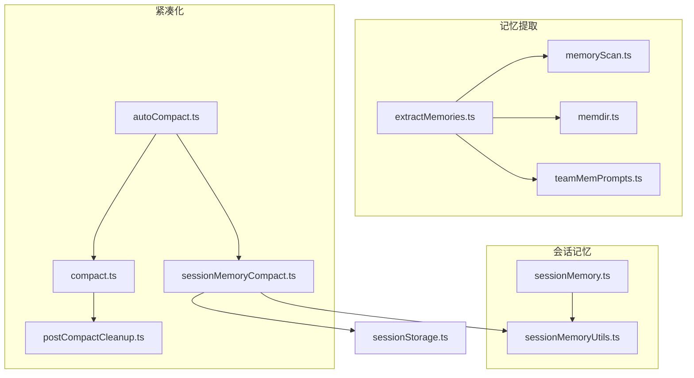
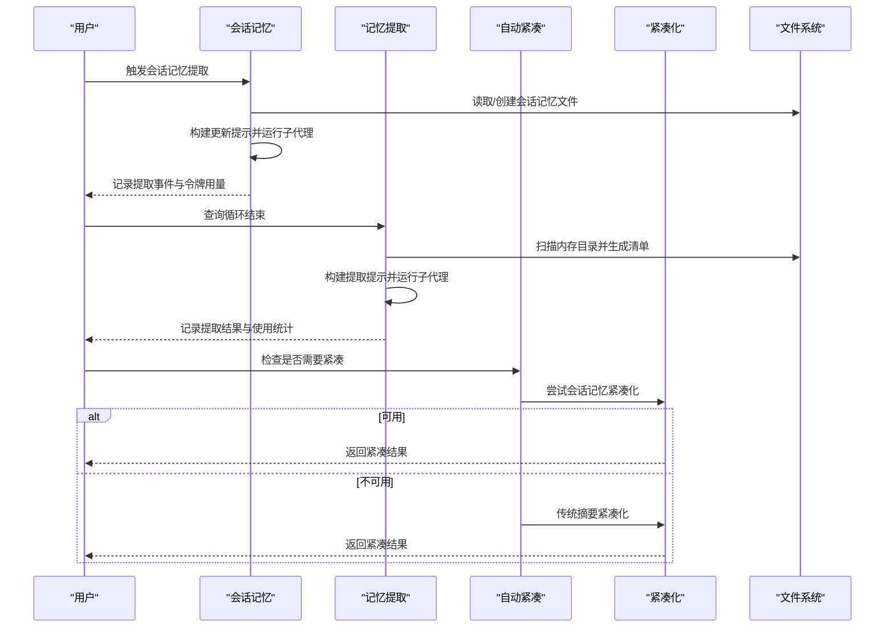
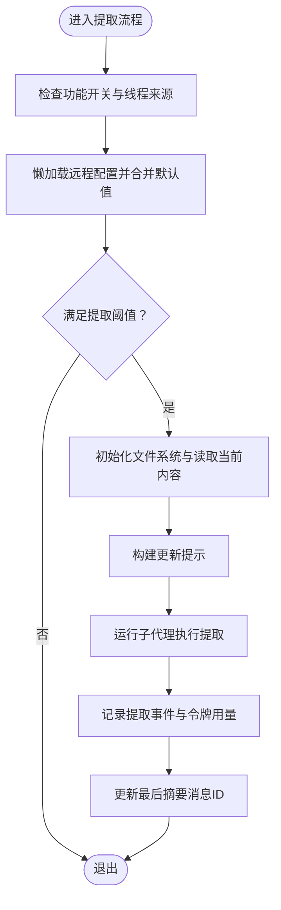
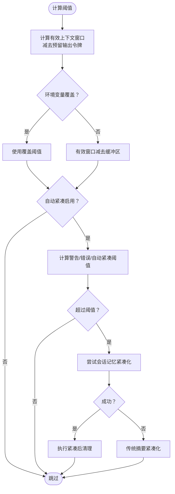
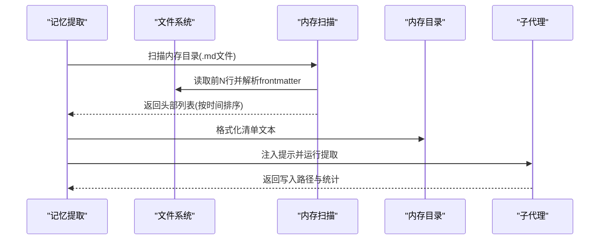
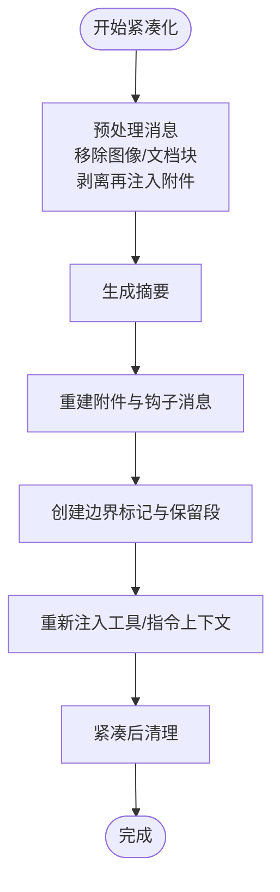
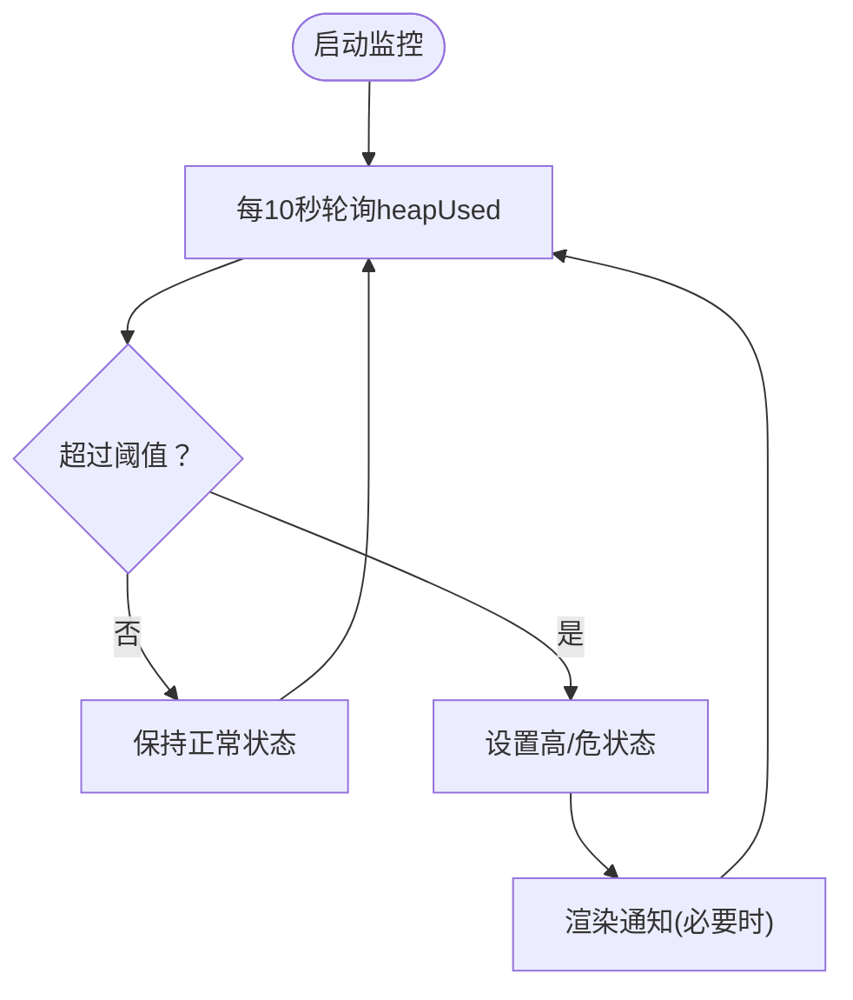
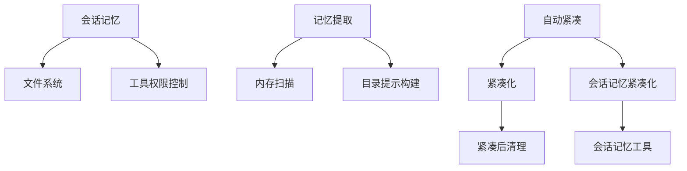

# 内存管理服务

<cite>
**本文档引用的文件**
- [sessionMemory.ts](file://src/services/SessionMemory/sessionMemory.ts)
- [sessionMemoryUtils.ts](file://src/services/SessionMemory/sessionMemoryUtils.ts)
- [extractMemories.ts](file://src/services/extractMemories/extractMemories.ts)
- [compact.ts](file://src/services/compact/compact.ts)
- [autoCompact.ts](file://src/services/compact/autoCompact.ts)
- [sessionMemoryCompact.ts](file://src/services/compact/sessionMemoryCompact.ts)
- [memdir.ts](file://src/memdir/memdir.ts)
- [memoryScan.ts](file://src/memdir/memoryScan.ts)
- [teamMemPrompts.ts](file://src/memdir/teamMemPrompts.ts)
- [sessionStorage.ts](file://src/utils/sessionStorage.ts)
- [useMemoryUsage.ts](file://src/hooks/useMemoryUsage.ts)
- [postCompactCleanup.ts](file://src/services/compact/postCompactCleanup.ts)
</cite>

## 目录
1. [简介](#简介)
2. [项目结构](#项目结构)
3. [核心组件](#核心组件)
4. [架构概览](#架构概览)
5. [详细组件分析](#详细组件分析)
6. [依赖关系分析](#依赖关系分析)
7. [性能考量](#性能考量)
8. [故障排除指南](#故障排除指南)
9. [结论](#结论)

## 简介
本文件全面阐述内存管理服务模块，涵盖会话内存存储结构、索引机制与检索算法；自动压缩系统的触发条件、压缩策略与性能影响评估；记忆提取的上下文分析、关键信息识别与存储优化；以及紧凑化过程中的数据去重、格式转换与空间回收机制。同时提供内存使用监控、阈值管理与清理策略，并给出内存优化最佳实践与故障排除指南。

## 项目结构
内存管理服务由三大子系统构成：
- 会话记忆（Session Memory）：在对话过程中持续维护一个Markdown文件，记录关键信息摘要，避免阻塞主对话流。
- 记忆提取（Extract Memories）：在查询循环结束时，从会话转录中提取持久记忆，写入自动记忆目录。
- 紧凑化（Compaction）：当上下文接近阈值时，通过会话记忆或传统摘要方式减少历史消息占用的空间。

**图表来源**
- [sessionMemory.ts:1-496](file://src/services/SessionMemory/sessionMemory.ts#L1-L496)
- [sessionMemoryUtils.ts:1-208](file://src/services/SessionMemory/sessionMemoryUtils.ts#L1-L208)
- [extractMemories.ts:1-616](file://src/services/extractMemories/extractMemories.ts#L1-L616)
- [memoryScan.ts:1-95](file://src/memdir/memoryScan.ts#L1-L95)
- [memdir.ts:1-508](file://src/memdir/memdir.ts#L1-L508)
- [teamMemPrompts.ts:1-100](file://src/memdir/teamMemPrompts.ts#L1-L100)
- [compact.ts:1-800](file://src/services/compact/compact.ts#L1-L800)
- [autoCompact.ts:1-352](file://src/services/compact/autoCompact.ts#L1-L352)
- [sessionMemoryCompact.ts:1-631](file://src/services/compact/sessionMemoryCompact.ts#L1-L631)
- [postCompactCleanup.ts:1-78](file://src/services/compact/postCompactCleanup.ts#L1-L78)
- [sessionStorage.ts:3838-3867](file://src/utils/sessionStorage.ts#L3838-L3867)

**章节来源**
- [sessionMemory.ts:1-496](file://src/services/SessionMemory/sessionMemory.ts#L1-L496)
- [extractMemories.ts:1-616](file://src/services/extractMemories/extractMemories.ts#L1-L616)
- [compact.ts:1-800](file://src/services/compact/compact.ts#L1-L800)

## 核心组件
- 会话记忆模块：负责在后台周期性提取关键信息到会话记忆文件，支持手动触发与阈值驱动。
- 记忆提取模块：在查询循环结束时，基于会话转录提取持久记忆，写入自动记忆目录并生成索引。
- 紧凑化模块：根据上下文窗口阈值，选择会话记忆紧凑化或传统摘要方式，确保后续交互保持在有效窗口内。
- 存储扫描与索引：提供内存目录扫描、头部元数据解析与清单格式化，支撑检索与索引构建。
- 监控与清理：提供内存使用监控钩子与紧凑化后的缓存清理，保障运行时内存健康。

**章节来源**
- [sessionMemory.ts:134-181](file://src/services/SessionMemory/sessionMemory.ts#L134-L181)
- [extractMemories.ts:296-587](file://src/services/extractMemories/extractMemories.ts#L296-L587)
- [autoCompact.ts:160-239](file://src/services/compact/autoCompact.ts#L160-L239)
- [memoryScan.ts:35-77](file://src/memdir/memoryScan.ts#L35-L77)
- [postCompactCleanup.ts:31-77](file://src/services/compact/postCompactCleanup.ts#L31-L77)

## 架构概览
内存管理服务采用“后台提取 + 主动紧凑”的双轨策略：
- 后台提取：会话记忆与自动记忆提取分别在不同阶段运行，互不干扰，且通过工具权限控制限制文件操作范围。
- 主动紧凑：当上下文接近阈值时，优先尝试会话记忆紧凑化；若不可用则回退到传统摘要方式。
- 缓存与清理：紧凑化后统一清理系统提示片段缓存、分类器审批、Beta追踪状态等，防止泄漏。

**图表来源**
- [sessionMemory.ts:272-350](file://src/services/SessionMemory/sessionMemory.ts#L272-L350)
- [extractMemories.ts:329-523](file://src/services/extractMemories/extractMemories.ts#L329-L523)
- [autoCompact.ts:241-351](file://src/services/compact/autoCompact.ts#L241-L351)
- [sessionMemoryCompact.ts:514-630](file://src/services/compact/sessionMemoryCompact.ts#L514-L630)

## 详细组件分析

### 会话内存存储与提取
会话内存以Markdown文件形式存储，路径由权限配置决定。模块通过后采样钩子在合适的时机触发提取，使用子代理模式避免污染父级状态，并严格限制工具使用范围仅限于目标文件。

**图表来源**
- [sessionMemory.ts:134-181](file://src/services/SessionMemory/sessionMemory.ts#L134-L181)
- [sessionMemory.ts:272-350](file://src/services/SessionMemory/sessionMemory.ts#L272-L350)
- [sessionMemoryUtils.ts:173-189](file://src/services/SessionMemory/sessionMemoryUtils.ts#L173-L189)

**章节来源**
- [sessionMemory.ts:134-181](file://src/services/SessionMemory/sessionMemory.ts#L134-L181)
- [sessionMemory.ts:272-350](file://src/services/SessionMemory/sessionMemory.ts#L272-L350)
- [sessionMemoryUtils.ts:173-189](file://src/services/SessionMemory/sessionMemoryUtils.ts#L173-L189)

### 自动压缩系统
自动压缩系统根据模型上下文窗口与预留输出令牌计算有效阈值，结合警告与错误缓冲区确定触发条件。当满足阈值时，优先尝试会话记忆紧凑化，否则执行传统摘要紧凑化。

**图表来源**
- [autoCompact.ts:32-91](file://src/services/compact/autoCompact.ts#L32-L91)
- [autoCompact.ts:160-239](file://src/services/compact/autoCompact.ts#L160-L239)
- [autoCompact.ts:241-351](file://src/services/compact/autoCompact.ts#L241-L351)

**章节来源**
- [autoCompact.ts:32-91](file://src/services/compact/autoCompact.ts#L32-L91)
- [autoCompact.ts:160-239](file://src/services/compact/autoCompact.ts#L160-L239)
- [autoCompact.ts:241-351](file://src/services/compact/autoCompact.ts#L241-L351)

### 记忆提取的上下文分析与索引
记忆提取在查询循环结束时运行，通过扫描内存目录获取最近修改的记忆文件头部信息，生成清单注入提示，避免重复列出目录项。该清单用于指导子代理进行上下文检索与合并。

**图表来源**
- [extractMemories.ts:398-400](file://src/services/extractMemories/extractMemories.ts#L398-L400)
- [memoryScan.ts:35-77](file://src/memdir/memoryScan.ts#L35-L77)
- [memdir.ts:84-94](file://src/memdir/memdir.ts#L84-L94)

**章节来源**
- [extractMemories.ts:398-400](file://src/services/extractMemories/extractMemories.ts#L398-L400)
- [memoryScan.ts:35-77](file://src/memdir/memoryScan.ts#L35-L77)
- [memdir.ts:84-94](file://src/memdir/memdir.ts#L84-L94)

### 紧凑化过程的数据去重与格式转换
紧凑化模块在执行摘要前对消息进行预处理，去除图像块与可能污染摘要的附件类型，确保摘要质量与稳定性。紧凑完成后，重建必要的附件与会话开始钩子消息，保证后续交互上下文完整。

**图表来源**
- [compact.ts:145-200](file://src/services/compact/compact.ts#L145-L200)
- [compact.ts:532-586](file://src/services/compact/compact.ts#L532-L586)
- [compact.ts:598-624](file://src/services/compact/compact.ts#L598-L624)
- [postCompactCleanup.ts:31-77](file://src/services/compact/postCompactCleanup.ts#L31-L77)

**章节来源**
- [compact.ts:145-200](file://src/services/compact/compact.ts#L145-L200)
- [compact.ts:532-586](file://src/services/compact/compact.ts#L532-L586)
- [compact.ts:598-624](file://src/services/compact/compact.ts#L598-L624)
- [postCompactCleanup.ts:31-77](file://src/services/compact/postCompactCleanup.ts#L31-L77)

### 内存使用监控与阈值管理
系统提供内存使用监控钩子，定时轮询进程堆内存使用情况，按阈值分级显示高/危状态。紧凑化后统一清理各类缓存与跟踪状态，释放内存占用。

**图表来源**
- [useMemoryUsage.ts:18-39](file://src/hooks/useMemoryUsage.ts#L18-L39)
- [postCompactCleanup.ts:31-77](file://src/services/compact/postCompactCleanup.ts#L31-L77)

**章节来源**
- [useMemoryUsage.ts:18-39](file://src/hooks/useMemoryUsage.ts#L18-L39)
- [postCompactCleanup.ts:31-77](file://src/services/compact/postCompactCleanup.ts#L31-L77)

## 依赖关系分析
- 会话记忆依赖工具权限控制与文件系统实现，通过子代理隔离状态，避免父级污染。
- 记忆提取依赖内存扫描与目录提示构建，确保子代理无需额外目录操作。
- 紧凑化依赖上下文分析与令牌估算，确保摘要质量与后续交互稳定性。
- 清理模块统一管理缓存与跟踪状态，避免跨线程共享状态被意外保留。

**图表来源**
- [sessionMemory.ts:460-482](file://src/services/SessionMemory/sessionMemory.ts#L460-L482)
- [extractMemories.ts:171-222](file://src/services/extractMemories/extractMemories.ts#L171-L222)
- [autoCompact.ts:287-310](file://src/services/compact/autoCompact.ts#L287-L310)
- [sessionMemoryCompact.ts:514-598](file://src/services/compact/sessionMemoryCompact.ts#L514-L598)
- [postCompactCleanup.ts:31-77](file://src/services/compact/postCompactCleanup.ts#L31-L77)

**章节来源**
- [sessionMemory.ts:460-482](file://src/services/SessionMemory/sessionMemory.ts#L460-L482)
- [extractMemories.ts:171-222](file://src/services/extractMemories/extractMemories.ts#L171-L222)
- [autoCompact.ts:287-310](file://src/services/compact/autoCompact.ts#L287-L310)
- [sessionMemoryCompact.ts:514-598](file://src/services/compact/sessionMemoryCompact.ts#L514-L598)
- [postCompactCleanup.ts:31-77](file://src/services/compact/postCompactCleanup.ts#L31-L77)

## 性能考量
- 令牌估算与上下文分析：紧凑化前对消息进行令牌估算与上下文分析，避免不必要的API调用与错误。
- 缓存复用：紧凑化采用子代理路径复用主对话的提示缓存，显著降低缓存未命中成本。
- 阈值与缓冲区：通过警告/错误/自动紧凑三档阈值与缓冲区设计，平衡触发频率与用户体验。
- 清理策略：紧凑化后统一清理系统提示片段、分类器审批、Beta追踪状态等，防止内存泄漏。

[本节为通用性能讨论，无需特定文件引用]

## 故障排除指南
- 会话记忆提取失败：检查功能开关、线程来源与文件权限；确认子代理可编辑目标文件。
- 记忆提取超时：等待进行中的提取完成或超时后重试；检查内存目录扫描是否异常。
- 紧凑化失败：查看错误日志与重试次数；必要时禁用自动紧凑或调整阈值。
- 内存使用过高：关注监控钩子提示，适时触发紧凑化或清理缓存。

**章节来源**
- [sessionMemory.ts:284-291](file://src/services/SessionMemory/sessionMemory.ts#L284-L291)
- [extractMemories.ts:536-542](file://src/services/extractMemories/extractMemories.ts#L536-L542)
- [autoCompact.ts:334-350](file://src/services/compact/autoCompact.ts#L334-L350)
- [useMemoryUsage.ts:18-39](file://src/hooks/useMemoryUsage.ts#L18-L39)

## 结论
内存管理服务通过会话记忆、记忆提取与紧凑化三者协同，实现了对会话上下文的高效管理与优化。其设计兼顾性能与稳定性，提供完善的监控与清理机制，确保长期运行的内存健康与用户体验。