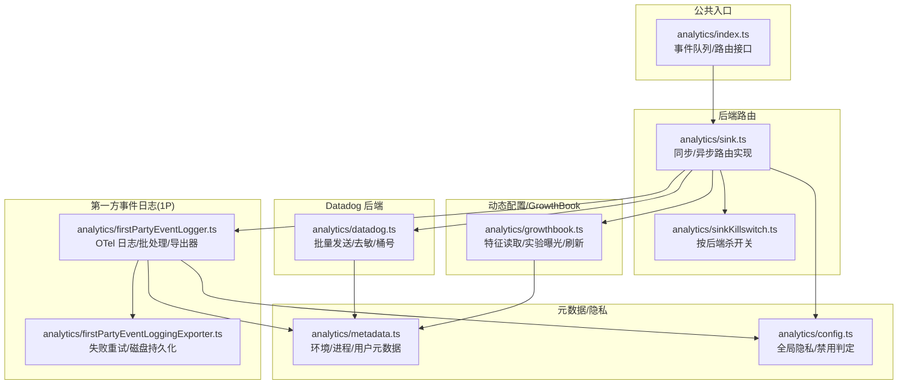
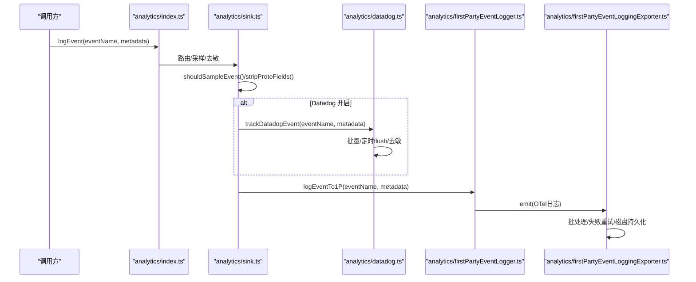
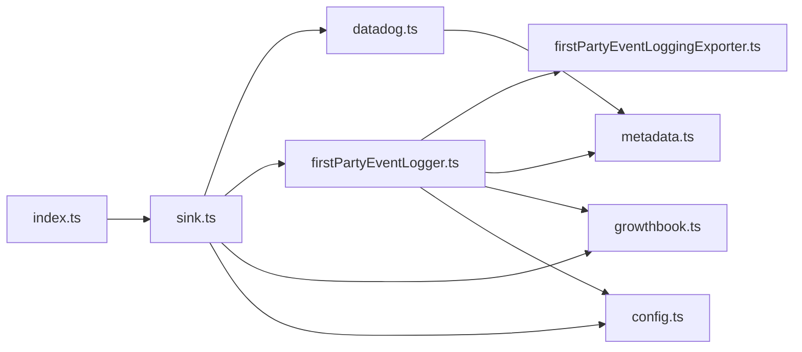

# 分析服务

<cite>
**本文引用的文件**
- [src/services/analytics/index.ts](file://src/services/analytics/index.ts)
- [src/services/analytics/sink.ts](file://src/services/analytics/sink.ts)
- [src/services/analytics/datadog.ts](file://src/services/analytics/datadog.ts)
- [src/services/analytics/firstPartyEventLogger.ts](file://src/services/analytics/firstPartyEventLogger.ts)
- [src/services/analytics/firstPartyEventLoggingExporter.ts](file://src/services/analytics/firstPartyEventLoggingExporter.ts)
- [src/services/analytics/metadata.ts](file://src/services/analytics/metadata.ts)
- [src/services/analytics/growthbook.ts](file://src/services/analytics/growthbook.ts)
- [src/services/analytics/sinkKillswitch.ts](file://src/services/analytics/sinkKillswitch.ts)
- [src/services/analytics/config.ts](file://src/services/analytics/config.ts)
</cite>

## 目录
1. [简介](#简介)
2. [项目结构](#项目结构)
3. [核心组件](#核心组件)
4. [架构总览](#架构总览)
5. [详细组件分析](#详细组件分析)
6. [依赖关系分析](#依赖关系分析)
7. [性能考量](#性能考量)
8. [故障排查指南](#故障排查指南)
9. [结论](#结论)
10. [附录](#附录)

## 简介
本文件系统化梳理分析服务模块，覆盖以下主题：
- 数据分析架构与事件收集、指标追踪机制
- Datadog 集成的性能监控与错误追踪
- 第一方事件日志（1P）的事件格式与存储策略
- GrowthBook 实验平台的 A/B 测试配置与结果分析
- 元数据管理、事件导出与隐私保护机制
- 分析数据的可视化、报告生成与性能优化建议

## 项目结构
分析服务位于 src/services/analytics 目录，采用“公共入口 + 多后端路由”的设计：公共入口负责事件排队与路由；后端包括 Datadog 与第一方事件日志（1P）两条通道；通过 GrowthBook 动态配置控制采样、批次与开关；通过隐私配置与杀开关实现全局禁用与降级。

图示来源
- [src/services/analytics/index.ts:1-174](file://src/services/analytics/index.ts#L1-L174)
- [src/services/analytics/sink.ts:1-114](file://src/services/analytics/sink.ts#L1-L114)
- [src/services/analytics/sinkKillswitch.ts:1-26](file://src/services/analytics/sinkKillswitch.ts#L1-L26)
- [src/services/analytics/datadog.ts:1-307](file://src/services/analytics/datadog.ts#L1-L307)
- [src/services/analytics/firstPartyEventLogger.ts:1-450](file://src/services/analytics/firstPartyEventLogger.ts#L1-L450)
- [src/services/analytics/firstPartyEventLoggingExporter.ts:1-807](file://src/services/analytics/firstPartyEventLoggingExporter.ts#L1-L807)
- [src/services/analytics/metadata.ts:1-974](file://src/services/analytics/metadata.ts#L1-L974)
- [src/services/analytics/growthbook.ts:1-800](file://src/services/analytics/growthbook.ts#L1-L800)
- [src/services/analytics/config.ts:1-39](file://src/services/analytics/config.ts#L1-L39)

章节来源
- [src/services/analytics/index.ts:1-174](file://src/services/analytics/index.ts#L1-L174)
- [src/services/analytics/sink.ts:1-114](file://src/services/analytics/sink.ts#L1-L114)

## 核心组件
- 公共入口与事件队列
  - 提供同步/异步 logEvent 接口，未绑定后端时事件入队，待后端初始化后再出队。
  - 提供 stripProtoFields 去除 _PROTO_* 键，确保非 1P 通道不泄露敏感字段。
- 后端路由与采样
  - 路由到 Datadog 与 1P 事件日志；支持按事件类型采样，并在元数据中注入 sample_rate。
  - 支持按后端杀开关（GrowthBook 配置）临时关闭某后端。
- Datadog 后端
  - 批量发送、定时 flush、网络超时、第三方模型提供商过滤、用户桶号（哈希用户 ID 的固定桶）。
- 第一方事件日志（1P）
  - 使用 OpenTelemetry Logs，独立 Provider/Exporter，带批处理、失败重试、磁盘持久化、指数退避。
  - 导出器将事件转换为内部协议格式，支持实验曝光事件与常规事件。
- 元数据与隐私
  - 统一采集环境、进程、订阅、会话等上下文；对工具名、文件扩展名等进行脱敏；支持仅在特定场景暴露 MCP 名称。
  - 全局隐私配置可整体禁用分析。
- GrowthBook
  - 远端评估缓存、磁盘落盘、刷新监听、实验曝光记录、特征门控与回退。

章节来源
- [src/services/analytics/index.ts:1-174](file://src/services/analytics/index.ts#L1-L174)
- [src/services/analytics/sink.ts:1-114](file://src/services/analytics/sink.ts#L1-L114)
- [src/services/analytics/datadog.ts:1-307](file://src/services/analytics/datadog.ts#L1-L307)
- [src/services/analytics/firstPartyEventLogger.ts:1-450](file://src/services/analytics/firstPartyEventLogger.ts#L1-L450)
- [src/services/analytics/firstPartyEventLoggingExporter.ts:1-807](file://src/services/analytics/firstPartyEventLoggingExporter.ts#L1-L807)
- [src/services/analytics/metadata.ts:1-974](file://src/services/analytics/metadata.ts#L1-L974)
- [src/services/analytics/growthbook.ts:1-800](file://src/services/analytics/growthbook.ts#L1-L800)
- [src/services/analytics/sinkKillswitch.ts:1-26](file://src/services/analytics/sinkKillswitch.ts#L1-L26)
- [src/services/analytics/config.ts:1-39](file://src/services/analytics/config.ts#L1-L39)

## 架构总览
分析服务采用“单入口、多后端、动态配置、强隐私”的设计。事件从公共入口进入，经采样与去敏后，同时投递至 Datadog 与 1P 两条通道。两条通道各自具备独立的批处理、缓冲与容错策略。动态配置通过 GrowthBook 提供，支持采样率、批次参数、后端开关与实验曝光记录。隐私层通过全局禁用与字段去敏保障合规。

图示来源
- [src/services/analytics/index.ts:125-164](file://src/services/analytics/index.ts#L125-L164)
- [src/services/analytics/sink.ts:48-72](file://src/services/analytics/sink.ts#L48-L72)
- [src/services/analytics/datadog.ts:160-279](file://src/services/analytics/datadog.ts#L160-L279)
- [src/services/analytics/firstPartyEventLogger.ts:216-230](file://src/services/analytics/firstPartyEventLogger.ts#L216-L230)
- [src/services/analytics/firstPartyEventLoggingExporter.ts:277-377](file://src/services/analytics/firstPartyEventLoggingExporter.ts#L277-L377)

## 详细组件分析

### 公共入口与事件队列（analytics/index.ts）
- 设计要点
  - 无后端依赖，避免循环导入；事件未绑定后端时入队，后端初始化后微任务出队，不影响启动路径。
  - 提供同步/异步接口，统一注入 sample_rate（若被采样）。
  - 提供 stripProtoFields，确保 _PROTO_* 敏感键在非 1P 通道被移除。
- 关键行为
  - attachAnalyticsSink：幂等绑定后端；首次绑定时出队并异步重放。
  - logEvent/logEventAsync：未绑定则入队；绑定后直接转发。
  - _resetForTesting：测试重置状态。

章节来源
- [src/services/analytics/index.ts:1-174](file://src/services/analytics/index.ts#L1-L174)

### 后端路由与采样（analytics/sink.ts）
- 设计要点
  - 初始化时读取 Datadog 门控（GrowthBook），早于后端初始化的事件使用上会话缓存值。
  - 采样逻辑：根据事件类型采样配置决定是否丢弃或注入 sample_rate。
  - Datadog 通道：对元数据执行 stripProtoFields，移除 _PROTO_* 键。
  - 1P 通道：保留完整元数据，由导出器进一步处理。
- 关键行为
  - initializeAnalyticsGates：启动时更新门控。
  - initializeAnalyticsSink：绑定后端实现。
  - logEventImpl/logEventAsyncImpl：同步/异步实现。

章节来源
- [src/services/analytics/sink.ts:1-114](file://src/services/analytics/sink.ts#L1-L114)

### Datadog 后端（analytics/datadog.ts）
- 设计要点
  - 生产环境才启用；仅在首方模型提供商时发送；使用客户端令牌与固定端点。
  - 批量发送：最大批大小、定时 flush、网络超时；异常吞吐日志。
  - 用户桶号：对用户 ID 做哈希分桶，用于估算受影响用户数而不暴露真实 ID。
  - 允许事件白名单：仅允许白名单事件进入 Datadog。
- 关键行为
  - initializeDatadog/shutdownDatadog：懒初始化与优雅停机 flush。
  - trackDatadogEvent：批量组装、去敏、入队、定时/满批触发 flush。
  - getFlushIntervalMs：支持测试覆盖。

章节来源
- [src/services/analytics/datadog.ts:1-307](file://src/services/analytics/datadog.ts#L1-L307)

### 第一方事件日志（1P）与导出器（analytics/firstPartyEventLogger.ts, firstPartyEventLoggingExporter.ts）
- 设计要点
  - OTel Logs Provider/Exporter 独立于客户遥测，避免泄漏。
  - 批处理：可配置延迟、最大批大小、队列上限；支持 skipAuth 与自定义端点。
  - 容错：失败事件追加写入磁盘，指数退避重试（二次方），达到最大尝试次数后丢弃。
  - 实验曝光：支持 GrowthBook 实验分配事件的记录与导出。
  - 去敏：导出前对 additional_metadata 中的 _PROTO_* 进行防御性剥离。
- 关键行为
  - initialize1PEventLogging：构建 Provider/Exporter，注册刷新监听以热更新配置。
  - reinitialize1PEventLoggingIfConfigChanged：配置变更时安全重建。
  - logEventTo1P/logEventTo1PAsync：异步记录，增强核心元数据与用户元数据。
  - FirstPartyEventLoggingExporter.export/doExport/sendEventsInBatches/queueFailedEvents/retryFailedEvents/resetBackoff：完整的导出与重试流程。
  - transformLogsToEvents：将 OTel 日志转换为内部协议事件，处理实验曝光与常规事件。

章节来源
- [src/services/analytics/firstPartyEventLogger.ts:1-450](file://src/services/analytics/firstPartyEventLogger.ts#L1-L450)
- [src/services/analytics/firstPartyEventLoggingExporter.ts:1-807](file://src/services/analytics/firstPartyEventLoggingExporter.ts#L1-L807)

### 元数据管理与隐私（analytics/metadata.ts, config.ts）
- 设计要点
  - 统一采集：模型、会话、用户类型、环境、进程指标、订阅等级、仓库远程哈希、助理模式、技能模式、观察者模式等。
  - 工具名脱敏：MCP 工具名标准化为通用标识，内置服务器名保留。
  - 文件扩展名脱敏：长扩展名替换为“other”，避免泄露哈希类文件名。
  - 隐私开关：测试环境、第三方云提供商、隐私级别为“禁用遥测”或“仅必要流量”时禁用分析。
- 关键行为
  - getEventMetadata：聚合环境与进程信息，按需加入订阅、助理模式、仓库哈希等。
  - sanitizeToolNameForAnalytics/getFileExtensionForAnalytics：脱敏工具名与扩展名。
  - isAnalyticsDisabled/isFeedbackSurveyDisabled：全局禁用判定。

章节来源
- [src/services/analytics/metadata.ts:1-974](file://src/services/analytics/metadata.ts#L1-L974)
- [src/services/analytics/config.ts:1-39](file://src/services/analytics/config.ts#L1-L39)

### GrowthBook 实验平台（analytics/growthbook.ts）
- 设计要点
  - 远端评估（remoteEval）：服务端预计算特征值，本地缓存并落盘，避免 SDK 本地再计算问题。
  - 缓存与刷新：内存缓存 + 磁盘落盘；周期性刷新；onGrowthBookRefresh 通知订阅者。
  - 实验曝光：访问特征时记录实验数据，按会话去重上报。
  - 门控与回退：支持环境变量覆盖、配置页覆盖；未初始化时使用磁盘缓存。
  - 安全与销毁：信任建立后重建客户端；退出钩子销毁；支持重新初始化。
- 关键行为
  - initializeGrowthBook/getGrowthBookClient：懒初始化与认证头注入。
  - getFeatureValue_CACHED_MAY_BE_STALE/_CACHED_WITH_REFRESH：缓存读取与过期策略。
  - onGrowthBookRefresh：订阅刷新事件。
  - logGrowthBookExperimentTo1P：记录实验曝光事件。

章节来源
- [src/services/analytics/growthbook.ts:1-800](file://src/services/analytics/growthbook.ts#L1-L800)

### 后端杀开关（analytics/sinkKillswitch.ts）
- 设计要点
  - 通过 GrowthBook 配置按后端关闭（datadog/firstParty），默认开启。
  - 在事件派发处检查，避免与 1P 启用判断形成递归。
- 关键行为
  - isSinkKilled：读取配置并判定是否关闭。

章节来源
- [src/services/analytics/sinkKillswitch.ts:1-26](file://src/services/analytics/sinkKillswitch.ts#L1-L26)

## 依赖关系分析
- 模块耦合
  - index.ts 仅作为入口，不依赖后端，降低耦合。
  - sink.ts 依赖 datadog.ts 与 firstPartyEventLogger.ts，并通过 stripProtoFields 统一去敏。
  - firstPartyEventLoggingExporter.ts 依赖 metadata.ts 与 GrowthBook 配置，负责最终导出。
  - growthbook.ts 为动态配置中心，被多个模块读取。
- 外部依赖
  - Datadog：HTTP Intake 端点、客户端令牌、批量限制。
  - OTel Logs：Provider/Processor/Exporter、资源属性、批处理参数。
  - Axios：网络请求、超时、401 自动降级。
  - 文件系统：失败事件磁盘持久化。

图示来源
- [src/services/analytics/index.ts:1-174](file://src/services/analytics/index.ts#L1-L174)
- [src/services/analytics/sink.ts:1-114](file://src/services/analytics/sink.ts#L1-L114)
- [src/services/analytics/datadog.ts:1-307](file://src/services/analytics/datadog.ts#L1-L307)
- [src/services/analytics/firstPartyEventLogger.ts:1-450](file://src/services/analytics/firstPartyEventLogger.ts#L1-L450)
- [src/services/analytics/firstPartyEventLoggingExporter.ts:1-807](file://src/services/analytics/firstPartyEventLoggingExporter.ts#L1-L807)
- [src/services/analytics/metadata.ts:1-974](file://src/services/analytics/metadata.ts#L1-L974)
- [src/services/analytics/growthbook.ts:1-800](file://src/services/analytics/growthbook.ts#L1-L800)
- [src/services/analytics/config.ts:1-39](file://src/services/analytics/config.ts#L1-L39)

章节来源
- [src/services/analytics/index.ts:1-174](file://src/services/analytics/index.ts#L1-L174)
- [src/services/analytics/sink.ts:1-114](file://src/services/analytics/sink.ts#L1-L114)
- [src/services/analytics/firstPartyEventLogger.ts:1-450](file://src/services/analytics/firstPartyEventLogger.ts#L1-L450)
- [src/services/analytics/firstPartyEventLoggingExporter.ts:1-807](file://src/services/analytics/firstPartyEventLoggingExporter.ts#L1-L807)
- [src/services/analytics/metadata.ts:1-974](file://src/services/analytics/metadata.ts#L1-L974)
- [src/services/analytics/growthbook.ts:1-800](file://src/services/analytics/growthbook.ts#L1-L800)
- [src/services/analytics/config.ts:1-39](file://src/services/analytics/config.ts#L1-L39)

## 性能考量
- 批处理与定时器
  - Datadog：批量大小与 flush 间隔可调，默认批量上限与定时器减少网络开销。
  - 1P：OTel 批处理器支持延迟、最大批大小与队列上限，避免高频小包。
- 采样与去敏
  - 事件级采样降低带宽与存储压力；_PROTO_* 去敏避免额外字段膨胀。
- 指数退避与磁盘持久化
  - 1P 导出器采用二次方退避，结合磁盘持久化，提升稳定性与恢复能力。
- 内存与 CPU
  - 进程指标（RSS、堆、CPU%）按事件采集，便于性能回归分析。
- 并发与队列
  - 事件队列与 OTel 批处理并发运行，避免阻塞主流程。

## 故障排查指南
- Datadog 发送失败
  - 现象：网络异常、超时、第三方模型提供商过滤。
  - 排查：确认生产环境、首方模型、令牌有效；查看 flush 与批量配置；检查超时设置。
  - 参考
    - [src/services/analytics/datadog.ts:102-119](file://src/services/analytics/datadog.ts#L102-L119)
    - [src/services/analytics/datadog.ts:160-279](file://src/services/analytics/datadog.ts#L160-L279)
- 1P 导出失败
  - 现象：HTTP 错误、401、磁盘持久化文件堆积。
  - 排查：检查信任状态与 OAuth 令牌有效性；确认端点与批处理配置；查看磁盘失败文件与重试日志。
  - 参考
    - [src/services/analytics/firstPartyEventLoggingExporter.ts:527-615](file://src/services/analytics/firstPartyEventLoggingExporter.ts#L527-L615)
    - [src/services/analytics/firstPartyEventLoggingExporter.ts:445-517](file://src/services/analytics/firstPartyEventLoggingExporter.ts#L445-L517)
- 后端被杀
  - 现象：事件未到达 Datadog 或 1P。
  - 排查：检查 GrowthBook 配置 tengu_frond_boric 对应键。
  - 参考
    - [src/services/analytics/sinkKillswitch.ts:18-25](file://src/services/analytics/sinkKillswitch.ts#L18-L25)
- 采样导致数据缺失
  - 现象：部分事件未出现。
  - 排查：检查 tengu_event_sampling_config；确认 sample_rate 注入。
  - 参考
    - [src/services/analytics/firstPartyEventLogger.ts:57-85](file://src/services/analytics/firstPartyEventLogger.ts#L57-L85)
    - [src/services/analytics/sink.ts:48-72](file://src/services/analytics/sink.ts#L48-L72)
- 元数据缺失
  - 现象：缺少核心元数据导致导出为“部分事件”。
  - 排查：确认 getEventMetadata 是否正常返回；检查用户元数据与会话上下文。
  - 参考
    - [src/services/analytics/firstPartyEventLoggingExporter.ts:683-705](file://src/services/analytics/firstPartyEventLoggingExporter.ts#L683-L705)
    - [src/services/analytics/metadata.ts:693-743](file://src/services/analytics/metadata.ts#L693-L743)

章节来源
- [src/services/analytics/datadog.ts:102-279](file://src/services/analytics/datadog.ts#L102-L279)
- [src/services/analytics/firstPartyEventLoggingExporter.ts:445-779](file://src/services/analytics/firstPartyEventLoggingExporter.ts#L445-L779)
- [src/services/analytics/sinkKillswitch.ts:18-25](file://src/services/analytics/sinkKillswitch.ts#L18-L25)
- [src/services/analytics/firstPartyEventLogger.ts:57-85](file://src/services/analytics/firstPartyEventLogger.ts#L57-L85)
- [src/services/analytics/sink.ts:48-72](file://src/services/analytics/sink.ts#L48-L72)
- [src/services/analytics/metadata.ts:693-743](file://src/services/analytics/metadata.ts#L693-L743)

## 结论
该分析服务模块通过统一入口、双通道后端、动态配置与强隐私策略，实现了高可用、可观测且合规的数据分析体系。Datadog 用于通用性能与错误监控，1P 事件日志用于内部精细化分析与实验追踪。GrowthBook 提供灵活的特征与实验治理，配合采样与去敏策略，在保证数据质量的同时兼顾性能与隐私。

## 附录

### 事件格式与存储策略
- Datadog
  - 字段：ddsource、ddtags、message、service、hostname 等；其余字段转为 snake_case 映射。
  - 存储：HTTP Intake 端点，客户端令牌鉴权。
  - 参考
    - [src/services/analytics/datadog.ts:89-96](file://src/services/analytics/datadog.ts#L89-L96)
    - [src/services/analytics/datadog.ts:257-262](file://src/services/analytics/datadog.ts#L257-L262)
- 1P 事件日志
  - 协议：ClaudeCodeInternalEvent 与 GrowthbookExperimentEvent。
  - 字段：event_id、event_name、client_timestamp、device_id、auth、env、process、additional_metadata 等。
  - 存储：成功后清空磁盘文件；失败追加写入，指数退避重试。
  - 参考
    - [src/services/analytics/firstPartyEventLoggingExporter.ts:49-56](file://src/services/analytics/firstPartyEventLoggingExporter.ts#L49-L56)
    - [src/services/analytics/firstPartyEventLoggingExporter.ts:729-758](file://src/services/analytics/firstPartyEventLoggingExporter.ts#L729-L758)

### GrowthBook 实验配置与结果分析
- 配置来源
  - 远端评估缓存 + 磁盘落盘；周期刷新；订阅 onGrowthBookRefresh 获取变更。
- 实验曝光
  - 访问特征时记录实验数据，按会话去重上报；支持通过 logGrowthBookExperimentTo1P 主动上报。
- 结果分析
  - 通过 1P 事件日志中的实验事件与常规事件联合分析，结合用户桶号估算影响范围。
- 参考
  - [src/services/analytics/growthbook.ts:327-394](file://src/services/analytics/growthbook.ts#L327-L394)
  - [src/services/analytics/growthbook.ts:296-314](file://src/services/analytics/growthbook.ts#L296-L314)
  - [src/services/analytics/firstPartyEventLogger.ts:255-298](file://src/services/analytics/firstPartyEventLogger.ts#L255-L298)

### 可视化、报告与性能优化建议
- 可视化与报告
  - Datadog：基于事件标签与字段构建仪表板与告警；利用用户桶号进行基数控制与影响面估算。
  - 1P：基于 BigQuery 表结构与字段进行多维分析（环境、版本、订阅、工具等）。
- 性能优化
  - 调整批处理参数（延迟、大小、队列上限）与 flush 间隔，平衡延迟与吞吐。
  - 合理设置采样率，优先保留关键事件。
  - 严格遵守隐私策略，避免敏感字段进入通用通道。
- 参考
  - [src/services/analytics/firstPartyEventLogger.ts:329-339](file://src/services/analytics/firstPartyEventLogger.ts#L329-L339)
  - [src/services/analytics/firstPartyEventLogger.ts:87-102](file://src/services/analytics/firstPartyEventLogger.ts#L87-L102)
  - [src/services/analytics/datadog.ts:301-307](file://src/services/analytics/datadog.ts#L301-L307)