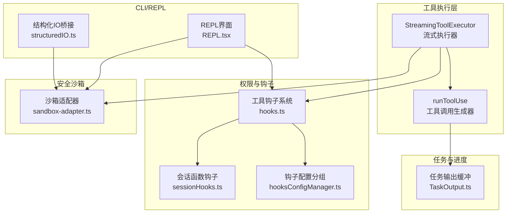
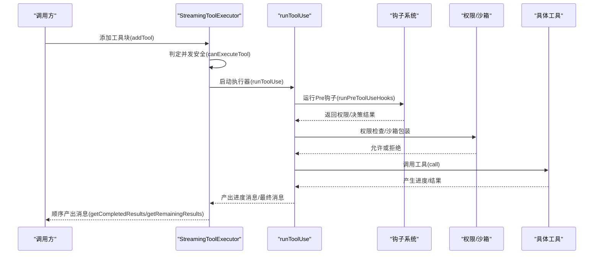
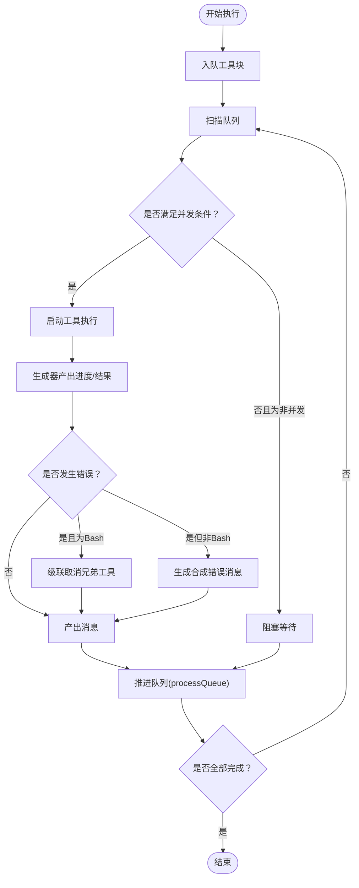
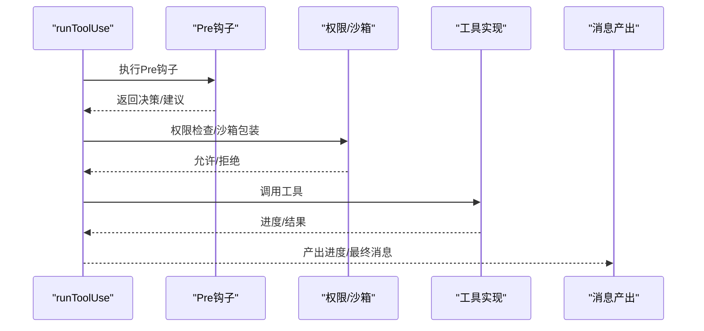
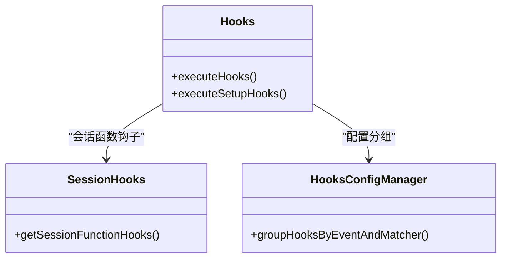
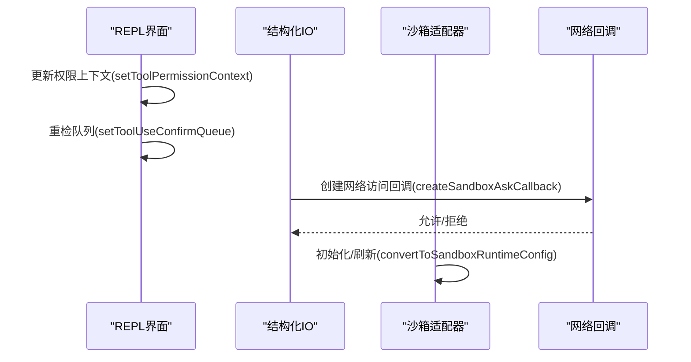
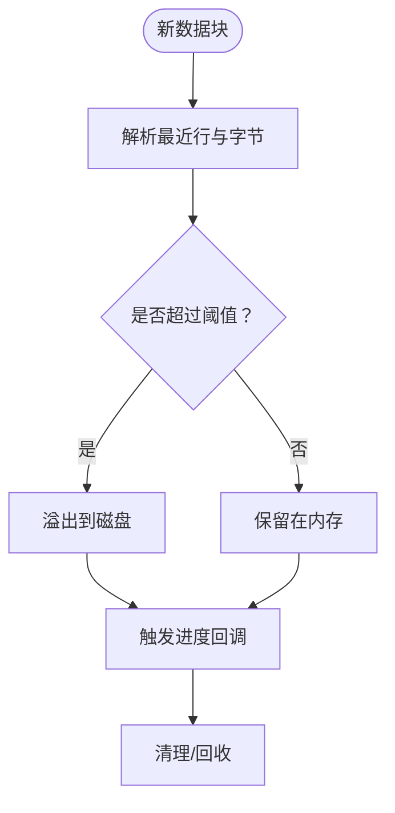
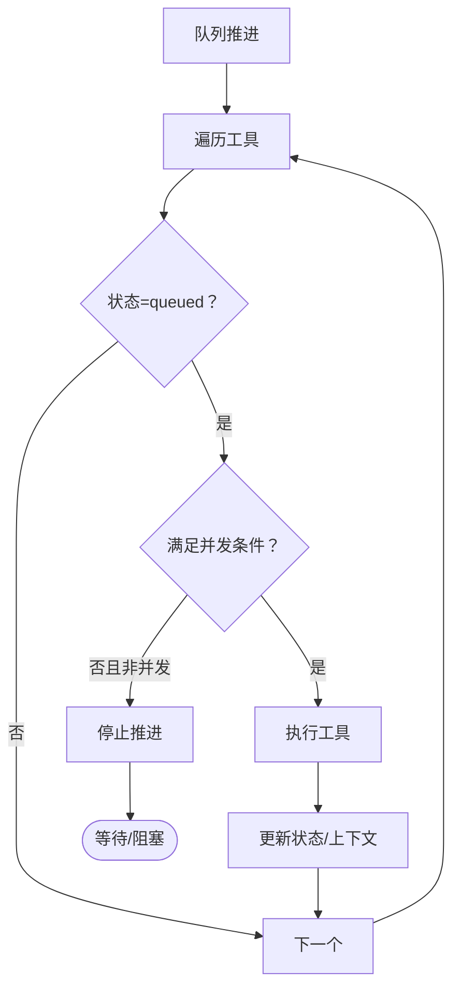
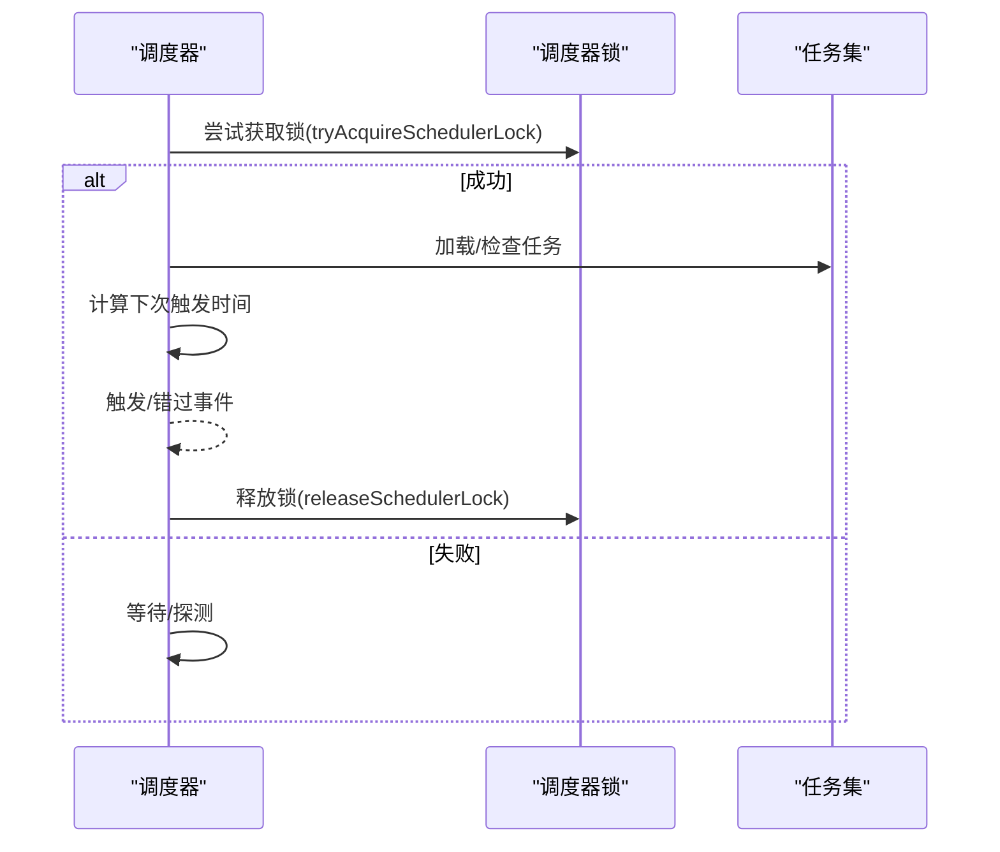
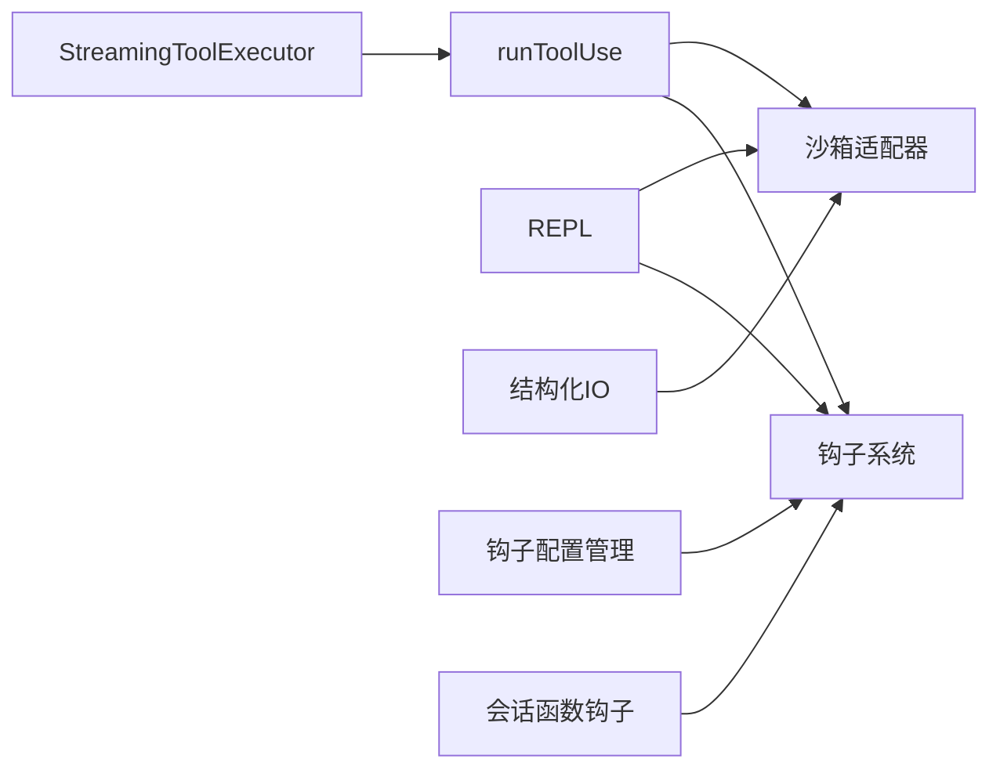

# 工具执行服务

<cite>
**本文档引用的文件**
- [StreamingToolExecutor.ts](file://src/services/tools/StreamingToolExecutor.ts)
- [toolExecution.ts](file://src/services/tools/toolExecution.ts)
- [Tool.ts](file://src/Tool.ts)
- [sandbox-adapter.ts](file://src/utils/sandbox/sandbox-adapter.ts)
- [hooks.ts](file://src/utils/hooks.ts)
- [sessionHooks.ts](file://src/utils/hooks/sessionHooks.ts)
- [hooksConfigManager.ts](file://src/utils/hooks/hooksConfigManager.ts)
- [TaskOutput.ts](file://src/utils/task/TaskOutput.ts)
- [REPL.tsx](file://src/screens/REPL.tsx)
- [hooks.ts（权限）](file://src/components/permissions/hooks.ts)
- [structuredIO.ts](file://src/cli/structuredIO.ts)
- [cronTasksLock.ts](file://src/utils/cronTasksLock.ts)
- [cronScheduler.ts](file://src/utils/cronScheduler.ts)
- [cronJitterConfig.ts](file://src/utils/cronJitterConfig.ts)
- [agentSdkTypes.ts](file://src/entrypoints/agentSdkTypes.ts)
</cite>

## 目录
1. [简介](#简介)
2. [项目结构](#项目结构)
3. [核心组件](#核心组件)
4. [架构总览](#架构总览)
5. [详细组件分析](#详细组件分析)
6. [依赖关系分析](#依赖关系分析)
7. [性能考量](#性能考量)
8. [故障排查指南](#故障排查指南)
9. [结论](#结论)
10. [附录](#附录)

## 简介
本文件系统性阐述工具执行服务模块，覆盖以下关键主题：
- 工具执行器的设计模式与并发控制：基于“流式执行 + 队列推进 + 中断感知”的设计，支持并发安全工具并行与非并发工具串行。
- 工具钩子系统：生命周期管理（Pre/Post/失败/停止等）、事件触发与状态同步、配置分组与函数钩子匹配。
- 工具编排与调度：队列处理、中断行为、错误传播与恢复策略、钩子与权限决策的时序协调。
- 流式工具执行：实时输出、进度报告、资源管理（内存/磁盘溢出）。
- 安全沙箱：权限控制、网络访问请求桥接、违规记录与可视化。
- 性能监控：遥测、追踪、性能指标采集。
- 开发调试与优化最佳实践：输入校验、并发安全标记、中断行为、钩子与权限策略。

## 项目结构
工具执行服务位于 src/services/tools 下，围绕 StreamingToolExecutor 与 runToolUse 协同工作；权限与钩子在 src/utils 下组织；沙箱适配器在 src/utils/sandbox；CLI 与 REPL 屏幕负责交互与权限上下文更新；任务输出与进度在 src/utils/task；调度与锁在 src/utils 下。

图表来源
- [StreamingToolExecutor.ts:40-531](file://src/services/tools/StreamingToolExecutor.ts#L40-L531)
- [toolExecution.ts:337-490](file://src/services/tools/toolExecution.ts#L337-L490)
- [hooks.ts:3884-3922](file://src/utils/hooks.ts#L3884-L3922)
- [sessionHooks.ts:322-368](file://src/utils/hooks/sessionHooks.ts#L322-L368)
- [hooksConfigManager.ts:269-320](file://src/utils/hooks/hooksConfigManager.ts#L269-L320)
- [sandbox-adapter.ts:704-792](file://src/utils/sandbox/sandbox-adapter.ts#L704-L792)
- [REPL.tsx:2340-2375](file://src/screens/REPL.tsx#L2340-L2375)
- [structuredIO.ts:723-753](file://src/cli/structuredIO.ts#L723-L753)
- [TaskOutput.ts:211-390](file://src/utils/task/TaskOutput.ts#L211-L390)

章节来源
- [StreamingToolExecutor.ts:40-531](file://src/services/tools/StreamingToolExecutor.ts#L40-L531)
- [toolExecution.ts:337-490](file://src/services/tools/toolExecution.ts#L337-L490)
- [sandbox-adapter.ts:704-792](file://src/utils/sandbox/sandbox-adapter.ts#L704-L792)

## 核心组件
- 流式工具执行器 StreamingToolExecutor：维护工具队列、并发控制、进度消息即时产出、错误传播与中断处理、上下文修改器应用。
- 工具调用生成器 runToolUse：封装权限检查、钩子执行、工具调用、进度事件与结果聚合。
- 工具定义与上下文 Tool.ts：统一的工具接口、输入模式、中断行为、上下文结构。
- 沙箱适配器 sandbox-adapter.ts：将本地设置转换为沙箱运行时配置、初始化与动态刷新、网络访问回调桥接。
- 钩子系统：hooks.ts 提供执行入口；sessionHooks.ts 处理会话函数钩子；hooksConfigManager.ts 负责按事件与匹配器分组。
- 任务输出 TaskOutput.ts：流式进度提取、最近行缓存、溢出到磁盘与清理。
- REPL 与结构化 IO：REPL.tsx 更新权限上下文并重检队列；structuredIO.ts 将网络访问请求桥接到 can_use_tool 控制请求。
- 调度与锁：cronTasksLock.ts/cronScheduler.ts/cronJitterConfig.ts/agentSdkTypes.ts 提供调度器锁、任务过期与抖动配置。

章节来源
- [Tool.ts:158-200](file://src/Tool.ts#L158-L200)
- [StreamingToolExecutor.ts:40-151](file://src/services/tools/StreamingToolExecutor.ts#L40-L151)
- [toolExecution.ts:337-570](file://src/services/tools/toolExecution.ts#L337-L570)
- [sandbox-adapter.ts:704-792](file://src/utils/sandbox/sandbox-adapter.ts#L704-L792)
- [hooks.ts:3884-3922](file://src/utils/hooks.ts#L3884-L3922)
- [sessionHooks.ts:322-368](file://src/utils/hooks/sessionHooks.ts#L322-L368)
- [hooksConfigManager.ts:269-320](file://src/utils/hooks/hooksConfigManager.ts#L269-L320)
- [TaskOutput.ts:211-390](file://src/utils/task/TaskOutput.ts#L211-L390)
- [REPL.tsx:2340-2375](file://src/screens/REPL.tsx#L2340-L2375)
- [structuredIO.ts:723-753](file://src/cli/structuredIO.ts#L723-L753)
- [cronTasksLock.ts:100-195](file://src/utils/cronTasksLock.ts#L100-L195)
- [cronScheduler.ts:40-60](file://src/utils/cronScheduler.ts#L40-L60)
- [cronJitterConfig.ts:55-75](file://src/utils/cronJitterConfig.ts#L55-L75)
- [agentSdkTypes.ts:291-328](file://src/entrypoints/agentSdkTypes.ts#L291-L328)

## 架构总览
工具执行服务采用“生成器驱动 + 并发控制 + 钩子与权限前置”的流水线式架构。StreamingToolExecutor 负责入队、并发判定、执行与结果产出；runToolUse 负责权限与钩子链路、进度事件与最终消息；沙箱适配器贯穿工具调用前后的安全策略；REPL/CLI 通过上下文与回调参与权限与网络访问决策。

图表来源
- [StreamingToolExecutor.ts:140-151](file://src/services/tools/StreamingToolExecutor.ts#L140-L151)
- [toolExecution.ts:492-570](file://src/services/tools/toolExecution.ts#L492-L570)
- [hooks.ts:3884-3922](file://src/utils/hooks.ts#L3884-L3922)

## 详细组件分析

### 流式工具执行器 StreamingToolExecutor
- 设计模式
  - 基于生成器的异步迭代：工具调用返回 AsyncGenerator，逐步产出进度与最终结果。
  - 队列推进模型：逐个扫描队列，满足并发条件则启动下一个工具。
  - 中断感知：支持用户中断、兄弟工具错误导致的级联取消、流式回退丢弃。
- 并发控制
  - 并发安全工具：当存在并发安全工具时，允许与其他并发安全工具并行。
  - 非并发工具：独占执行，阻塞后续非并发工具，保证顺序一致性。
- 错误与恢复
  - Bash 错误触发兄弟工具级联取消，避免无意义的后续执行。
  - 用户中断根据工具中断行为决定取消或阻塞。
  - 流式回退时丢弃未完成工具，生成合成错误消息。
- 实时输出与进度
  - 进度消息优先于结果立即产出，确保 UI 及时反馈。
  - 上下文修改器仅对非并发工具生效，避免并发场景下的竞态。
- 资源管理
  - 使用 AbortController 分层控制：父级用于整轮中断，子控制器用于兄弟级联取消。
  - 结果收集完成后更新“可中断”状态，便于 UI 交互。

图表来源
- [StreamingToolExecutor.ts:129-151](file://src/services/tools/StreamingToolExecutor.ts#L129-L151)
- [StreamingToolExecutor.ts:265-405](file://src/services/tools/StreamingToolExecutor.ts#L265-L405)
- [StreamingToolExecutor.ts:412-490](file://src/services/tools/StreamingToolExecutor.ts#L412-L490)

章节来源
- [StreamingToolExecutor.ts:40-531](file://src/services/tools/StreamingToolExecutor.ts#L40-L531)

### 工具调用生成器 runToolUse
- 输入校验与值验证：使用 Zod Schema 校验参数类型与业务规则，必要时提示加载工具搜索以补充模式。
- 权限与钩子：先运行 Pre 钩子，再进行权限检查与沙箱包装，最后调用工具；期间持续产出进度消息。
- 结果聚合：将工具结果与上下文修改器合并，支持后续钩子链路。
- 错误分类与遥测：对常见错误进行分类，输出到遥测与日志，便于诊断。

图表来源
- [toolExecution.ts:492-570](file://src/services/tools/toolExecution.ts#L492-L570)
- [toolExecution.ts:613-800](file://src/services/tools/toolExecution.ts#L613-L800)

章节来源
- [toolExecution.ts:337-800](file://src/services/tools/toolExecution.ts#L337-L800)

### 工具钩子系统
- 生命周期与事件
  - 支持 PreToolUse、PostToolUse、PostToolUseFailure、PermissionDenied、Notification、UserPromptSubmit、SessionStart/End、Stop/StopFailure、SubagentStart/Stop、PreCompact/PostCompact、PermissionRequest、Setup、TeammateIdle、TaskCreated/Completed、Elicitation/ElicitationResult、ConfigChange、WorktreeCreate/Remove、InstructionsLoaded、CwdChanged、FileChanged 等事件。
- 执行入口
  - executeHooks：通用执行器，支持同步/异步钩子、超时与信号控制。
  - executeSetupHooks：针对初始化/维护阶段的钩子执行。
- 会话函数钩子
  - getSessionFunctionHooks：从会话存储中提取函数型钩子，不持久化为 HookMatcher。
- 配置分组
  - groupHooksByEventAndMatcher：按事件与匹配器分组，支持无匹配器事件使用空字符串键。

图表来源
- [hooks.ts:3884-3922](file://src/utils/hooks.ts#L3884-L3922)
- [sessionHooks.ts:345-368](file://src/utils/hooks/sessionHooks.ts#L345-L368)
- [hooksConfigManager.ts:269-320](file://src/utils/hooks/hooksConfigManager.ts#L269-L320)

章节来源
- [hooks.ts:3884-3922](file://src/utils/hooks.ts#L3884-L3922)
- [sessionHooks.ts:322-368](file://src/utils/hooks/sessionHooks.ts#L322-L368)
- [hooksConfigManager.ts:269-320](file://src/utils/hooks/hooksConfigManager.ts#L269-L320)

### 安全沙箱与权限控制
- 沙箱适配器
  - 初始化与动态刷新：convertToSandboxRuntimeConfig 将本地设置转换为运行时配置；initialize 包装回调并订阅设置变更；refreshConfig 动态更新。
  - 网络访问回调：structuredIO 的 createSandboxAskCallback 将网络请求桥接为 can_use_tool 请求。
  - 排除命令与路径解析：支持排除特定命令、路径前缀解析、Git bare 仓库防护与清理。
- REPL 权限上下文
  - setToolPermissionContext 更新工具权限上下文，并在变更后重检队列中的待确认项。
- 权限决策分析
  - hooks.ts（权限）记录权限请求与决策原因，用于分析与审计。

图表来源
- [REPL.tsx:2340-2375](file://src/screens/REPL.tsx#L2340-L2375)
- [structuredIO.ts:723-753](file://src/cli/structuredIO.ts#L723-L753)
- [sandbox-adapter.ts:704-792](file://src/utils/sandbox/sandbox-adapter.ts#L704-L792)
- [hooks.ts（权限）:131-165](file://src/components/permissions/hooks.ts#L131-L165)

章节来源
- [sandbox-adapter.ts:704-792](file://src/utils/sandbox/sandbox-adapter.ts#L704-L792)
- [structuredIO.ts:723-753](file://src/cli/structuredIO.ts#L723-L753)
- [REPL.tsx:2340-2375](file://src/screens/REPL.tsx#L2340-L2375)
- [hooks.ts（权限）:131-165](file://src/components/permissions/hooks.ts#L131-L165)

### 流式工具执行的实时输出与进度
- 进度提取：TaskOutput 从最新数据块中提取最近若干行与字节统计，滚动窗口限制内存占用。
- 溢出策略：超过阈值时将内容溢出到磁盘，支持 flush 与删除。
- 输出文件管理：大输出文件持久化到工具结果目录，截断上限并链接/复制至结果位置，便于模型读取。

图表来源
- [TaskOutput.ts:211-254](file://src/utils/task/TaskOutput.ts#L211-L254)
- [TaskOutput.ts:361-390](file://src/utils/task/TaskOutput.ts#L361-L390)

章节来源
- [TaskOutput.ts:211-390](file://src/utils/task/TaskOutput.ts#L211-L390)

### 工具编排与调度算法
- 队列推进：processQueue 顺序扫描，遇到不可并发工具即停止推进，保证顺序一致性。
- 中断行为：根据工具中断行为（cancel/block）决定是否响应用户中断。
- 错误恢复：Bash 错误触发级联取消，其他工具错误生成合成错误消息，避免无效执行。
- 钩子与权限：Pre 钩子与权限检查在工具调用前完成，影响后续执行路径与结果。

图表来源
- [StreamingToolExecutor.ts:140-151](file://src/services/tools/StreamingToolExecutor.ts#L140-L151)
- [StreamingToolExecutor.ts:233-241](file://src/services/tools/StreamingToolExecutor.ts#L233-L241)

章节来源
- [StreamingToolExecutor.ts:129-151](file://src/services/tools/StreamingToolExecutor.ts#L129-L151)
- [StreamingToolExecutor.ts:233-241](file://src/services/tools/StreamingToolExecutor.ts#L233-L241)

### 调度器锁与任务过期
- 调度器锁：tryAcquireSchedulerLock 与 releaseSchedulerLock 提供会话级互斥，支持恢复会话 ID 与进程存活检测。
- 任务过期：isRecurringTaskAged 根据创建时间与最大年龄判断是否应删除。
- 抖动配置：getCronJitterConfig 从 GrowthBook 获取调度抖动参数，daemon 与 CLI 一致。

图表来源
- [cronTasksLock.ts:100-195](file://src/utils/cronTasksLock.ts#L100-L195)
- [cronScheduler.ts:40-60](file://src/utils/cronScheduler.ts#L40-L60)
- [cronJitterConfig.ts:55-75](file://src/utils/cronJitterConfig.ts#L55-L75)
- [agentSdkTypes.ts:291-328](file://src/entrypoints/agentSdkTypes.ts#L291-L328)

章节来源
- [cronTasksLock.ts:100-195](file://src/utils/cronTasksLock.ts#L100-L195)
- [cronScheduler.ts:40-60](file://src/utils/cronScheduler.ts#L40-L60)
- [cronJitterConfig.ts:55-75](file://src/utils/cronJitterConfig.ts#L55-L75)
- [agentSdkTypes.ts:291-328](file://src/entrypoints/agentSdkTypes.ts#L291-L328)

## 依赖关系分析
- 组件耦合
  - StreamingToolExecutor 依赖 runToolUse、工具定义、上下文与中断信号。
  - runToolUse 依赖钩子系统、权限/沙箱、工具实现、进度与结果消息构建。
  - 钩子系统与配置管理相互协作，提供事件驱动的扩展点。
  - 沙箱适配器与 CLI/REPL 通过回调与上下文联动。
- 外部依赖
  - 沙箱运行时包：@anthropic-ai/sandbox-runtime。
  - MCP 客户端与服务器连接：用于 MCP 工具的传输类型识别与基地址提取。
  - 调度与锁：文件锁与进程存活检测。

图表来源
- [StreamingToolExecutor.ts:40-531](file://src/services/tools/StreamingToolExecutor.ts#L40-L531)
- [toolExecution.ts:337-490](file://src/services/tools/toolExecution.ts#L337-L490)
- [hooks.ts:3884-3922](file://src/utils/hooks.ts#L3884-L3922)
- [hooksConfigManager.ts:269-320](file://src/utils/hooks/hooksConfigManager.ts#L269-L320)
- [sessionHooks.ts:322-368](file://src/utils/hooks/sessionHooks.ts#L322-L368)
- [sandbox-adapter.ts:704-792](file://src/utils/sandbox/sandbox-adapter.ts#L704-L792)
- [REPL.tsx:2340-2375](file://src/screens/REPL.tsx#L2340-L2375)
- [structuredIO.ts:723-753](file://src/cli/structuredIO.ts#L723-L753)

章节来源
- [StreamingToolExecutor.ts:40-531](file://src/services/tools/StreamingToolExecutor.ts#L40-L531)
- [toolExecution.ts:337-490](file://src/services/tools/toolExecution.ts#L337-L490)
- [hooks.ts:3884-3922](file://src/utils/hooks.ts#L3884-L3922)
- [hooksConfigManager.ts:269-320](file://src/utils/hooks/hooksConfigManager.ts#L269-L320)
- [sessionHooks.ts:322-368](file://src/utils/hooks/sessionHooks.ts#L322-L368)
- [sandbox-adapter.ts:704-792](file://src/utils/sandbox/sandbox-adapter.ts#L704-L792)
- [REPL.tsx:2340-2375](file://src/screens/REPL.tsx#L2340-L2375)
- [structuredIO.ts:723-753](file://src/cli/structuredIO.ts#L723-L753)

## 性能考量
- 并发策略：并发安全工具并行，非并发工具串行，减少资源竞争与状态冲突。
- 进度优先：进度消息优先产出，降低 UI 等待时间，提升感知性能。
- 内存与磁盘：TaskOutput 在阈值后溢出到磁盘，避免内存峰值；输出文件截断与链接/复制策略平衡性能与可靠性。
- 遥测与追踪：OTLP/Perfetto 追踪工具执行时长、成功与否、错误类型与决策来源，辅助定位热点与瓶颈。
- 调度抖动：通过抖动配置平滑任务触发，避免集中负载。

## 故障排查指南
- 工具不可用
  - 现象：提示“无此工具可用”。
  - 排查：确认工具名称与别名映射，检查工具注册与可用列表。
- 输入校验失败
  - 现象：提示输入验证错误。
  - 排查：核对 Zod Schema，必要时调用工具搜索以补全模式。
- 权限拒绝
  - 现象：工具被拒绝执行。
  - 排查：查看权限决策原因与来源，检查规则、钩子与沙箱策略。
- Bash 错误级联
  - 现象：Bash 失败导致后续工具被取消。
  - 排查：检查命令依赖链，修复上游失败后再重试。
- 沙箱不可用
  - 现象：沙箱启用但无法运行。
  - 排查：检查平台支持、依赖缺失与 enabledPlatforms 限制；查看不可用原因提示。
- 调度器锁冲突
  - 现象：任务无法获取锁或被阻塞。
  - 排查：确认会话 ID 与进程存活，清理旧锁后重试。

章节来源
- [toolExecution.ts:368-411](file://src/services/tools/toolExecution.ts#L368-L411)
- [toolExecution.ts:613-733](file://src/services/tools/toolExecution.ts#L613-L733)
- [StreamingToolExecutor.ts:354-364](file://src/services/tools/StreamingToolExecutor.ts#L354-L364)
- [sandbox-adapter.ts:562-592](file://src/utils/sandbox/sandbox-adapter.ts#L562-L592)
- [cronTasksLock.ts:100-172](file://src/utils/cronTasksLock.ts#L100-L172)

## 结论
工具执行服务通过“流式执行 + 并发控制 + 钩子与权限前置”的架构，实现了高并发、低耦合、可观测与可扩展的工具执行能力。沙箱与权限体系保障了安全性，调度与锁机制提升了稳定性。结合进度优先与溢出策略，系统在复杂场景下仍能保持良好的用户体验与性能表现。

## 附录
- 最佳实践
  - 明确工具并发安全属性，合理划分并发与串行工具。
  - 在工具实现中提供合理的中断行为与进度事件。
  - 使用钩子与权限策略进行前置治理，减少失败成本。
  - 对大输出与长耗时工具启用溢出与遥测，便于监控与优化。
  - 在 REPL/CLI 中及时更新权限上下文并重检队列，确保一致性。