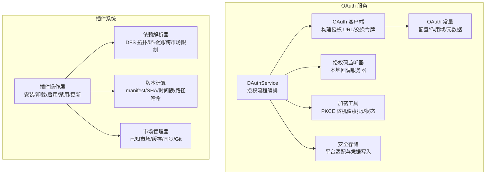
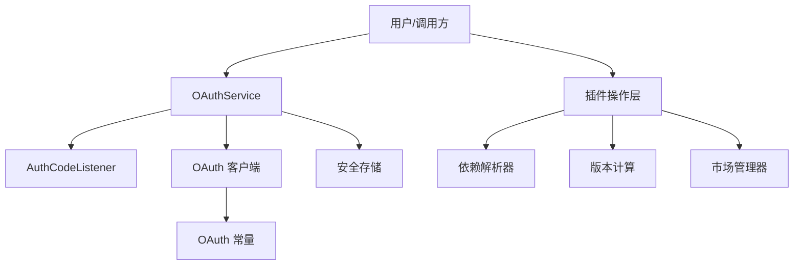
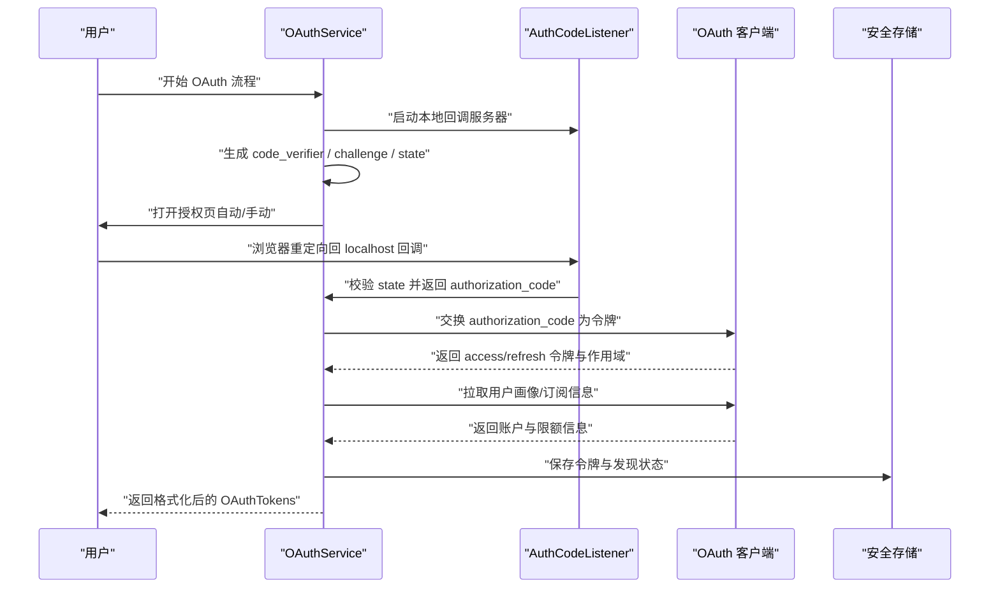
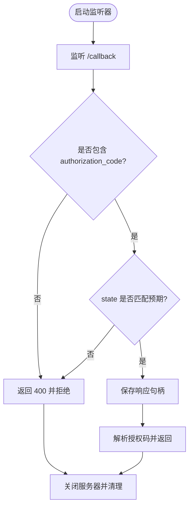
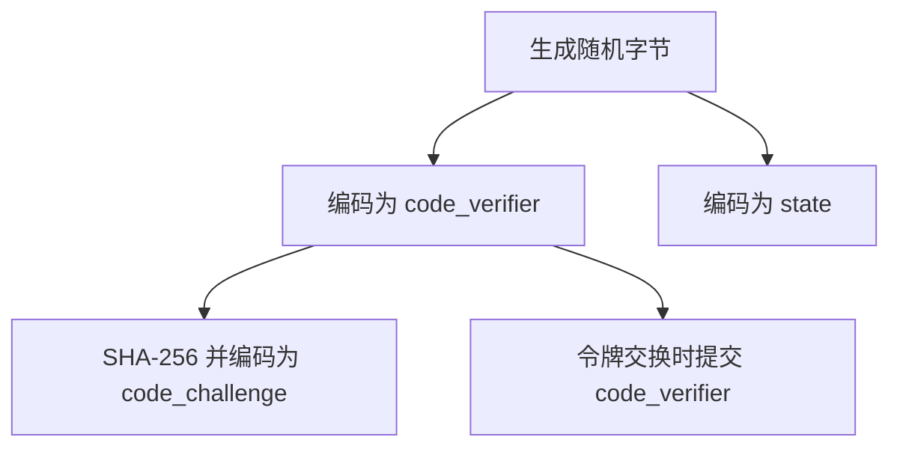
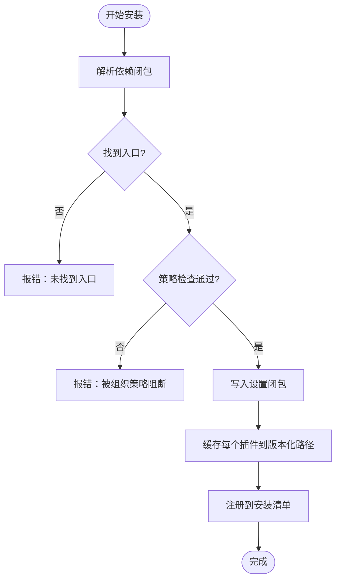
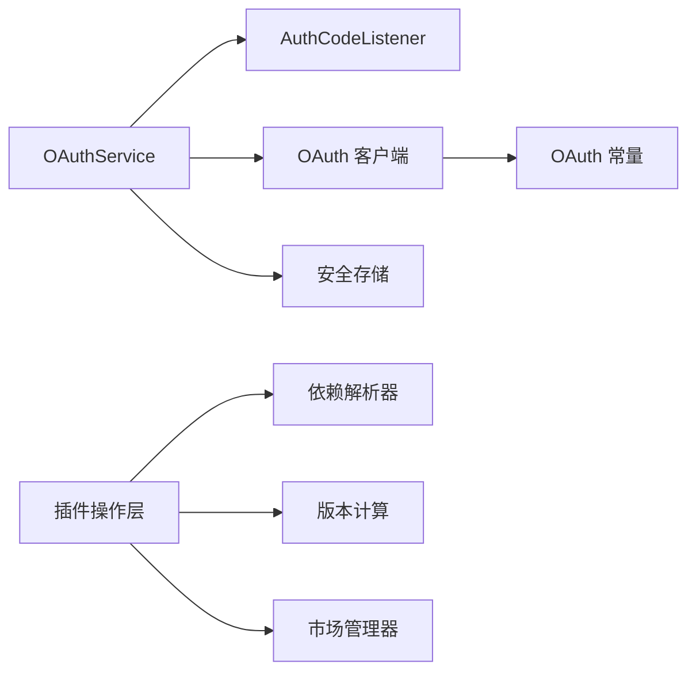

# 插件和 OAuth 服务

<cite>
**本文引用的文件**
- [src/services/oauth/index.ts](file://src/services/oauth/index.ts)
- [src/services/oauth/client.ts](file://src/services/oauth/client.ts)
- [src/services/oauth/auth-code-listener.ts](file://src/services/oauth/auth-code-listener.ts)
- [src/services/oauth/crypto.ts](file://src/services/oauth/crypto.ts)
- [src/services/oauth/getOauthProfile.ts](file://src/services/oauth/getOauthProfile.ts)
- [src/constants/oauth.ts](file://src/constants/oauth.ts)
- [src/utils/secureStorage/index.ts](file://src/utils/secureStorage/index.ts)
- [src/utils/secureStorage/macOsKeychainStorage.ts](file://src/utils/secureStorage/macOsKeychainStorage.ts)
- [src/utils/secureStorage/macOsKeychainHelpers.ts](file://src/utils/secureStorage/macOsKeychainHelpers.ts)
- [src/utils/secureStorage/plainTextStorage.ts](file://src/utils/secureStorage/plainTextStorage.ts)
- [src/services/plugins/pluginOperations.ts](file://src/services/plugins/pluginOperations.ts)
- [src/utils/plugins/dependencyResolver.ts](file://src/utils/plugins/dependencyResolver.ts)
- [src/utils/plugins/pluginVersioning.ts](file://src/utils/plugins/pluginVersioning.ts)
- [src/utils/plugins/pluginInstallationHelpers.ts](file://src/utils/plugins/pluginInstallationHelpers.ts)
- [src/utils/plugins/marketplaceManager.ts](file://src/utils/plugins/marketplaceManager.ts)
</cite>

## 目录
1. [简介](#简介)
2. [项目结构](#项目结构)
3. [核心组件](#核心组件)
4. [架构总览](#架构总览)
5. [详细组件分析](#详细组件分析)
6. [依赖关系分析](#依赖关系分析)
7. [性能考量](#性能考量)
8. [故障排查指南](#故障排查指南)
9. [结论](#结论)
10. [附录](#附录)

## 简介
本文件面向插件与 OAuth 服务模块，系统化阐述以下主题：
- 插件安装管理器的安装流程、依赖解析与版本控制机制
- OAuth 客户端的授权流程、令牌管理与安全存储
- 加密服务的密钥生成、挑战/验证码生成与状态随机性
- 授权码监听器的回调处理、状态验证与安全性保障
- 插件市场集成、OAuth 应用配置与用户认证流程
- 插件开发、OAuth 集成与安全最佳实践

目标是帮助开发者在不深入源码的前提下，快速理解系统设计与实现要点，并为后续扩展与维护提供清晰指引。

## 项目结构
围绕“插件”和“OAuth”两大主题，相关代码分布在以下目录与文件中：
- OAuth 服务：服务层负责授权流程编排、令牌交换与刷新；客户端封装请求细节；常量定义 OAuth 配置；安全存储负责凭据持久化；加密工具提供 PKCE 所需的随机值与挑战。
- 插件系统：操作层提供安装、卸载、启用、禁用、更新等核心能力；依赖解析器负责拓扑遍历与环检测；版本计算模块统一版本来源；市场管理器负责市场源的加载、缓存与同步。

图示来源
- [src/services/oauth/index.ts:21-132](file://src/services/oauth/index.ts#L21-L132)
- [src/services/oauth/client.ts:46-105](file://src/services/oauth/client.ts#L46-L105)
- [src/services/oauth/auth-code-listener.ts:27-71](file://src/services/oauth/auth-code-listener.ts#L27-L71)
- [src/services/oauth/crypto.ts:1-23](file://src/services/oauth/crypto.ts#L1-L23)
- [src/constants/oauth.ts:60-104](file://src/constants/oauth.ts#L60-L104)
- [src/utils/secureStorage/index.ts:9-17](file://src/utils/secureStorage/index.ts#L9-L17)
- [src/services/plugins/pluginOperations.ts:321-418](file://src/services/plugins/pluginOperations.ts#L321-L418)
- [src/utils/plugins/dependencyResolver.ts:95-159](file://src/utils/plugins/dependencyResolver.ts#L95-L159)
- [src/utils/plugins/pluginVersioning.ts:36-106](file://src/utils/plugins/pluginVersioning.ts#L36-L106)
- [src/utils/plugins/marketplaceManager.ts:264-298](file://src/utils/plugins/marketplaceManager.ts#L264-L298)

章节来源
- [src/services/oauth/index.ts:21-132](file://src/services/oauth/index.ts#L21-L132)
- [src/services/plugins/pluginOperations.ts:321-418](file://src/services/plugins/pluginOperations.ts#L321-L418)

## 核心组件
- OAuthService：封装 PKCE 授权码流程，支持自动与手动两种模式；负责启动本地回调服务器、等待授权码、交换令牌、拉取用户画像与订阅信息，并格式化返回结果。
- OAuth 客户端：构建授权 URL（含 code_challenge、state、redirect_uri、scope），发起令牌交换与刷新，拉取用户角色与 API Key，以及账户信息的存储与补全。
- 授权码监听器：在 localhost 启动回调服务器，校验 state 参数，接收授权码并进行状态验证，确保防 CSRF 攻击。
- 加密工具：生成 code_verifier、code_challenge 与 state，保证 PKCE 的安全强度。
- OAuth 常量：集中管理 OAuth 配置（生产/预发/本地）、客户端 ID、授权与令牌端点、作用域集合、MCP 元数据 URL 等。
- 安全存储：根据平台选择合适的凭据存储后端（macOS 使用钥匙串，其他平台使用明文文件），提供读写与缓存一致性保障。
- 插件操作层：提供安装、卸载、启用、禁用、更新等操作；统一错误格式与分析事件上报；与设置与磁盘状态交互。
- 依赖解析器：对插件依赖进行 DFS 遍历，检测环与缺失，限制跨市场自动安装，避免意外副作用。
- 版本计算：按优先级从 manifest、提供的版本、git 提交 SHA、回退到未知版本，支持 git-subdir 路径哈希以区分不同子目录。
- 市场管理器：维护已知市场列表、缓存市场清单、处理同步与更新（含 Git 操作与子模块），并提供插件查询与安装位置解析。

章节来源
- [src/services/oauth/index.ts:21-132](file://src/services/oauth/index.ts#L21-L132)
- [src/services/oauth/client.ts:46-105](file://src/services/oauth/client.ts#L46-L105)
- [src/services/oauth/auth-code-listener.ts:27-71](file://src/services/oauth/auth-code-listener.ts#L27-L71)
- [src/services/oauth/crypto.ts:1-23](file://src/services/oauth/crypto.ts#L1-L23)
- [src/constants/oauth.ts:60-104](file://src/constants/oauth.ts#L60-L104)
- [src/utils/secureStorage/index.ts:9-17](file://src/utils/secureStorage/index.ts#L9-L17)
- [src/services/plugins/pluginOperations.ts:321-418](file://src/services/plugins/pluginOperations.ts#L321-L418)
- [src/utils/plugins/dependencyResolver.ts:95-159](file://src/utils/plugins/dependencyResolver.ts#L95-L159)
- [src/utils/plugins/pluginVersioning.ts:36-106](file://src/utils/plugins/pluginVersioning.ts#L36-L106)
- [src/utils/plugins/marketplaceManager.ts:264-298](file://src/utils/plugins/marketplaceManager.ts#L264-L298)

## 架构总览
下图展示 OAuth 与插件两大模块的关键交互与职责边界：

图示来源
- [src/services/oauth/index.ts:21-132](file://src/services/oauth/index.ts#L21-L132)
- [src/services/oauth/auth-code-listener.ts:27-71](file://src/services/oauth/auth-code-listener.ts#L27-L71)
- [src/services/oauth/client.ts:46-105](file://src/services/oauth/client.ts#L46-L105)
- [src/constants/oauth.ts:60-104](file://src/constants/oauth.ts#L60-L104)
- [src/utils/secureStorage/index.ts:9-17](file://src/utils/secureStorage/index.ts#L9-L17)
- [src/services/plugins/pluginOperations.ts:321-418](file://src/services/plugins/pluginOperations.ts#L321-L418)
- [src/utils/plugins/dependencyResolver.ts:95-159](file://src/utils/plugins/dependencyResolver.ts#L95-L159)
- [src/utils/plugins/pluginVersioning.ts:36-106](file://src/utils/plugins/pluginVersioning.ts#L36-L106)
- [src/utils/plugins/marketplaceManager.ts:264-298](file://src/utils/plugins/marketplaceManager.ts#L264-L298)

## 详细组件分析

### OAuth 授权流程与令牌管理
- 授权流程
  - OAuthService 启动本地回调服务器，生成 code_verifier、code_challenge 与 state，构建授权 URL 并打开浏览器或提示手动输入。
  - 用户在授权页同意后，重定向至本地回调服务器，携带 authorization_code 与 state。
  - OAuthService 校验 state，若通过则调用 OAuth 客户端交换令牌；否则返回错误并关闭连接。
  - 成功后拉取用户画像与订阅信息，格式化返回令牌对象（包含过期时间、作用域、账户信息）。
- 令牌管理
  - 刷新令牌：当 access_token 即将过期时，OAuth 客户端发起 refresh_token 流程，支持作用域扩展。
  - API Key 创建：在具备相应作用域时，可直接在服务端创建 API Key 并保存。
  - 账户信息补全：若全局配置中缺少订阅类型与限额等级，可在首次刷新时拉取并写入。
- 安全存储
  - 采用平台适配的安全存储：macOS 使用钥匙串，其他平台使用明文文件（权限严格限制）。
  - 写入前清空缓存，确保读取一致性；提供删除与更新方法，失败时返回布尔结果。

图示来源
- [src/services/oauth/index.ts:32-132](file://src/services/oauth/index.ts#L32-L132)
- [src/services/oauth/auth-code-listener.ts:62-175](file://src/services/oauth/auth-code-listener.ts#L62-L175)
- [src/services/oauth/client.ts:107-144](file://src/services/oauth/client.ts#L107-L144)
- [src/utils/secureStorage/index.ts:9-17](file://src/utils/secureStorage/index.ts#L9-L17)

章节来源
- [src/services/oauth/index.ts:32-132](file://src/services/oauth/index.ts#L32-L132)
- [src/services/oauth/client.ts:146-274](file://src/services/oauth/client.ts#L146-L274)
- [src/services/oauth/auth-code-listener.ts:62-175](file://src/services/oauth/auth-code-listener.ts#L62-L175)
- [src/utils/secureStorage/index.ts:9-17](file://src/utils/secureStorage/index.ts#L9-L17)

### 授权码监听器与状态验证
- 监听器职责
  - 在 localhost 上启动回调服务器，监听 /callback 路径。
  - 校验 state 参数，防止 CSRF 攻击；若缺失或不匹配，返回 400 并拒绝响应。
  - 将授权码与状态保存，供 OAuthService 取用；成功后发送重定向页面。
- 关闭与清理
  - 若存在挂起响应，在关闭前先发送错误重定向，避免浏览器长时间等待。
  - 移除所有监听器，释放资源。

图示来源
- [src/services/oauth/auth-code-listener.ts:62-175](file://src/services/oauth/auth-code-listener.ts#L62-L175)

章节来源
- [src/services/oauth/auth-code-listener.ts:27-71](file://src/services/oauth/auth-code-listener.ts#L27-L71)
- [src/services/oauth/auth-code-listener.ts:149-175](file://src/services/oauth/auth-code-listener.ts#L149-L175)

### 加密服务与 PKCE
- 密钥生成
  - 生成 32 字节随机数，经 base64URL 编码作为 code_verifier。
  - 对 code_verifier 进行 SHA-256 哈希，再 base64URL 编码得到 code_challenge。
  - 生成 32 字节随机数作为 state，用于防 CSRF。
- 使用场景
  - OAuthService 在授权前生成上述值，传递给授权 URL 与令牌交换请求。

图示来源
- [src/services/oauth/crypto.ts:1-23](file://src/services/oauth/crypto.ts#L1-L23)

章节来源
- [src/services/oauth/crypto.ts:1-23](file://src/services/oauth/crypto.ts#L1-L23)

### OAuth 应用配置与作用域
- 配置来源
  - 生产/预发/本地三档配置，支持自定义 OAuth 基地址与客户端 ID 覆盖。
  - 统一的作用域集合：控制台与 Claude.ai 的作用域合并，支持推理专用令牌。
- MCP 客户端元数据
  - 提供 MCP OAuth 客户端元数据文档 URL，便于动态客户端注册或替代方案。

章节来源
- [src/constants/oauth.ts:60-104](file://src/constants/oauth.ts#L60-L104)
- [src/constants/oauth.ts:106-114](file://src/constants/oauth.ts#L106-L114)
- [src/constants/oauth.ts:186-234](file://src/constants/oauth.ts#L186-L234)

### 插件安装管理器与依赖解析
- 安装流程
  - 解析依赖闭包：DFS 遍历，检测环与缺失；禁止跨市场自动安装（除非根市场显式允许）。
  - 写入设置：一次性写入整个闭包，避免中间态。
  - 材料化：逐个缓存插件（下载/复制），生成版本化路径，注册到安装清单。
  - 清理缓存并返回结果（含依赖数量后缀）。
- 错误处理
  - 本地源无安装位置、设置写入失败、策略阻断、依赖被策略阻断等，均格式化为用户可读消息。
- 更新流程
  - 非就地更新：下载新版本到临时目录，计算版本，复制到版本化缓存，更新磁盘记录，清理旧版本（若不再被任何安装引用）。

图示来源
- [src/utils/plugins/pluginInstallationHelpers.ts:348-481](file://src/utils/plugins/pluginInstallationHelpers.ts#L348-L481)
- [src/utils/plugins/dependencyResolver.ts:95-159](file://src/utils/plugins/dependencyResolver.ts#L95-L159)

章节来源
- [src/utils/plugins/pluginInstallationHelpers.ts:348-481](file://src/utils/plugins/pluginInstallationHelpers.ts#L348-L481)
- [src/utils/plugins/dependencyResolver.ts:95-159](file://src/utils/plugins/dependencyResolver.ts#L95-L159)
- [src/services/plugins/pluginOperations.ts:829-1089](file://src/services/plugins/pluginOperations.ts#L829-L1089)

### 版本控制机制
- 版本来源优先级
  - plugin.json 中的 version 字段（最高）
  - 市场提供的版本
  - git 提交 SHA（短 SHA 12 位）
  - 回退到 “unknown”
- git-subdir 场景
  - 为避免同一提交不同子目录冲突，将规范化后的子路径做 SHA-256 哈希（取前 8 位）拼接在短 SHA 后，形成唯一版本标识。
- 路径解析
  - 从版本化缓存路径提取版本号，判断是否为版本化路径。

章节来源
- [src/utils/plugins/pluginVersioning.ts:36-106](file://src/utils/plugins/pluginVersioning.ts#L36-L106)
- [src/utils/plugins/pluginVersioning.ts:127-147](file://src/utils/plugins/pluginVersioning.ts#L127-L147)

### 插件市场集成与同步
- 已知市场管理
  - 记录市场来源（URL/GitHub/npm/本地）、安装位置、最后更新时间。
  - 支持从种子目录注册只读市场条目，强制 autoUpdate=false，确保管理员可控。
- 缓存与同步
  - 缓存市场清单于本地；提供拉取与子模块更新逻辑，增强错误提示（超时、主机密钥变更、认证失败、网络异常）。
- 插件查询
  - 通过名称/ID 查询市场条目，解析安装位置，支持本地源路径校验与跨市场信任白名单。

章节来源
- [src/utils/plugins/marketplaceManager.ts:264-298](file://src/utils/plugins/marketplaceManager.ts#L264-L298)
- [src/utils/plugins/marketplaceManager.ts:380-434](file://src/utils/plugins/marketplaceManager.ts#L380-L434)
- [src/utils/plugins/marketplaceManager.ts:528-582](file://src/utils/plugins/marketplaceManager.ts#L528-L582)
- [src/utils/plugins/marketplaceManager.ts:723-761](file://src/utils/plugins/marketplaceManager.ts#L723-L761)

### 安全存储与凭据持久化
- 平台适配
  - macOS：使用钥匙串存储，支持 stdin 注入与十六进制参数回退，避免明文参数泄露。
  - 其他平台：使用明文文件存储，严格限制权限（0600）。
- 缓存与一致性
  - 读取异步化，带 TTL 与代数版本，避免并发写入覆盖最新数据。
  - 写入/删除前清空缓存，确保后续读取命中最新值。
- 失败处理
  - 返回布尔结果与警告信息，便于上层决策。

章节来源
- [src/utils/secureStorage/index.ts:9-17](file://src/utils/secureStorage/index.ts#L9-L17)
- [src/utils/secureStorage/macOsKeychainStorage.ts:76-161](file://src/utils/secureStorage/macOsKeychainStorage.ts#L76-L161)
- [src/utils/secureStorage/macOsKeychainHelpers.ts:71-111](file://src/utils/secureStorage/macOsKeychainHelpers.ts#L71-L111)
- [src/utils/secureStorage/plainTextStorage.ts:57-84](file://src/utils/secureStorage/plainTextStorage.ts#L57-L84)

## 依赖关系分析
- OAuth 侧
  - OAuthService 依赖 AuthCodeListener、OAuth 客户端与加密工具；OAuth 客户端依赖 OAuth 常量；最终写入安全存储。
- 插件侧
  - 插件操作层依赖依赖解析器、版本计算与市场管理器；安装过程中还涉及缓存与磁盘写入。

图示来源
- [src/services/oauth/index.ts:21-132](file://src/services/oauth/index.ts#L21-L132)
- [src/services/oauth/client.ts:46-105](file://src/services/oauth/client.ts#L46-L105)
- [src/constants/oauth.ts:60-104](file://src/constants/oauth.ts#L60-L104)
- [src/utils/secureStorage/index.ts:9-17](file://src/utils/secureStorage/index.ts#L9-L17)
- [src/services/plugins/pluginOperations.ts:321-418](file://src/services/plugins/pluginOperations.ts#L321-L418)
- [src/utils/plugins/dependencyResolver.ts:95-159](file://src/utils/plugins/dependencyResolver.ts#L95-L159)
- [src/utils/plugins/pluginVersioning.ts:36-106](file://src/utils/plugins/pluginVersioning.ts#L36-L106)
- [src/utils/plugins/marketplaceManager.ts:264-298](file://src/utils/plugins/marketplaceManager.ts#L264-L298)

章节来源
- [src/services/oauth/index.ts:21-132](file://src/services/oauth/index.ts#L21-L132)
- [src/services/plugins/pluginOperations.ts:321-418](file://src/services/plugins/pluginOperations.ts#L321-L418)

## 性能考量
- OAuth
  - 自动刷新时尽量复用已有订阅与限额信息，减少不必要的网络请求。
  - 本地回调服务器仅在授权期间运行，及时关闭以释放端口与资源。
- 插件
  - 依赖解析采用 DFS，避免重复访问；缓存版本化路径，减少磁盘扫描。
  - 非就地更新避免覆盖当前运行树，降低停机风险；旧版本清理基于引用计数，避免误删仍在使用的版本。
  - 市场同步支持超时与错误增强提示，提升网络异常下的可用性。

## 故障排查指南
- OAuth 授权失败
  - 检查 state 是否匹配；确认回调服务器已启动且端口未被占用。
  - 若出现 401，确认 authorization_code 有效且未过期。
- 令牌刷新失败
  - 查看返回状态与响应体，确认 refresh_token 是否仍有效；必要时重新授权。
- 安全存储写入失败
  - macOS 钥匙串：检查凭据服务名与用户名；确认命令注入方式（stdin 或 argv）是否触发限制。
  - 其他平台：确认文件权限与路径存在性。
- 插件安装失败
  - 依赖环：查看依赖闭包中的环链路，修正依赖声明。
  - 跨市场依赖：确认根市场的 allowlist 是否包含目标市场。
  - 策略阻断：检查组织策略对插件或其依赖的限制。
- 市场同步失败
  - 超时：通过环境变量增加超时时间。
  - 主机密钥变更：按提示移除旧密钥或手动接受新密钥。
  - 认证失败：检查 SSH/Git 凭据配置。

章节来源
- [src/services/oauth/auth-code-listener.ts:149-175](file://src/services/oauth/auth-code-listener.ts#L149-L175)
- [src/services/oauth/client.ts:146-274](file://src/services/oauth/client.ts#L146-L274)
- [src/utils/secureStorage/macOsKeychainStorage.ts:111-146](file://src/utils/secureStorage/macOsKeychainStorage.ts#L111-L146)
- [src/utils/plugins/dependencyResolver.ts:133-135](file://src/utils/plugins/dependencyResolver.ts#L133-L135)
- [src/utils/plugins/marketplaceManager.ts:649-709](file://src/utils/plugins/marketplaceManager.ts#L649-L709)

## 结论
本模块在 OAuth 与插件两个方向均实现了高内聚、低耦合的设计：OAuth 侧通过服务层编排、客户端封装与安全存储，确保授权流程安全可靠；插件侧通过依赖解析、版本控制与市场管理，保障安装与更新的确定性与可追溯性。整体架构兼顾易用性与安全性，适合在企业环境中部署与扩展。

## 附录
- 最佳实践建议
  - OAuth
    - 强制使用 PKCE（已内置），始终校验 state，避免明文参数暴露。
    - 在刷新令牌时保留订阅与限额信息，减少重复请求。
    - 对于受限网络环境，合理设置超时与重试策略。
  - 插件
    - 明确依赖关系，避免环与跨市场自动安装带来的不可控风险。
    - 使用版本化缓存与非就地更新，降低升级风险。
    - 通过组织策略限制第三方插件来源，确保供应链安全。
  - 安全
    - 凭据存储优先使用平台原生钥匙串；其他平台严格限制文件权限。
    - 对外暴露的回调端口仅在授权期间开启，授权完成后立即关闭。