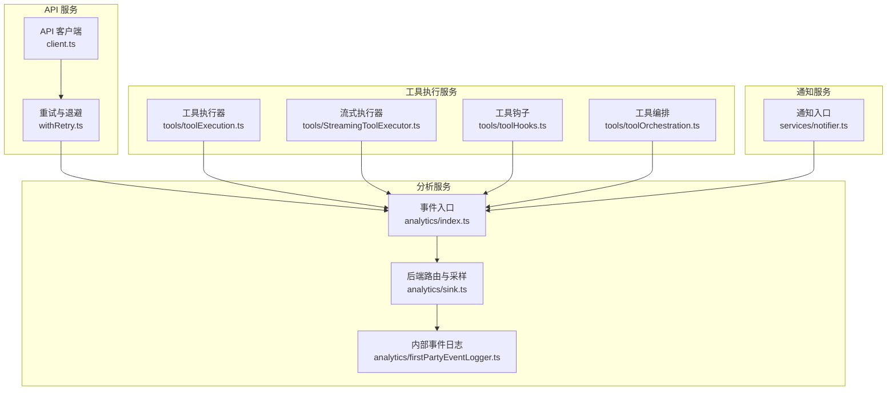
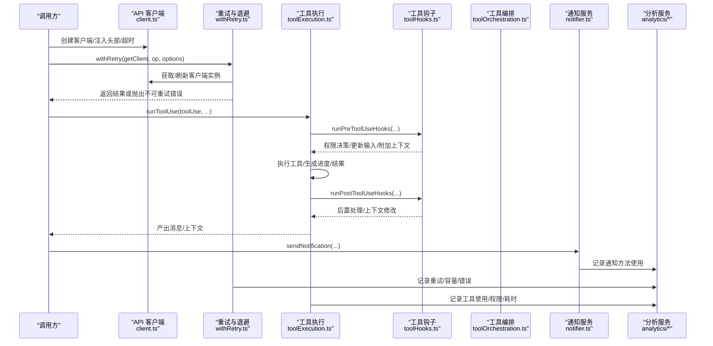
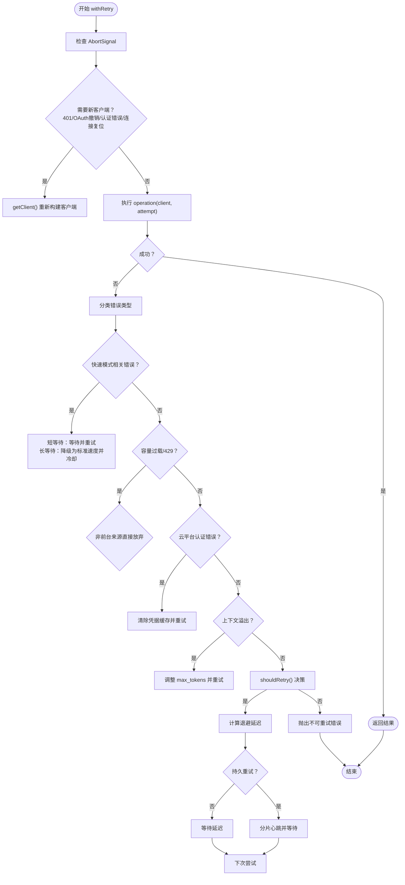
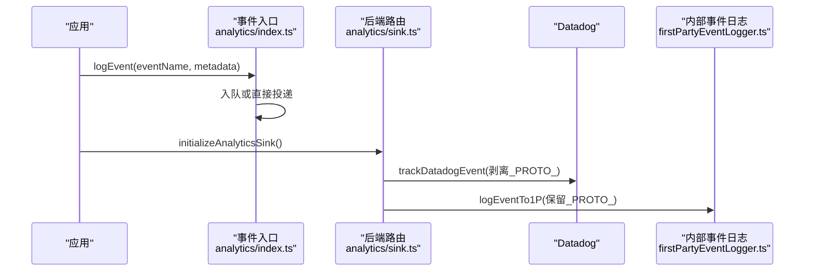
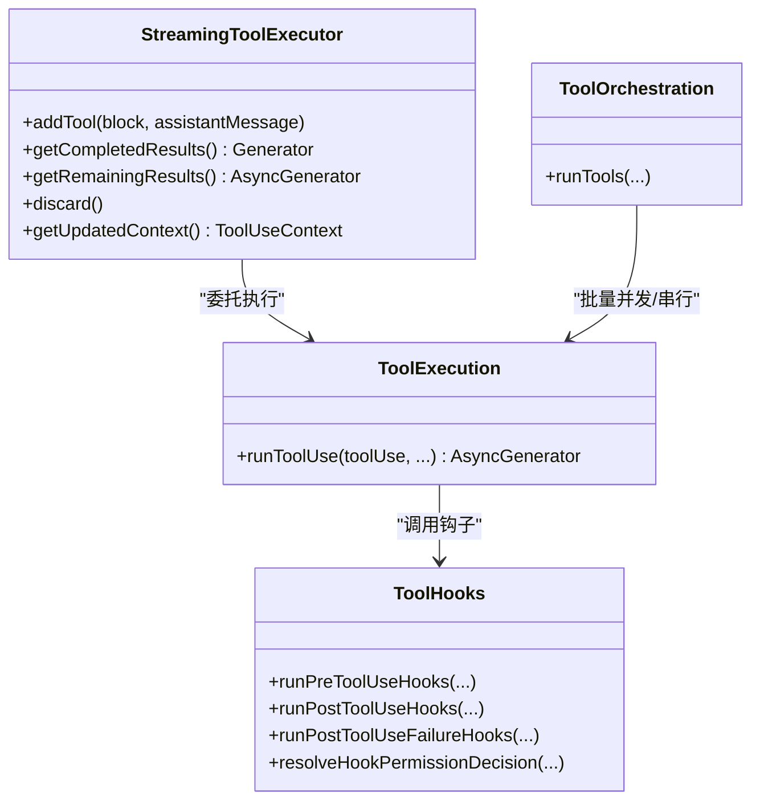
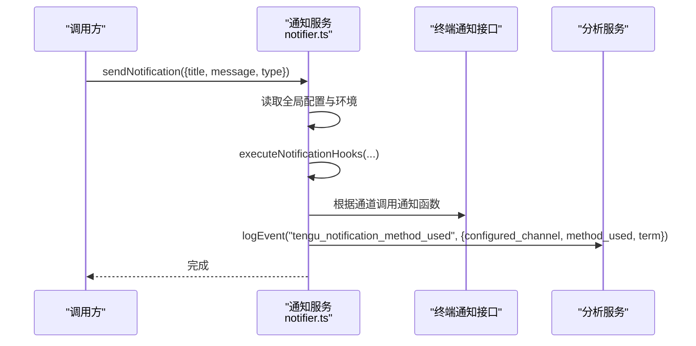
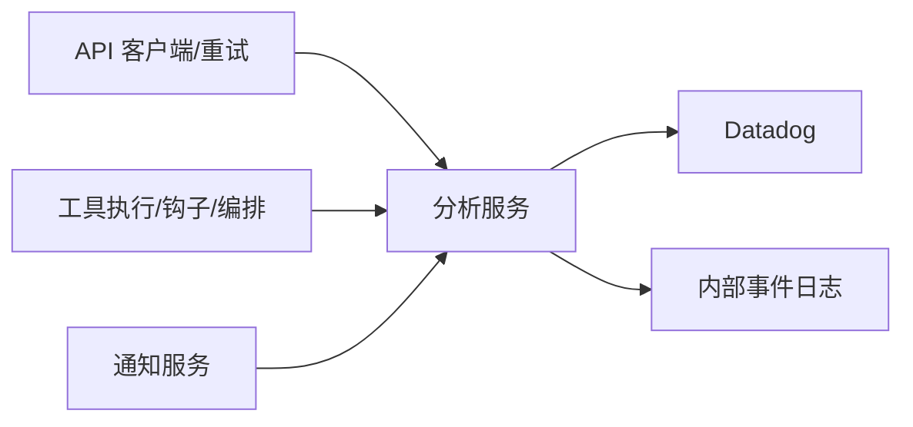

# 核心服务

<cite>
**本文引用的文件**
- [src/services/api/client.ts](file://src/services/api/client.ts)
- [src/services/api/withRetry.ts](file://src/services/api/withRetry.ts)
- [src/services/notifier.ts](file://src/services/notifier.ts)
- [src/services/tools/StreamingToolExecutor.ts](file://src/services/tools/StreamingToolExecutor.ts)
- [src/services/tools/toolExecution.ts](file://src/services/tools/toolExecution.ts)
- [src/services/tools/toolHooks.ts](file://src/services/tools/toolHooks.ts)
- [src/services/tools/toolOrchestration.ts](file://src/services/tools/toolOrchestration.ts)
- [src/services/analytics/index.ts](file://src/services/analytics/index.ts)
- [src/services/analytics/sink.ts](file://src/services/analytics/sink.ts)
- [src/services/analytics/firstPartyEventLogger.ts](file://src/services/analytics/firstPartyEventLogger.ts)
</cite>

## 目录
1. [简介](#简介)
2. [项目结构](#项目结构)
3. [核心组件](#核心组件)
4. [架构总览](#架构总览)
5. [详细组件分析](#详细组件分析)
6. [依赖关系分析](#依赖关系分析)
7. [性能考量](#性能考量)
8. [故障排查指南](#故障排查指南)
9. [结论](#结论)
10. [附录](#附录)

## 简介
本文件聚焦于 Claude Code 核心服务模块，系统性阐述以下四大服务的设计与实现：
- API 服务：客户端管理、请求重试机制与错误处理
- 分析服务：数据采集、事件追踪与性能监控
- 工具执行服务：流式执行、钩子管理与工具编排
- 通知服务：消息推送、状态通知与用户提醒

文档同时提供服务配置要点、扩展点与最佳实践，帮助开发者在不深入源码的前提下高效理解与使用这些服务。

## 项目结构
核心服务位于 src/services 下，围绕“API 客户端”“分析日志”“工具执行”“通知”四个维度组织。各模块职责清晰、边界明确，并通过统一的分析服务入口进行事件上报，确保可观测性与可扩展性。

图示来源
- [src/services/api/client.ts:88-316](file://src/services/api/client.ts#L88-L316)
- [src/services/api/withRetry.ts:170-517](file://src/services/api/withRetry.ts#L170-L517)
- [src/services/analytics/index.ts:133-164](file://src/services/analytics/index.ts#L133-L164)
- [src/services/analytics/sink.ts:48-86](file://src/services/analytics/sink.ts#L48-L86)
- [src/services/analytics/firstPartyEventLogger.ts:156-230](file://src/services/analytics/firstPartyEventLogger.ts#L156-L230)
- [src/services/tools/toolExecution.ts:337-490](file://src/services/tools/toolExecution.ts#L337-L490)
- [src/services/tools/StreamingToolExecutor.ts:40-124](file://src/services/tools/StreamingToolExecutor.ts#L40-L124)
- [src/services/tools/toolHooks.ts:435-651](file://src/services/tools/toolHooks.ts#L435-L651)
- [src/services/tools/toolOrchestration.ts:19-82](file://src/services/tools/toolOrchestration.ts#L19-L82)
- [src/services/notifier.ts:18-36](file://src/services/notifier.ts#L18-L36)

章节来源
- [src/services/api/client.ts:88-316](file://src/services/api/client.ts#L88-L316)
- [src/services/api/withRetry.ts:170-517](file://src/services/api/withRetry.ts#L170-L517)
- [src/services/analytics/index.ts:133-164](file://src/services/analytics/index.ts#L133-L164)
- [src/services/analytics/sink.ts:48-86](file://src/services/analytics/sink.ts#L48-L86)
- [src/services/analytics/firstPartyEventLogger.ts:156-230](file://src/services/analytics/firstPartyEventLogger.ts#L156-L230)
- [src/services/tools/toolExecution.ts:337-490](file://src/services/tools/toolExecution.ts#L337-L490)
- [src/services/tools/StreamingToolExecutor.ts:40-124](file://src/services/tools/StreamingToolExecutor.ts#L40-L124)
- [src/services/tools/toolHooks.ts:435-651](file://src/services/tools/toolHooks.ts#L435-L651)
- [src/services/tools/toolOrchestration.ts:19-82](file://src/services/tools/toolOrchestration.ts#L19-L82)
- [src/services/notifier.ts:18-36](file://src/services/notifier.ts#L18-L36)

## 核心组件
- API 客户端与认证：集中管理多云提供商（AWS Bedrock、GCP Vertex、Azure Foundry）与第一方 API 的客户端初始化、头部注入、超时与代理设置、OAuth 刷新与令牌注入等。
- 请求重试与退避：基于错误类型、速率限制、容量过载与上下文溢出等条件，采用指数退避、抖动与持久重试策略；支持快速模式降级与模型回退。
- 工具执行与编排：支持并发安全与串行执行、进度消息即时产出、中断行为控制、钩子前置/后置拦截与上下文修改、MCP 工具桥接。
- 通知服务：根据终端环境自动选择通知通道（iTerm2、Kitty、Ghostty、Bell 等），并记录方法使用统计。
- 分析服务：事件队列与延迟绑定、动态采样、Datadog 与内部事件日志双通道输出、生命周期管理与批量导出。

章节来源
- [src/services/api/client.ts:88-316](file://src/services/api/client.ts#L88-L316)
- [src/services/api/withRetry.ts:170-517](file://src/services/api/withRetry.ts#L170-L517)
- [src/services/tools/StreamingToolExecutor.ts:40-124](file://src/services/tools/StreamingToolExecutor.ts#L40-L124)
- [src/services/tools/toolExecution.ts:337-490](file://src/services/tools/toolExecution.ts#L337-L490)
- [src/services/tools/toolHooks.ts:435-651](file://src/services/tools/toolHooks.ts#L435-L651)
- [src/services/tools/toolOrchestration.ts:19-82](file://src/services/tools/toolOrchestration.ts#L19-L82)
- [src/services/notifier.ts:18-36](file://src/services/notifier.ts#L18-L36)
- [src/services/analytics/index.ts:133-164](file://src/services/analytics/index.ts#L133-L164)

## 架构总览
下图展示从 API 调用到分析与通知的整体链路，以及工具执行与钩子的协作关系。

图示来源
- [src/services/api/client.ts:88-316](file://src/services/api/client.ts#L88-L316)
- [src/services/api/withRetry.ts:170-517](file://src/services/api/withRetry.ts#L170-L517)
- [src/services/tools/toolExecution.ts:337-490](file://src/services/tools/toolExecution.ts#L337-L490)
- [src/services/tools/toolHooks.ts:435-651](file://src/services/tools/toolHooks.ts#L435-L651)
- [src/services/tools/toolOrchestration.ts:19-82](file://src/services/tools/toolOrchestration.ts#L19-L82)
- [src/services/notifier.ts:18-36](file://src/services/notifier.ts#L18-L36)
- [src/services/analytics/index.ts:133-164](file://src/services/analytics/index.ts#L133-L164)

## 详细组件分析

### API 服务：客户端管理、请求重试与错误处理
- 客户端管理
  - 多提供商适配：AWS Bedrock、GCP Vertex、Azure Foundry、第一方 API；按环境变量动态选择与参数注入。
  - 认证与令牌：OAuth 刷新、订阅者令牌、自定义 API Key 注入、AWS/GCP 凭据缓存清理与刷新。
  - 请求头与代理：默认头部（会话 ID、容器 ID、远程会话 ID、UA）、自定义头部解析、代理选项、客户端请求 ID 注入用于关联前后端日志。
- 请求重试与错误处理
  - 错误分类：连接错误、HTTP 4xx/5xx、速率限制、容量过载（529）、上下文溢出、云平台认证错误。
  - 重试策略：指数退避 + 抖动；持久重试（长时间等待）分片心跳避免空闲；基于查询来源区分前台/后台重试。
  - 快速模式：在短等待窗口内保持快速模式以保护提示缓存；长等待则切换标准速度并触发冷却。
  - 模型回退：连续 529 达阈值时触发备用模型；外部用户在特定条件下返回“重复过载”错误。
  - 上下文溢出：自动调整 max_tokens 并记录事件，避免无效重试。
  - 取消与中止：AbortSignal 支持，优雅退出并产出系统消息。
- 错误处理与可观测性
  - 事件埋点：重试次数、延迟、错误类型、提供商、查询来源等。
  - 日志与调试：调试日志开关、错误信息标准化、异常捕获与降级。

图示来源
- [src/services/api/withRetry.ts:170-517](file://src/services/api/withRetry.ts#L170-L517)

章节来源
- [src/services/api/client.ts:88-316](file://src/services/api/client.ts#L88-L316)
- [src/services/api/withRetry.ts:170-517](file://src/services/api/withRetry.ts#L170-L517)

### 分析服务：数据采集、事件追踪与性能监控
- 事件入口与队列
  - 事件入口模块提供同步/异步日志接口，未绑定后端时将事件入队，待后端初始化后批量投递。
  - 提供标记类型确保元数据不含敏感字符串，剥离 _PROTO_ 前缀字段以避免泄露至通用后端。
- 后端路由与采样
  - 初始化门控：Datadog 开关与动态配置；事件按类型采样，采样率写入元数据。
  - 双通道输出：Datadog（通用访问）与内部事件日志（保留 PII 字段）。
- 内部事件日志
  - 独立 Provider/Exporter，批量导出至内部端点；支持动态批处理配置热更新与安全重建。
  - 生命周期：初始化、运行期热配置变更、优雅关闭与磁盘重试保障。

图示来源
- [src/services/analytics/index.ts:133-164](file://src/services/analytics/index.ts#L133-L164)
- [src/services/analytics/sink.ts:48-86](file://src/services/analytics/sink.ts#L48-L86)
- [src/services/analytics/firstPartyEventLogger.ts:156-230](file://src/services/analytics/firstPartyEventLogger.ts#L156-L230)

章节来源
- [src/services/analytics/index.ts:133-164](file://src/services/analytics/index.ts#L133-L164)
- [src/services/analytics/sink.ts:48-86](file://src/services/analytics/sink.ts#L48-L86)
- [src/services/analytics/firstPartyEventLogger.ts:156-230](file://src/services/analytics/firstPartyEventLogger.ts#L156-L230)

### 工具执行服务：流式执行、钩子管理与工具编排
- 流式执行器
  - 并发控制：并发安全工具并行、非并发工具串行；维护执行顺序与结果缓冲。
  - 进度与中断：即时产出进度消息；兄弟进程错误（如 Bash）触发同组取消；用户中断按工具中断行为决定取消或阻塞。
  - 上下文修改：仅对串行工具应用上下文修改；并发工具暂不支持。
- 工具执行
  - 输入校验：Zod Schema 校验与延迟工具提示；失败时记录事件并返回错误消息。
  - 钩子集成：前置钩子（权限决策/更新输入/附加上下文）、后置钩子（失败/成功路径）、权限决策合并。
  - MCP 工具：识别服务器类型与基础地址，注入分析元数据。
- 工具编排
  - 批次划分：将连续只读工具聚合成并发批次，非并发工具单独串行。
  - 并发上限：受环境变量控制的最大并发数，避免资源争用。
  - 上下文传播：后置钩子与上下文修改在批次完成后应用到当前上下文。

图示来源
- [src/services/tools/StreamingToolExecutor.ts:40-124](file://src/services/tools/StreamingToolExecutor.ts#L40-L124)
- [src/services/tools/toolExecution.ts:337-490](file://src/services/tools/toolExecution.ts#L337-L490)
- [src/services/tools/toolHooks.ts:435-651](file://src/services/tools/toolHooks.ts#L435-L651)
- [src/services/tools/toolOrchestration.ts:19-82](file://src/services/tools/toolOrchestration.ts#L19-L82)

章节来源
- [src/services/tools/StreamingToolExecutor.ts:40-124](file://src/services/tools/StreamingToolExecutor.ts#L40-L124)
- [src/services/tools/toolExecution.ts:337-490](file://src/services/tools/toolExecution.ts#L337-L490)
- [src/services/tools/toolHooks.ts:435-651](file://src/services/tools/toolHooks.ts#L435-L651)
- [src/services/tools/toolOrchestration.ts:19-82](file://src/services/tools/toolOrchestration.ts#L19-L82)

### 通知服务：消息推送、状态通知与用户提醒
- 通知渠道
  - 自动选择：根据终端类型（iTerm2、Kitty、Ghostty、Apple 终端铃声）与配置自动决定最优通道。
  - 显式通道：支持 iTerm2、带铃声 iTerm2、Kitty、Ghostty、终端铃声、禁用等。
  - Apple 终端特殊处理：检测当前配置是否禁用铃声，必要时回退到铃声提醒。
- 通知钩子与统计
  - 在发送前执行通知钩子，随后记录实际使用的通道与终端信息，便于分析与优化用户体验。
- 终端通知封装
  - 通过终端通知接口实现跨终端的一致体验，避免硬编码平台差异。

图示来源
- [src/services/notifier.ts:18-36](file://src/services/notifier.ts#L18-L36)
- [src/services/notifier.ts:40-104](file://src/services/notifier.ts#L40-L104)
- [src/services/notifier.ts:110-157](file://src/services/notifier.ts#L110-L157)
- [src/services/analytics/index.ts:133-164](file://src/services/analytics/index.ts#L133-L164)

章节来源
- [src/services/notifier.ts:18-36](file://src/services/notifier.ts#L18-L36)
- [src/services/notifier.ts:40-104](file://src/services/notifier.ts#L40-L104)
- [src/services/notifier.ts:110-157](file://src/services/notifier.ts#L110-L157)

## 依赖关系分析
- 模块耦合
  - API 服务与分析服务：API 重试与错误路径广泛打点，形成强观测性闭环。
  - 工具执行服务与分析服务：工具执行、钩子与编排均产生丰富事件，支撑权限、性能与行为分析。
  - 通知服务与分析服务：通知方法使用被记录，辅助评估不同终端与通道的可用性。
- 外部依赖
  - 分析服务依赖 OpenTelemetry Logs、Statsig 动态配置与后端导出器；通知服务依赖终端能力探测与系统命令。
- 循环依赖
  - 事件入口模块无外部依赖，避免循环导入风险；各子模块通过入口统一接入。

图示来源
- [src/services/analytics/index.ts:133-164](file://src/services/analytics/index.ts#L133-L164)
- [src/services/analytics/sink.ts:48-86](file://src/services/analytics/sink.ts#L48-L86)
- [src/services/analytics/firstPartyEventLogger.ts:156-230](file://src/services/analytics/firstPartyEventLogger.ts#L156-L230)
- [src/services/api/withRetry.ts:468-475](file://src/services/api/withRetry.ts#L468-L475)
- [src/services/tools/toolExecution.ts:522-548](file://src/services/tools/toolExecution.ts#L522-L548)
- [src/services/notifier.ts:29-35](file://src/services/notifier.ts#L29-L35)

章节来源
- [src/services/analytics/index.ts:133-164](file://src/services/analytics/index.ts#L133-L164)
- [src/services/analytics/sink.ts:48-86](file://src/services/analytics/sink.ts#L48-L86)
- [src/services/analytics/firstPartyEventLogger.ts:156-230](file://src/services/analytics/firstPartyEventLogger.ts#L156-L230)
- [src/services/api/withRetry.ts:468-475](file://src/services/api/withRetry.ts#L468-L475)
- [src/services/tools/toolExecution.ts:522-548](file://src/services/tools/toolExecution.ts#L522-L548)
- [src/services/notifier.ts:29-35](file://src/services/notifier.ts#L29-L35)

## 性能考量
- API 重试
  - 指数退避与抖动降低峰值压力；持久重试分片心跳避免会话空闲；容量过载场景优先保护前台来源。
  - 上下文溢出自动调整 max_tokens，减少无效重试。
- 工具执行
  - 并发安全工具并行执行，提升吞吐；串行工具严格保证顺序一致性。
  - 进度消息即时产出，改善交互体验。
- 通知
  - 自动通道选择与铃声检测减少无效通知；禁用通道时快速回退。
- 分析
  - 事件队列与延迟绑定避免启动阻塞；动态采样与批处理降低网络开销。

## 故障排查指南
- API 重试失败
  - 检查错误类型：是否为 401/403/OAuth 撤销、云平台认证错误、连接复位、容量过载或上下文溢出。
  - 查看事件：tengu_api_retry、tengu_api_persistent_retry_wait、tengu_max_tokens_context_overflow_adjustment。
  - 关联请求：客户端注入的 x-client-request-id 与服务端日志匹配。
- 工具执行异常
  - 输入校验失败：查看 Zod 错误与延迟工具提示；关注 tengu_tool_use_error。
  - 权限拒绝：前置钩子返回 deny 或规则拒绝；查看 tengu_pre_tool_hook_error。
  - 后置钩子错误：查看 tengu_post_tool_hook_error/tengu_post_tool_failure_hook_error。
- 通知问题
  - 通道不可用：检查终端类型与配置；查看 tengu_notification_method_used。
  - Apple 终端铃声禁用：检测当前配置并回退到铃声提醒。

章节来源
- [src/services/api/withRetry.ts:468-517](file://src/services/api/withRetry.ts#L468-L517)
- [src/services/tools/toolExecution.ts:635-663](file://src/services/tools/toolExecution.ts#L635-L663)
- [src/services/tools/toolHooks.ts:154-176](file://src/services/tools/toolHooks.ts#L154-L176)
- [src/services/notifier.ts:110-157](file://src/services/notifier.ts#L110-L157)

## 结论
核心服务通过“统一入口、分层解耦”的设计，在保证可观测性的同时提供了强大的扩展能力。API 服务的多提供商适配与智能重试、工具执行的并发与钩子体系、通知的跨终端兼容与分析服务的双通道输出，共同构成了稳定高效的运行时基础设施。建议在生产环境中结合动态配置与采样策略，持续优化性能与成本。

## 附录
- 服务配置要点
  - API 客户端：ANTHROPIC_API_KEY、AWS/GCP/Azure 凭据、代理与超时、自定义头部、额外保护头。
  - 重试策略：CLAUDE_CODE_MAX_RETRIES、CLAUDE_CODE_UNATTENDED_RETRY、FALLBACK_FOR_ALL_PRIMARY_MODELS。
  - 工具并发：CLAUDE_CODE_MAX_TOOL_USE_CONCURRENCY。
  - 通知通道：preferredNotifChannel（auto/iterm2/kitty/ghostty/terminal_bell/notifications_disabled）。
- 扩展点
  - 新增分析事件：通过事件入口 logEvent/logEventAsync；注意元数据类型约束。
  - 新增通知通道：在通知服务中扩展 sendToChannel 分支。
  - 新增工具：实现 Tool 接口并注册；利用钩子扩展权限与上下文。
- 最佳实践
  - 对关键路径启用持久重试与心跳；对外部依赖使用并发安全工具并行化。
  - 使用分析事件进行容量与性能监控，结合动态采样控制成本。
  - 在工具执行中尽早校验输入，减少后置错误与重试。