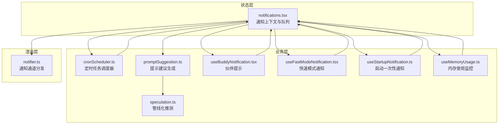
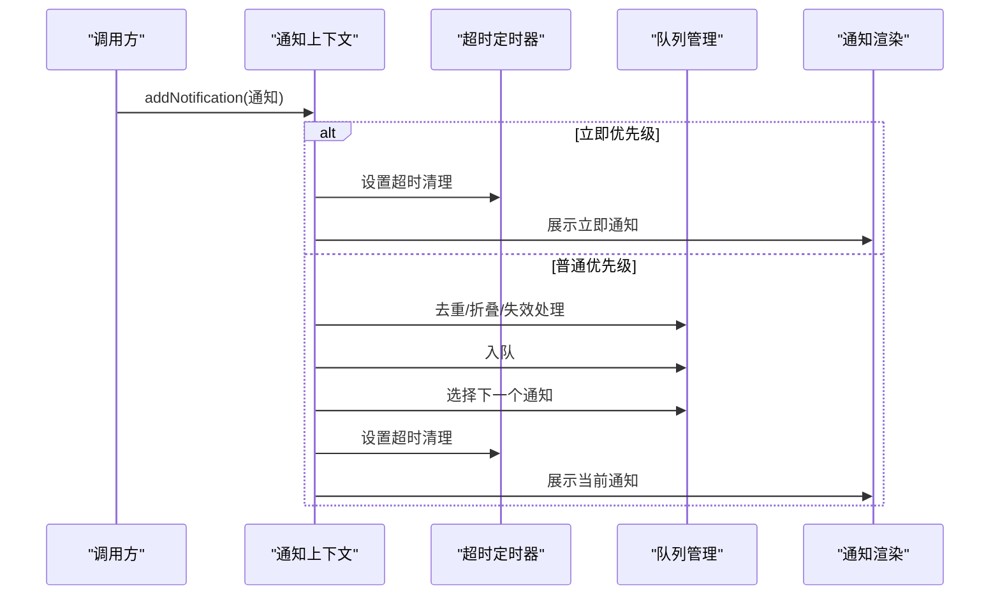
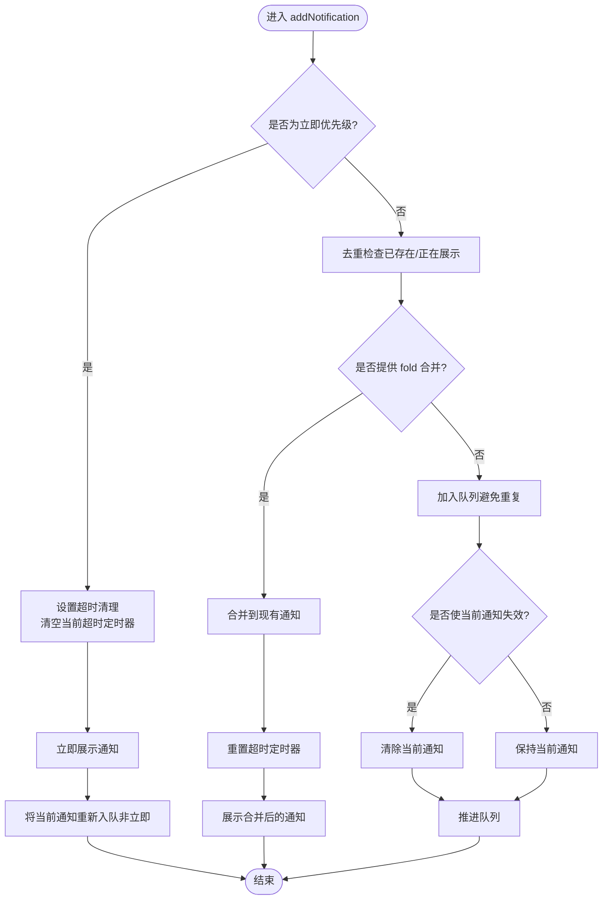
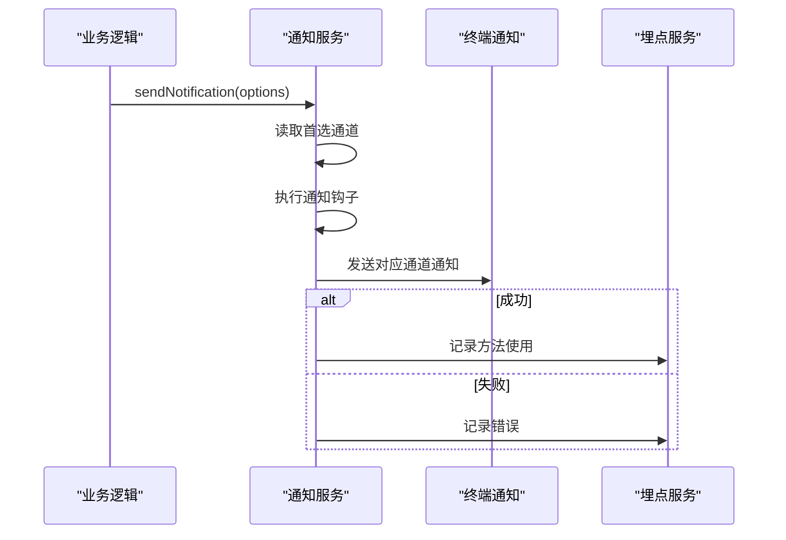
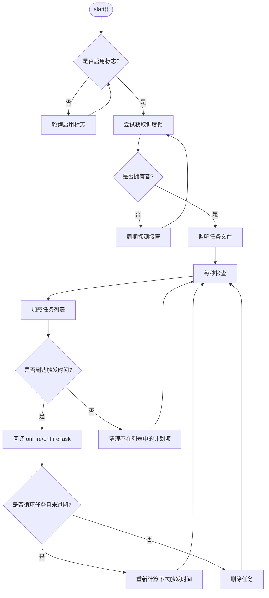
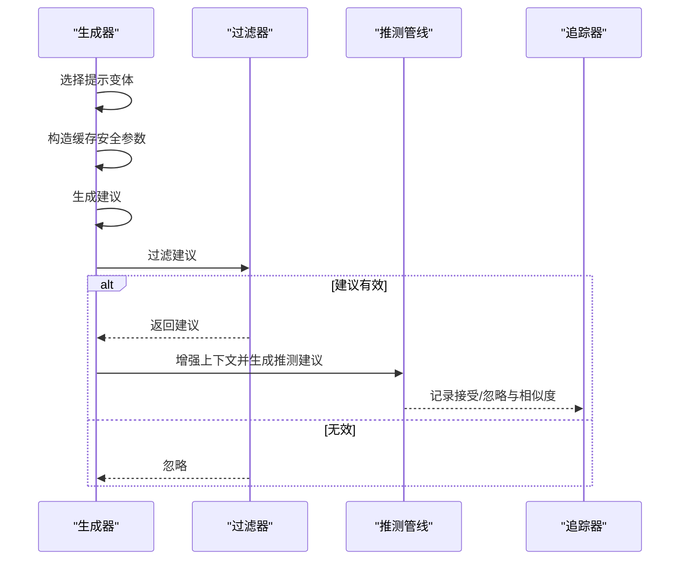
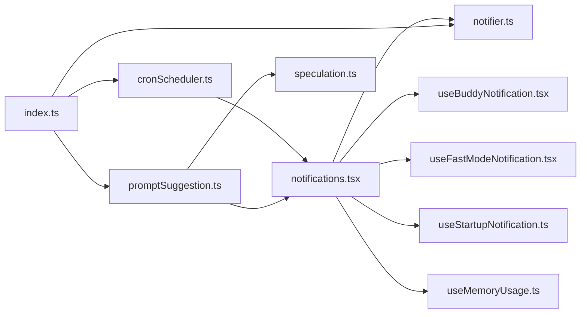

# 通知服务

<cite>
**本文档引用的文件**
- [notifications.tsx](file://src/context/notifications.tsx)
- [notifier.ts](file://src/services/notifier.ts)
- [useBuddyNotification.tsx](file://src/buddy/useBuddyNotification.tsx)
- [useScheduledTasks.ts](file://src/hooks/useScheduledTasks.ts)
- [cronScheduler.ts](file://src/utils/cronScheduler.ts)
- [promptSuggestion.ts](file://src/services/PromptSuggestion/promptSuggestion.ts)
- [speculation.ts](file://src/services/PromptSuggestion/speculation.ts)
- [useFastModeNotification.tsx](file://src/hooks/notifs/useFastModeNotification.tsx)
- [useStartupNotification.ts](file://src/hooks/notifs/useStartupNotification.ts)
- [useMemoryUsage.ts](file://src/hooks/useMemoryUsage.ts)
- [index.ts](file://src/services/analytics/index.ts)
- [Config.tsx](file://src/components/Settings/Config.tsx)
</cite>

## 目录
1. [简介](#简介)
2. [项目结构](#项目结构)
3. [核心组件](#核心组件)
4. [架构总览](#架构总览)
5. [详细组件分析](#详细组件分析)
6. [依赖关系分析](#依赖关系分析)
7. [性能考虑](#性能考虑)
8. [故障排除指南](#故障排除指南)
9. [结论](#结论)
10. [附录](#附录)

## 简介
本文件系统性梳理通知服务模块，覆盖消息路由、优先级管理与送达保证机制；提示系统的设计架构、提示内容管理与个性化推荐算法；提示调度器的时间安排、触发条件与执行策略；提示历史的存储结构、检索机制与分析功能；通知渠道管理、用户偏好设置与隐私控制；以及通知服务的扩展接口、自定义通知类型与性能优化建议。目标是帮助开发者快速理解并高效扩展通知能力。

## 项目结构
通知服务由“状态层（上下文）+ 业务层（调度/提示）+ 渲染层（终端通知）”三层构成：
- 状态层：统一的通知队列与优先级调度，负责去重、折叠、失效与超时控制
- 业务层：定时任务调度器、提示建议生成与管线化推测、内存使用监控等
- 渲染层：终端通知通道选择与回退策略

图表来源
- [notifications.tsx:1-240](file://src/context/notifications.tsx#L1-L240)
- [cronScheduler.ts:1-566](file://src/utils/cronScheduler.ts#L1-L566)
- [promptSuggestion.ts:77-497](file://src/services/PromptSuggestion/promptSuggestion.ts#L77-L497)
- [speculation.ts:345-382](file://src/services/PromptSuggestion/speculation.ts#L345-L382)
- [useBuddyNotification.tsx:1-98](file://src/buddy/useBuddyNotification.tsx#L1-L98)
- [useFastModeNotification.tsx:1-91](file://src/hooks/notifs/useFastModeNotification.tsx#L1-L91)
- [useStartupNotification.ts:1-41](file://src/hooks/notifs/useStartupNotification.ts#L1-L41)
- [useMemoryUsage.ts:1-39](file://src/hooks/useMemoryUsage.ts#L1-L39)
- [notifier.ts:1-157](file://src/services/notifier.ts#L1-L157)

章节来源
- [notifications.tsx:1-240](file://src/context/notifications.tsx#L1-L240)
- [cronScheduler.ts:1-566](file://src/utils/cronScheduler.ts#L1-L566)
- [promptSuggestion.ts:77-497](file://src/services/PromptSuggestion/promptSuggestion.ts#L77-L497)
- [speculation.ts:345-382](file://src/services/PromptSuggestion/speculation.ts#L345-L382)
- [useBuddyNotification.tsx:1-98](file://src/buddy/useBuddyNotification.tsx#L1-L98)
- [useFastModeNotification.tsx:1-91](file://src/hooks/notifs/useFastModeNotification.tsx#L1-L91)
- [useStartupNotification.ts:1-41](file://src/hooks/notifs/useStartupNotification.ts#L1-L41)
- [useMemoryUsage.ts:1-39](file://src/hooks/useMemoryUsage.ts#L1-L39)
- [notifier.ts:1-157](file://src/services/notifier.ts#L1-L157)

## 核心组件
- 通知上下文（notifications.tsx）
  - 统一的优先级模型：immediate/high/medium/low
  - 去重与折叠：基于 key 的 fold 合并策略
  - 失效链：invalidates 指定可互相替代/取消的通知
  - 超时与自动推进：默认超时与定时器清理
- 通知通道（notifier.ts）
  - 自动/手动通道选择：iTerm2/kitty/ghostty/终端铃声/禁用
  - Apple Terminal 铃声检测与回退
  - 事件埋点：记录实际使用的通道与终端环境
- 定时任务调度器（cronScheduler.ts）
  - 文件锁与多会话互斥
  - 抖动与过期回收策略
  - 缺失任务提醒构建与一次性任务处理
- 提示建议系统（promptSuggestion.ts/speculation.ts）
  - 建议生成与过滤
  - 管线化推测与上下文增强
  - 结果追踪与相似度分析
- 通知钩子与场景化通知
  - 伙伴提示、快速模式变更、启动一次性通知、内存使用告警

章节来源
- [notifications.tsx:1-240](file://src/context/notifications.tsx#L1-L240)
- [notifier.ts:1-157](file://src/services/notifier.ts#L1-L157)
- [cronScheduler.ts:1-566](file://src/utils/cronScheduler.ts#L1-L566)
- [promptSuggestion.ts:77-497](file://src/services/PromptSuggestion/promptSuggestion.ts#L77-L497)
- [speculation.ts:345-382](file://src/services/PromptSuggestion/speculation.ts#L345-L382)
- [useBuddyNotification.tsx:1-98](file://src/buddy/useBuddyNotification.tsx#L1-L98)
- [useFastModeNotification.tsx:1-91](file://src/hooks/notifs/useFastModeNotification.tsx#L1-L91)
- [useStartupNotification.ts:1-41](file://src/hooks/notifs/useStartupNotification.ts#L1-L41)
- [useMemoryUsage.ts:1-39](file://src/hooks/useMemoryUsage.ts#L1-L39)

## 架构总览
通知服务采用“状态驱动 + 事件驱动”的双轨设计：
- 状态驱动：通过 useNotifications 维护全局通知队列，按优先级与失效规则推进
- 事件驱动：定时任务、提示建议、内存监控等异步事件触发 addNotification

图表来源
- [notifications.tsx:78-192](file://src/context/notifications.tsx#L78-L192)

## 详细组件分析

### 通知上下文与消息路由
- 关键机制
  - 优先级排序：immediate > high > medium > low
  - 去重与折叠：相同 key 的通知可通过 fold 合并，延长展示时间
  - 失效链：通知可声明 invalidates，用于互斥替换
  - 超时与自动推进：当前通知超时后自动移除并推进队列
- 数据结构
  - 当前显示 current 与队列 queue 双态管理
  - 通过 key 比较避免引用变化导致的误判
- 错误处理
  - 重复添加与无效 key 直接忽略
  - 移除时同步清理超时定时器

图表来源
- [notifications.tsx:78-192](file://src/context/notifications.tsx#L78-L192)

章节来源
- [notifications.tsx:1-240](file://src/context/notifications.tsx#L1-L240)

### 通知通道与送达保证
- 通道策略
  - auto：根据终端类型自动选择最优通道，若 Apple_Terminal 铃声关闭则回退至终端铃声
  - 显式通道：iTerm2/kitty/ghostty/终端铃声
  - 禁用：不发送任何通知
- 送达保证
  - 事件埋点：记录实际使用的通道与终端信息，便于诊断与统计
  - 异常兜底：通道异常时返回 error 标识，不影响主流程

图表来源
- [notifier.ts:18-75](file://src/services/notifier.ts#L18-L75)
- [index.ts:133-164](file://src/services/analytics/index.ts#L133-L164)

章节来源
- [notifier.ts:1-157](file://src/services/notifier.ts#L1-L157)
- [index.ts:1-174](file://src/services/analytics/index.ts#L1-L174)

### 定时任务调度器与触发策略
- 生命周期
  - 启动：尝试获取文件锁，监听任务文件变化，每秒检查一次
  - 触发：在抖动窗口内命中 cron 表达式即触发，支持一次性与循环任务
  - 过期：循环任务可配置最大存活时长，到期后最后一次触发后删除
- 失效与一致性
  - 多会话互斥：同一目录下仅一个拥有者运行，其他会话探测接管
  - 缺失任务提醒：进程重启期间错过的一次性任务会生成提醒文本
- 执行策略
  - 会话任务：内存中维护，随进程结束而消失
  - 文件任务：持久化到 .claude/scheduled_tasks.json，支持跨进程恢复

图表来源
- [cronScheduler.ts:396-531](file://src/utils/cronScheduler.ts#L396-L531)

章节来源
- [cronScheduler.ts:1-566](file://src/utils/cronScheduler.ts#L1-L566)
- [useScheduledTasks.ts:63-139](file://src/hooks/useScheduledTasks.ts#L63-L139)

### 提示系统：设计架构与个性化推荐
- 设计架构
  - 初始化阶段：根据设置与限流状态决定是否启用
  - 生成阶段：选择提示变体，构造缓存安全参数，生成建议
  - 过滤阶段：对生成结果进行过滤，避免不合适的内容
  - 管线化推测：在用户可能输入前，基于推测消息生成后续建议
- 个性化与追踪
  - 接受/忽略追踪：记录相似度、响应时间、生成请求 ID 等指标
  - SDK 推送路径：支持外部 SDK 接收建议结果并上报

图表来源
- [promptSuggestion.ts:165-182](file://src/services/PromptSuggestion/promptSuggestion.ts#L165-L182)
- [speculation.ts:345-382](file://src/services/PromptSuggestion/speculation.ts#L345-L382)
- [promptSuggestion.ts:462-497](file://src/services/PromptSuggestion/promptSuggestion.ts#L462-L497)

章节来源
- [promptSuggestion.ts:77-497](file://src/services/PromptSuggestion/promptSuggestion.ts#L77-L497)
- [speculation.ts:345-382](file://src/services/PromptSuggestion/speculation.ts#L345-L382)

### 场景化通知与用户偏好
- 伙伴提示：启动时在特定窗口期内展示 /buddy 提示，支持立即优先级与超时
- 快速模式通知：组织策略变更或配额拒绝时，即时推送颜色化提示
- 启动一次性通知：封装远程模式与单次触发保护，简化各通知钩子实现
- 内存使用告警：10 秒轮询，超过阈值才更新状态，减少渲染开销

章节来源
- [useBuddyNotification.tsx:1-98](file://src/buddy/useBuddyNotification.tsx#L1-L98)
- [useFastModeNotification.tsx:1-91](file://src/hooks/notifs/useFastModeNotification.tsx#L1-L91)
- [useStartupNotification.ts:1-41](file://src/hooks/notifs/useStartupNotification.ts#L1-L41)
- [useMemoryUsage.ts:1-39](file://src/hooks/useMemoryUsage.ts#L1-L39)

### 通知历史与分析
- 历史存储
  - 定时任务：.claude/scheduled_tasks.json，包含任务元数据与最后触发时间
  - 提示建议：生成请求 ID、相似度、接受/忽略时间等指标
- 检索与分析
  - 通过任务 ID 与时间窗口检索缺失任务与触发记录
  - 建议追踪指标用于评估用户体验与改进策略

章节来源
- [cronScheduler.ts:542-566](file://src/utils/cronScheduler.ts#L542-L566)
- [promptSuggestion.ts:462-497](file://src/services/PromptSuggestion/promptSuggestion.ts#L462-L497)

### 通知渠道管理、用户偏好与隐私控制
- 渠道管理
  - 首选通道：通过全局配置设置
  - 自动检测：Apple_Terminal 铃声关闭时自动回退
- 用户偏好
  - 设置界面：提供任务完成/需要输入/代理推送等开关
- 隐私控制
  - 埋点元数据严格校验，避免敏感信息泄露

章节来源
- [notifier.ts:22-36](file://src/services/notifier.ts#L22-L36)
- [Config.tsx:666-713](file://src/components/Settings/Config.tsx#L666-L713)
- [index.ts:11-58](file://src/services/analytics/index.ts#L11-L58)

## 依赖关系分析

图表来源
- [notifications.tsx:1-240](file://src/context/notifications.tsx#L1-L240)
- [useBuddyNotification.tsx:1-98](file://src/buddy/useBuddyNotification.tsx#L1-L98)
- [useFastModeNotification.tsx:1-91](file://src/hooks/notifs/useFastModeNotification.tsx#L1-L91)
- [useStartupNotification.ts:1-41](file://src/hooks/notifs/useStartupNotification.ts#L1-L41)
- [useMemoryUsage.ts:1-39](file://src/hooks/useMemoryUsage.ts#L1-L39)
- [notifier.ts:1-157](file://src/services/notifier.ts#L1-L157)
- [cronScheduler.ts:1-566](file://src/utils/cronScheduler.ts#L1-L566)
- [promptSuggestion.ts:77-497](file://src/services/PromptSuggestion/promptSuggestion.ts#L77-L497)
- [speculation.ts:345-382](file://src/services/PromptSuggestion/speculation.ts#L345-L382)
- [index.ts:1-174](file://src/services/analytics/index.ts#L1-L174)

章节来源
- [notifications.tsx:1-240](file://src/context/notifications.tsx#L1-L240)
- [cronScheduler.ts:1-566](file://src/utils/cronScheduler.ts#L1-L566)
- [promptSuggestion.ts:77-497](file://src/services/PromptSuggestion/promptSuggestion.ts#L77-L497)
- [speculation.ts:345-382](file://src/services/PromptSuggestion/speculation.ts#L345-L382)
- [useBuddyNotification.tsx:1-98](file://src/buddy/useBuddyNotification.tsx#L1-L98)
- [useFastModeNotification.tsx:1-91](file://src/hooks/notifs/useFastModeNotification.tsx#L1-L91)
- [useStartupNotification.ts:1-41](file://src/hooks/notifs/useStartupNotification.ts#L1-L41)
- [useMemoryUsage.ts:1-39](file://src/hooks/useMemoryUsage.ts#L1-L39)
- [notifier.ts:1-157](file://src/services/notifier.ts#L1-L157)
- [index.ts:1-174](file://src/services/analytics/index.ts#L1-L174)

## 性能考虑
- 通知上下文
  - 优先级排序使用常量映射，O(n) 选择下一个通知
  - 超时定时器按需清理，避免泄漏
- 通知通道
  - Apple_Terminal 检测仅在必要时加载 plist 解析库，降低冷启动成本
- 定时任务
  - 文件锁与探测间隔平衡一致性与资源占用
  - 抖动窗口避免全量负载集中在整点边界
- 提示建议
  - 缓存安全参数减少重复计算
  - 管线化推测在用户输入前生成，提升交互流畅度
- 内存使用
  - 10 秒轮询，正常状态下不更新状态树，避免频繁渲染

## 故障排除指南
- 通知未显示
  - 检查优先级与失效链：高优先级通知会取消低优先级
  - 确认超时设置：默认 8 秒，可通过 timeoutMs 调整
  - 核对通道配置：确认首选通道与终端类型匹配
- 定时任务未触发
  - 检查调度锁：多会话环境下确保只有一个拥有者
  - 校验 cron 表达式与抖动配置
  - 查看缺失任务提醒：进程重启期间错过的一次性任务会被提醒
- 建议未生成
  - 检查抑制原因：权限、速率限制、计划模式等
  - 确认过滤器：避免被过滤器拦截
- 内存告警频繁
  - 调整阈值或减少同时运行的任务
  - 分析内存增长趋势，定位泄漏源

章节来源
- [notifications.tsx:78-192](file://src/context/notifications.tsx#L78-L192)
- [notifier.ts:110-156](file://src/services/notifier.ts#L110-L156)
- [cronScheduler.ts:230-394](file://src/utils/cronScheduler.ts#L230-L394)
- [promptSuggestion.ts:107-119](file://src/services/PromptSuggestion/promptSuggestion.ts#L107-L119)
- [useMemoryUsage.ts:11-39](file://src/hooks/useMemoryUsage.ts#L11-L39)

## 结论
通知服务模块以“状态驱动 + 事件驱动”为核心，结合优先级、失效链与超时机制，实现了可靠的路由与送达保障；定时任务调度器兼顾一致性与性能；提示系统通过生成、过滤与管线化推测提供个性化体验，并具备完善的追踪与分析能力。通过合理的渠道管理与用户偏好设置，可在不同终端与场景下稳定运行。建议在扩展新通知类型时遵循现有模式，确保一致性与可观测性。

## 附录
- 扩展接口建议
  - 新增通知类型：在通知上下文中定义 key 与 fold 合并策略
  - 新增通道：在通知服务中增加通道分支与回退逻辑
  - 新增调度策略：在调度器中扩展过滤器与抖动配置
- 自定义通知类型示例路径
  - 通知上下文：[notifications.tsx:31-33](file://src/context/notifications.tsx#L31-L33)
  - 通知通道：[notifier.ts:40-75](file://src/services/notifier.ts#L40-L75)
  - 定时任务：[cronScheduler.ts:142-140](file://src/utils/cronScheduler.ts#L142-L140)
- 性能优化建议
  - 控制通知数量与优先级分布，避免队列积压
  - 合理设置超时与抖动，平衡实时性与资源占用
  - 使用缓存安全参数与管线化推测，减少重复计算