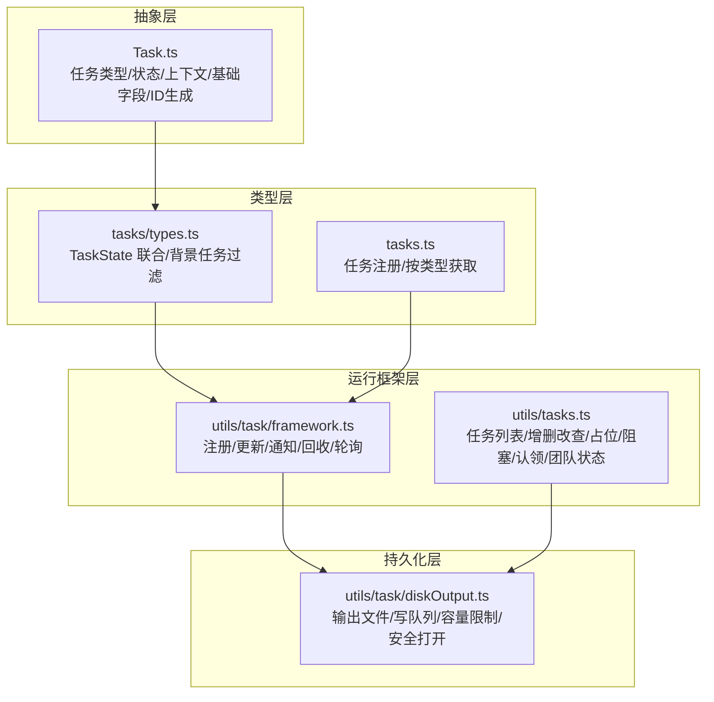
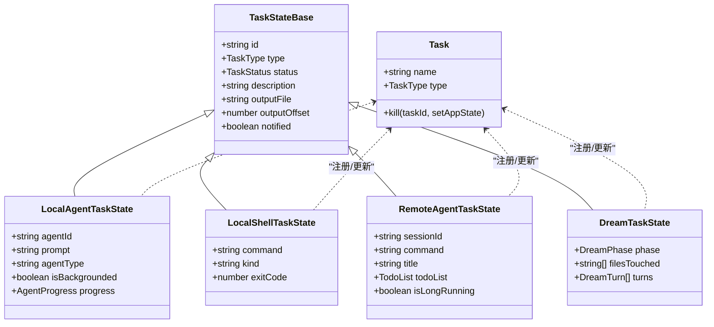
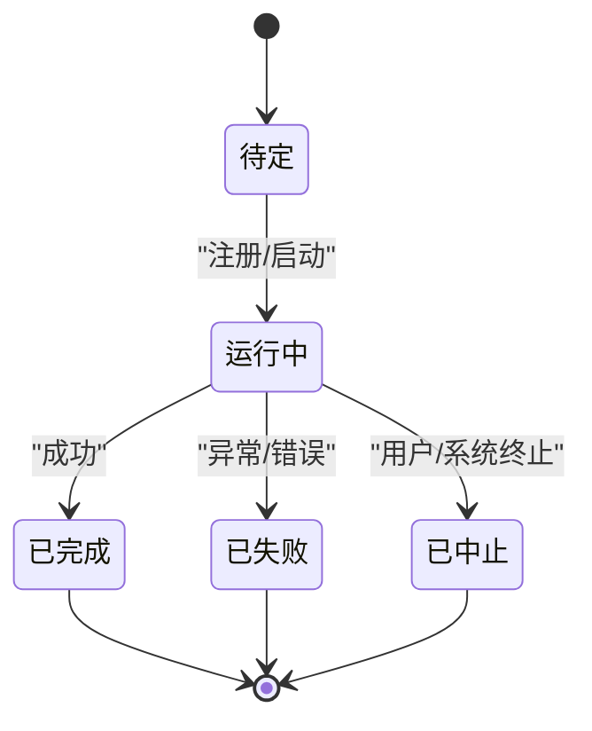
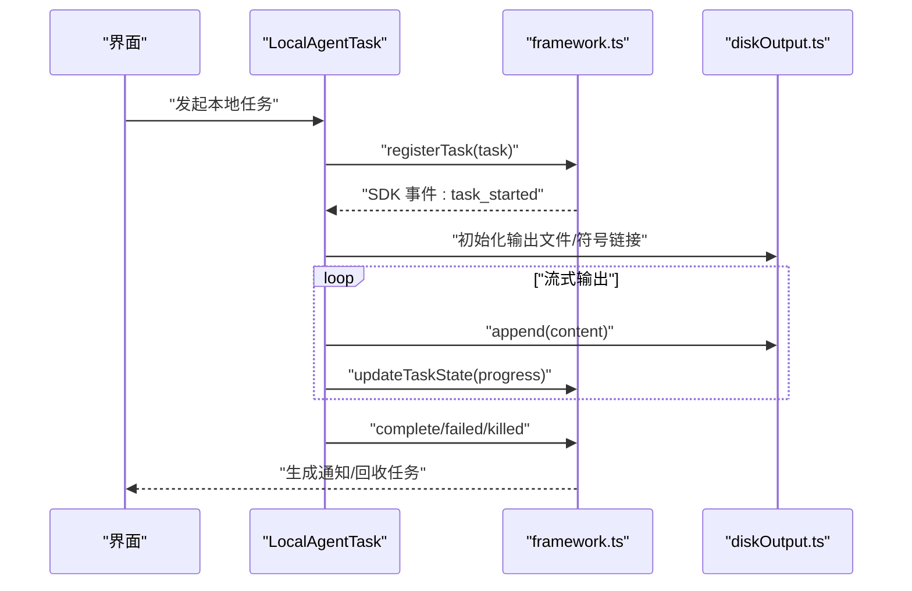
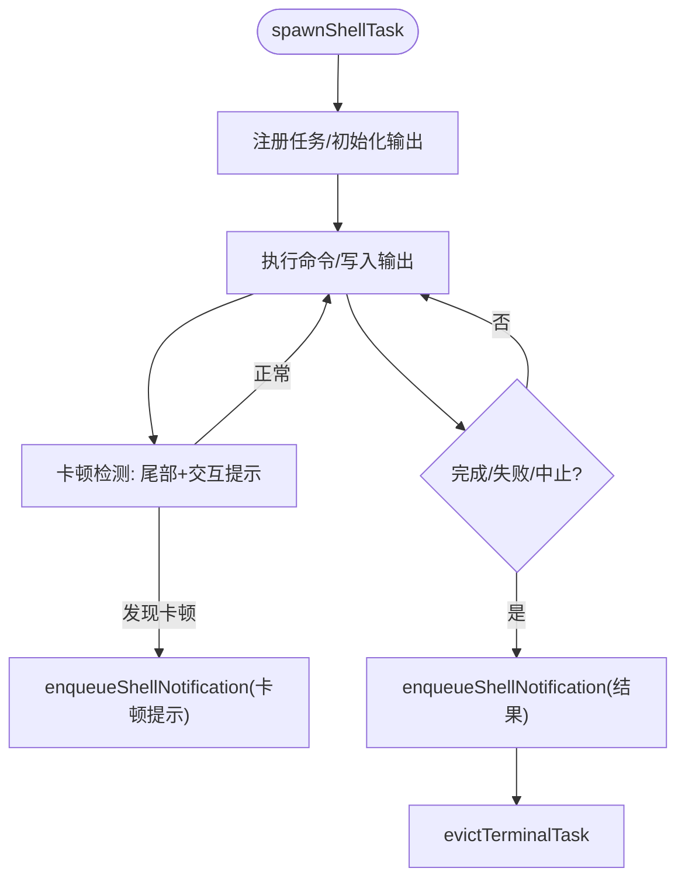
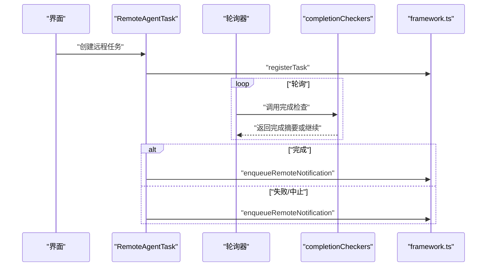
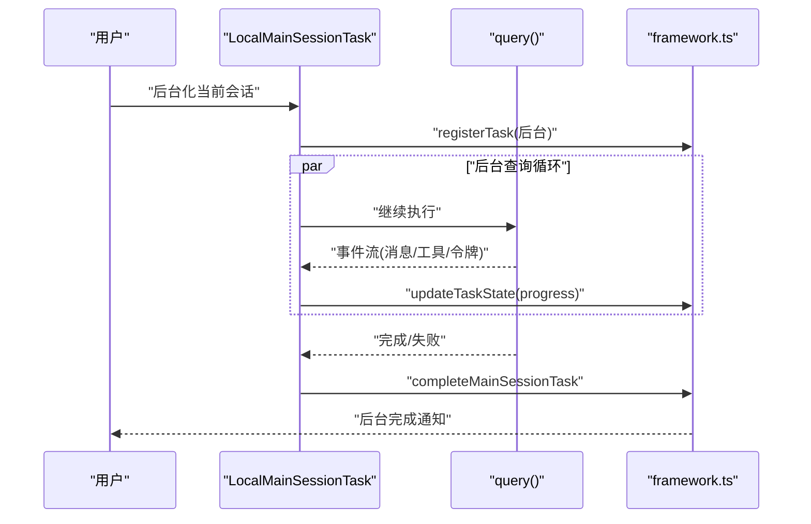
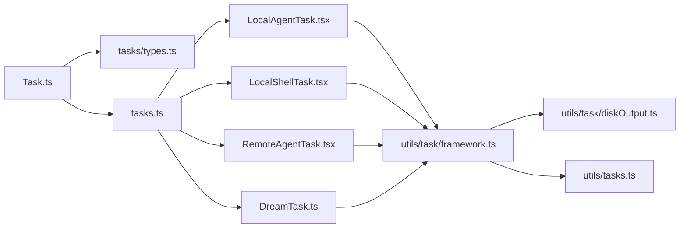

# 任务系统

<cite>
**本文引用的文件**
- [src/Task.ts](file://src/Task.ts)
- [src/tasks.ts](file://src/tasks.ts)
- [src/tasks/types.ts](file://src/tasks/types.ts)
- [src/utils/tasks.ts](file://src/utils/tasks.ts)
- [src/tasks/LocalMainSessionTask.ts](file://src/tasks/LocalMainSessionTask.ts)
- [src/tasks/LocalAgentTask/LocalAgentTask.tsx](file://src/tasks/LocalAgentTask/LocalAgentTask.tsx)
- [src/tasks/LocalShellTask/LocalShellTask.tsx](file://src/tasks/LocalShellTask/LocalShellTask.tsx)
- [src/tasks/RemoteAgentTask/RemoteAgentTask.tsx](file://src/tasks/RemoteAgentTask/RemoteAgentTask.tsx)
- [src/tasks/DreamTask/DreamTask.ts](file://src/tasks/DreamTask/DreamTask.ts)
- [src/utils/task/framework.ts](file://src/utils/task/framework.ts)
- [src/utils/task/diskOutput.ts](file://src/utils/task/diskOutput.ts)
</cite>

## 目录
1. [简介](#简介)
2. [项目结构](#项目结构)
3. [核心组件](#核心组件)
4. [架构总览](#架构总览)
5. [详细组件分析](#详细组件分析)
6. [依赖关系分析](#依赖关系分析)
7. [性能考量](#性能考量)
8. [故障排查指南](#故障排查指南)
9. [结论](#结论)
10. [附录：任务工具与使用示例路径](#附录任务工具与使用示例路径)

## 简介
本文件系统性阐述 Claude Code 的任务系统设计与实现，覆盖任务抽象基类、任务生命周期、任务类型（本地任务、远程任务、异步/后台任务）、调度与并发控制、资源分配与持久化、状态管理与恢复、监控与追踪、进度报告与错误处理/重试等主题。文档既面向初学者解释任务概念与基本用法，也为高级开发者提供扩展点与性能优化建议。

## 项目结构
任务系统由“任务抽象层”“任务类型层”“任务运行框架层”“磁盘输出与持久化层”四部分组成：
- 抽象层：定义任务类型、状态、上下文、基础字段与工具函数（如任务 ID 生成、状态判定）。
- 类型层：统一的任务状态联合类型与背景任务过滤逻辑。
- 运行框架层：注册、更新、通知、回收、轮询等通用能力。
- 持久化层：任务输出文件、锁文件、高水位标记、任务列表目录与文件组织。

**图表来源**
- [src/Task.ts:1-126](file://src/Task.ts#L1-L126)
- [src/tasks/types.ts:1-47](file://src/tasks/types.ts#L1-L47)
- [src/tasks.ts:1-40](file://src/tasks.ts#L1-L40)
- [src/utils/task/framework.ts:1-200](file://src/utils/task/framework.ts#L1-L200)
- [src/utils/tasks.ts:1-800](file://src/utils/tasks.ts#L1-L800)
- [src/utils/task/diskOutput.ts:1-200](file://src/utils/task/diskOutput.ts#L1-L200)

**章节来源**
- [src/Task.ts:1-126](file://src/Task.ts#L1-L126)
- [src/tasks/types.ts:1-47](file://src/tasks/types.ts#L1-L47)
- [src/tasks.ts:1-40](file://src/tasks.ts#L1-L40)
- [src/utils/task/framework.ts:1-200](file://src/utils/task/framework.ts#L1-L200)
- [src/utils/tasks.ts:1-800](file://src/utils/tasks.ts#L1-L800)
- [src/utils/task/diskOutput.ts:1-200](file://src/utils/task/diskOutput.ts#L1-L200)

## 核心组件
- 任务抽象与基类
  - 任务类型枚举与状态枚举，终端状态判定，任务上下文（AbortController、AppState 读写器），基础字段（开始/结束时间、输出文件路径与偏移、是否已通知等）。
  - 任务 ID 生成策略：带前缀的短 ID，兼顾向后兼容与安全随机性。
- 任务类型与状态
  - 统一的任务状态联合类型，支持“前台/后台”任务过滤，用于 UI 展示与后台指示器。
- 任务运行框架
  - 注册、更新、通知、回收、轮询间隔、附件生成（增量输出与状态变更）。
- 任务持久化与输出
  - 输出文件目录与命名、写队列与容量上限、安全打开策略（避免符号链接攻击）、增量读取与偏移维护。
- 任务列表与并发控制
  - 基于文件锁的任务列表与单任务锁；高水位标记防止 ID 回绕；任务列表目录隔离不同上下文（会话/团队/进程内同伴）。

**章节来源**
- [src/Task.ts:6-126](file://src/Task.ts#L6-L126)
- [src/tasks/types.ts:12-47](file://src/tasks/types.ts#L12-L47)
- [src/utils/task/framework.ts:48-117](file://src/utils/task/framework.ts#L48-L117)
- [src/utils/task/diskOutput.ts:30-135](file://src/utils/task/diskOutput.ts#L30-L135)
- [src/utils/tasks.ts:147-188](file://src/utils/tasks.ts#L147-L188)

## 架构总览
任务系统采用“类型驱动 + 框架统一 + 持久化解耦”的分层架构：
- 类型驱动：通过 TaskState 联合类型与 isBackgroundTask 过滤，确保 UI 与业务逻辑对任务类型的一致理解。
- 框架统一：所有任务共享 register/update/notify/evict/poll 等通用流程，降低重复实现成本。
- 持久化解耦：输出文件与任务元数据分离，分别由 DiskTaskOutput 与 utils/tasks.ts 管理，便于扩展与测试。

**图表来源**
- [src/Task.ts:44-57](file://src/Task.ts#L44-L57)
- [src/tasks/LocalAgentTask/LocalAgentTask.tsx:116-148](file://src/tasks/LocalAgentTask/LocalAgentTask.tsx#L116-L148)
- [src/tasks/LocalShellTask/LocalShellTask.tsx:173-179](file://src/tasks/LocalShellTask/LocalShellTask.tsx#L173-L179)
- [src/tasks/RemoteAgentTask/RemoteAgentTask.tsx:22-59](file://src/tasks/RemoteAgentTask/RemoteAgentTask.tsx#L22-L59)
- [src/tasks/DreamTask/DreamTask.ts:25-41](file://src/tasks/DreamTask/DreamTask.ts#L25-L41)

## 详细组件分析

### 任务抽象基类与生命周期
- 设计要点
  - 统一的基础字段与状态机：pending → running → completed/failed/killed。
  - 终端状态判定用于回收与防护（避免向已死任务注入消息、清理孤儿任务）。
  - 任务上下文包含 AbortController 与 AppState 读写器，便于中断与状态更新。
  - 任务 ID 前缀映射与随机生成，兼顾兼容与安全。
- 生命周期关键节点
  - 注册：registerTask 写入 AppState 并发出 SDK 事件。
  - 运行：updateTaskState 增量更新状态与进度。
  - 完成/失败/中止：enqueuePendingNotification 发出通知，evictTerminalTask 在 notified 后回收。
  - 恢复：通过输出文件偏移与增量读取维持 UI 一致性。

**图表来源**
- [src/Task.ts:15-29](file://src/Task.ts#L15-L29)
- [src/utils/task/framework.ts:77-117](file://src/utils/task/framework.ts#L77-L117)
- [src/utils/task/framework.ts:125-144](file://src/utils/task/framework.ts#L125-L144)

**章节来源**
- [src/Task.ts:27-106](file://src/Task.ts#L27-L106)
- [src/utils/task/framework.ts:48-117](file://src/utils/task/framework.ts#L48-L117)

### 任务类型与实现差异

#### 本地任务（Agent）
- 特点
  - 使用本地模型执行，支持前台/后台切换、进度统计（工具调用次数、令牌数、近期活动）。
  - 输出文件与会话转录关联，支持 /clear 后的转录保留与增量写入。
- 关键流程
  - 注册：registerTask + initTaskOutputAsSymlink。
  - 进度：updateProgressFromMessage 与 getProgressUpdate。
  - 完成：completeMainSessionTask 或 enqueueAgentNotification。

**图表来源**
- [src/tasks/LocalAgentTask/LocalAgentTask.tsx:116-148](file://src/tasks/LocalAgentTask/LocalAgentTask.tsx#L116-L148)
- [src/utils/task/framework.ts:77-117](file://src/utils/task/framework.ts#L77-L117)
- [src/utils/task/diskOutput.ts:97-135](file://src/utils/task/diskOutput.ts#L97-L135)

**章节来源**
- [src/tasks/LocalAgentTask/LocalAgentTask.tsx:68-104](file://src/tasks/LocalAgentTask/LocalAgentTask.tsx#L68-L104)
- [src/tasks/LocalAgentTask/LocalAgentTask.tsx:116-148](file://src/tasks/LocalAgentTask/LocalAgentTask.tsx#L116-L148)

#### 本地 Shell 任务
- 特点
  - 支持“后台命令”与“监控”两类，具备卡顿检测（基于输出尾部与交互提示模式）。
  - 通过 enqueueShellNotification 发送完成/失败/中止通知。
- 关键流程
  - spawnShellTask 注册任务并启动进程，watchdog 检测卡顿并提示。
  - kill 通过 killShellTasks 实现。

**图表来源**
- [src/tasks/LocalShellTask/LocalShellTask.tsx:46-104](file://src/tasks/LocalShellTask/LocalShellTask.tsx#L46-L104)
- [src/tasks/LocalShellTask/LocalShellTask.tsx:105-172](file://src/tasks/LocalShellTask/LocalShellTask.tsx#L105-L172)
- [src/utils/task/framework.ts:125-144](file://src/utils/task/framework.ts#L125-L144)

**章节来源**
- [src/tasks/LocalShellTask/LocalShellTask.tsx:173-179](file://src/tasks/LocalShellTask/LocalShellTask.tsx#L173-L179)

#### 远程任务（Remote Agent）
- 特点
  - 通过远程会话执行，支持长时运行、审查进度、超时与条件完成检查。
  - 提供前置条件校验与错误格式化，确保环境合规。
- 关键流程
  - 注册：createTaskStateBase + registerTask。
  - 轮询：completionCheckers 钩子在轮询周期判断完成条件。
  - 通知：enqueueRemoteNotification。

**图表来源**
- [src/tasks/RemoteAgentTask/RemoteAgentTask.tsx:77-86](file://src/tasks/RemoteAgentTask/RemoteAgentTask.tsx#L77-L86)
- [src/tasks/RemoteAgentTask/RemoteAgentTask.tsx:166-183](file://src/tasks/RemoteAgentTask/RemoteAgentTask.tsx#L166-L183)
- [src/utils/task/framework.ts:158-200](file://src/utils/task/framework.ts#L158-L200)

**章节来源**
- [src/tasks/RemoteAgentTask/RemoteAgentTask.tsx:124-141](file://src/tasks/RemoteAgentTask/RemoteAgentTask.tsx#L124-L141)

#### 异步/后台任务（Main Session）
- 特点
  - 用户在查询过程中两次按下 Ctrl+B 可将当前会话“后台化”，任务继续运行，UI 清空并等待完成通知。
  - 支持前台恢复查看，隔离输出文件以避免 /clear 影响。
- 关键流程
  - registerMainSessionTask：生成任务 ID、初始化输出、注册任务。
  - startBackgroundSession：在独立查询循环中持续记录转录与进度。
  - completeMainSessionTask：根据是否后台发送通知并回收。

**图表来源**
- [src/tasks/LocalMainSessionTask.ts:94-162](file://src/tasks/LocalMainSessionTask.ts#L94-L162)
- [src/tasks/LocalMainSessionTask.ts:338-479](file://src/tasks/LocalMainSessionTask.ts#L338-L479)
- [src/utils/task/framework.ts:48-72](file://src/utils/task/framework.ts#L48-L72)

**章节来源**
- [src/tasks/LocalMainSessionTask.ts:168-219](file://src/tasks/LocalMainSessionTask.ts#L168-L219)

#### 梦境任务（Dream）
- 特点
  - 用于记忆整合的后台子代理，UI 可见但无模型通知路径，通过增量转录与文件变更集合展示进展。
- 关键流程
  - registerDreamTask：注册运行中任务。
  - addDreamTurn：追加回合与文件变更，推进阶段。
  - completeDreamTask/failDreamTask：标记完成/失败并回收。

**章节来源**
- [src/tasks/DreamTask/DreamTask.ts:52-130](file://src/tasks/DreamTask/DreamTask.ts#L52-L130)

### 任务调度机制、优先级与并发控制
- 调度与轮询
  - 所有任务共享轮询间隔常量，框架负责生成增量附件与状态变更。
- 并发控制
  - 任务列表与单任务均采用文件锁，避免竞态；高水位标记防止 ID 回绕。
- 前台/后台过滤
  - isBackgroundTask 依据状态与 isBackgrounded 字段决定是否计入后台任务指示器。

**章节来源**
- [src/utils/task/framework.ts:21-28](file://src/utils/task/framework.ts#L21-L28)
- [src/utils/tasks.ts:504-523](file://src/utils/tasks.ts#L504-L523)
- [src/tasks/types.ts:37-46](file://src/tasks/types.ts#L37-L46)

### 资源分配策略
- 输出容量与安全
  - 输出文件容量上限与截断提示，避免磁盘膨胀。
  - 写队列逐块写入并尽快释放内存，减少驻留。
  - 文件打开使用 O_NOFOLLOW 降低符号链接攻击风险。
- 任务列表隔离
  - 任务列表目录按上下文（会话/团队/进程内同伴）隔离，避免相互干扰。

**章节来源**
- [src/utils/task/diskOutput.ts:30-135](file://src/utils/task/diskOutput.ts#L30-L135)
- [src/utils/task/diskOutput.ts:141-200](file://src/utils/task/diskOutput.ts#L141-L200)
- [src/utils/tasks.ts:221-231](file://src/utils/tasks.ts#L221-L231)

### 状态管理、持久化与恢复
- 状态字段
  - 基础字段包含开始/结束时间、输出路径与偏移、是否已通知等，保证 UI 与持久化一致。
- 持久化
  - 任务元数据以 JSON 文件存储，输出文件以 .output 存储；通过增量读取与偏移维护。
  - 高水位标记与删除时更新，防止 ID 复用。
- 恢复
  - 框架在轮询与附件生成时读取增量输出，支持任务重启后的连续展示。

**章节来源**
- [src/Task.ts:108-125](file://src/Task.ts#L108-L125)
- [src/utils/tasks.ts:284-308](file://src/utils/tasks.ts#L284-L308)
- [src/utils/tasks.ts:310-350](file://src/utils/tasks.ts#L310-L350)
- [src/utils/tasks.ts:443-456](file://src/utils/tasks.ts#L443-L456)
- [src/utils/task/framework.ts:158-200](file://src/utils/task/framework.ts#L158-L200)

### 监控与追踪、进度报告与错误处理
- 进度报告
  - 本地 Agent 任务提供工具使用次数、令牌数、最近活动等指标；Shell 任务提供卡顿检测与提示。
- 错误处理与重试
  - 任务实现内部捕获异常并标记失败；Shell 任务在卡顿时给出交互式提示，指导用户重试或调整输入。
- 通知与回收
  - 通过 enqueuePendingNotification 发出通知；evictTerminalTask 在 notified 后回收，释放内存。

**章节来源**
- [src/tasks/LocalAgentTask/LocalAgentTask.tsx:68-104](file://src/tasks/LocalAgentTask/LocalAgentTask.tsx#L68-L104)
- [src/tasks/LocalShellTask/LocalShellTask.tsx:46-104](file://src/tasks/LocalShellTask/LocalShellTask.tsx#L46-L104)
- [src/utils/task/framework.ts:158-200](file://src/utils/task/framework.ts#L158-L200)

## 依赖关系分析

**图表来源**
- [src/Task.ts:1-126](file://src/Task.ts#L1-L126)
- [src/tasks/types.ts:1-47](file://src/tasks/types.ts#L1-L47)
- [src/tasks.ts:1-40](file://src/tasks.ts#L1-L40)
- [src/tasks/LocalAgentTask/LocalAgentTask.tsx:1-200](file://src/tasks/LocalAgentTask/LocalAgentTask.tsx#L1-L200)
- [src/tasks/LocalShellTask/LocalShellTask.tsx:1-200](file://src/tasks/LocalShellTask/LocalShellTask.tsx#L1-L200)
- [src/tasks/RemoteAgentTask/RemoteAgentTask.tsx:1-200](file://src/tasks/RemoteAgentTask/RemoteAgentTask.tsx#L1-L200)
- [src/tasks/DreamTask/DreamTask.ts:1-158](file://src/tasks/DreamTask/DreamTask.ts#L1-L158)
- [src/utils/task/framework.ts:1-200](file://src/utils/task/framework.ts#L1-L200)
- [src/utils/task/diskOutput.ts:1-200](file://src/utils/task/diskOutput.ts#L1-L200)
- [src/utils/tasks.ts:1-800](file://src/utils/tasks.ts#L1-L800)

**章节来源**
- [src/tasks.ts:22-39](file://src/tasks.ts#L22-L39)

## 性能考量
- 写入性能
  - DiskTaskOutput 使用写队列与逐块写入，避免链式 .then 内存累积；及时释放缓冲区。
- 轮询与通知
  - 统一轮询间隔与增量附件生成，减少不必要的渲染与 IO。
- 并发与锁
  - 任务列表与单任务锁配合高水位标记，避免竞态与 ID 回绕。
- 输出容量
  - 输出文件容量上限与截断提示，防止磁盘膨胀影响系统稳定性。

[本节为通用性能建议，不直接分析具体文件]

## 故障排查指南
- 任务未显示或状态异常
  - 检查 isBackgroundTask 过滤与 isBackgrounded 字段，确认任务处于 running/pending 且未被标记为前台。
- 通知缺失
  - 确认任务状态已进入 terminal 且 notified 为 true；框架在 notified 后才回收，避免重复通知。
- 输出为空或截断
  - 检查 MAX_TASK_OUTPUT_BYTES 与截断提示；确认输出文件存在且可读。
- 卡顿与交互提示
  - Shell 任务在长时间无输出且尾部匹配交互提示时会发出卡顿通知，建议提供非交互式输入或管道输入。
- 认领冲突
  - 使用 claimTaskWithBusyCheck 在原子锁下检查代理忙碌状态与阻塞关系，避免抢占式冲突。

**章节来源**
- [src/tasks/types.ts:37-46](file://src/tasks/types.ts#L37-L46)
- [src/utils/task/framework.ts:125-144](file://src/utils/task/framework.ts#L125-L144)
- [src/utils/task/diskOutput.ts:117-124](file://src/utils/task/diskOutput.ts#L117-L124)
- [src/tasks/LocalShellTask/LocalShellTask.tsx:46-104](file://src/tasks/LocalShellTask/LocalShellTask.tsx#L46-L104)
- [src/utils/tasks.ts:618-692](file://src/utils/tasks.ts#L618-L692)

## 结论
该任务系统以类型驱动与框架统一为核心，结合安全的磁盘输出与严格的并发控制，实现了从本地到远程、从前台到后台的全场景任务管理。通过增量输出、统一轮询与通知机制，系统在保证可观测性的同时，兼顾了性能与安全性。对于扩展者而言，遵循现有框架与类型约定即可快速接入新任务类型，并在需要时利用文件锁与高水位标记保障一致性。

[本节为总结性内容，不直接分析具体文件]

## 附录：任务工具与使用示例路径
以下为常用任务工具与示例的代码路径参考（请在对应文件中查看具体实现与调用方式）：
- 创建本地 Agent 任务：[src/tasks/LocalAgentTask/LocalAgentTask.tsx](file://src/tasks/LocalAgentTask/LocalAgentTask.tsx)
- 启动本地 Shell 任务：[src/tasks/LocalShellTask/LocalShellTask.tsx](file://src/tasks/LocalShellTask/LocalShellTask.tsx)
- 创建远程 Agent 任务：[src/tasks/RemoteAgentTask/RemoteAgentTask.tsx](file://src/tasks/RemoteAgentTask/RemoteAgentTask.tsx)
- 后台主会话任务注册与完成：[src/tasks/LocalMainSessionTask.ts](file://src/tasks/LocalMainSessionTask.ts)
- 梦境任务注册与进度更新：[src/tasks/DreamTask/DreamTask.ts](file://src/tasks/DreamTask/DreamTask.ts)
- 任务列表与并发控制（创建/更新/删除/认领/阻塞）：[src/utils/tasks.ts](file://src/utils/tasks.ts)
- 任务运行框架（注册/更新/通知/回收/轮询）：[src/utils/task/framework.ts](file://src/utils/task/framework.ts)
- 任务输出与容量限制（写队列/安全打开/增量读取）：[src/utils/task/diskOutput.ts](file://src/utils/task/diskOutput.ts)