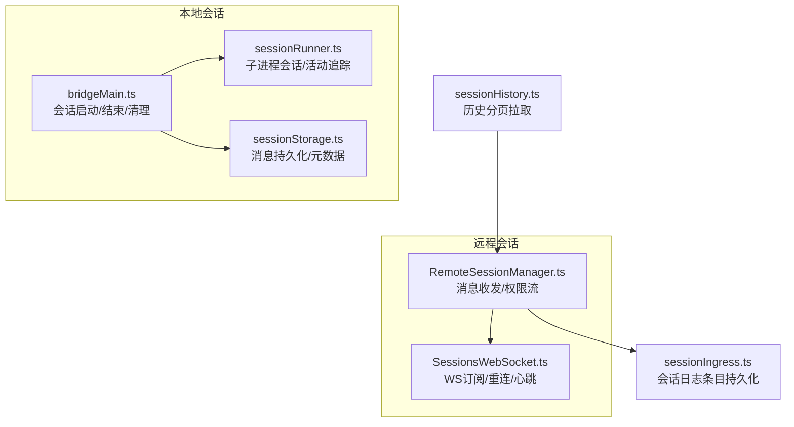
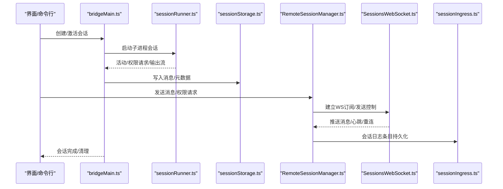
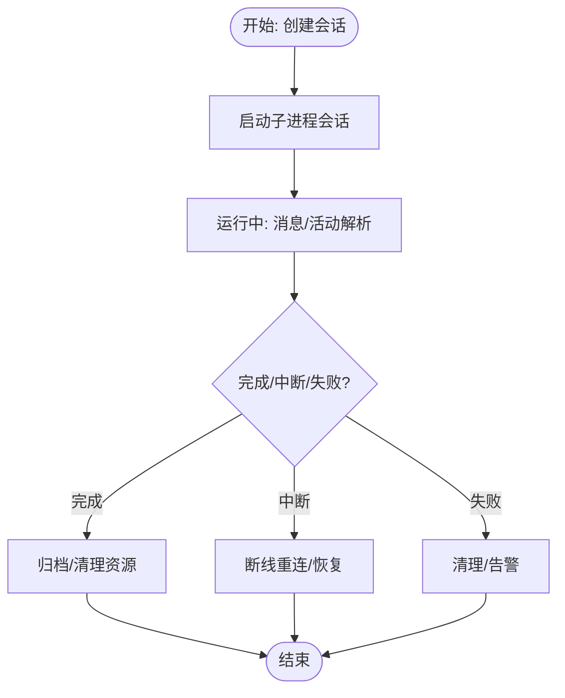
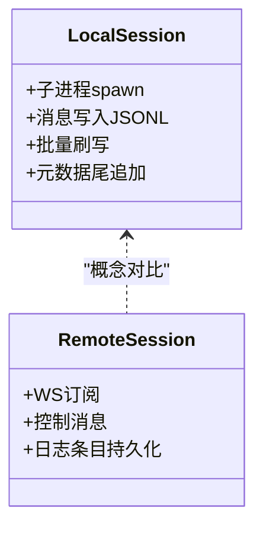
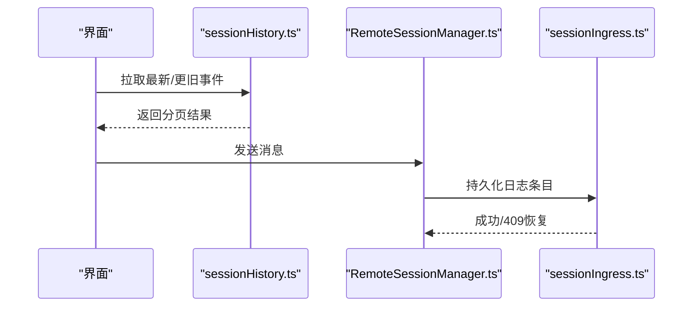
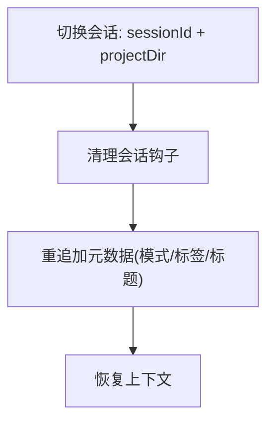
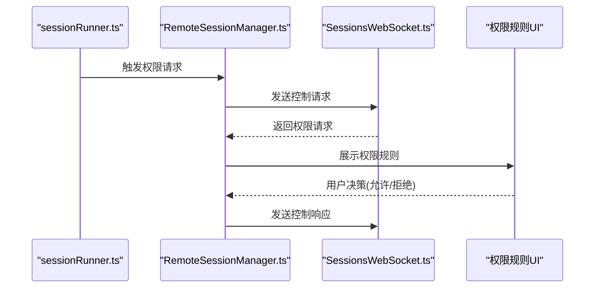
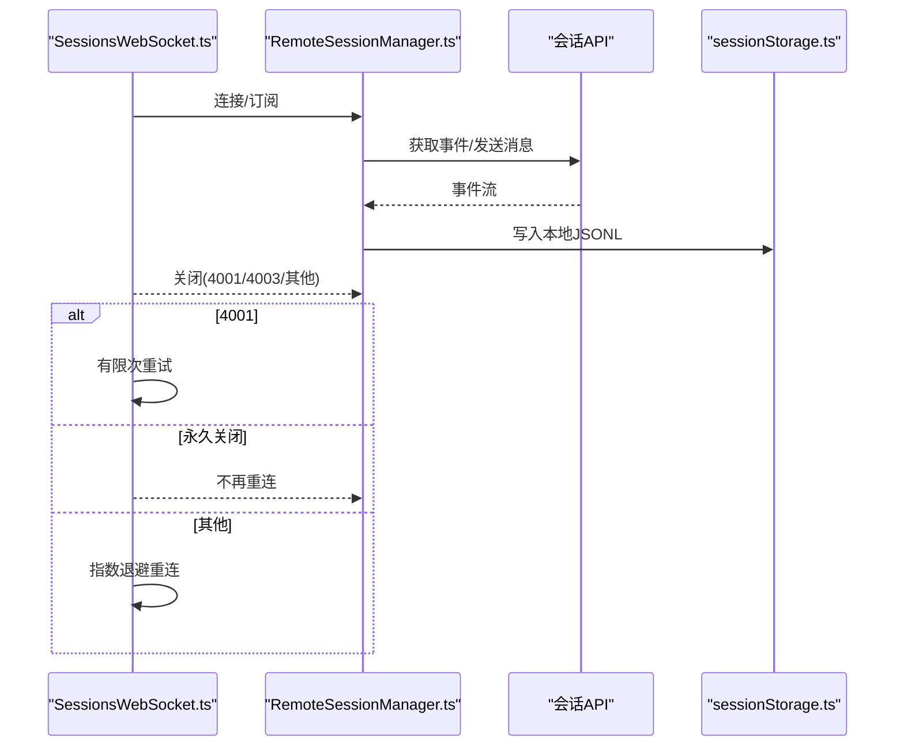
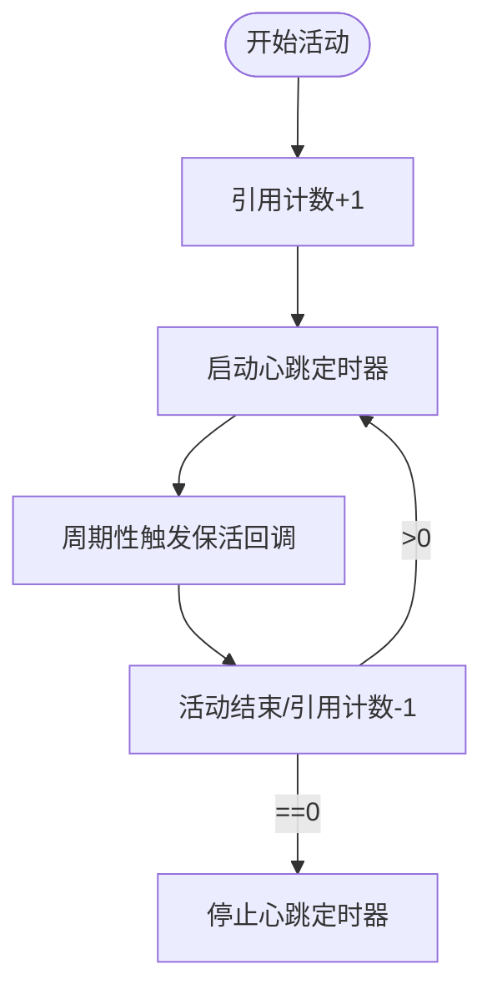
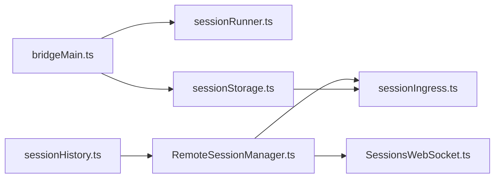

# 会话管理

<cite>
**本文引用的文件**
- [sessionHistory.ts](file://src/assistant/sessionHistory.ts)
- [state.ts](file://src/bootstrap/state.ts)
- [createSession.ts](file://src/bridge/createSession.ts)
- [sessionRunner.ts](file://src/bridge/sessionRunner.ts)
- [bridgeMain.ts](file://src/bridge/bridgeMain.ts)
- [SessionsWebSocket.ts](file://src/remote/SessionsWebSocket.ts)
- [RemoteSessionManager.ts](file://src/remote/RemoteSessionManager.ts)
- [sessionStorage.ts](file://src/utils/sessionStorage.ts)
- [sessionActivity.ts](file://src/utils/sessionActivity.ts)
- [sessionHooks.ts](file://src/utils/hooks/sessionHooks.ts)
- [concurrentSessions.ts](file://src/utils/concurrentSessions.ts)
- [sessionIngress.ts](file://src/services/api/sessionIngress.ts)
- [sessionMemoryUtils.ts](file://src/services/SessionMemory/sessionMemoryUtils.ts)
- [types.ts](file://src/bridge/types.ts)
- [permissions.tsx](file://src/commands/permissions/permissions.tsx)
- [REPL.tsx](file://src/screens/REPL.tsx)
- [teleport.tsx](file://src/utils/teleport.tsx)
</cite>

## 目录
1. [简介](#简介)
2. [项目结构](#项目结构)
3. [核心组件](#核心组件)
4. [架构总览](#架构总览)
5. [详细组件分析](#详细组件分析)
6. [依赖关系分析](#依赖关系分析)
7. [性能考量](#性能考量)
8. [故障排查指南](#故障排查指南)
9. [结论](#结论)
10. [附录](#附录)

## 简介
本文件系统性阐述 Claude Code 的会话管理系统，覆盖会话的概念与生命周期（创建、激活、运行、归档、销毁）、本地与远程会话差异、会话历史与消息持久化、上下文保持策略、权限控制与安全边界、会话迁移与恢复、断线重连与一致性保障，并提供面向初学者与高级开发者的实践指南与参考路径。

## 项目结构
围绕会话管理的关键模块包括：
- 会话状态与生命周期：bootstrap/state.ts 提供全局会话标识与会话切换能力；bridgeMain.ts 负责桥接环境中的会话启动与结束；bridge/sessionRunner.ts 负责子进程会话的生命周期与活动追踪。
- 远程会话：remote/SessionsWebSocket.ts 提供与 CCR 服务的 WebSocket 订阅连接；remote/RemoteSessionManager.ts 协调远程会话的收发、权限请求与响应。
- 消息持久化与历史：utils/sessionStorage.ts 负责会话日志写入、批量刷写、元数据重追加、模式与工作树状态保存；assistant/sessionHistory.ts 提供历史事件分页拉取；services/api/sessionIngress.ts 提供会话日志条目持久化接口。
- 权限与安全：bridge/types.ts 定义权限控制消息类型；commands/permissions/permissions.tsx 提供权限规则列表与重试提示；remote/RemoteSessionManager.ts 处理权限请求与响应。
- 会话活动与保活：utils/sessionActivity.ts 提供会话活动心跳与保活回调注册；bridge/bridgeMain.ts 在会话结束时清理定时器与令牌刷新。
- 并发与会话钩子：utils/concurrentSessions.ts 维护会话名与桥接 ID 的 PID 文件；utils/hooks/sessionHooks.ts 提供会话钩子的清理与注册。

**图表来源**
- [bridgeMain.ts:442-745](file://src/bridge/bridgeMain.ts#L442-L745)
- [sessionRunner.ts:248-547](file://src/bridge/sessionRunner.ts#L248-L547)
- [sessionStorage.ts:532-861](file://src/utils/sessionStorage.ts#L532-L861)
- [SessionsWebSocket.ts:82-204](file://src/remote/SessionsWebSocket.ts#L82-L204)
- [RemoteSessionManager.ts:95-131](file://src/remote/RemoteSessionManager.ts#L95-L131)
- [sessionHistory.ts:31-87](file://src/assistant/sessionHistory.ts#L31-L87)
- [sessionIngress.ts:77-103](file://src/services/api/sessionIngress.ts#L77-L103)

**章节来源**
- [state.ts:431-498](file://src/bootstrap/state.ts#L431-L498)
- [bridgeMain.ts:442-745](file://src/bridge/bridgeMain.ts#L442-L745)
- [sessionRunner.ts:248-547](file://src/bridge/sessionRunner.ts#L248-L547)
- [SessionsWebSocket.ts:82-204](file://src/remote/SessionsWebSocket.ts#L82-L204)
- [RemoteSessionManager.ts:95-131](file://src/remote/RemoteSessionManager.ts#L95-L131)
- [sessionStorage.ts:532-861](file://src/utils/sessionStorage.ts#L532-L861)
- [sessionHistory.ts:31-87](file://src/assistant/sessionHistory.ts#L31-L87)
- [sessionIngress.ts:77-103](file://src/services/api/sessionIngress.ts#L77-L103)

## 核心组件
- 会话标识与切换：通过 bootstrap/state.ts 提供的 sessionId 与 switchSession 实现会话原子切换，确保 sessionId 与项目目录一致，避免漂移。
- 本地会话生命周期：bridgeMain.ts 统一管理会话启动、完成回调、超时与中断处理、资源清理与容量唤醒；sessionRunner.ts 负责子进程会话的 spawn、活动解析、权限请求转发与令牌更新。
- 远程会话生命周期：RemoteSessionManager.ts 通过 SessionsWebSocket.ts 建立订阅，处理消息收发、权限请求/响应、断线重连与错误处理。
- 消息持久化：sessionStorage.ts 提供批量写队列、延迟刷写、尾部元数据重追加、按会话与子代理分文件存储；sessionIngress.ts 提供会话日志条目持久化并处理 409 冲突恢复。
- 历史与恢复：sessionHistory.ts 支持最新与更旧事件分页拉取；hydrateFromCCRv2InternalEvents 可从内部事件重建会话；teleport.tsx 提供远程恢复流程封装。
- 权限与安全：bridge/types.ts 定义权限控制消息类型；RemoteSessionManager.ts 将权限决策通过控制响应发送回会话；permissions.tsx 提供权限规则与重试交互。

**章节来源**
- [state.ts:431-498](file://src/bootstrap/state.ts#L431-L498)
- [bridgeMain.ts:442-745](file://src/bridge/bridgeMain.ts#L442-L745)
- [sessionRunner.ts:248-547](file://src/bridge/sessionRunner.ts#L248-L547)
- [RemoteSessionManager.ts:95-131](file://src/remote/RemoteSessionManager.ts#L95-L131)
- [SessionsWebSocket.ts:82-204](file://src/remote/SessionsWebSocket.ts#L82-L204)
- [sessionStorage.ts:532-861](file://src/utils/sessionStorage.ts#L532-L861)
- [sessionIngress.ts:77-103](file://src/services/api/sessionIngress.ts#L77-L103)
- [sessionHistory.ts:31-87](file://src/assistant/sessionHistory.ts#L31-L87)
- [types.ts:117-131](file://src/bridge/types.ts#L117-L131)
- [permissions.tsx:1-9](file://src/commands/permissions/permissions.tsx#L1-L9)
- [teleport.tsx:488-503](file://src/utils/teleport.tsx#L488-L503)

## 架构总览
下图展示了本地与远程会话在不同传输层下的交互关系与关键职责：

**图表来源**
- [bridgeMain.ts:442-745](file://src/bridge/bridgeMain.ts#L442-L745)
- [sessionRunner.ts:248-547](file://src/bridge/sessionRunner.ts#L248-L547)
- [sessionStorage.ts:532-861](file://src/utils/sessionStorage.ts#L532-L861)
- [RemoteSessionManager.ts:95-131](file://src/remote/RemoteSessionManager.ts#L95-L131)
- [SessionsWebSocket.ts:82-204](file://src/remote/SessionsWebSocket.ts#L82-L204)
- [sessionIngress.ts:77-103](file://src/services/api/sessionIngress.ts#L77-L103)

## 详细组件分析

### 会话生命周期与状态管理
- 会话标识与切换：bootstrap/state.ts 提供 sessionId 生成、父会话记录、会话切换与监听信号，确保跨模块对当前会话的一致感知。
- 本地会话完成回调：bridgeMain.ts 在 onSessionDone 中清理定时器、令牌刷新、容器容量唤醒，并根据超时情况调整状态，随后触发归档或停止工作。
- 子进程会话管理：sessionRunner.ts 负责 spawn、stdout 解析、stderr 缓存、权限请求转发、令牌更新与进程终止；提供活动缓冲与首条用户消息检测。
- 并发会话与 PID 文件：concurrentSessions.ts 更新会话名与桥接 ID 到 PID 文件，便于外部枚举与去重。

**图表来源**
- [bridgeMain.ts:442-745](file://src/bridge/bridgeMain.ts#L442-L745)
- [sessionRunner.ts:248-547](file://src/bridge/sessionRunner.ts#L248-L547)
- [concurrentSessions.ts:116-148](file://src/utils/concurrentSessions.ts#L116-L148)

**章节来源**
- [state.ts:431-498](file://src/bootstrap/state.ts#L431-L498)
- [bridgeMain.ts:442-745](file://src/bridge/bridgeMain.ts#L442-L745)
- [sessionRunner.ts:248-547](file://src/bridge/sessionRunner.ts#L248-L547)
- [concurrentSessions.ts:116-148](file://src/utils/concurrentSessions.ts#L116-L148)

### 本地会话与远程会话对比
- 本地会话
  - 通过 bridgeMain.ts + sessionRunner.ts 管理子进程生命周期，消息直接写入本地 JSONL 文件，支持批量刷写与尾部元数据重追加。
  - 会话标题、标签、模式、工作树状态等元信息通过 sessionStorage.ts 写入尾部，保证 --resume 能正确读取。
- 远程会话
  - 通过 RemoteSessionManager.ts + SessionsWebSocket.ts 建立订阅，消息经由 CCR 通道传输；权限请求/响应通过控制消息往返。
  - 会话日志条目通过 sessionIngress.ts 持久化，处理 409 冲突恢复以保证幂等。

**图表来源**
- [sessionStorage.ts:532-861](file://src/utils/sessionStorage.ts#L532-L861)
- [SessionsWebSocket.ts:82-204](file://src/remote/SessionsWebSocket.ts#L82-L204)
- [RemoteSessionManager.ts:95-131](file://src/remote/RemoteSessionManager.ts#L95-L131)
- [sessionIngress.ts:77-103](file://src/services/api/sessionIngress.ts#L77-L103)

**章节来源**
- [sessionStorage.ts:532-861](file://src/utils/sessionStorage.ts#L532-L861)
- [SessionsWebSocket.ts:82-204](file://src/remote/SessionsWebSocket.ts#L82-L204)
- [RemoteSessionManager.ts:95-131](file://src/remote/RemoteSessionManager.ts#L95-L131)
- [sessionIngress.ts:77-103](file://src/services/api/sessionIngress.ts#L77-L103)

### 会话历史管理与消息持久化
- 历史分页拉取：assistant/sessionHistory.ts 提供最新与更旧事件分页接口，支持锚点与游标翻页，便于 UI 分段加载。
- 本地消息持久化：sessionStorage.ts 使用写队列与批量刷写，限制单批大小，避免大文件 OOM；尾部元数据重追加确保 --resume 读取最新标题/标签等。
- 远程日志条目持久化：services/api/sessionIngress.ts 在 PUT 成功后更新 lastUuidMap，处理 409 场景以恢复“已存在”状态，避免重复写入。
- 会话内存内容：services/SessionMemory/sessionMemoryUtils.ts 提供会话记忆内容读取与配置设置，支持等待提取完成与超时控制。

**图表来源**
- [sessionHistory.ts:31-87](file://src/assistant/sessionHistory.ts#L31-L87)
- [RemoteSessionManager.ts:227-242](file://src/remote/RemoteSessionManager.ts#L227-L242)
- [sessionIngress.ts:77-103](file://src/services/api/sessionIngress.ts#L77-L103)

**章节来源**
- [sessionHistory.ts:31-87](file://src/assistant/sessionHistory.ts#L31-L87)
- [sessionStorage.ts:532-861](file://src/utils/sessionStorage.ts#L532-L861)
- [sessionIngress.ts:77-103](file://src/services/api/sessionIngress.ts#L77-L103)
- [sessionMemoryUtils.ts:85-138](file://src/services/SessionMemory/sessionMemoryUtils.ts#L85-L138)

### 上下文保持策略
- 会话切换一致性：bootstrap/state.ts 的 switchSession 原子地更新 sessionId 与项目目录，避免会话 ID 与项目目录漂移导致的路径不一致问题。
- 会话钩子清理：utils/hooks/sessionHooks.ts 提供按会话清理钩子的能力，避免残留钩子影响新会话。
- 模式与工作树状态：sessionStorage.ts 在尾部重追加模式与工作树状态，确保恢复时上下文完整。
- REPL 模式保存：screens/REPL.tsx 在退出前保存当前模式，以便后续恢复。

**图表来源**
- [state.ts:468-498](file://src/bootstrap/state.ts#L468-L498)
- [sessionHooks.ts:437-447](file://src/utils/hooks/sessionHooks.ts#L437-L447)
- [sessionStorage.ts:721-839](file://src/utils/sessionStorage.ts#L721-L839)
- [REPL.tsx:1894-1910](file://src/screens/REPL.tsx#L1894-L1910)

**章节来源**
- [state.ts:468-498](file://src/bootstrap/state.ts#L468-L498)
- [sessionHooks.ts:437-447](file://src/utils/hooks/sessionHooks.ts#L437-L447)
- [sessionStorage.ts:721-839](file://src/utils/sessionStorage.ts#L721-L839)
- [REPL.tsx:1894-1910](file://src/screens/REPL.tsx#L1894-L1910)

### 权限控制与安全边界
- 权限消息类型：bridge/types.ts 定义权限控制响应结构，用于向会话返回决策。
- 远程权限流：RemoteSessionManager.ts 维护 pendingPermissionRequests 映射，接收权限请求并通过控制响应发送决策；支持允许并可更新输入或拒绝并附带消息。
- 权限规则交互：commands/permissions/permissions.tsx 提供权限规则列表与重试交互，便于用户在权限被拒绝时重新尝试。

**图表来源**
- [sessionRunner.ts:417-430](file://src/bridge/sessionRunner.ts#L417-L430)
- [RemoteSessionManager.ts:247-282](file://src/remote/RemoteSessionManager.ts#L247-L282)
- [SessionsWebSocket.ts:328-357](file://src/remote/SessionsWebSocket.ts#L328-L357)
- [types.ts:117-131](file://src/bridge/types.ts#L117-L131)
- [permissions.tsx:1-9](file://src/commands/permissions/permissions.tsx#L1-L9)

**章节来源**
- [types.ts:117-131](file://src/bridge/types.ts#L117-L131)
- [RemoteSessionManager.ts:247-282](file://src/remote/RemoteSessionManager.ts#L247-L282)
- [permissions.tsx:1-9](file://src/commands/permissions/permissions.tsx#L1-L9)

### 会话迁移与恢复、断线重连与一致性
- 断线重连：SessionsWebSocket.ts 对连接关闭进行分类处理，对 4001（会话不存在）进行有限次重试；对永久关闭码（如 4003）不再重连；常规关闭按最大重连次数与指数退避策略重连。
- 强制重连：当订阅过期或容器重启后，SessionsWebSocket 提供强制重连方法，关闭现有连接并重新建立。
- 会话恢复：
  - CCR v2 内部事件恢复：hydrateFromCCRv2InternalEvents 从服务器读取内部事件并写入本地 JSONL，支持前台与子代理事件。
  - 历史恢复：sessionHistory.ts 提供历史事件分页拉取，配合远程会话管理器实现历史浏览。
  - Teleport 恢复：teleport.tsx 封装从会话 API 恢复流程，捕获异常并上报分析事件。
- 一致性校验：checkResumeConsistency 对恢复链路进行一致性检查，记录预期与实际位置差值，监控写入-加载往返漂移。

**图表来源**
- [SessionsWebSocket.ts:234-288](file://src/remote/SessionsWebSocket.ts#L234-L288)
- [SessionsWebSocket.ts:393-403](file://src/remote/SessionsWebSocket.ts#L393-L403)
- [RemoteSessionManager.ts:108-131](file://src/remote/RemoteSessionManager.ts#L108-L131)
- [sessionStorage.ts:1632-1660](file://src/utils/sessionStorage.ts#L1632-L1660)
- [teleport.tsx:488-503](file://src/utils/teleport.tsx#L488-L503)

**章节来源**
- [SessionsWebSocket.ts:234-288](file://src/remote/SessionsWebSocket.ts#L234-L288)
- [SessionsWebSocket.ts:393-403](file://src/remote/SessionsWebSocket.ts#L393-L403)
- [RemoteSessionManager.ts:108-131](file://src/remote/RemoteSessionManager.ts#L108-L131)
- [sessionStorage.ts:1632-1660](file://src/utils/sessionStorage.ts#L1632-L1660)
- [sessionHistory.ts:31-87](file://src/assistant/sessionHistory.ts#L31-L87)
- [teleport.tsx:488-503](file://src/utils/teleport.tsx#L488-L503)
- [sessionStorage.ts:2224-2243](file://src/utils/sessionStorage.ts#L2224-L2243)

### 会话令牌与活动保活
- 会话活动心跳：utils/sessionActivity.ts 提供基于引用计数的心跳定时器，当有活动（API 调用/工具执行）时周期性触发回调以保持容器活跃；可通过环境变量开关。
- 令牌更新：sessionRunner.ts 在子进程会话中通过 stdin 发送更新环境变量消息，使子进程在下次刷新头时使用新令牌。
- 会话完成清理：bridgeMain.ts 在 onSessionDone 中取消令牌刷新与会话定时器，确保资源释放。

**图表来源**
- [sessionActivity.ts:30-40](file://src/utils/sessionActivity.ts#L30-L40)
- [sessionRunner.ts:527-542](file://src/bridge/sessionRunner.ts#L527-L542)
- [bridgeMain.ts:442-475](file://src/bridge/bridgeMain.ts#L442-L475)

**章节来源**
- [sessionActivity.ts:1-40](file://src/utils/sessionActivity.ts#L1-L40)
- [sessionRunner.ts:527-542](file://src/bridge/sessionRunner.ts#L527-L542)
- [bridgeMain.ts:442-475](file://src/bridge/bridgeMain.ts#L442-L475)

## 依赖关系分析
- 组件耦合
  - bridgeMain.ts 与 sessionRunner.ts 高内聚：前者负责调度与清理，后者负责子进程与活动解析。
  - RemoteSessionManager.ts 与 SessionsWebSocket.ts 高内聚：前者协调消息与权限，后者负责网络层。
  - sessionStorage.ts 作为持久化枢纽，被多处模块调用（会话写入、元数据重追加、子代理与远程代理元数据）。
- 外部依赖
  - WebSocket 适配：SessionsWebSocket.ts 在 Bun 与 Node 环境下分别使用原生 WebSocket 与 ws 包。
  - Axios：sessionIngress.ts 与 sessionHistory.ts 使用 HTTP 客户端进行持久化与历史拉取。
- 循环依赖
  - 通过模块拆分与回调注册避免循环导入；例如 sessionSwitched 信号在 bootstrap/state.ts 中定义，供 concurrentSessions.ts 订阅。

**图表来源**
- [bridgeMain.ts:442-745](file://src/bridge/bridgeMain.ts#L442-L745)
- [sessionRunner.ts:248-547](file://src/bridge/sessionRunner.ts#L248-L547)
- [sessionStorage.ts:532-861](file://src/utils/sessionStorage.ts#L532-L861)
- [RemoteSessionManager.ts:95-131](file://src/remote/RemoteSessionManager.ts#L95-L131)
- [SessionsWebSocket.ts:82-204](file://src/remote/SessionsWebSocket.ts#L82-L204)
- [sessionIngress.ts:77-103](file://src/services/api/sessionIngress.ts#L77-L103)
- [sessionHistory.ts:31-87](file://src/assistant/sessionHistory.ts#L31-L87)

**章节来源**
- [bridgeMain.ts:442-745](file://src/bridge/bridgeMain.ts#L442-L745)
- [sessionRunner.ts:248-547](file://src/bridge/sessionRunner.ts#L248-L547)
- [sessionStorage.ts:532-861](file://src/utils/sessionStorage.ts#L532-L861)
- [RemoteSessionManager.ts:95-131](file://src/remote/RemoteSessionManager.ts#L95-L131)
- [SessionsWebSocket.ts:82-204](file://src/remote/SessionsWebSocket.ts#L82-L204)
- [sessionIngress.ts:77-103](file://src/services/api/sessionIngress.ts#L77-L103)
- [sessionHistory.ts:31-87](file://src/assistant/sessionHistory.ts#L31-L87)

## 性能考量
- 批量刷写与队列：sessionStorage.ts 使用写队列与延迟刷写，限制单批大小，降低磁盘压力与 IO 抖动。
- 尾部元数据重追加：在会话退出与压缩前后重追加标题/标签/模式等元数据，避免全文件扫描，提升 --resume 读取效率。
- 心跳与保活：sessionActivity.ts 的心跳间隔与条件触发，避免不必要的网络开销；仅在启用时发送保活。
- 重连退避：SessionsWebSocket.ts 对 4001 与常规错误采用不同重连策略，减少无效重试与服务器压力。

[本节为通用性能建议，无需特定文件引用]

## 故障排查指南
- 会话未创建或无会话 ID
  - 检查 createBridgeSession 的鉴权与组织 UUID 获取是否成功；确认返回体包含 id 字段。
  - 参考路径：[createSession.ts:64-75](file://src/bridge/createSession.ts#L64-L75)、[createSession.ts:168-179](file://src/bridge/createSession.ts#L168-L179)
- 远程会话无法连接或频繁断开
  - 查看 SessionsWebSocket.ts 的关闭码与重连逻辑；关注 4001（瞬态）与 4003（永久）的不同处理。
  - 参考路径：[SessionsWebSocket.ts:234-288](file://src/remote/SessionsWebSocket.ts#L234-L288)、[SessionsWebSocket.ts:393-403](file://src/remote/SessionsWebSocket.ts#L393-L403)
- 权限请求未生效或被拒绝
  - 确认 RemoteSessionManager.ts 是否正确缓存并发送控制响应；检查权限规则 UI 的交互与重试。
  - 参考路径：[RemoteSessionManager.ts:247-282](file://src/remote/RemoteSessionManager.ts#L247-L282)、[permissions.tsx:1-9](file://src/commands/permissions/permissions.tsx#L1-L9)
- 消息持久化失败或重复
  - 检查 sessionIngress.ts 的 409 冲突恢复逻辑与 lastUuidMap 更新；确认幂等写入。
  - 参考路径：[sessionIngress.ts:77-103](file://src/services/api/sessionIngress.ts#L77-L103)
- 会话恢复不一致或消息缺失
  - 使用 checkResumeConsistency 对恢复链路进行一致性检查；必要时回退到历史拉取或 Teleport 恢复。
  - 参考路径：[sessionStorage.ts:2224-2243](file://src/utils/sessionStorage.ts#L2224-L2243)、[teleport.tsx:488-503](file://src/utils/teleport.tsx#L488-L503)

**章节来源**
- [createSession.ts:64-75](file://src/bridge/createSession.ts#L64-L75)
- [createSession.ts:168-179](file://src/bridge/createSession.ts#L168-L179)
- [SessionsWebSocket.ts:234-288](file://src/remote/SessionsWebSocket.ts#L234-L288)
- [SessionsWebSocket.ts:393-403](file://src/remote/SessionsWebSocket.ts#L393-L403)
- [RemoteSessionManager.ts:247-282](file://src/remote/RemoteSessionManager.ts#L247-L282)
- [permissions.tsx:1-9](file://src/commands/permissions/permissions.tsx#L1-L9)
- [sessionIngress.ts:77-103](file://src/services/api/sessionIngress.ts#L77-L103)
- [sessionStorage.ts:2224-2243](file://src/utils/sessionStorage.ts#L2224-L2243)
- [teleport.tsx:488-503](file://src/utils/teleport.tsx#L488-L503)

## 结论
Claude Code 的会话管理通过本地与远程双通道实现统一的生命周期管理与上下文保持。本地侧以子进程与 JSONL 持久化为核心，远程侧以 WebSocket 订阅与内部事件恢复为特色。配合权限控制、断线重连与一致性校验，系统在可用性、安全性与可恢复性方面形成闭环。对于初学者，建议从会话切换与消息持久化入手；对于高级开发者，可关注批量刷写、心跳保活与 Teleport 恢复的扩展点。

[本节为总结性内容，无需特定文件引用]

## 附录
- 代码示例路径（不展示具体代码）
  - 会话创建与标题更新：[createSession.ts:34-180](file://src/bridge/createSession.ts#L34-L180)、[createSession.ts:327-384](file://src/bridge/createSession.ts#L327-L384)
  - 会话完成回调与清理：[bridgeMain.ts:442-475](file://src/bridge/bridgeMain.ts#L442-L475)、[bridgeMain.ts:1459-1492](file://src/bridge/bridgeMain.ts#L1459-L1492)
  - 子进程会话活动解析与权限请求：[sessionRunner.ts:417-444](file://src/bridge/sessionRunner.ts#L417-L444)
  - 远程会话连接与消息收发：[RemoteSessionManager.ts:108-131](file://src/remote/RemoteSessionManager.ts#L108-L131)、[SessionsWebSocket.ts:100-204](file://src/remote/SessionsWebSocket.ts#L100-L204)
  - 会话历史分页拉取：[sessionHistory.ts:73-87](file://src/assistant/sessionHistory.ts#L73-L87)
  - 会话日志条目持久化与 409 恢复：[sessionIngress.ts:77-103](file://src/services/api/sessionIngress.ts#L77-L103)
  - 会话元数据重追加与批量刷写：[sessionStorage.ts:721-839](file://src/utils/sessionStorage.ts#L721-L839)、[sessionStorage.ts:841-861](file://src/utils/sessionStorage.ts#L841-L861)
  - 会话活动心跳与保活回调：[sessionActivity.ts:30-40](file://src/utils/sessionActivity.ts#L30-L40)
  - 会话钩子清理：[sessionHooks.ts:437-447](file://src/utils/hooks/sessionHooks.ts#L437-L447)
  - 并发会话 PID 文件更新：[concurrentSessions.ts:116-148](file://src/utils/concurrentSessions.ts#L116-L148)
  - CCR v2 内部事件恢复：[sessionStorage.ts:1632-1660](file://src/utils/sessionStorage.ts#L1632-L1660)
  - Teleport 恢复封装：[teleport.tsx:488-503](file://src/utils/teleport.tsx#L488-L503)

[本节为附录索引，无需特定文件引用]