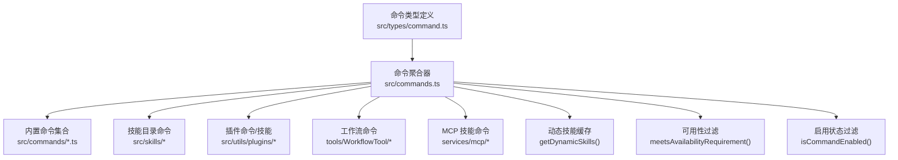
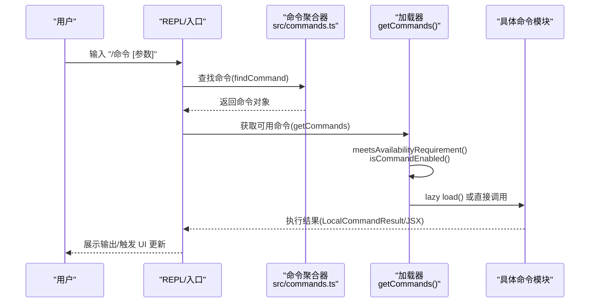
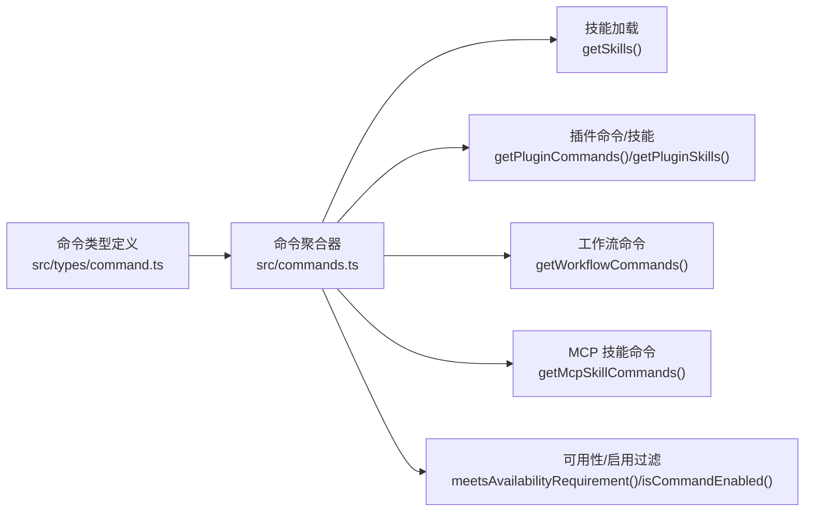

# 命令系统

<cite>
**本文引用的文件**
- [src/commands.ts](file://src/commands.ts)
- [src/types/command.ts](file://src/types/command.ts)
- [src/commands/init.ts](file://src/commands/init.ts)
- [src/commands/help/index.ts](file://src/commands/help/index.ts)
- [src/commands/context/index.ts](file://src/commands/context/index.ts)
- [src/commands/clear/index.ts](file://src/commands/clear/index.ts)
- [src/commands/exit/index.ts](file://src/commands/exit/index.ts)
- [src/commands/theme/index.ts](file://src/commands/theme/index.ts)
- [src/commands/skills/index.ts](file://src/commands/skills/index.ts)
- [src/commands/mcp/index.ts](file://src/commands/mcp/index.ts)
</cite>

## 目录
1. [简介](#简介)
2. [项目结构](#项目结构)
3. [核心组件](#核心组件)
4. [架构总览](#架构总览)
5. [详细组件分析](#详细组件分析)
6. [依赖关系分析](#依赖关系分析)
7. [性能考量](#性能考量)
8. [故障排查指南](#故障排查指南)
9. [结论](#结论)
10. [附录](#附录)

## 简介
本文件系统性阐述 Claude Code 的命令系统：命令注册机制、执行流程、参数解析与上下文传递；内置命令的分类与功能；安全与权限控制；错误处理策略；以及扩展机制（自定义命令、插件命令、动态命令生成）。文档同时提供面向初学者的概念讲解与面向高级开发者的扩展指南，并通过图示与路径引用帮助快速定位实现位置。

## 项目结构
命令系统的核心由“命令聚合器”和“命令类型定义”两部分组成：
- 命令聚合器负责收集、过滤、去重并暴露可用命令列表，支持按用户身份与特性开关进行可用性筛选，并可注入动态技能与工作流命令。
- 命令类型定义统一了三类命令形态：提示型（prompt）、本地型（local）、本地 JSX 型（local-jsx），并规定了参数、上下文、显示行为等契约。

图表来源
- [src/commands.ts:258-517](file://src/commands.ts#L258-L517)
- [src/types/command.ts:16-206](file://src/types/command.ts#L16-L206)

章节来源
- [src/commands.ts:258-517](file://src/commands.ts#L258-L517)
- [src/types/command.ts:16-206](file://src/types/command.ts#L16-L206)

## 核心组件
- 命令聚合器与加载管线
  - 聚合内置命令、技能目录命令、插件命令/技能、工作流命令与 MCP 技能命令，按可用性与启用状态过滤后返回。
  - 支持动态技能注入与去重，保证用户视角命令列表稳定且不重复。
  - 提供命令查找、名称格式化、远程/桥接安全命令白名单等工具函数。
- 命令类型与上下文
  - 统一的 Command 接口，区分三类命令形态与元数据（如别名、描述、是否对模型可见、是否敏感参数等）。
  - 上下文接口 LocalJSXCommandContext 为本地 JSX 命令提供渲染、消息更新、主题切换、IDE 安装等能力。
- 内置命令示例
  - 帮助、上下文可视化、清屏、退出、主题切换、技能列表、MCP 管理等，覆盖系统集成、UX 辅助与开发工作流。

章节来源
- [src/commands.ts:258-517](file://src/commands.ts#L258-L517)
- [src/types/command.ts:16-206](file://src/types/command.ts#L16-L206)
- [src/commands/help/index.ts:3-8](file://src/commands/help/index.ts#L3-L8)
- [src/commands/context/index.ts:4-24](file://src/commands/context/index.ts#L4-L24)
- [src/commands/clear/index.ts:10-17](file://src/commands/clear/index.ts#L10-L17)
- [src/commands/exit/index.ts:3-10](file://src/commands/exit/index.ts#L3-L10)
- [src/commands/theme/index.ts:3-8](file://src/commands/theme/index.ts#L3-L8)
- [src/commands/skills/index.ts:3-8](file://src/commands/skills/index.ts#L3-L8)
- [src/commands/mcp/index.ts:3-10](file://src/commands/mcp/index.ts#L3-L10)

## 架构总览
命令系统采用“声明式注册 + 运行时聚合”的架构：
- 每个命令以模块形式导出一个 Command 对象，声明其类型、元数据与实现入口。
- 命令聚合器在运行时按需加载（lazy load），并通过 memoize 缓存昂贵的磁盘 I/O 与动态导入结果。
- 可用性与启用状态在每次获取命令列表时重新计算，确保登录态变化或特性开关切换时即时生效。

图表来源
- [src/commands.ts:688-719](file://src/commands.ts#L688-L719)
- [src/commands.ts:476-517](file://src/commands.ts#L476-L517)
- [src/types/command.ts:62-152](file://src/types/command.ts#L62-L152)

## 详细组件分析

### 命令注册与聚合
- 注册机制
  - 命令以模块形式集中导出，命令聚合器通过 import/require 动态引入，支持条件特性开关与环境变量控制。
  - 内置命令集合通过 memoize 缓存，避免重复构建。
- 加载与过滤
  - 先加载技能目录命令、插件命令/技能、工作流命令与 MCP 技能，再合并内置命令。
  - 按可用性（meetsAvailabilityRequirement）与启用状态（isCommandEnabled）过滤。
  - 动态技能去重并插入到插件技能之后、内置命令之前，保持稳定的优先级顺序。
- 名称与别名解析
  - 支持精确匹配、用户可见名与别名匹配，便于帮助与自动补全。
- 远程/桥接安全命令
  - 提供 REMOTE_SAFE_COMMANDS 与 BRIDGE_SAFE_COMMANDS 白名单，确保远端客户端安全执行。

章节来源
- [src/commands.ts:258-517](file://src/commands.ts#L258-L517)
- [src/commands.ts:619-686](file://src/commands.ts#L619-L686)
- [src/commands.ts:688-719](file://src/commands.ts#L688-L719)

### 命令类型与上下文
- 类型定义
  - PromptCommand：面向模型的提示型命令，支持内容长度估算、进度提示、工具限制、路径过滤等。
  - LocalCommand：纯本地命令，延迟加载实现，支持非交互模式。
  - LocalJSXCommand：渲染 JSX 的本地命令，延迟加载，适合复杂 UI 交互。
- 上下文与回调
  - LocalJSXCommandContext 提供消息更新、主题切换、IDE 安装、动态 MCP 配置变更等能力。
  - LocalJSXCommandOnDone 支持结果展示方式、是否继续向模型提问、插入元消息等。

章节来源
- [src/types/command.ts:16-206](file://src/types/command.ts#L16-L206)

### 内置命令分类与功能
- 系统与 UX 辅助
  - 帮助：列出可用命令与说明。
  - 主题：切换终端主题。
  - 退出：立即退出 REPL。
  - 清屏：清理会话历史与缓存。
  - 上下文可视化：在交互式会话中可视化当前上下文占用。
- 开发与工作流
  - 技能：列出可用技能。
  - MCP：管理 MCP 服务器。
  - 初始化：生成 CLAUDE.md、个人配置与技能/钩子建议。
- 其他
  - 文件、差异、统计、成本、模型、输出样式、远程环境、升级、反馈、标签、任务、权限、计划、隐私设置、钩子、桌面/移动集成、调试工具调用等。

章节来源
- [src/commands/help/index.ts:3-8](file://src/commands/help/index.ts#L3-L8)
- [src/commands/theme/index.ts:3-8](file://src/commands/theme/index.ts#L3-L8)
- [src/commands/exit/index.ts:3-10](file://src/commands/exit/index.ts#L3-L10)
- [src/commands/clear/index.ts:10-17](file://src/commands/clear/index.ts#L10-L17)
- [src/commands/context/index.ts:4-24](file://src/commands/context/index.ts#L4-L24)
- [src/commands/skills/index.ts:3-8](file://src/commands/skills/index.ts#L3-L8)
- [src/commands/mcp/index.ts:3-10](file://src/commands/mcp/index.ts#L3-L10)
- [src/commands/init.ts:226-254](file://src/commands/init.ts#L226-L254)

### 参数解析与上下文感知
- 参数解析
  - 命令对象支持 argumentHint 作为输入提示；PromptCommand 支持 argNames 与 allowedTools 等约束。
  - 本地命令通过 args 字符串传入，具体解析逻辑在各命令模块内部实现。
- 上下文感知
  - LocalJSXCommandContext 提供 setMessages、onChangeAPIKey、onInstallIDEExtension、resume 等回调，使命令可与 UI 与会话状态联动。
  - PromptCommand 支持 paths 过滤，仅在模型触达匹配文件后可见。

章节来源
- [src/types/command.ts:25-57](file://src/types/command.ts#L25-L57)
- [src/types/command.ts:80-98](file://src/types/command.ts#L80-L98)

### 安全机制与权限控制
- 可用性门槛
  - availability 字段限定命令对特定认证/提供商环境可见（如 claude.ai 订阅者、Console 直连用户）。
  - meetsAvailabilityRequirement 在每次获取命令时重新评估，确保登录态变化即时生效。
- 启用状态
  - isEnabled 可基于特性开关、环境变量等动态启用/禁用命令。
- 远程/桥接安全
  - REMOTE_SAFE_COMMANDS 与 BRIDGE_SAFE_COMMANDS 白名单严格限制远端可执行命令范围。
  - isBridgeSafeCommand 判定 slash 命令在桥接通道上的安全性（prompt 命令默认安全；local 命令需显式允许；local-jsx 命令禁止）。
- 敏感参数
  - isSensitive 标记后，命令参数在会话历史中会被脱敏。

章节来源
- [src/types/command.ts:169-203](file://src/types/command.ts#L169-L203)
- [src/commands.ts:417-443](file://src/commands.ts#L417-L443)
- [src/commands.ts:619-686](file://src/commands.ts#L619-L686)
- [src/commands.ts:672-676](file://src/commands.ts#L672-L676)

### 错误处理策略
- 加载失败容错
  - 技能目录命令、插件技能与工作流命令的加载失败被捕获并记录日志，系统继续运行并返回可用命令集合。
- 技能列表异常保护
  - getSlashCommandToolSkills 在加载失败时返回空数组，避免影响整体体验。
- 日志与调试
  - 使用 logError、toError、logForDebugging 输出错误与调试信息，便于定位问题。

章节来源
- [src/commands.ts:358-398](file://src/commands.ts#L358-L398)
- [src/commands.ts:586-608](file://src/commands.ts#L586-L608)

### 命令扩展机制
- 自定义命令
  - 实现一个符合 Command 接口的对象，选择 type: 'local' 或 'local-jsx' 并提供 load() 或直接实现 call。
  - 将命令注册到命令聚合器的 COMMANDS 数组中，或通过插件/技能目录暴露。
- 插件命令系统
  - 通过 getPluginCommands 与 getPluginSkills 动态加载插件提供的命令与技能。
  - 插件命令可通过 pluginInfo 附带插件清单信息，用于 UI 展示来源。
- 动态命令生成
  - getDynamicSkills 提供在文件操作过程中发现的动态技能，聚合器在去重后插入到合适位置。
  - getSkillToolCommands 与 getSlashCommandToolSkills 用于筛选可用于模型调用的技能集合。
- 工作流命令
  - WORKFLOW_SCRIPTS 特性开启时，通过 createWorkflowCommand 生成工作流驱动的命令。

章节来源
- [src/commands.ts:449-469](file://src/commands.ts#L449-L469)
- [src/commands.ts:563-608](file://src/commands.ts#L563-L608)
- [src/commands.ts:400-406](file://src/commands.ts#L400-L406)

### 命令行参数处理与上下文感知命令
- 参数处理
  - 本地命令通过 args 字符串接收参数，具体解析在命令模块内完成。
  - PromptCommand 支持 argNames、allowedTools、paths 等约束，便于模型侧生成与调用。
- 上下文感知
  - 通过 LocalJSXCommandContext 与 ToolUseContext 的组合，命令可读取/修改消息、主题、IDE 状态等。
  - 非交互会话中的命令（如 contextNonInteractive）通过 isEnabled 与 isHidden 控制可见性。

章节来源
- [src/types/command.ts:62-98](file://src/types/command.ts#L62-L98)
- [src/commands/context/index.ts:12-24](file://src/commands/context/index.ts#L12-L24)

### 具体应用示例（代码路径）
- 初始化命令（/init）
  - 通过 getPromptForCommand 返回提示内容，引导生成 CLAUDE.md、个人配置与技能/钩子建议。
  - 示例路径：[src/commands/init.ts:226-254](file://src/commands/init.ts#L226-L254)
- 帮助命令（/help）
  - 本地 JSX 命令，延迟加载帮助界面。
  - 示例路径：[src/commands/help/index.ts:3-8](file://src/commands/help/index.ts#L3-L8)
- 上下文命令（/context）
  - 交互式会话中可视化上下文使用情况；非交互会话提供文本版。
  - 示例路径：[src/commands/context/index.ts:4-24](file://src/commands/context/index.ts#L4-L24)
- 清屏命令（/clear）
  - 本地命令，延迟加载实现，支持清理会话缓存与对话历史。
  - 示例路径：[src/commands/clear/index.ts:10-17](file://src/commands/clear/index.ts#L10-L17)
- 退出命令（/exit）
  - 本地 JSX 命令，immediate: true 表示立即退出。
  - 示例路径：[src/commands/exit/index.ts:3-10](file://src/commands/exit/index.ts#L3-L10)
- 主题命令（/theme）
  - 本地 JSX 命令，延迟加载主题切换界面。
  - 示例路径：[src/commands/theme/index.ts:3-8](file://src/commands/theme/index.ts#L3-L8)
- 技能命令（/skills）
  - 本地 JSX 命令，列出可用技能。
  - 示例路径：[src/commands/skills/index.ts:3-8](file://src/commands/skills/index.ts#L3-L8)
- MCP 命令（/mcp）
  - 本地 JSX 命令，延迟加载 MCP 管理界面。
  - 示例路径：[src/commands/mcp/index.ts:3-10](file://src/commands/mcp/index.ts#L3-L10)

## 依赖关系分析
- 命令聚合器依赖
  - 命令类型定义：统一命令接口与上下文契约。
  - 技能加载：技能目录命令、插件技能、动态技能。
  - 工作流工具：根据特性开关生成工作流命令。
  - MCP 服务：过滤 MCP 提供的 prompt 型技能。
- 安全与可用性
  - meetsAvailabilityRequirement 与 isCommandEnabled 保证命令在不同认证/特性环境下正确呈现与执行。
- 性能优化
  - memoize 缓存命令列表与技能工具命令，减少重复加载与计算。

图表来源
- [src/commands.ts:449-469](file://src/commands.ts#L449-L469)
- [src/commands.ts:547-559](file://src/commands.ts#L547-L559)
- [src/commands.ts:417-443](file://src/commands.ts#L417-L443)
- [src/commands.ts:213-222](file://src/commands.ts#L213-L222)

章节来源
- [src/commands.ts:449-469](file://src/commands.ts#L449-L469)
- [src/commands.ts:547-559](file://src/commands.ts#L547-L559)
- [src/commands.ts:417-443](file://src/commands.ts#L417-L443)
- [src/commands.ts:213-222](file://src/commands.ts#L213-L222)

## 性能考量
- 惰性加载与缓存
  - 命令与技能模块均采用延迟加载，聚合器使用 memoize 缓存，显著降低启动与查询开销。
- 并行加载
  - 技能目录命令、插件技能与工作流命令通过 Promise.all 并行加载，缩短等待时间。
- 去重与排序
  - 动态技能与内置命令去重并插入到固定位置，避免重复扫描与多次构建。

章节来源
- [src/commands.ts:358-398](file://src/commands.ts#L358-L398)
- [src/commands.ts:450-458](file://src/commands.ts#L450-L458)
- [src/commands.ts:491-516](file://src/commands.ts#L491-L516)

## 故障排查指南
- 命令未出现
  - 检查 availability 是否满足当前认证/提供商要求；确认 isEnabled 是否返回 true。
  - 确认命令未被 isHidden 标记；检查别名是否正确。
- 命令执行报错
  - 查看日志输出（logError/toError）定位具体模块错误；确认命令模块是否正确导出 load/call。
- 技能/插件命令缺失
  - 检查技能目录与插件加载是否抛错；确认 getSkills 与 getPluginCommands 的返回值。
- 远端不可用
  - 确认命令是否在 REMOTE_SAFE_COMMANDS 或 BRIDGE_SAFE_COMMANDS 中；检查 isBridgeSafeCommand 判定。

章节来源
- [src/commands.ts:417-443](file://src/commands.ts#L417-L443)
- [src/commands.ts:619-686](file://src/commands.ts#L619-L686)
- [src/commands.ts:358-398](file://src/commands.ts#L358-L398)

## 结论
命令系统通过声明式注册、运行时聚合与安全过滤，实现了高扩展性与强健性。内置命令覆盖系统集成、UX 辅助与开发工作流；通过插件与技能机制，用户可以轻松扩展能力；通过远端安全白名单与可用性门槛，保障在多端场景下的安全与一致性。建议在新增命令时遵循统一类型定义与上下文契约，充分利用惰性加载与缓存策略，确保性能与可维护性。

## 附录
- 快速上手
  - 查看帮助：/help
  - 列出技能：/skills
  - 切换主题：/theme
  - 清理上下文：/clear
  - 管理 MCP：/mcp
  - 初始化项目：/init
- 扩展指南
  - 新增本地命令：实现 LocalCommand 并在聚合器中注册。
  - 新增本地 JSX 命令：实现 LocalJSXCommand 并提供延迟加载。
  - 新增提示型命令：实现 PromptCommand 并提供 getPromptForCommand。
  - 插件命令：通过插件系统暴露命令与技能。
  - 动态命令：利用 getDynamicSkills 与聚合器去重插入逻辑。