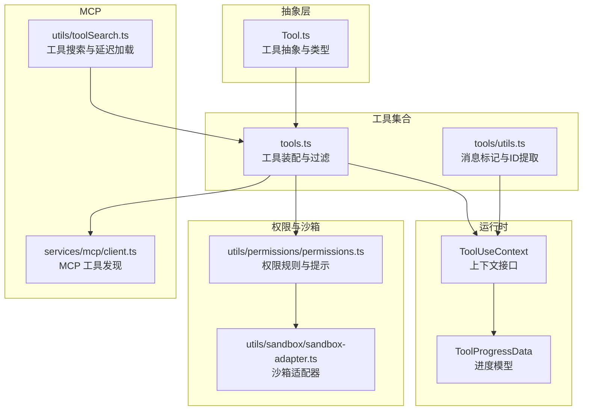
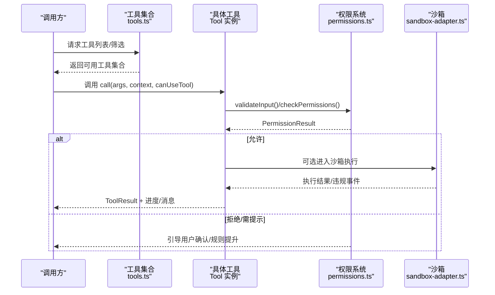
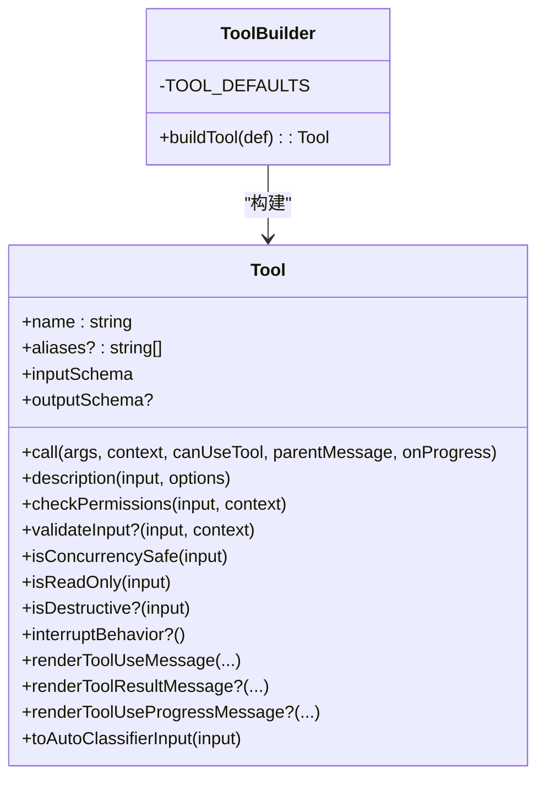
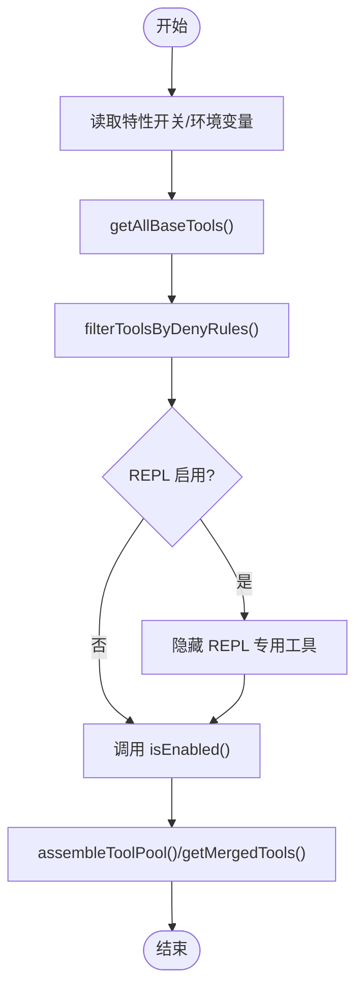
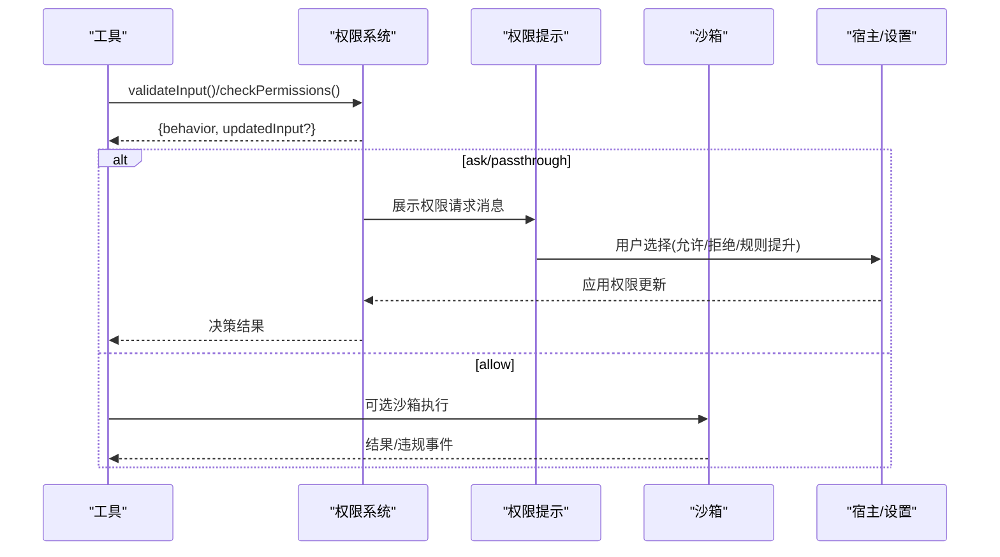
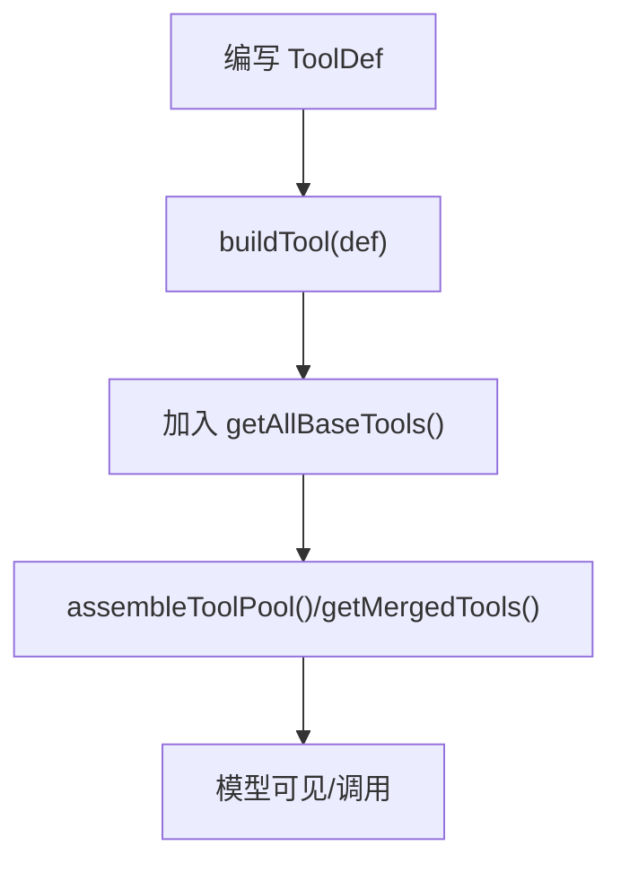
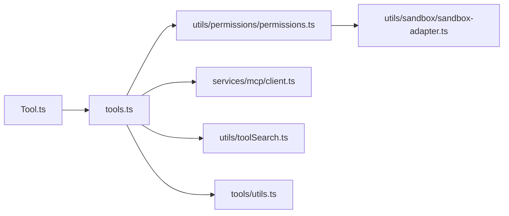

# 工具系统

<cite>
**本文引用的文件**
- [Tool.ts](file://src/Tool.ts)
- [tools.ts](file://src/tools.ts)
- [tools/utils.ts](file://src/tools/utils.ts)
- [tools/BashTool/BashTool.tsx](file://src/tools/BashTool/BashTool.tsx)
- [tools/FileEditTool/FileEditTool.ts](file://src/tools/FileEditTool/FileEditTool.ts)
- [tools/AgentTool/AgentTool.tsx](file://src/tools/AgentTool/AgentTool.tsx)
- [utils/permissions/permissions.ts](file://src/utils/permissions/permissions.ts)
- [utils/sandbox/sandbox-adapter.ts](file://src/utils/sandbox/sandbox-adapter.ts)
- [utils/toolSearch.ts](file://src/utils/toolSearch.ts)
- [services/mcp/client.ts](file://src/services/mcp/client.ts)
- [screens/REPL.tsx](file://src/screens/REPL.tsx)
- [cli/structuredIO.ts](file://src/cli/structuredIO.ts)
</cite>

## 目录
1. [简介](#简介)
2. [项目结构](#项目结构)
3. [核心组件](#核心组件)
4. [架构总览](#架构总览)
5. [详细组件分析](#详细组件分析)
6. [依赖关系分析](#依赖关系分析)
7. [性能考量](#性能考量)
8. [故障排查指南](#故障排查指南)
9. [结论](#结论)
10. [附录：开发与使用示例路径](#附录开发与使用示例路径)

## 简介
本文件系统性阐述 Claude Code 的工具系统，围绕以下目标展开：
- 工具抽象基类的设计理念与架构模式
- 工具生命周期（创建、初始化、运行、渲染、销毁）
- 权限控制体系（分类、检查、提示与提升）
- 执行环境与安全边界（沙箱隔离、资源限制、网络/文件系统约束）
- 工具扩展机制（自定义工具开发、注册与发现）
- 面向初学者的概念讲解与面向高级开发者的安全设计指南

## 项目结构
工具系统由“抽象基类 + 工具集合装配 + 运行时上下文 + 权限与沙箱”四部分组成：
- 抽象基类与类型：定义工具契约、默认行为、上下文与进度模型
- 工具集合装配：按权限与特性动态组装内置工具与 MCP 工具
- 运行时上下文：贯穿工具调用的可注入能力（文件状态缓存、消息、通知、状态变更等）
- 权限与沙箱：统一的权限规则匹配、自动分类器、交互式提示与沙箱执行

图示来源
- [Tool.ts:1-793](file://src/Tool.ts#L1-L793)
- [tools.ts:1-390](file://src/tools.ts#L1-L390)
- [tools/utils.ts:1-41](file://src/tools/utils.ts#L1-L41)
- [utils/permissions/permissions.ts:1-200](file://src/utils/permissions/permissions.ts#L1-L200)
- [utils/sandbox/sandbox-adapter.ts:1-200](file://src/utils/sandbox/sandbox-adapter.ts#L1-L200)
- [utils/toolSearch.ts:364-706](file://src/utils/toolSearch.ts#L364-L706)
- [services/mcp/client.ts:1980-1998](file://src/services/mcp/client.ts#L1980-L1998)

章节来源
- [Tool.ts:1-793](file://src/Tool.ts#L1-L793)
- [tools.ts:1-390](file://src/tools.ts#L1-L390)

## 核心组件
- 工具抽象与类型
  - 工具契约：名称、输入/输出模式、调用函数、描述生成、权限检查、并发安全、只读/破坏性判定、中断行为、UI 渲染钩子、摘要与活动描述、自动分类器输入等
  - 默认行为：通过构建器填充常用方法的默认实现，确保一致性与安全闭合
  - 上下文：ToolUseContext 提供命令集、文件状态缓存、状态变更回调、消息追加、通知、工具结果预算、请求提示回调等
  - 进度模型：ToolProgressData 及各类工具进度类型，支持 UI 分阶段反馈
- 工具集合装配
  - getAllBaseTools：按特性开关与环境变量聚合内置工具
  - getTools/filterToolsByDenyRules：基于权限上下文过滤工具
  - assembleToolPool/getMergedTools：合并内置与 MCP 工具，去重并保持提示缓存稳定
- 运行时上下文
  - 包含文件历史、归属状态、对话ID、会话级状态更新、SDK 状态、消息列表等
  - 支持在子代理/异步任务中传递或克隆上下文，保证会话一致性

章节来源
- [Tool.ts:362-792](file://src/Tool.ts#L362-L792)
- [tools.ts:193-390](file://src/tools.ts#L193-L390)

## 架构总览
工具系统采用“契约 + 构建器 + 装配 + 运行时”的分层架构：
- 契约层：Tool.ts 定义工具接口与默认行为
- 组装层：tools.ts 按权限与特性动态拼装工具池
- 运行时层：ToolUseContext 注入能力，贯穿工具调用链
- 安全层：权限系统与沙箱适配器统一拦截与提示

图示来源
- [tools.ts:271-327](file://src/tools.ts#L271-L327)
- [utils/permissions/permissions.ts:137-200](file://src/utils/permissions/permissions.ts#L137-L200)
- [utils/sandbox/sandbox-adapter.ts:172-200](file://src/utils/sandbox/sandbox-adapter.ts#L172-L200)

## 详细组件分析

### 抽象基类与构建器：Tool.ts
- 设计要点
  - 类型安全：Zod 输入模式、可选 JSON Schema 输入、输出模式、进度泛型
  - 可插拔：大量可选钩子（描述、摘要、活动描述、渲染、权限匹配器等）
  - 默认安全：构建器填充 isEnabled/isConcurrencySafe/isReadOnly/isDestructive/checkPermissions 等默认实现，确保“失败即拒绝”
  - 生命周期钩子：validateInput、checkPermissions、renderToolUseMessage/renderToolResultMessage 等
- 关键类型
  - Tool、ToolDef、Tools、ToolUseContext、ToolProgressData、ToolResult
  - 工具匹配与查找工具集辅助函数（toolMatchesName、findToolByName）

图示来源
- [Tool.ts:362-792](file://src/Tool.ts#L362-L792)

章节来源
- [Tool.ts:362-792](file://src/Tool.ts#L362-L792)

### 工具集合装配：tools.ts
- 动态装配策略
  - getAllBaseTools：按特性开关与环境变量聚合内置工具，避免不必要的依赖
  - getTools：结合权限上下文过滤工具，隐藏 REPL 专用工具，尊重禁用规则
  - assembleToolPool：内置工具优先，MCP 工具补充，保持排序稳定以维持提示缓存
  - getMergedTools：返回完整工具集（用于统计/阈值判断）
- 工具过滤
  - filterToolsByDenyRules：基于权限规则匹配工具名或 MCP 服务器前缀，提前在模型可见前剔除

图示来源
- [tools.ts:193-390](file://src/tools.ts#L193-L390)

章节来源
- [tools.ts:193-390](file://src/tools.ts#L193-L390)

### 运行时上下文：ToolUseContext
- 能力清单
  - 命令集、调试/思考配置、工具集、MCP 客户端与资源
  - 文件状态缓存、消息列表、通知、进度回调、SDK 状态、会话/对话ID
  - 请求提示回调、内容替换预算、渲染系统提示冻结、本地拒绝计数等
- 子代理/异步任务
  - createSubagentContext 支持会话级基础设施共享与清理

章节来源
- [Tool.ts:158-300](file://src/Tool.ts#L158-L300)

### 权限控制系统
- 规则与匹配
  - ToolPermissionContext：包含权限模式、附加工作目录、允许/禁止/询问规则映射、是否可绕过等
  - getAllowRules/permissionRuleSourceDisplayString：将设置源转换为规则集合
  - createPermissionRequestMessage：根据决策原因生成可读提示
- 自动分类器与降级
  - classifyYoloAction/formatActionForClassifier：对工具输入进行自动分类
  - shouldFallbackToPrompting：当拒绝次数达到阈值时回退到交互提示
- 沙箱与网络访问
  - structuredIO.createSandboxAskCallback：将网络访问请求转译为 can_use_tool 控制请求，交由宿主处理
  - REPL.tsx 中 setToolPermissionContext：在权限变化时重新校验队列项

图示来源
- [utils/permissions/permissions.ts:137-200](file://src/utils/permissions/permissions.ts#L137-L200)
- [cli/structuredIO.ts:723-753](file://src/cli/structuredIO.ts#L723-L753)
- [screens/REPL.tsx:2345-2375](file://src/screens/REPL.tsx#L2345-L2375)

章节来源
- [utils/permissions/permissions.ts:1-200](file://src/utils/permissions/permissions.ts#L1-L200)
- [cli/structuredIO.ts:723-753](file://src/cli/structuredIO.ts#L723-L753)
- [screens/REPL.tsx:2345-2375](file://src/screens/REPL.tsx#L2345-L2375)

### 执行环境与沙箱隔离
- 沙箱适配器
  - convertToSandboxRuntimeConfig：将权限与设置转换为沙箱运行时配置
  - resolvePathPatternForSandbox/resolveSandboxFilesystemPath：解析 CC 特有的路径约定
  - addToExcludedCommands：将命令加入豁免列表并持久化
- 网络与文件系统约束
  - shouldAllowManagedSandboxDomainsOnly：仅允许受管域名
  - 读写路径解析与标准化，避免路径逃逸
- 进程退出与可观测性
  - gracefulShutdownSync：统一的优雅退出流程，记录未处理拒绝等诊断信息

章节来源
- [utils/sandbox/sandbox-adapter.ts:172-200](file://src/utils/sandbox/sandbox-adapter.ts#L172-L200)
- [utils/sandbox/sandbox-adapter.ts:805-849](file://src/utils/sandbox/sandbox-adapter.ts#L805-L849)
- [utils/gracefulShutdown.ts:336-347](file://src/utils/gracefulShutdown.ts#L336-L347)

### 工具扩展机制
- 开发自定义工具
  - 使用 buildTool 定义 ToolDef，仅实现必要钩子；默认行为由构建器补齐
  - 输入/输出模式建议使用 Zod 或 inputJSONSchema；提供描述、摘要、活动描述、渲染钩子
  - 若涉及文件/网络/外部进程，务必实现 validateInput 与 checkPermissions，并考虑 isReadOnly/isDestructive/isConcurrencySafe
- 注册与发现
  - 在 tools.ts 的 getAllBaseTools 中加入新工具
  - 对于 MCP 工具，通过 services/mcp/client.ts 发现并拼接至工具池
  - 工具搜索与延迟加载：通过工具搜索阈值与 tool_reference 机制按需加载

图示来源
- [Tool.ts:783-792](file://src/Tool.ts#L783-L792)
- [tools.ts:193-251](file://src/tools.ts#L193-L251)
- [services/mcp/client.ts:1980-1998](file://src/services/mcp/client.ts#L1980-L1998)
- [utils/toolSearch.ts:385-406](file://src/utils/toolSearch.ts#L385-L406)

章节来源
- [Tool.ts:783-792](file://src/Tool.ts#L783-L792)
- [tools.ts:193-251](file://src/tools.ts#L193-L251)
- [utils/toolSearch.ts:364-706](file://src/utils/toolSearch.ts#L364-L706)

### 典型工具案例

#### BashTool：命令执行与安全
- 能力
  - 解析命令语义、识别搜索/读取/列表命令，支持 UI 折叠显示
  - 只读约束、破坏性命令警告、路径合法性校验
  - 沙箱启用策略、超时与输出截断、任务输出路径管理
- 权限与安全
  - bashToolHasPermission/matchWildcardPattern：基于规则匹配
  - shouldUseSandbox：根据环境与规则决定是否沙箱执行
  - interpretCommandResult/stdErrAppendShellResetMessage：错误与重置处理

章节来源
- [tools/BashTool/BashTool.tsx:1-200](file://src/tools/BashTool/BashTool.tsx#L1-L200)

#### FileEditTool：文件编辑与权限
- 能力
  - 输入校验（路径展开、大小限制、团队内存敏感内容检查）、差异生成与预览
  - 渲染工具使用消息与结果消息、拒绝/错误 UI
- 权限与安全
  - checkWritePermissionForTool：基于文件系统规则
  - matchingRuleForInput：通配符匹配路径规则
  - toAutoClassifierInput：将修改内容纳入自动分类器输入

章节来源
- [tools/FileEditTool/FileEditTool.ts:1-200](file://src/tools/FileEditTool/FileEditTool.ts#L1-L200)

#### AgentTool：多智能体与隔离
- 能力
  - 多智能体类型、后台/前台运行、工作树隔离、远程执行
  - 进度跟踪、异步生命周期管理、系统提示构建
- 安全与权限
  - runWithAgentContext/assembleToolPool：在受限工具池内运行
  - getDenyRuleForAgent/filterDeniedAgents：按规则过滤不可用智能体

章节来源
- [tools/AgentTool/AgentTool.tsx:196-200](file://src/tools/AgentTool/AgentTool.tsx#L196-L200)

## 依赖关系分析
- 组件耦合
  - 工具实现依赖 Tool 抽象与构建器，复用统一的上下文与进度模型
  - 权限系统与沙箱适配器相互协作：权限决定是否进入沙箱，沙箱违规触发权限提示
  - MCP 工具通过客户端发现并拼接到工具池，避免静态依赖
- 外部依赖
  - 沙箱运行时包、设置系统、平台与路径工具、日志与诊断

图示来源
- [Tool.ts:1-793](file://src/Tool.ts#L1-L793)
- [tools.ts:1-390](file://src/tools.ts#L1-L390)
- [utils/permissions/permissions.ts:1-200](file://src/utils/permissions/permissions.ts#L1-L200)
- [utils/sandbox/sandbox-adapter.ts:1-200](file://src/utils/sandbox/sandbox-adapter.ts#L1-L200)
- [utils/toolSearch.ts:364-706](file://src/utils/toolSearch.ts#L364-L706)
- [services/mcp/client.ts:1980-1998](file://src/services/mcp/client.ts#L1980-L1998)
- [tools/utils.ts:1-41](file://src/tools/utils.ts#L1-L41)

章节来源
- [tools.ts:1-390](file://src/tools.ts#L1-L390)

## 性能考量
- 工具池稳定性
  - assembleToolPool 保持内置工具连续前缀并按名称排序，避免缓存键抖动
- 工具搜索与延迟加载
  - isToolSearchEnabled 与 extractDiscoveredToolNames 减少初始工具声明数量，按需加载 MCP 工具
- 进度与渲染
  - ToolProgressData 与各类渲染钩子支持渐进式 UI 更新，降低感知延迟
- 资源限制
  - BashTool 的超时、输出截断与 FileEditTool 的大文件限制，防止 OOM 与长时间阻塞

## 故障排查指南
- 工具未出现或被隐藏
  - 检查权限上下文中的 deny 规则与 REPL 专用工具过滤逻辑
  - 确认特性开关与环境变量是否影响工具装配
- 权限提示频繁
  - 查看拒绝计数与自动分类器决策；必要时通过设置提升规则或切换权限模式
- 沙箱违规
  - 检查网络域名与文件系统路径是否在允许列表；必要时将命令加入豁免
- 优雅退出与诊断
  - gracefulShutdownSync 记录未处理拒绝与堆栈，便于定位问题

章节来源
- [utils/permissions/permissions.ts:95-101](file://src/utils/permissions/permissions.ts#L95-L101)
- [utils/sandbox/sandbox-adapter.ts:805-849](file://src/utils/sandbox/sandbox-adapter.ts#L805-L849)
- [utils/gracefulShutdown.ts:312-347](file://src/utils/gracefulShutdown.ts#L312-L347)

## 结论
工具系统通过“契约 + 构建器 + 装配 + 运行时 + 权限与沙箱”的分层设计，实现了高扩展性与强安全边界的统一。开发者只需关注工具的输入/输出与关键钩子，即可快速集成安全可控的工具；系统通过权限与沙箱自动拦截潜在风险，并提供丰富的提示与规则提升路径。

## 附录：开发与使用示例路径
- 开发一个最小工具
  - 参考路径：[Tool.ts:783-792](file://src/Tool.ts#L783-L792)
  - 在 tools.ts 中注册：[tools.ts:193-251](file://src/tools.ts#L193-L251)
- 为 Bash 命令添加权限规则
  - 参考路径：[tools/BashTool/BashTool.tsx:1-200](file://src/tools/BashTool/BashTool.tsx#L1-L200)
  - 权限提示与规则应用：[utils/permissions/permissions.ts:137-200](file://src/utils/permissions/permissions.ts#L137-L200)
- 为文件编辑工具增加输入校验
  - 参考路径：[tools/FileEditTool/FileEditTool.ts:137-200](file://src/tools/FileEditTool/FileEditTool.ts#L137-L200)
- 多智能体工具的装配与隔离
  - 参考路径：[tools/AgentTool/AgentTool.tsx:196-200](file://src/tools/AgentTool/AgentTool.tsx#L196-L200)
- MCP 工具的发现与拼接
  - 参考路径：[services/mcp/client.ts:1980-1998](file://src/services/mcp/client.ts#L1980-L1998)
- 工具搜索与延迟加载
  - 参考路径：[utils/toolSearch.ts:385-406](file://src/utils/toolSearch.ts#L385-L406)
- 消息标记与父消息关联
  - 参考路径：[tools/utils.ts:12-41](file://src/tools/utils.ts#L12-L41)