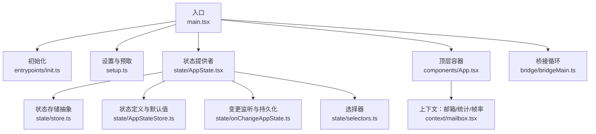
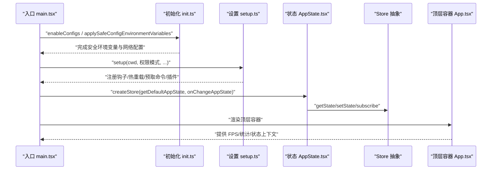
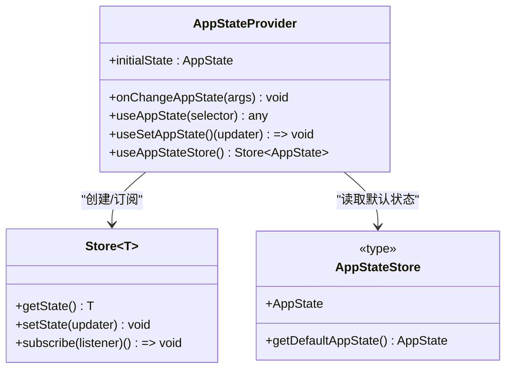
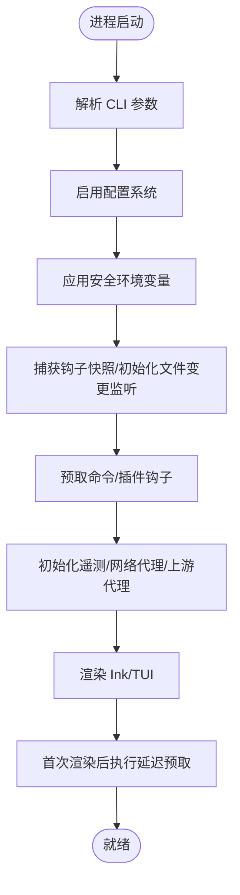
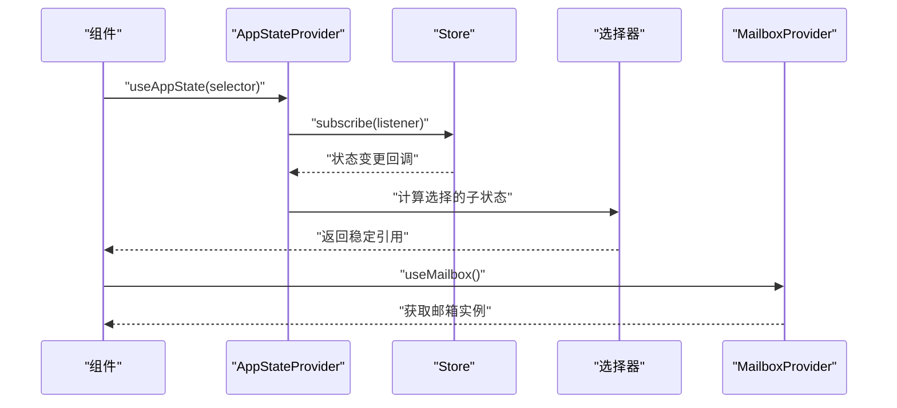
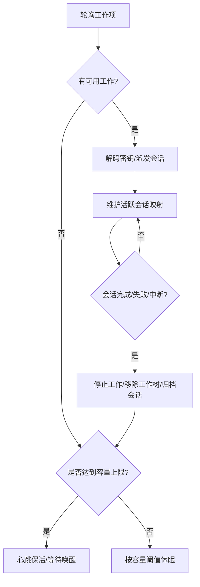
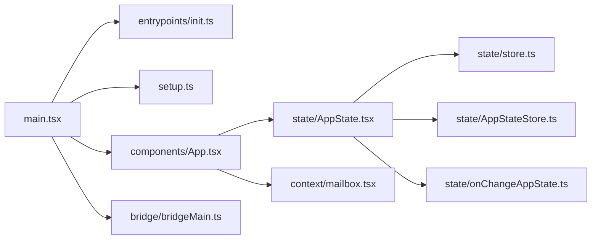

# 应用程序架构

<cite>
**本文引用的文件**
- [main.tsx](file://src/main.tsx)
- [AppStateStore.ts](file://src/state/AppStateStore.ts)
- [AppState.tsx](file://src/state/AppState.tsx)
- [store.ts](file://src/state/store.ts)
- [onChangeAppState.ts](file://src/state/onChangeAppState.ts)
- [selectors.ts](file://src/state/selectors.ts)
- [App.tsx](file://src/components/App.tsx)
- [state.ts](file://src/bootstrap/state.ts)
- [init.ts](file://src/entrypoints/init.ts)
- [setup.ts](file://src/setup.ts)
- [bridgeMain.ts](file://src/bridge/bridgeMain.ts)
- [mailbox.tsx](file://src/context/mailbox.tsx)
</cite>

## 目录
1. [引言](#引言)
2. [项目结构](#项目结构)
3. [核心组件](#核心组件)
4. [架构总览](#架构总览)
5. [详细组件分析](#详细组件分析)
6. [依赖关系分析](#依赖关系分析)
7. [性能考虑](#性能考虑)
8. [故障排查指南](#故障排查指南)
9. [结论](#结论)
10. [附录](#附录)

## 引言
本文件系统性阐述 Claude Code 的应用程序架构与实现细节，重点覆盖以下方面：
- 整体架构设计原则：模块化、组件分离、状态管理与事件驱动
- 启动流程：从入口 main.tsx 到各子系统的初始化与并行预取
- 状态管理：AppStateStore 的设计理念、状态树结构、响应式更新与持久化策略
- 组件通信：上下文与订阅模型、事件驱动与数据流
- 架构决策的技术考量、性能优化策略与可扩展性设计
- 通过图示与路径引用展示架构模式的实际应用

## 项目结构
Claude Code 采用“入口层 → 初始化层 → 状态层 → 组件层”的分层组织方式：
- 入口层：main.tsx 负责解析参数、建立信任、并行预取与渲染
- 初始化层：entrypoints/init.ts 在信任后初始化遥测与网络栈
- 状态层：state/AppStateStore.ts 定义全局状态树；AppState.tsx 提供 React 订阅与更新；store.ts 实现最小 Store 抽象
- 组件层：components/App.tsx 作为顶层容器，注入状态、统计与帧率上下文
- 桥接与通信：bridge/bridgeMain.ts 管理远程会话与工作项；context/mailbox.tsx 提供组件间消息通道

图表来源
- [main.tsx](file://src/main.tsx)
- [init.ts](file://src/entrypoints/init.ts)
- [setup.ts](file://src/setup.ts)
- [AppState.tsx](file://src/state/AppState.tsx)
- [store.ts](file://src/state/store.ts)
- [AppStateStore.ts](file://src/state/AppStateStore.ts)
- [onChangeAppState.ts](file://src/state/onChangeAppState.ts)
- [selectors.ts](file://src/state/selectors.ts)
- [App.tsx](file://src/components/App.tsx)
- [bridgeMain.ts](file://src/bridge/bridgeMain.ts)
- [mailbox.tsx](file://src/context/mailbox.tsx)

章节来源
- [main.tsx](file://src/main.tsx)
- [init.ts](file://src/entrypoints/init.ts)
- [setup.ts](file://src/setup.ts)
- [AppState.tsx](file://src/state/AppState.tsx)
- [store.ts](file://src/state/store.ts)
- [AppStateStore.ts](file://src/state/AppStateStore.ts)
- [onChangeAppState.ts](file://src/state/onChangeAppState.ts)
- [selectors.ts](file://src/state/selectors.ts)
- [App.tsx](file://src/components/App.tsx)
- [bridgeMain.ts](file://src/bridge/bridgeMain.ts)
- [mailbox.tsx](file://src/context/mailbox.tsx)

## 核心组件
- 全局状态树（AppState）：集中承载设置、任务、插件、MCP、通知、权限、思维与推测等状态
- 状态存储（Store）：最小订阅/发布抽象，支持 onChange 回调与批量订阅
- 状态提供者（AppStateProvider）：在 React 中暴露状态订阅与更新能力
- 变更监听（onChangeAppState）：将状态变更映射为外部元数据同步与配置持久化
- 顶层容器（App）：聚合 FPS、统计与状态上下文，作为交互会话的根组件
- 启动与设置（init、setup）：在信任后初始化遥测、网络代理、上游代理、LSP 等
- 桥接循环（bridgeMain）：管理远程环境、会话生命周期与心跳重连

章节来源
- [AppStateStore.ts](file://src/state/AppStateStore.ts)
- [store.ts](file://src/state/store.ts)
- [AppState.tsx](file://src/state/AppState.tsx)
- [onChangeAppState.ts](file://src/state/onChangeAppState.ts)
- [App.tsx](file://src/components/App.tsx)
- [init.ts](file://src/entrypoints/init.ts)
- [setup.ts](file://src/setup.ts)
- [bridgeMain.ts](file://src/bridge/bridgeMain.ts)

## 架构总览
本应用采用“单向数据流 + 响应式订阅 + 事件驱动”的混合架构：
- 单向数据流：状态仅通过 setState 更新，避免环状依赖
- 响应式订阅：React 使用 useSyncExternalStore 订阅 Store，按需重渲染
- 事件驱动：桥接循环、设置变更、权限模式切换等通过回调与信号触发
- 模块化与死码消除：通过 feature 标记与条件导入，按构建目标裁剪功能

图表来源
- [main.tsx](file://src/main.tsx)
- [init.ts](file://src/entrypoints/init.ts)
- [setup.ts](file://src/setup.ts)
- [AppState.tsx](file://src/state/AppState.tsx)
- [store.ts](file://src/state/store.ts)
- [App.tsx](file://src/components/App.tsx)

## 详细组件分析

### 状态管理：AppStateStore 与 AppStateProvider
- 设计理念
  - 将所有会话级状态收敛于 AppState，避免跨组件散落的状态碎片
  - 使用深度不可变类型（DeepImmutable）约束状态结构，降低意外修改风险
  - 通过 onChange 回调统一处理外部元数据同步与持久化
- 状态树结构
  - settings、tasks、plugins、mcp、notifications、inbox、workerSandboxPermissions、promptSuggestion、speculation、authVersion 等
  - 包含团队上下文、代理定义、文件历史、归属信息、技能改进建议等
- 响应式更新
  - AppStateProvider 内部使用 createStore，结合 useSyncExternalStore 订阅
  - 仅当选择器返回的对象被 Object.is 视为不同才触发重渲染
- 持久化策略
  - onChangeAppState 将关键字段（如 expandedView、verbose、tungstenPanelVisible）写入全局配置
  - settings 变更时清理认证相关缓存并重新应用环境变量

图表来源
- [store.ts](file://src/state/store.ts)
- [AppState.tsx](file://src/state/AppState.tsx)
- [AppStateStore.ts](file://src/state/AppStateStore.ts)

章节来源
- [AppStateStore.ts](file://src/state/AppStateStore.ts)
- [AppState.tsx](file://src/state/AppState.tsx)
- [store.ts](file://src/state/store.ts)
- [onChangeAppState.ts](file://src/state/onChangeAppState.ts)

### 启动流程：从 main.tsx 到各子系统
- 入口职责
  - 解析参数、建立信任、并行预取系统上下文、提示、插件与模型能力
  - 初始化 Analytics 门控、官方 MCP 地址预取、模型能力刷新
  - 设置 Deferred Prefetch（首次渲染后执行），避免阻塞首屏
- 初始化阶段（信任后）
  - entrypoints/init.ts：启用配置系统、应用安全环境变量、配置 mTLS/代理、预连接 API、初始化上游代理、注册清理函数
- 设置阶段
  - setup.ts：根据工作树/会话参数准备目录、注册钩子快照、预取命令与插件钩子、注册提交归属钩子、会话文件访问钩子、团队内存观察器、初始化 Sink 并记录 beacon 事件

图表来源
- [main.tsx](file://src/main.tsx)
- [init.ts](file://src/entrypoints/init.ts)
- [setup.ts](file://src/setup.ts)

章节来源
- [main.tsx](file://src/main.tsx)
- [init.ts](file://src/entrypoints/init.ts)
- [setup.ts](file://src/setup.ts)

### 组件通信：上下文与消息通道
- 上下文提供者
  - App.tsx 将 FPS、统计与状态上下文注入组件树
  - MailboxProvider 为组件提供轻量消息通道（邮箱），用于解耦组件间通信
- 订阅与选择器
  - AppState.tsx 提供 useAppState/useSetAppState/useAppStateStore，支持细粒度订阅与稳定引用
  - selectors.ts 提供纯函数选择器，避免在渲染中构造新对象导致重渲染

图表来源
- [App.tsx](file://src/components/App.tsx)
- [AppState.tsx](file://src/state/AppState.tsx)
- [store.ts](file://src/state/store.ts)
- [selectors.ts](file://src/state/selectors.ts)
- [mailbox.tsx](file://src/context/mailbox.tsx)

章节来源
- [App.tsx](file://src/components/App.tsx)
- [AppState.tsx](file://src/state/AppState.tsx)
- [store.ts](file://src/state/store.ts)
- [selectors.ts](file://src/state/selectors.ts)
- [mailbox.tsx](file://src/context/mailbox.tsx)

### 事件驱动与桥接：bridgeMain 循环
- 多会话/多工作项管理
  - 通过会话映射、工作项集合与兼容 ID 缓存，维持活跃会话与工作项生命周期
  - 心跳保活与错误回退：鉴权失败触发服务端重新派发；致命错误直接终止
- 容量与睡眠唤醒
  - 在容量饱和时进入心跳模式，周期性检查容量变化或唤醒信号
  - 通过容量唤醒（capacityWake）在会话结束时立即接受新工作
- 日志与可观测性
  - 结合日志器与事件上报，记录连接断开、重连、会话完成/失败等关键事件

图表来源
- [bridgeMain.ts](file://src/bridge/bridgeMain.ts)

章节来源
- [bridgeMain.ts](file://src/bridge/bridgeMain.ts)

## 依赖关系分析
- 入口依赖
  - main.tsx 依赖 init.ts、setup.ts、AppState.tsx、bridgeMain 等模块
- 状态层依赖
  - AppState.tsx 依赖 store.ts 与 AppStateStore.ts；onChangeAppState 依赖配置与会话状态
- 组件层依赖
  - App.tsx 依赖 AppState.tsx 与上下文提供者；mailbox.tsx 依赖 utils/mailbox
- 启动与桥接
  - init.ts 与 setup.ts 为 main.tsx 的前置步骤，bridgeMain.ts 与入口并行运行

图表来源
- [main.tsx](file://src/main.tsx)
- [init.ts](file://src/entrypoints/init.ts)
- [setup.ts](file://src/setup.ts)
- [App.tsx](file://src/components/App.tsx)
- [AppState.tsx](file://src/state/AppState.tsx)
- [store.ts](file://src/state/store.ts)
- [AppStateStore.ts](file://src/state/AppStateStore.ts)
- [onChangeAppState.ts](file://src/state/onChangeAppState.ts)
- [bridgeMain.ts](file://src/bridge/bridgeMain.ts)
- [mailbox.tsx](file://src/context/mailbox.tsx)

章节来源
- [main.tsx](file://src/main.tsx)
- [init.ts](file://src/entrypoints/init.ts)
- [setup.ts](file://src/setup.ts)
- [App.tsx](file://src/components/App.tsx)
- [AppState.tsx](file://src/state/AppState.tsx)
- [store.ts](file://src/state/store.ts)
- [AppStateStore.ts](file://src/state/AppStateStore.ts)
- [onChangeAppState.ts](file://src/state/onChangeAppState.ts)
- [bridgeMain.ts](file://src/bridge/bridgeMain.ts)
- [mailbox.tsx](file://src/context/mailbox.tsx)

## 性能考虑
- 启动性能
  - 并行预取：系统上下文、提示、MCP 官方地址、模型能力等在信任后异步执行
  - 首屏优化：setup.ts 中对 --bare 模式跳过部分预取，减少脚本化场景的额外开销
- 渲染性能
  - 使用 useSyncExternalStore 与选择器，避免不必要的重渲染
  - Store setState 对比前后状态，仅在变化时广播
- 运行时性能
  - 桥接循环的心跳模式在容量饱和时降低轮询频率，减少资源竞争
  - 容量唤醒机制在会话结束后快速接受新工作，提升吞吐

## 故障排查指南
- 配置错误
  - init.ts 在非交互模式下直接输出错误并优雅退出；在交互模式下弹出无效配置对话框
- 权限与信任
  - onChangeAppState 会在权限模式变化时同步外部元数据；settings 变更会清理认证缓存并重新应用环境变量
- 桥接问题
  - bridgeMain.ts 记录连接断开、重连、会话完成/失败事件；鉴权失败触发服务端重新派发

章节来源
- [init.ts](file://src/entrypoints/init.ts)
- [onChangeAppState.ts](file://src/state/onChangeAppState.ts)
- [bridgeMain.ts](file://src/bridge/bridgeMain.ts)

## 结论
本架构以“状态中心化 + 响应式订阅 + 事件驱动”为核心，结合模块化与死码消除，实现了高内聚、低耦合且可扩展的应用体系。入口层负责启动与并行预取，状态层提供稳定的单向数据流与细粒度订阅，组件层通过上下文与消息通道实现解耦通信，桥接层以心跳与容量管理保障远端会话的稳定性与吞吐。该设计在保证易用性的同时，兼顾了性能与可维护性。

## 附录
- 关键实现路径参考
  - 状态定义与默认值：[AppStateStore.ts](file://src/state/AppStateStore.ts)
  - 状态提供者与订阅：[AppState.tsx](file://src/state/AppState.tsx)
  - Store 抽象与订阅：[store.ts](file://src/state/store.ts)
  - 状态变更监听与持久化：[onChangeAppState.ts](file://src/state/onChangeAppState.ts)
  - 顶层容器与上下文：[App.tsx](file://src/components/App.tsx)
  - 启动与初始化：[main.tsx](file://src/main.tsx)、[init.ts](file://src/entrypoints/init.ts)
  - 设置与预取：[setup.ts](file://src/setup.ts)
  - 桥接循环与会话管理：[bridgeMain.ts](file://src/bridge/bridgeMain.ts)
  - 组件间消息通道：[mailbox.tsx](file://src/context/mailbox.tsx)