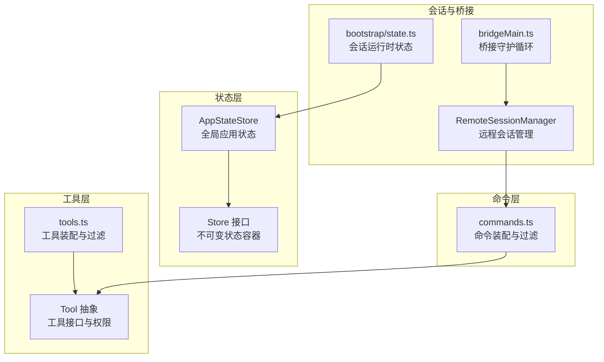
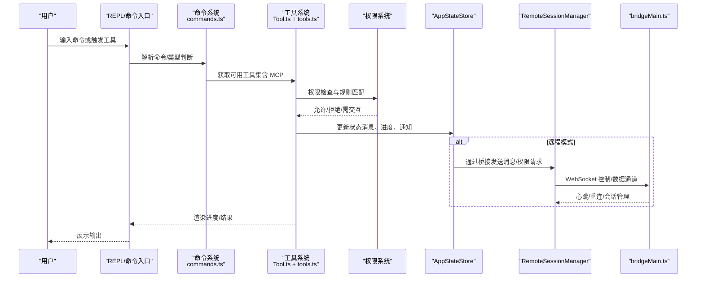
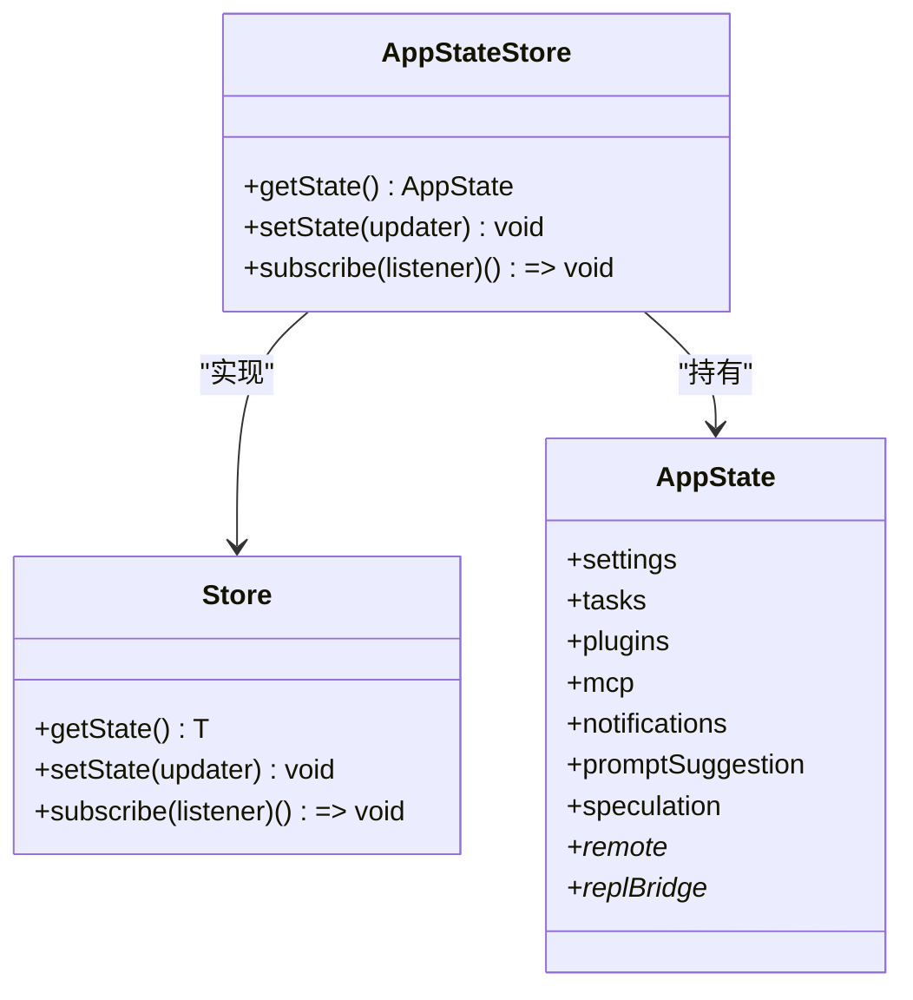
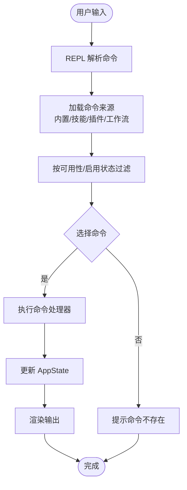
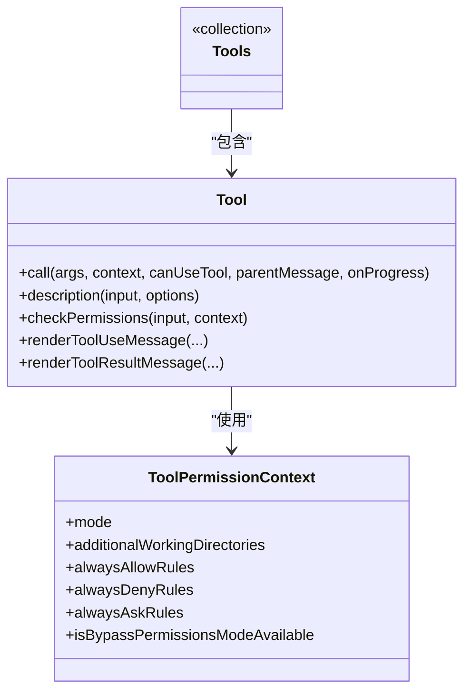
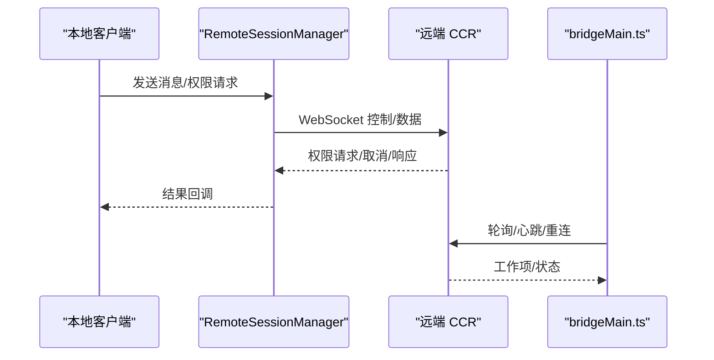
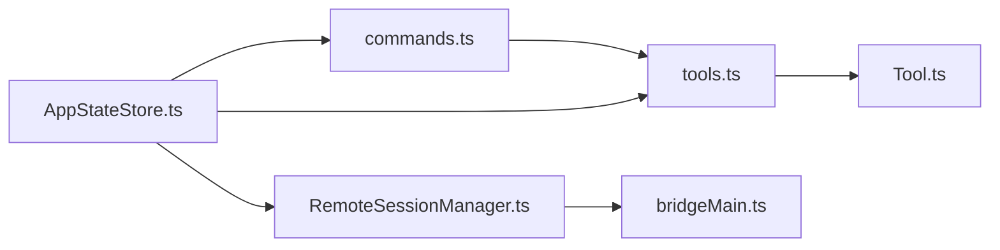

# 核心概念

<cite>
**本文引用的文件**
- [AppStateStore.ts](file://src/state/AppStateStore.ts)
- [AppState.tsx](file://src/state/AppState.tsx)
- [store.ts](file://src/state/store.ts)
- [Tool.ts](file://src/Tool.ts)
- [tools.ts](file://src/tools.ts)
- [commands.ts](file://src/commands.ts)
- [bootstrap/state.ts](file://src/bootstrap/state.ts)
- [RemoteSessionManager.ts](file://src/remote/RemoteSessionManager.ts)
- [bridgeMain.ts](file://src/bridge/bridgeMain.ts)
- [init.ts](file://src/commands/init.ts)
</cite>

## 目录
1. [引言](#引言)
2. [项目结构](#项目结构)
3. [核心组件](#核心组件)
4. [架构总览](#架构总览)
5. [详细组件分析](#详细组件分析)
6. [依赖关系分析](#依赖关系分析)
7. [性能考量](#性能考量)
8. [故障排查指南](#故障排查指南)
9. [结论](#结论)
10. [附录](#附录)

## 引言
本文件面向初学者与高级开发者，系统阐述 Claude Code 的核心概念与实现：状态管理模式（AppStateStore）、命令系统设计原理、工具系统架构；详解 AppStateStore 的职责与工作机制、状态持久化与同步策略；梳理命令系统从用户输入到工具执行的完整链路；阐释工具抽象基类的设计理念与权限控制；介绍会话管理（本地会话与远程会话）及其区别，并通过图示与路径引用帮助读者快速定位源码位置。

## 项目结构
- 状态层
  - 应用状态容器：AppStateStore 提供全局只读状态与变更接口，配合 React hooks 在 UI 中订阅渲染。
  - 基础 Store：通用不可变状态容器，支持订阅与 onChange 回调。
- 工具层
  - 工具抽象：Tool 定义统一的工具接口、权限检查、进度渲染、结果消息等能力。
  - 工具集合装配：tools.ts 负责按环境与权限过滤内置工具与 MCP 工具，形成最终可用工具池。
- 命令层
  - 命令定义与装配：commands.ts 组织所有命令来源（内置、技能、插件、工作流），并提供安全过滤与动态加载。
- 会话与桥接
  - 本地会话：bootstrap/state.ts 提供会话级运行时状态（如 sessionId、统计指标、交互时间等）。
  - 远程会话：RemoteSessionManager 管理与远端 CCR 的 WebSocket 通信、权限请求与消息转发。
  - 桥接守护：bridgeMain.ts 管理本地桥接进程、会话生命周期与心跳重连。

**图表来源**
- [AppStateStore.ts:89-452](file://src/state/AppStateStore.ts#L89-L452)
- [store.ts:4-8](file://src/state/store.ts#L4-L8)
- [Tool.ts:362-695](file://src/Tool.ts#L362-L695)
- [tools.ts:193-390](file://src/tools.ts#L193-L390)
- [commands.ts:258-517](file://src/commands.ts#L258-L517)
- [bootstrap/state.ts:45-257](file://src/bootstrap/state.ts#L45-L257)
- [RemoteSessionManager.ts:95-324](file://src/remote/RemoteSessionManager.ts#L95-L324)
- [bridgeMain.ts:141-800](file://src/bridge/bridgeMain.ts#L141-L800)

**章节来源**
- [AppStateStore.ts:89-452](file://src/state/AppStateStore.ts#L89-L452)
- [store.ts:4-8](file://src/state/store.ts#L4-L8)
- [Tool.ts:362-695](file://src/Tool.ts#L362-L695)
- [tools.ts:193-390](file://src/tools.ts#L193-L390)
- [commands.ts:258-517](file://src/commands.ts#L258-L517)
- [bootstrap/state.ts:45-257](file://src/bootstrap/state.ts#L45-L257)
- [RemoteSessionManager.ts:95-324](file://src/remote/RemoteSessionManager.ts#L95-L324)
- [bridgeMain.ts:141-800](file://src/bridge/bridgeMain.ts#L141-L800)

## 核心组件
- AppStateStore：定义应用全局状态结构与默认值，承载设置、任务、插件、通知、提示建议、权限上下文、MCP 工具与命令、遥测与会话钩子等。
- Store 接口：提供 getState、setState、subscribe 三件套，确保状态变更可订阅、可追踪。
- Tool 抽象：统一工具调用协议、输入输出模式、并发安全、权限检查、进度与结果渲染、搜索/只读/破坏性等语义标记。
- tools.ts：按权限上下文与 REPL 模式过滤内置工具，合并 MCP 工具，去重并保持提示缓存稳定排序。
- commands.ts：聚合内置/技能/插件/工作流命令，按可用性与启用状态筛选，提供远程/桥接安全命令白名单。
- bootstrap/state.ts：会话级运行时状态（sessionId、统计、交互时间、计划/钩子缓存、频道许可等）。
- RemoteSessionManager：远程会话的 WebSocket 管理、权限请求/取消/响应、消息转发、中断与重连。
- bridgeMain.ts：桥接守护循环，负责工作项轮询、会话生命周期、心跳、容量唤醒、令牌刷新与错误退避。

**章节来源**
- [AppStateStore.ts:89-452](file://src/state/AppStateStore.ts#L89-L452)
- [store.ts:4-8](file://src/state/store.ts#L4-L8)
- [Tool.ts:362-695](file://src/Tool.ts#L362-L695)
- [tools.ts:271-390](file://src/tools.ts#L271-L390)
- [commands.ts:476-517](file://src/commands.ts#L476-L517)
- [bootstrap/state.ts:45-257](file://src/bootstrap/state.ts#L45-L257)
- [RemoteSessionManager.ts:95-324](file://src/remote/RemoteSessionManager.ts#L95-L324)
- [bridgeMain.ts:141-800](file://src/bridge/bridgeMain.ts#L141-L800)

## 架构总览
下图展示了从用户输入到工具执行的关键链路，以及远程会话与桥接守护的协作方式。

**图表来源**
- [commands.ts:476-517](file://src/commands.ts#L476-L517)
- [tools.ts:271-390](file://src/tools.ts#L271-L390)
- [Tool.ts:500-503](file://src/Tool.ts#L500-L503)
- [AppStateStore.ts:89-452](file://src/state/AppStateStore.ts#L89-L452)
- [RemoteSessionManager.ts:95-324](file://src/remote/RemoteSessionManager.ts#L95-L324)
- [bridgeMain.ts:141-800](file://src/bridge/bridgeMain.ts#L141-L800)

## 详细组件分析

### 状态管理模式：AppStateStore 与 Store
- 设计要点
  - 不可变深拷贝：AppState 使用深度不可变包装，避免意外修改；部分字段（如任务状态）排除在不可变之外以容纳函数类型。
  - 默认状态：getDefaultAppState 提供初始值，包含设置、权限上下文、MCP/插件、通知、提示建议、遥测钩子等。
  - 订阅渲染：AppState.tsx 提供 useAppState/useSetAppState/useAppStateStore，基于 useSyncExternalStore 订阅 Store 变更，仅在选择的子树变化时重渲染。
  - onChange 回调：Store 在 setState 后触发 onChange，便于日志与调试。
- 状态持久化与同步
  - 本地持久化：AppStateStore 未直接暴露持久化逻辑；实际持久化通常由上层模块（如设置系统、会话历史）在 onChange 或特定事件中落盘。
  - 远程同步：远程会话通过 RemoteSessionManager 与桥接守护进行双向通信，状态变更通过消息与控制请求在本地与远端之间传播。
- 关键路径
  - 创建 Store：createStore(initialState, onChange)
  - 订阅渲染：useSyncExternalStore(store.subscribe, get, get)
  - 更新状态：store.setState(updater)

**图表来源**
- [store.ts:4-8](file://src/state/store.ts#L4-L8)
- [AppStateStore.ts:454-570](file://src/state/AppStateStore.ts#L454-L570)
- [AppState.tsx:142-179](file://src/state/AppState.tsx#L142-L179)

**章节来源**
- [AppStateStore.ts:89-452](file://src/state/AppStateStore.ts#L89-L452)
- [store.ts:4-8](file://src/state/store.ts#L4-L8)
- [AppState.tsx:142-179](file://src/state/AppState.tsx#L142-L179)

### 命令系统设计原理与执行链路
- 命令装配
  - 内置命令：commands.ts 聚合各目录命令，按可用性与启用状态筛选。
  - 技能/插件/工作流：动态加载技能目录、插件命令与工作流命令，去重后合并。
  - 过滤策略：按权限可用性（如 Claude AI 订阅者）、命令启用状态、动态技能插入位置等。
- 执行链路
  - 用户输入 → REPL 解析 → commands.ts 获取命令列表 → 选择命令 → 调用命令处理器（prompt/local/local-jsx）→ 更新 AppState → 渲染输出。
  - 远程/桥接安全：REMOTE_SAFE_COMMANDS 与 BRIDGE_SAFE_COMMANDS 白名单保障移动端/远程侧安全。
- 示例路径
  - 命令装配与筛选：[commands.ts:476-517](file://src/commands.ts#L476-L517)
  - 远程安全命令白名单：[commands.ts:619-676](file://src/commands.ts#L619-L676)

**图表来源**
- [commands.ts:476-517](file://src/commands.ts#L476-L517)

**章节来源**
- [commands.ts:258-517](file://src/commands.ts#L258-L517)

### 工具系统架构与权限控制
- 工具抽象
  - Tool 接口：统一 call/description/inputSchema/outputSchema/isConcurrencySafe/isReadOnly/isDestructive/checkPermissions 等方法。
  - 工具构建：buildTool 提供默认实现，确保工具最小可用接口一致。
- 工具装配
  - tools.ts 按权限上下文过滤内置工具，隐藏 REPL 专用工具，合并 MCP 工具并去重，保证提示缓存稳定性。
- 权限控制
  - ToolPermissionContext：包含权限模式、附加工作目录、允许/拒绝/询问规则、是否可绕过权限等。
  - 权限检查：Tool.checkPermissions 与通用权限系统协同，支持自动分类器输入、拒绝/允许行为与输入更新。
- 示例路径
  - 工具接口与构建：[Tool.ts:362-793](file://src/Tool.ts#L362-L793)
  - 工具装配与过滤：[tools.ts:271-390](file://src/tools.ts#L271-L390)
  - 权限上下文定义：[Tool.ts:123-148](file://src/Tool.ts#L123-L148)

**图表来源**
- [Tool.ts:362-695](file://src/Tool.ts#L362-L695)
- [Tool.ts:123-148](file://src/Tool.ts#L123-L148)
- [tools.ts:271-390](file://src/tools.ts#L271-L390)

**章节来源**
- [Tool.ts:362-793](file://src/Tool.ts#L362-L793)
- [tools.ts:271-390](file://src/tools.ts#L271-L390)

### 会话管理：本地会话与远程会话
- 本地会话
  - 会话标识：bootstrap/state.ts 维护 sessionId、parentSessionId、会话项目目录、交互时间、统计指标等。
  - 切换与再生：提供 switchSession/regenerateSessionId 等 API，确保计划 slug 缓存与项目目录一致性。
- 远程会话
  - RemoteSessionManager：管理 WebSocket 连接、控制请求（权限请求/取消/响应）、消息转发、中断与重连。
  - 桥接守护：bridgeMain.ts 负责轮询工作项、会话生命周期、心跳、令牌刷新与错误退避，维持多会话/容量场景下的稳定运行。
- 示例路径
  - 会话切换与再生：[bootstrap/state.ts:468-480](file://src/bootstrap/state.ts#L468-L480)
  - 远程会话管理：[RemoteSessionManager.ts:95-324](file://src/remote/RemoteSessionManager.ts#L95-L324)
  - 桥接守护循环：[bridgeMain.ts:141-800](file://src/bridge/bridgeMain.ts#L141-L800)

**图表来源**
- [RemoteSessionManager.ts:95-324](file://src/remote/RemoteSessionManager.ts#L95-L324)
- [bridgeMain.ts:141-800](file://src/bridge/bridgeMain.ts#L141-L800)

**章节来源**
- [bootstrap/state.ts:468-480](file://src/bootstrap/state.ts#L468-L480)
- [RemoteSessionManager.ts:95-324](file://src/remote/RemoteSessionManager.ts#L95-L324)
- [bridgeMain.ts:141-800](file://src/bridge/bridgeMain.ts#L141-L800)

### 命令系统与工具系统的结合：以 /init 为例
- 功能概述
  - /init 命令根据新旧模式生成引导内容，指导用户初始化 CLAUDE.md、个人偏好、技能与钩子。
  - 通过 AskUserQuestion 与子代理探索代码库，收集构建/测试/格式化等信息，再生成建议方案。
- 关键点
  - 新模式下，/init 支持“项目 CLAUDE.md + 个人 CLAUDE.local.md + 技能/钩子”的组合产出。
  - 与工具系统结合：使用工具（如 Bash、FileRead/Write、Skill）执行文件操作与技能调用。
- 示例路径
  - /init 命令定义与提示模板：[init.ts:226-257](file://src/commands/init.ts#L226-L257)

**章节来源**
- [init.ts:226-257](file://src/commands/init.ts#L226-L257)

## 依赖关系分析
- 组件耦合
  - AppStateStore 与 Store：低耦合，Store 作为基础设施被 AppStateStore 复用。
  - Tool 与 commands/tools：高内聚，工具装配与权限检查集中于 tools.ts 与 Tool 接口。
  - RemoteSessionManager 与 bridgeMain：协作关系，前者负责会话与权限，后者负责守护与轮询。
- 关键依赖链
  - commands.ts → tools.ts → Tool.ts
  - RemoteSessionManager → bridgeMain.ts（通过 WebSocket 与控制请求）
  - AppStateStore → commands/tools → Tool → AppState（状态更新）

**图表来源**
- [commands.ts:258-517](file://src/commands.ts#L258-L517)
- [tools.ts:271-390](file://src/tools.ts#L271-L390)
- [Tool.ts:362-695](file://src/Tool.ts#L362-L695)
- [AppStateStore.ts:89-452](file://src/state/AppStateStore.ts#L89-L452)
- [RemoteSessionManager.ts:95-324](file://src/remote/RemoteSessionManager.ts#L95-L324)
- [bridgeMain.ts:141-800](file://src/bridge/bridgeMain.ts#L141-L800)

**章节来源**
- [commands.ts:258-517](file://src/commands.ts#L258-L517)
- [tools.ts:271-390](file://src/tools.ts#L271-L390)
- [Tool.ts:362-695](file://src/Tool.ts#L362-L695)
- [AppStateStore.ts:89-452](file://src/state/AppStateStore.ts#L89-L452)
- [RemoteSessionManager.ts:95-324](file://src/remote/RemoteSessionManager.ts#L95-L324)
- [bridgeMain.ts:141-800](file://src/bridge/bridgeMain.ts#L141-L800)

## 性能考量
- 状态更新与渲染
  - 使用不可变状态与 Object.is 比较，避免不必要的重渲染；useSyncExternalStore 仅在选择子树变化时触发。
  - AppStateStore 将任务状态等函数类型排除在不可变之外，减少深拷贝成本。
- 工具装配与提示缓存
  - tools.ts 对工具集合进行稳定排序与去重，确保提示缓存命中率；REPL 模式下隐藏原语工具，避免重复加载。
- 远程会话与桥接
  - RemoteSessionManager 与 bridgeMain.ts 采用心跳与退避策略，降低网络抖动对性能的影响；多会话场景下通过容量唤醒与轮询节流提升吞吐。

[本节为通用指导，无需具体文件引用]

## 故障排查指南
- 命令不可用或找不到
  - 检查命令可用性与启用状态：[commands.ts:417-443](file://src/commands.ts#L417-L443)
  - 确认命令名称/别名匹配：[commands.ts:688-719](file://src/commands.ts#L688-L719)
- 工具权限被拒绝
  - 查看 ToolPermissionContext 与规则匹配：[Tool.ts:123-148](file://src/Tool.ts#L123-L148)
  - 确认工具 checkPermissions 返回的行为与 updatedInput：[Tool.ts:500-503](file://src/Tool.ts#L500-L503)
- 远程会话异常
  - 检查 RemoteSessionManager 的连接/重连/错误回调：[RemoteSessionManager.ts:108-141](file://src/remote/RemoteSessionManager.ts#L108-L141)
  - 查看 bridgeMain.ts 的轮询/心跳/令牌刷新配置：[bridgeMain.ts:141-800](file://src/bridge/bridgeMain.ts#L141-L800)
- 状态未更新或渲染不生效
  - 确认使用 useAppState/useSetAppState 正确订阅与更新：[AppState.tsx:142-179](file://src/state/AppState.tsx#L142-L179)
  - 检查 Store.setState 是否触发 onChange：[store.ts:20-27](file://src/state/store.ts#L20-L27)

**章节来源**
- [commands.ts:417-443](file://src/commands.ts#L417-L443)
- [commands.ts:688-719](file://src/commands.ts#L688-L719)
- [Tool.ts:123-148](file://src/Tool.ts#L123-L148)
- [Tool.ts:500-503](file://src/Tool.ts#L500-L503)
- [RemoteSessionManager.ts:108-141](file://src/remote/RemoteSessionManager.ts#L108-L141)
- [bridgeMain.ts:141-800](file://src/bridge/bridgeMain.ts#L141-L800)
- [AppState.tsx:142-179](file://src/state/AppState.tsx#L142-L179)
- [store.ts:20-27](file://src/state/store.ts#L20-L27)

## 结论
Claude Code 的核心围绕“状态—命令—工具—会话”四条主线展开：AppStateStore 提供统一的状态容器与订阅机制；commands.ts 与 tools.ts 实现命令与工具的装配与权限控制；Tool 抽象确保工具行为的一致性与可扩展性；RemoteSessionManager 与 bridgeMain.ts 则支撑远程会话与桥接守护的稳定运行。理解这些组件的职责边界与交互方式，有助于在复杂场景中进行定制与优化。

[本节为总结性内容，无需具体文件引用]

## 附录
- 示例路径索引
  - 状态容器与订阅：[store.ts:4-8](file://src/state/store.ts#L4-L8)、[AppState.tsx:142-179](file://src/state/AppState.tsx#L142-L179)
  - 应用状态结构：[AppStateStore.ts:89-452](file://src/state/AppStateStore.ts#L89-L452)
  - 工具接口与构建：[Tool.ts:362-793](file://src/Tool.ts#L362-L793)
  - 工具装配与过滤：[tools.ts:271-390](file://src/tools.ts#L271-L390)
  - 命令装配与安全过滤：[commands.ts:476-517](file://src/commands.ts#L476-L517)
  - 会话运行时状态：[bootstrap/state.ts:468-480](file://src/bootstrap/state.ts#L468-L480)
  - 远程会话管理：[RemoteSessionManager.ts:95-324](file://src/remote/RemoteSessionManager.ts#L95-L324)
  - 桥接守护循环：[bridgeMain.ts:141-800](file://src/bridge/bridgeMain.ts#L141-L800)
  - /init 命令示例：[init.ts:226-257](file://src/commands/init.ts#L226-L257)

[本节为补充索引，无需具体文件引用]