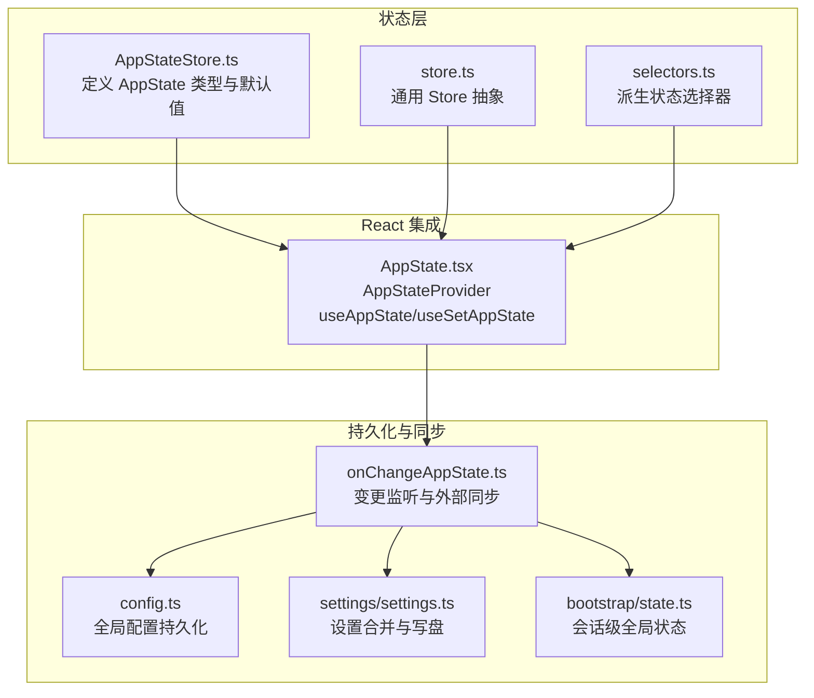
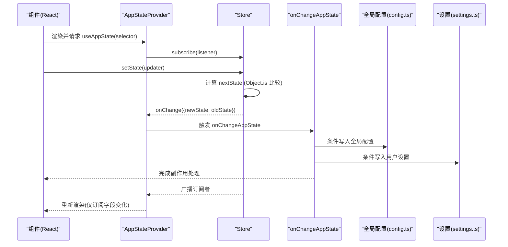
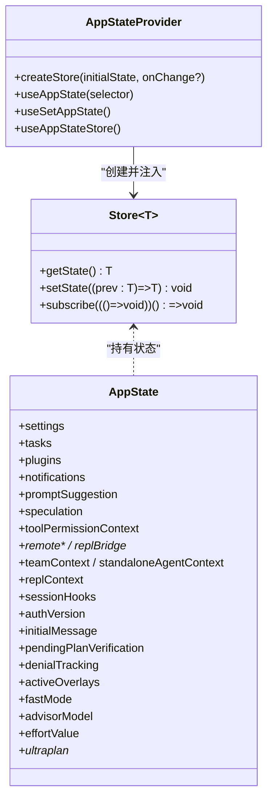
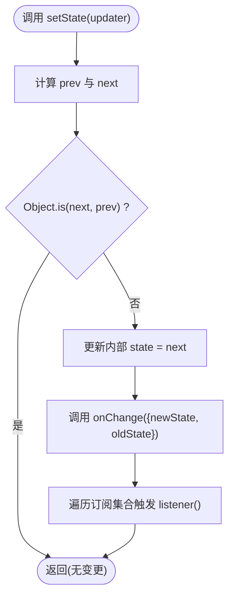
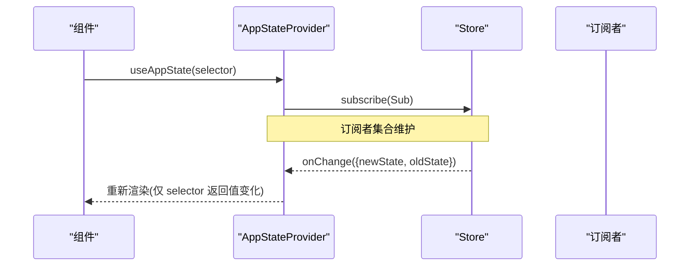
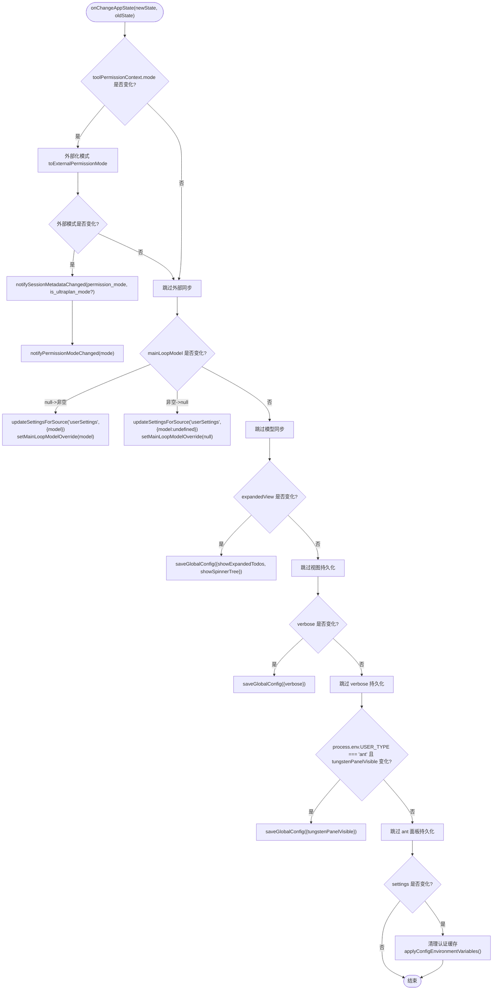
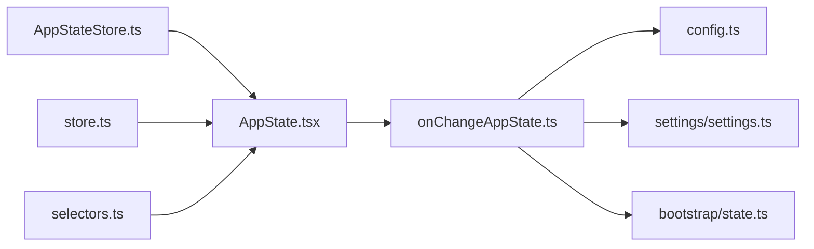

# 状态管理系统

<cite>
**本文引用的文件**
- [AppStateStore.ts](file://src/state/AppStateStore.ts)
- [AppState.tsx](file://src/state/AppState.tsx)
- [store.ts](file://src/state/store.ts)
- [selectors.ts](file://src/state/selectors.ts)
- [onChangeAppState.ts](file://src/state/onChangeAppState.ts)
- [config.ts](file://src/utils/config.ts)
- [settings.ts](file://src/utils/settings/settings.ts)
- [state.ts](file://src/bootstrap/state.ts)
</cite>

## 目录
1. [简介](#简介)
2. [项目结构](#项目结构)
3. [核心组件](#核心组件)
4. [架构总览](#架构总览)
5. [详细组件分析](#详细组件分析)
6. [依赖关系分析](#依赖关系分析)
7. [性能考量](#性能考量)
8. [故障排查指南](#故障排查指南)
9. [结论](#结论)
10. [附录](#附录)

## 简介
本文件系统性阐述 Claude Code 的状态管理系统，重点围绕 AppStateStore 的设计与实现，涵盖状态树结构、类型安全、响应式更新、持久化策略（本地存储与同步）、状态选择器模式、状态变更监听 onChangeAppState 的工作机制与使用场景，并给出最佳实践、性能优化与内存管理建议。文档既面向初学者解释状态管理的基本概念，也为高级开发者提供架构细节与扩展方法。

## 项目结构
状态管理相关的核心文件位于 src/state 目录，配合 src/utils 下的配置与设置模块共同完成持久化与同步：

- 状态定义与默认值：AppStateStore.ts
- React Provider 与 Hooks：AppState.tsx
- 轻量 Store 抽象：store.ts
- 状态选择器：selectors.ts
- 变更监听与外部同步：onChangeAppState.ts
- 全局配置持久化：utils/config.ts
- 设置合并与写入：utils/settings/settings.ts
- 会话级全局状态（非 UI 状态）：bootstrap/state.ts

图表来源
- [AppStateStore.ts:1-570](file://src/state/AppStateStore.ts#L1-L570)
- [store.ts:1-35](file://src/state/store.ts#L1-L35)
- [AppState.tsx:1-200](file://src/state/AppState.tsx#L1-L200)
- [onChangeAppState.ts:1-172](file://src/state/onChangeAppState.ts#L1-L172)
- [config.ts:1-200](file://src/utils/config.ts#L1-L200)
- [settings.ts:1-800](file://src/utils/settings/settings.ts#L1-L800)
- [state.ts:1-800](file://src/bootstrap/state.ts#L1-L800)

章节来源
- [AppStateStore.ts:1-570](file://src/state/AppStateStore.ts#L1-L570)
- [AppState.tsx:1-200](file://src/state/AppState.tsx#L1-L200)
- [store.ts:1-35](file://src/state/store.ts#L1-L35)
- [selectors.ts:1-77](file://src/state/selectors.ts#L1-L77)
- [onChangeAppState.ts:1-172](file://src/state/onChangeAppState.ts#L1-L172)
- [config.ts:1-200](file://src/utils/config.ts#L1-L200)
- [settings.ts:1-800](file://src/utils/settings/settings.ts#L1-L800)
- [state.ts:1-800](file://src/bootstrap/state.ts#L1-L800)

## 核心组件
- AppStateStore：定义完整的应用状态树 AppState，包含设置、任务、插件、通知、权限、提示词建议、推测状态等；提供 getDefaultAppState 初始化默认值。
- Store 抽象：提供 getState、setState、subscribe 三件套，支持 onChange 回调与订阅者广播。
- AppStateProvider 与 Hooks：在 React 中通过上下文注入 Store，提供 useAppState 选择器订阅、useSetAppState 获取更新器、useAppStateStore 直接获取 Store。
- onChangeAppState：集中处理状态变更带来的副作用，如同步到外部元数据、持久化配置、清理缓存、环境变量重载等。
- 持久化层：全局配置（config.ts）与用户设置（settings/settings.ts）分别负责 UI/行为偏好与功能开关的持久化；bootstrap/state.ts 提供会话级全局状态。

章节来源
- [AppStateStore.ts:89-452](file://src/state/AppStateStore.ts#L89-L452)
- [store.ts:4-8](file://src/state/store.ts#L4-L8)
- [AppState.tsx:27-124](file://src/state/AppState.tsx#L27-L124)
- [onChangeAppState.ts:43-171](file://src/state/onChangeAppState.ts#L43-L171)
- [config.ts:797-1055](file://src/utils/config.ts#L797-L1055)
- [settings.ts:416-524](file://src/utils/settings/settings.ts#L416-L524)
- [state.ts:45-257](file://src/bootstrap/state.ts#L45-L257)

## 架构总览
AppStateStore 作为状态树根节点，通过轻量 Store 抽象实现不可变式更新与订阅分发；React 层通过 useSyncExternalStore 将 Store 与组件渲染绑定，实现细粒度重渲染；onChangeAppState 在变更时触发跨模块同步与持久化；配置与设置模块分别处理 UI 行为偏好与功能开关的落盘与合并。

图表来源
- [AppState.tsx:142-162](file://src/state/AppState.tsx#L142-L162)
- [store.ts:20-27](file://src/state/store.ts#L20-L27)
- [onChangeAppState.ts:43-171](file://src/state/onChangeAppState.ts#L43-L171)
- [config.ts:797-1055](file://src/utils/config.ts#L797-L1055)
- [settings.ts:416-524](file://src/utils/settings/settings.ts#L416-L524)

## 详细组件分析

### AppStateStore 设计与状态树
- 类型安全：AppState 使用 DeepImmutable 包装，确保状态树不可变；部分包含函数类型的字段（如任务）排除在外，避免运行时错误。
- 状态树结构：涵盖设置、任务、插件、通知、权限、提示词建议、推测状态、桥接连接、团队上下文、REPL VM 上下文、技能改进、计划模式、远程会话等。
- 默认值：getDefaultAppState 基于运行时条件（如是否处于团队模式、计划模式）初始化 toolPermissionContext.mode 等关键字段。

图表来源
- [AppStateStore.ts:89-452](file://src/state/AppStateStore.ts#L89-L452)
- [store.ts:4-8](file://src/state/store.ts#L4-L8)
- [AppState.tsx:37-124](file://src/state/AppState.tsx#L37-L124)

章节来源
- [AppStateStore.ts:89-452](file://src/state/AppStateStore.ts#L89-L452)
- [AppStateStore.ts:456-569](file://src/state/AppStateStore.ts#L456-L569)
- [AppState.tsx:37-124](file://src/state/AppState.tsx#L37-L124)

### Store 抽象与响应式更新
- 不可变更新：setState 接受函数式更新器，先计算 next，再用 Object.is 判断是否变化，避免无意义重渲染。
- 订阅广播：每次状态变更后，遍历订阅集合触发回调，实现与 React 的 useSyncExternalStore 协作。
- onChange 回调：在创建 Store 时传入 onChange，用于集中处理副作用（如持久化、外部同步）。

图表来源
- [store.ts:20-32](file://src/state/store.ts#L20-L32)

章节来源
- [store.ts:10-34](file://src/state/store.ts#L10-L34)

### React 集成：AppStateProvider 与 Hooks
- AppStateProvider：创建 Store 实例，注入上下文；在挂载时处理“禁用 bypass 权限模式”等边界情况；注册 useSettingsChange 同步设置变更。
- useAppState：基于 useSyncExternalStore 订阅选择器结果，仅在被选中的子树变化时重渲染。
- useSetAppState：稳定引用的更新器，避免因闭包导致的不必要重渲染。
- useAppStateStore：直接暴露 Store，便于非 React 场景使用。

图表来源
- [AppState.tsx:142-179](file://src/state/AppState.tsx#L142-L179)
- [store.ts:29-32](file://src/state/store.ts#L29-L32)

章节来源
- [AppState.tsx:37-124](file://src/state/AppState.tsx#L37-L124)
- [AppState.tsx:142-179](file://src/state/AppState.tsx#L142-L179)

### 状态选择器模式
- 选择器纯函数：从 AppState 派生计算值，保持无副作用与可测试性。
- 典型选择器：
  - getViewedTeammateTask：根据 viewingAgentTaskId 与 tasks 获取当前查看的队友任务。
  - getActiveAgentForInput：根据视图状态与任务类型判断输入路由目标（leader/viewed/named_agent）。
- 使用建议：
  - 复杂字段多次访问时，拆分为多个选择器调用，避免重复计算。
  - 返回现有对象引用而非新建对象，防止 Object.is 总是不同导致的无效重渲染。

章节来源
- [selectors.ts:18-76](file://src/state/selectors.ts#L18-L76)

### 状态变更监听：onChangeAppState 工作原理与场景
onChangeAppState 是状态变更的“单点副作用入口”，典型职责包括：
- 权限模式同步：将 toolPermissionContext.mode 外部化后同步至外部元数据与 SDK 状态流，保证 CLI 与 Web UI 一致。
- 主循环模型同步：当 mainLoopModel 由 null 变为非空或反之，同步到设置并更新主循环覆盖。
- 视图偏好持久化：将 expandedView 映射为 showExpandedTodos/showSpinnerTree 写入全局配置。
- 详细日志级别持久化：verbose 字段变更时写入全局配置。
- Ant 专属面板可见性持久化：tungstenPanelVisible 变更时写入全局配置。
- 设置变更副作用：settings 变更时清理认证相关缓存并重载环境变量。

图表来源
- [onChangeAppState.ts:43-171](file://src/state/onChangeAppState.ts#L43-L171)

章节来源
- [onChangeAppState.ts:43-171](file://src/state/onChangeAppState.ts#L43-L171)

### 状态持久化策略
- 全局配置持久化（config.ts）
  - 写入策略：saveGlobalConfig 支持函数式更新，写入后采用 write-through 缓存，避免自身写入被误判为外部变更。
  - 一致性保障：提供 isProjectConfigKey 与 wouldLoseAuthState 等检测，防止写回丢失认证或引导状态。
  - 读取策略：优先内存缓存，后台新鲜度监视器感知外部变更。
- 用户设置持久化（settings/settings.ts）
  - 合并与写入：updateSettingsForSource 对指定来源进行深度合并，数组按约定替换，支持 undefined 删除键。
  - 文件落盘：使用原子写入与 flush，失败时保留原文件并记录错误。
  - 缓存失效：写入后重置会话缓存，确保后续读取到最新值。
- 会话级全局状态（bootstrap/state.ts）
  - 会话切换：switchSession 原子切换 sessionId 与项目目录，防止漂移。
  - 统计与指标：提供 turn/tool/classifier 持续时间与计数器，支持快照与预算跟踪。

章节来源
- [config.ts:797-1055](file://src/utils/config.ts#L797-L1055)
- [settings.ts:416-524](file://src/utils/settings/settings.ts#L416-L524)
- [state.ts:468-498](file://src/bootstrap/state.ts#L468-L498)

## 依赖关系分析
- AppStateStore.ts 依赖工具类型 DeepImmutable、设置初始化、思考与提示词建议开关、MCP/插件/任务/通知/权限等模块类型。
- AppState.tsx 依赖 store.ts 创建 Store，依赖 useSettingsChange 同步设置变更，依赖 VoiceProvider/MailboxProvider 等上下文。
- onChangeAppState.ts 依赖外部元数据同步、权限模式转换、配置与设置持久化、认证缓存清理、环境变量重载。
- config.ts 与 settings.ts 彼此独立但共同构成持久化层；state.ts 与之并行，服务于会话生命周期。

图表来源
- [AppStateStore.ts:1-570](file://src/state/AppStateStore.ts#L1-L570)
- [AppState.tsx:1-200](file://src/state/AppState.tsx#L1-L200)
- [store.ts:1-35](file://src/state/store.ts#L1-L35)
- [selectors.ts:1-77](file://src/state/selectors.ts#L1-L77)
- [onChangeAppState.ts:1-172](file://src/state/onChangeAppState.ts#L1-L172)
- [config.ts:1-200](file://src/utils/config.ts#L1-L200)
- [settings.ts:1-800](file://src/utils/settings/settings.ts#L1-L800)
- [state.ts:1-800](file://src/bootstrap/state.ts#L1-L800)

章节来源
- [AppStateStore.ts:1-570](file://src/state/AppStateStore.ts#L1-L570)
- [AppState.tsx:1-200](file://src/state/AppState.tsx#L1-L200)
- [store.ts:1-35](file://src/state/store.ts#L1-L35)
- [selectors.ts:1-77](file://src/state/selectors.ts#L1-L77)
- [onChangeAppState.ts:1-172](file://src/state/onChangeAppState.ts#L1-L172)
- [config.ts:1-200](file://src/utils/config.ts#L1-L200)
- [settings.ts:1-800](file://src/utils/settings/settings.ts#L1-L800)
- [state.ts:1-800](file://src/bootstrap/state.ts#L1-L800)

## 性能考量
- 选择器与订阅粒度
  - 使用多个简单选择器替代复杂组合，减少不必要的重渲染。
  - 避免在选择器中返回新对象，保持引用稳定。
- setState 函数式更新
  - 通过函数式更新器合并多处变更，减少中间态与重复渲染。
- 订阅去抖与批处理
  - 在高频交互场景下，利用 useSyncExternalStore 的订阅机制，避免逐次渲染。
- 持久化写入优化
  - saveGlobalConfig 采用 write-through 缓存，降低磁盘争用。
  - settings 更新使用原子写入与 flush，失败时保留原文件。
- 内存管理
  - 避免在 AppState 中存放大型只读数据；必要时使用引用或惰性加载。
  - 对包含函数类型的字段（如任务）排除在 DeepImmutable 之外，减少运行时开销。

## 故障排查指南
- 问题：设置变更未生效
  - 检查 settings/updateSettingsForSource 是否成功写入并重置缓存。
  - 确认 applyConfigEnvironmentVariables 是否被调用。
- 问题：权限模式在 CLI 与 Web UI 不一致
  - 检查 onChangeAppState 是否正确调用 notifySessionMetadataChanged 与 notifyPermissionModeChanged。
- 问题：全局配置写回丢失认证或引导状态
  - 检查 wouldLoseAuthState 检测逻辑，避免写回 DEFAULT_GLOBAL_CONFIG。
- 问题：频繁重渲染
  - 检查选择器是否返回新对象；确认订阅字段是否稳定。
  - 确认 Object.is 比较是否命中预期。

章节来源
- [onChangeAppState.ts:154-170](file://src/state/onChangeAppState.ts#L154-L170)
- [config.ts:783-795](file://src/utils/config.ts#L783-L795)
- [AppState.tsx:142-162](file://src/state/AppState.tsx#L142-L162)

## 结论
AppStateStore 通过类型安全的状态树、轻量 Store 抽象与 React 集成，构建了高性能、可维护的状态管理框架。onChangeAppState 将副作用集中化，结合 config 与 settings 的持久化策略，实现了跨模块的一致性与可靠性。遵循本文的最佳实践与性能建议，可在复杂场景中保持系统的稳定性与可扩展性。

## 附录
- 示例路径（不展示具体代码内容）
  - 状态选择器示例：[getViewedTeammateTask:18-40](file://src/state/selectors.ts#L18-L40)
  - 输入路由选择器：[getActiveAgentForInput:59-76](file://src/state/selectors.ts#L59-L76)
  - React 订阅示例：[useAppState:142-162](file://src/state/AppState.tsx#L142-L162)
  - 更新器示例：[useSetAppState:170-172](file://src/state/AppState.tsx#L170-L172)
  - 全局配置写入：[saveGlobalConfig:797-1055](file://src/utils/config.ts#L797-L1055)
  - 设置写入与合并：[updateSettingsForSource:416-524](file://src/utils/settings/settings.ts#L416-L524)
  - 会话切换与原子性：[switchSession:468-498](file://src/bootstrap/state.ts#L468-L498)