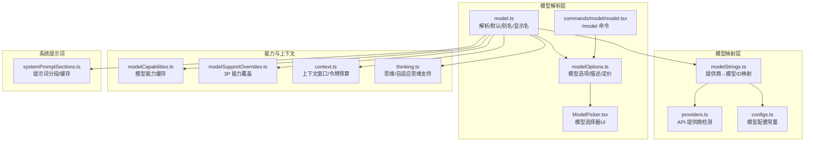
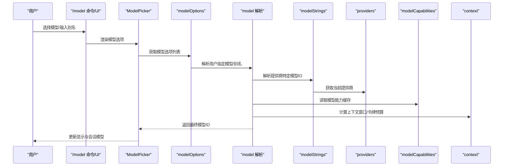
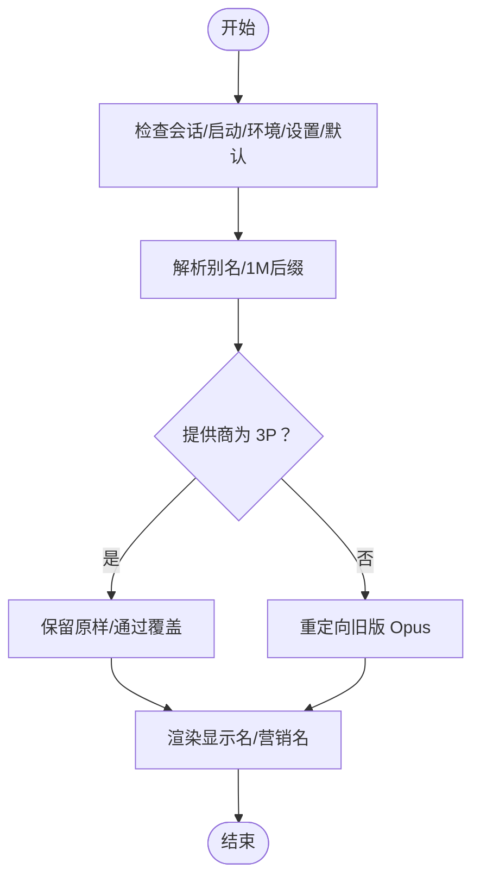
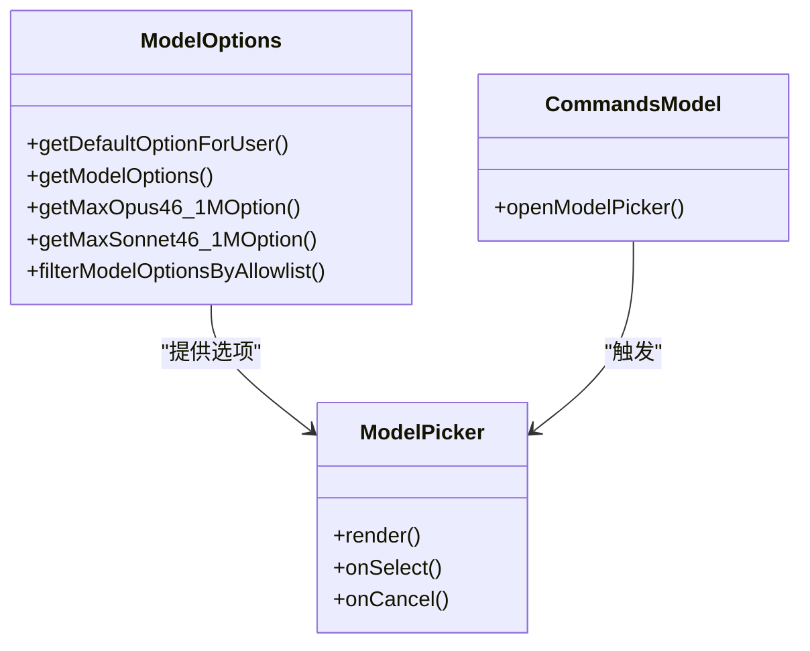
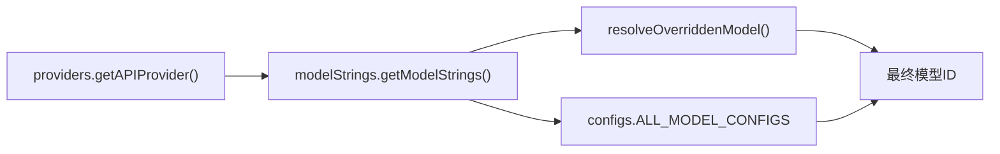
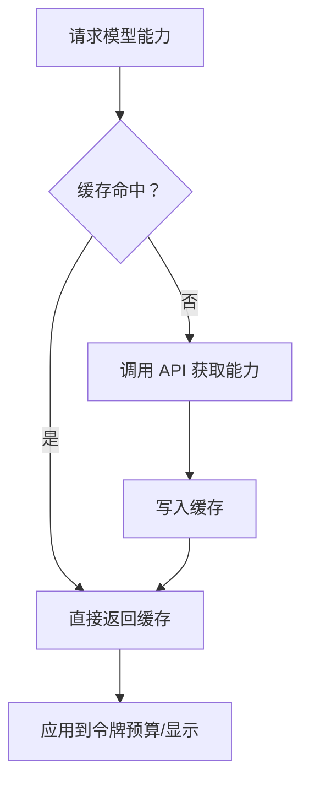
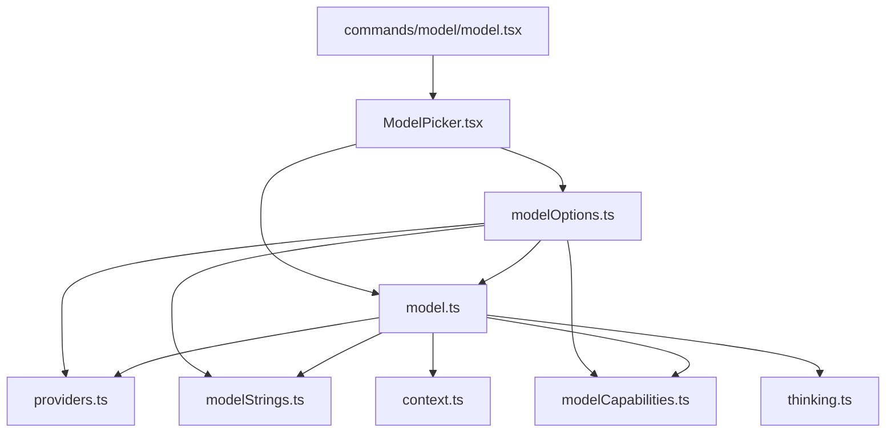

# 模型配置

<cite>
**本文引用的文件**
- [src/utils/model/model.ts](file://src/utils/model/model.ts)
- [src/utils/model/modelOptions.ts](file://src/utils/model/modelOptions.ts)
- [src/utils/model/configs.ts](file://src/utils/model/configs.ts)
- [src/utils/model/modelStrings.ts](file://src/utils/model/modelStrings.ts)
- [src/utils/model/providers.ts](file://src/utils/model/providers.ts)
- [src/utils/model/modelCapabilities.ts](file://src/utils/model/modelCapabilities.ts)
- [src/utils/model/modelSupportOverrides.ts](file://src/utils/model/modelSupportOverrides.ts)
- [src/utils/context.ts](file://src/utils/context.ts)
- [src/utils/thinking.ts](file://src/utils/thinking.ts)
- [src/constants/systemPromptSections.ts](file://src/constants/systemPromptSections.ts)
- [src/commands/model/model.tsx](file://src/commands/model/model.tsx)
- [src/components/ModelPicker.tsx](file://src/components/ModelPicker.tsx)
- [src/hooks/useMainLoopModel.ts](file://src/hooks/useMainLoopModel.ts)
- [src/cli/print.ts](file://src/cli/print.ts)
- [src/utils/config.ts](file://src/utils/config.ts)
</cite>

## 目录
1. [简介](#简介)
2. [项目结构](#项目结构)
3. [核心组件](#核心组件)
4. [架构总览](#架构总览)
5. [详细组件分析](#详细组件分析)
6. [依赖关系分析](#依赖关系分析)
7. [性能考量](#性能考量)
8. [故障排查指南](#故障排查指南)
9. [结论](#结论)
10. [附录](#附录)

## 简介
本文件面向 Claude Code 的模型配置与使用，系统性说明以下内容：
- 可用模型族谱与版本：Claude 3、Claude 3.5、Claude 3.7、Claude 4（含 Opus/Sonnet/Haiku）等
- 模型参数配置：温度、最大输出令牌数、top_p 等参数的作用与调优建议
- 系统提示词配置：系统提示词的结构、可定制部分与最佳实践
- 模型选择逻辑：基于用户角色、权限模式、上下文窗口与能力支持的自动选择策略
- 性能监控与切换机制：模型能力缓存、上下文窗口估算、快速模式与思维能力开关
- 配置变更对行为的影响：环境变量、设置覆盖、别名解析与 UI 展示
- 不同使用场景下的推荐方案：日常任务、长会话、复杂工程、计划模式等

## 项目结构
围绕模型配置的核心模块分布如下：
- 模型解析与默认值：model.ts
- 模型选项与 UI：modelOptions.ts、ModelPicker.tsx、commands/model/model.tsx
- 模型字符串映射与提供商：modelStrings.ts、providers.ts、configs.ts
- 能力探测与覆盖：modelCapabilities.ts、modelSupportOverrides.ts
- 上下文与令牌预算：context.ts、thinking.ts
- 系统提示词框架：constants/systemPromptSections.ts
- 全局配置与持久化：utils/config.ts

图表来源
- [src/utils/model/model.ts:1-619](file://src/utils/model/model.ts#L1-L619)
- [src/utils/model/modelOptions.ts:1-541](file://src/utils/model/modelOptions.ts#L1-L541)
- [src/components/ModelPicker.tsx:53-104](file://src/components/ModelPicker.tsx#L53-L104)
- [src/commands/model/model.tsx:95-149](file://src/commands/model/model.tsx#L95-L149)
- [src/utils/model/modelStrings.ts:1-167](file://src/utils/model/modelStrings.ts#L1-L167)
- [src/utils/model/providers.ts:1-41](file://src/utils/model/providers.ts#L1-L41)
- [src/utils/model/configs.ts:1-119](file://src/utils/model/configs.ts#L1-L119)
- [src/utils/model/modelCapabilities.ts:1-119](file://src/utils/model/modelCapabilities.ts#L1-L119)
- [src/utils/model/modelSupportOverrides.ts:1-51](file://src/utils/model/modelSupportOverrides.ts#L1-L51)
- [src/utils/context.ts:165-221](file://src/utils/context.ts#L165-L221)
- [src/utils/thinking.ts:88-144](file://src/utils/thinking.ts#L88-L144)
- [src/constants/systemPromptSections.ts:1-69](file://src/constants/systemPromptSections.ts#L1-L69)

章节来源
- [src/utils/model/model.ts:1-619](file://src/utils/model/model.ts#L1-L619)
- [src/utils/model/modelOptions.ts:1-541](file://src/utils/model/modelOptions.ts#L1-L541)
- [src/utils/model/modelStrings.ts:1-167](file://src/utils/model/modelStrings.ts#L1-L167)
- [src/utils/model/providers.ts:1-41](file://src/utils/model/providers.ts#L1-L41)
- [src/utils/model/configs.ts:1-119](file://src/utils/model/configs.ts#L1-L119)
- [src/utils/model/modelCapabilities.ts:1-119](file://src/utils/model/modelCapabilities.ts#L1-L119)
- [src/utils/model/modelSupportOverrides.ts:1-51](file://src/utils/model/modelSupportOverrides.ts#L1-L51)
- [src/utils/context.ts:165-221](file://src/utils/context.ts#L165-L221)
- [src/utils/thinking.ts:88-144](file://src/utils/thinking.ts#L88-L144)
- [src/constants/systemPromptSections.ts:1-69](file://src/constants/systemPromptSections.ts#L1-L69)
- [src/commands/model/model.tsx:95-149](file://src/commands/model/model.tsx#L95-L149)
- [src/components/ModelPicker.tsx:53-104](file://src/components/ModelPicker.tsx#L53-L104)
- [src/hooks/useMainLoopModel.ts:1-34](file://src/hooks/useMainLoopModel.ts#L1-L34)
- [src/cli/print.ts:1194-1220](file://src/cli/print.ts#L1194-L1220)
- [src/utils/config.ts:1-800](file://src/utils/config.ts#L1-L800)

## 核心组件
- 模型解析与默认值
  - 用户指定模型优先级：会话覆盖 > 启动覆盖 > 环境变量 > 设置 > 内置默认
  - 别名解析：opus/sonnet/haiku/best/opusplan 等别名到具体模型
  - 默认模型：Max/Team Premium 默认 Opus；其他用户默认 Sonnet；Ant 用户按配置
  - 显示名与营销名：渲染人类可读名称，支持 [1M] 上下文后缀
- 模型选项与 UI
  - 模型选项列表：按用户层级与提供商差异生成，支持 1M 上下文、快速模式标注、升级提示
  - 模型选择器：实时展示当前模型、支持快速模式切换、过滤可用模型
- 模型映射与提供商
  - 提供商检测：firstParty/bedrock/vertex/foundry
  - 模型字符串映射：根据提供商返回对应模型 ID，支持覆盖与 Bedrock 推理档解析
  - 模型配置常量：统一维护各模型在不同提供商下的 ID
- 能力与上下文
  - 模型能力缓存：从 API 获取并缓存 max_tokens 等能力信息
  - 令牌预算：按模型族与能力上限估算默认输出令牌数与思考令牌预算
  - 思维能力：支持/自适应思维能力检测，兼容 3P 覆盖
- 系统提示词
  - 分段式系统提示词：可缓存或每轮重新计算，支持清理与刷新

章节来源
- [src/utils/model/model.ts:49-208](file://src/utils/model/model.ts#L49-L208)
- [src/utils/model/modelOptions.ts:45-163](file://src/utils/model/modelOptions.ts#L45-L163)
- [src/utils/model/modelStrings.ts:136-167](file://src/utils/model/modelStrings.ts#L136-L167)
- [src/utils/model/providers.ts:6-18](file://src/utils/model/providers.ts#L6-L18)
- [src/utils/model/configs.ts:87-119](file://src/utils/model/configs.ts#L87-L119)
- [src/utils/model/modelCapabilities.ts:75-119](file://src/utils/model/modelCapabilities.ts#L75-L119)
- [src/utils/context.ts:165-221](file://src/utils/context.ts#L165-L221)
- [src/utils/thinking.ts:88-144](file://src/utils/thinking.ts#L88-L144)
- [src/constants/systemPromptSections.ts:43-69](file://src/constants/systemPromptSections.ts#L43-L69)

## 架构总览
模型配置的运行时流程如下：

图表来源
- [src/commands/model/model.tsx:95-149](file://src/commands/model/model.tsx#L95-L149)
- [src/components/ModelPicker.tsx:53-104](file://src/components/ModelPicker.tsx#L53-L104)
- [src/utils/model/modelOptions.ts:461-525](file://src/utils/model/modelOptions.ts#L461-L525)
- [src/utils/model/model.ts:445-506](file://src/utils/model/model.ts#L445-L506)
- [src/utils/model/modelStrings.ts:136-167](file://src/utils/model/modelStrings.ts#L136-L167)
- [src/utils/model/providers.ts:6-18](file://src/utils/model/providers.ts#L6-L18)
- [src/utils/model/modelCapabilities.ts:75-119](file://src/utils/model/modelCapabilities.ts#L75-L119)
- [src/utils/context.ts:165-221](file://src/utils/context.ts#L165-L221)

## 详细组件分析

### 组件一：模型解析与默认值（model.ts）
- 关键职责
  - 解析用户指定模型（含别名与 [1M] 后缀），并进行合法性检查
  - 生成默认主循环模型：按用户层级与提供商差异化默认值
  - 渲染显示名与营销名，支持 Ant 用户掩码显示
  - 运行时模型选择：结合权限模式与令牌占用情况动态调整
- 重要函数与路径
  - 用户指定模型解析：[parseUserSpecifiedModel:445-506](file://src/utils/model/model.ts#L445-L506)
  - 默认主循环模型：[getDefaultMainLoopModel:206-208](file://src/utils/model/model.ts#L206-L208)
  - 默认主循环模型设置（含 [1M] 合并）：[getDefaultMainLoopModelSetting:178-200](file://src/utils/model/model.ts#L178-L200)
  - 运行时主循环模型：[getRuntimeMainLoopModel:145-167](file://src/utils/model/model.ts#L145-L167)
  - 别名到具体模型映射：[parseUserSpecifiedModel:445-506](file://src/utils/model/model.ts#L445-L506)
  - 营销名与显示名：[getMarketingNameForModel:569-614](file://src/utils/model/model.ts#L569-L614)、[renderModelName:395-415](file://src/utils/model/model.ts#L395-L415)

图表来源
- [src/utils/model/model.ts:49-208](file://src/utils/model/model.ts#L49-L208)

章节来源
- [src/utils/model/model.ts:49-208](file://src/utils/model/model.ts#L49-L208)

### 组件二：模型选项与 UI（modelOptions.ts、ModelPicker.tsx、commands/model/model.tsx）
- 关键职责
  - 生成模型选项列表：按用户层级（Ant/Max/Team Premium/Pro/Team Standard/Enterprise/PAYG）与提供商差异生成
  - 支持快速模式标注、1M 上下文选项、自定义模型与升级提示
  - UI 交互：ModelPicker 展示当前模型、允许切换、合并自定义模型
  - 命令入口：/model 命令打开模型选择器
- 重要函数与路径
  - 默认选项与描述：[getDefaultOptionForUser:45-74](file://src/utils/model/modelOptions.ts#L45-L74)
  - 模型选项列表：[getModelOptions:461-525](file://src/utils/model/modelOptions.ts#L461-L525)
  - 1M 上下文选项：[getMaxOpus46_1MOption:229-236](file://src/utils/model/modelOptions.ts#L229-L236)、[getMaxSonnet46_1MOption:219-227](file://src/utils/model/modelOptions.ts#L219-L227)
  - 自定义模型注入：[filterModelOptionsByAllowlist:531-540](file://src/utils/model/modelOptions.ts#L531-L540)
  - UI 选择器：[ModelPicker:53-104](file://src/components/ModelPicker.tsx#L53-L104)
  - 命令入口：[/model 命令:95-149](file://src/commands/model/model.tsx#L95-L149)

图表来源
- [src/utils/model/modelOptions.ts:45-163](file://src/utils/model/modelOptions.ts#L45-L163)
- [src/components/ModelPicker.tsx:53-104](file://src/components/ModelPicker.tsx#L53-L104)
- [src/commands/model/model.tsx:95-149](file://src/commands/model/model.tsx#L95-L149)

章节来源
- [src/utils/model/modelOptions.ts:45-163](file://src/utils/model/modelOptions.ts#L45-L163)
- [src/components/ModelPicker.tsx:53-104](file://src/components/ModelPicker.tsx#L53-L104)
- [src/commands/model/model.tsx:95-149](file://src/commands/model/model.tsx#L95-L149)

### 组件三：模型映射与提供商（modelStrings.ts、providers.ts、configs.ts）
- 关键职责
  - 提供商检测：根据环境变量选择 firstParty/bedrock/vertex/foundry
  - 模型字符串映射：将统一的模型键映射到提供商特定 ID，支持覆盖与 Bedrock 推理档匹配
  - 模型配置常量：集中维护所有模型在各提供商下的 ID
- 重要函数与路径
  - 提供商检测：[getAPIProvider:6-14](file://src/utils/model/providers.ts#L6-L14)
  - 模型字符串映射：[getModelStrings:136-167](file://src/utils/model/modelStrings.ts#L136-L167)
  - 覆盖解析：[resolveOverriddenModel:84-100](file://src/utils/model/modelStrings.ts#L84-L100)
  - 配置常量：[ALL_MODEL_CONFIGS:87-119](file://src/utils/model/configs.ts#L87-L119)

图表来源
- [src/utils/model/providers.ts:6-18](file://src/utils/model/providers.ts#L6-L18)
- [src/utils/model/modelStrings.ts:136-167](file://src/utils/model/modelStrings.ts#L136-L167)
- [src/utils/model/configs.ts:87-119](file://src/utils/model/configs.ts#L87-L119)

章节来源
- [src/utils/model/providers.ts:6-18](file://src/utils/model/providers.ts#L6-L18)
- [src/utils/model/modelStrings.ts:136-167](file://src/utils/model/modelStrings.ts#L136-L167)
- [src/utils/model/configs.ts:87-119](file://src/utils/model/configs.ts#L87-L119)

### 组件四：能力与上下文（modelCapabilities.ts、modelSupportOverrides.ts、context.ts、thinking.ts）
- 关键职责
  - 能力缓存：从 API 获取模型能力并缓存，用于 max_tokens 等上限判断
  - 令牌预算：按模型族与能力上限估算默认输出令牌数与思考令牌预算
  - 思维能力：检测是否支持思维/自适应思维，3P 可通过环境变量覆盖
- 重要函数与路径
  - 能力缓存与刷新：[getModelCapability:75-83](file://src/utils/model/modelCapabilities.ts#L75-L83)、[refreshModelCapabilities:85-119](file://src/utils/model/modelCapabilities.ts#L85-L119)
  - 令牌预算：[getModelMaxOutputTokens:165-210](file://src/utils/context.ts#L165-L210)
  - 思维能力：[modelSupportsThinking:90-110](file://src/utils/thinking.ts#L90-L110)、[modelSupportsAdaptiveThinking:113-144](file://src/utils/thinking.ts#L113-L144)
  - 3P 能力覆盖：[get3PModelCapabilityOverride:30-50](file://src/utils/model/modelSupportOverrides.ts#L30-L50)

图表来源
- [src/utils/model/modelCapabilities.ts:75-119](file://src/utils/model/modelCapabilities.ts#L75-L119)
- [src/utils/context.ts:165-221](file://src/utils/context.ts#L165-L221)
- [src/utils/thinking.ts:88-144](file://src/utils/thinking.ts#L88-L144)
- [src/utils/model/modelSupportOverrides.ts:30-50](file://src/utils/model/modelSupportOverrides.ts#L30-L50)

章节来源
- [src/utils/model/modelCapabilities.ts:75-119](file://src/utils/model/modelCapabilities.ts#L75-L119)
- [src/utils/context.ts:165-221](file://src/utils/context.ts#L165-L221)
- [src/utils/thinking.ts:88-144](file://src/utils/thinking.ts#L88-L144)
- [src/utils/model/modelSupportOverrides.ts:30-50](file://src/utils/model/modelSupportOverrides.ts#L30-L50)

### 组件五：系统提示词（systemPromptSections.ts）
- 关键职责
  - 将系统提示词拆分为多个可缓存或每轮重新计算的“分段”
  - 提供统一的解析与清理接口，便于在 /clear 或 /compact 时重置
- 重要函数与路径
  - 分段注册与解析：[systemPromptSection:20-38](file://src/constants/systemPromptSections.ts#L20-L38)、[resolveSystemPromptSections:43-58](file://src/constants/systemPromptSections.ts#L43-L58)
  - 清理与刷新：[clearSystemPromptSections:65-69](file://src/constants/systemPromptSections.ts#L65-L69)

章节来源
- [src/constants/systemPromptSections.ts:1-69](file://src/constants/systemPromptSections.ts#L1-L69)

### 组件六：配置变更与 UI 响应（hooks/useMainLoopModel.ts、cli/print.ts、utils/config.ts）
- 关键职责
  - 响应配置变更：在 GrowthBook 初始化完成后强制重新解析模型别名
  - CLI 输出：打印模型选项及其支持的能力（思维/快速模式/自动模式）
  - 全局配置：持久化模型相关状态与通知
- 重要函数与路径
  - 主循环模型 Hook：[useMainLoopModel:13-34](file://src/hooks/useMainLoopModel.ts#L13-L34)
  - CLI 模型打印：[print 模型选项:1194-1220](file://src/cli/print.ts#L1194-L1220)
  - 全局配置结构：[GlobalConfig:183-578](file://src/utils/config.ts#L183-L578)

章节来源
- [src/hooks/useMainLoopModel.ts:13-34](file://src/hooks/useMainLoopModel.ts#L13-L34)
- [src/cli/print.ts:1194-1220](file://src/cli/print.ts#L1194-L1220)
- [src/utils/config.ts:183-578](file://src/utils/config.ts#L183-L578)

## 依赖关系分析
- 模块耦合
  - model.ts 依赖 providers、modelStrings、modelCapabilities、context、thinking 等
  - modelOptions.ts 依赖 model.ts、providers、modelStrings、modelCapabilities
  - ModelPicker.tsx 依赖 modelOptions.ts、model.ts
  - commands/model/model.tsx 依赖 ModelPicker.tsx 与 modelOptions.ts
- 外部依赖
  - API 提供商（firstParty/bedrock/vertex/foundry）
  - 模型能力缓存（本地文件缓存）
  - 环境变量与设置覆盖（ANETHPROPIC_*、availableModels）

图表来源
- [src/utils/model/model.ts:1-619](file://src/utils/model/model.ts#L1-L619)
- [src/utils/model/providers.ts:1-41](file://src/utils/model/providers.ts#L1-L41)
- [src/utils/model/modelStrings.ts:1-167](file://src/utils/model/modelStrings.ts#L1-L167)
- [src/utils/model/modelCapabilities.ts:1-119](file://src/utils/model/modelCapabilities.ts#L1-L119)
- [src/utils/context.ts:165-221](file://src/utils/context.ts#L165-L221)
- [src/utils/thinking.ts:88-144](file://src/utils/thinking.ts#L88-L144)
- [src/utils/model/modelOptions.ts:1-541](file://src/utils/model/modelOptions.ts#L1-L541)
- [src/components/ModelPicker.tsx:53-104](file://src/components/ModelPicker.tsx#L53-L104)
- [src/commands/model/model.tsx:95-149](file://src/commands/model/model.tsx#L95-L149)

章节来源
- [src/utils/model/model.ts:1-619](file://src/utils/model/model.ts#L1-L619)
- [src/utils/model/modelOptions.ts:1-541](file://src/utils/model/modelOptions.ts#L1-L541)
- [src/utils/model/modelStrings.ts:1-167](file://src/utils/model/modelStrings.ts#L1-L167)
- [src/utils/model/providers.ts:1-41](file://src/utils/model/providers.ts#L1-L41)
- [src/utils/model/modelCapabilities.ts:1-119](file://src/utils/model/modelCapabilities.ts#L1-L119)
- [src/utils/context.ts:165-221](file://src/utils/context.ts#L165-L221)
- [src/utils/thinking.ts:88-144](file://src/utils/thinking.ts#L88-L144)
- [src/components/ModelPicker.tsx:53-104](file://src/components/ModelPicker.tsx#L53-L104)
- [src/commands/model/model.tsx:95-149](file://src/commands/model/model.tsx#L95-L149)

## 性能考量
- 快速模式与成本
  - 快速模式在 Opus 4.6 上可能有额外计费标注，可通过 [getOpus46PricingSuffix:307-312](file://src/utils/model/model.ts#L307-L312) 获取
  - PAYG 3P 用户默认较新版本（如 Sonnet 4.5），以平衡可用性与成本
- 上下文窗口与令牌预算
  - 按模型族估算默认输出令牌数与上限，优先采用能力缓存中的 max_tokens
  - 思考令牌预算（已标记为废弃，新模型使用自适应思维）需小于输出令牌上限
- 思维能力
  - 自适应思维仅在部分 4+ 模型启用，3P 默认关闭，可通过环境变量覆盖
- UI 响应
  - GrowthBook 初始化完成后强制重新解析模型别名，避免 UI 与实际 API 使用不一致

章节来源
- [src/utils/model/model.ts:307-312](file://src/utils/model/model.ts#L307-L312)
- [src/utils/context.ts:165-221](file://src/utils/context.ts#L165-L221)
- [src/utils/thinking.ts:113-144](file://src/utils/thinking.ts#L113-L144)
- [src/hooks/useMainLoopModel.ts:13-34](file://src/hooks/useMainLoopModel.ts#L13-L34)

## 故障排查指南
- 模型不可用
  - 检查组织可用模型白名单：[filterModelOptionsByAllowlist:531-540](file://src/utils/model/modelOptions.ts#L531-L540)
  - 确认模型字符串是否被覆盖：[resolveOverriddenModel:84-100](file://src/utils/model/modelStrings.ts#L84-L100)
- 能力缓存异常
  - 手动刷新能力缓存：[refreshModelCapabilities:85-119](file://src/utils/model/modelCapabilities.ts#L85-L119)
  - 检查网络与隐私级别限制：[isEssentialTrafficOnly:87-88](file://src/utils/model/modelCapabilities.ts#L87-L88)
- 令牌预算不正确
  - 核对模型族与能力上限：[getModelMaxOutputTokens:165-210](file://src/utils/context.ts#L165-L210)
  - 确认 1M 合并开关与订阅状态：[isOpus1mMergeEnabled:314-332](file://src/utils/model/model.ts#L314-L332)
- 思维能力未生效
  - 检查提供商与模型是否支持：[modelSupportsThinking:90-110](file://src/utils/thinking.ts#L90-L110)
  - 3P 可通过环境变量覆盖：[get3PModelCapabilityOverride:30-50](file://src/utils/model/modelSupportOverrides.ts#L30-L50)

章节来源
- [src/utils/model/modelOptions.ts:531-540](file://src/utils/model/modelOptions.ts#L531-L540)
- [src/utils/model/modelStrings.ts:84-100](file://src/utils/model/modelStrings.ts#L84-L100)
- [src/utils/model/modelCapabilities.ts:85-119](file://src/utils/model/modelCapabilities.ts#L85-L119)
- [src/utils/context.ts:165-221](file://src/utils/context.ts#L165-L221)
- [src/utils/model/model.ts:314-332](file://src/utils/model/model.ts#L314-L332)
- [src/utils/thinking.ts:90-110](file://src/utils/thinking.ts#L90-L110)
- [src/utils/model/modelSupportOverrides.ts:30-50](file://src/utils/model/modelSupportOverrides.ts#L30-L50)

## 结论
本配置体系通过“解析—映射—能力—上下文—UI”的分层设计，实现了：
- 灵活的模型选择与别名解析
- 基于用户层级与提供商差异的默认策略
- 能力与上下文的动态适配
- 可观测、可覆盖、可切换的模型配置体验

在实际使用中，建议优先利用内置默认与模型选项，必要时通过环境变量与设置覆盖实现精细化控制。

## 附录

### 模型族谱与适用场景
- Opus 家族
  - 适合复杂工作负载与长上下文：[getDefaultOpusModel:105-116](file://src/utils/model/model.ts#L105-L116)
  - 支持 [1M] 上下文：[getMaxOpus46_1MOption:229-236](file://src/utils/model/modelOptions.ts#L229-L236)
- Sonnet 家族
  - 日常任务与通用编码：[getDefaultSonnetModel:119-128](file://src/utils/model/model.ts#L119-L128)
  - 支持 [1M] 上下文：[getMaxSonnet46_1MOption:219-227](file://src/utils/model/modelOptions.ts#L219-L227)
- Haiku 家族
  - 快速问答与低成本任务：[getDefaultHaikuModel:131-138](file://src/utils/model/model.ts#L131-L138)
- Claude 3/3.5/3.7
  - 3.7 Sonnet、3.5 Sonnet/Haiku 等：[CLAUDE_3_7_SONNET_CONFIG:9-14](file://src/utils/model/configs.ts#L9-L14)、[CLAUDE_3_5_V2_SONNET_CONFIG:16-21](file://src/utils/model/configs.ts#L16-L21)、[CLAUDE_3_5_HAIKU_CONFIG:23-28](file://src/utils/model/configs.ts#L23-L28)

章节来源
- [src/utils/model/model.ts:105-138](file://src/utils/model/model.ts#L105-L138)
- [src/utils/model/modelOptions.ts:219-236](file://src/utils/model/modelOptions.ts#L219-L236)
- [src/utils/model/configs.ts:9-28](file://src/utils/model/configs.ts#L9-L28)

### 模型参数配置与调优建议
- 温度（temperature）
  - 控制采样随机性；较低值更确定，较高值更具创造性
  - 建议：日常任务 0.3–0.5；创意/探索 0.6–0.8
- 最大输出令牌数（max_tokens）
  - 受模型能力上限与上下文窗口约束
  - 建议：长文档/代码生成使用 [1M] 上下文；短对话保持默认
- top_p
  - 核心采样；降低可提升稳定性
  - 建议：0.8–0.95 之间平衡多样性与稳定性

说明：上述参数为通用建议，具体数值请结合任务类型与输出质量反馈迭代。

### 系统提示词配置最佳实践
- 分段管理
  - 将系统提示词拆分为“角色设定”“任务目标”“约束条件”“输出格式”等分段
  - 对静态内容使用缓存，对动态内容使用每轮重新计算
- 缓存与清理
  - 在 /clear 或 /compact 时清理缓存，确保新会话获得最新提示词
- 可定制部分
  - 通过命令行或 UI 注入可变片段（如项目路径、语言偏好），减少硬编码

章节来源
- [src/constants/systemPromptSections.ts:43-69](file://src/constants/systemPromptSections.ts#L43-L69)

### 模型选择逻辑与自动切换
- 优先级
  - 会话覆盖 > 启动覆盖 > 环境变量 > 设置 > 内置默认
- 运行时调整
  - 计划模式与权限模式影响默认模型选择
  - 超过 20 万令牌时自动降级或切换模型
- UI 响应
  - GrowthBook 初始化完成后强制刷新，保证别名解析与 UI 一致

章节来源
- [src/utils/model/model.ts:49-208](file://src/utils/model/model.ts#L49-L208)
- [src/hooks/useMainLoopModel.ts:13-34](file://src/hooks/useMainLoopModel.ts#L13-L34)

### 不同使用场景下的推荐方案
- 日常任务
  - Sonnet 4.6（默认）；需要长上下文时开启 [1M]
- 复杂工程/长文档
  - Opus 4.6（Max/Team Premium）或 Sonnet 4.6（1M）
- 快速问答/低成本
  - Haiku 4.5
- 计划模式
  - opusplan：计划模式下使用 Opus 4.6，否则使用 Sonnet 4.6
- 3P 提供商
  - 默认较新版本（如 Sonnet 4.5），可按需切换至 Opus 4.6/1M

章节来源
- [src/utils/model/model.ts:145-167](file://src/utils/model/model.ts#L145-L167)
- [src/utils/model/modelOptions.ts:261-267](file://src/utils/model/modelOptions.ts#L261-L267)