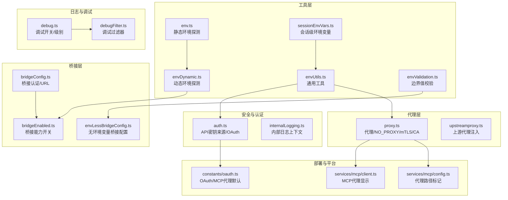
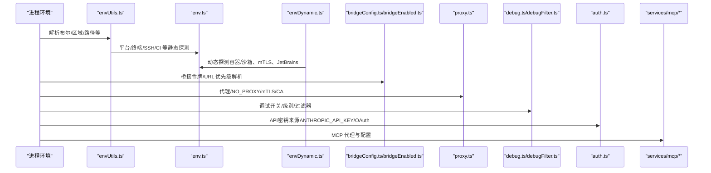
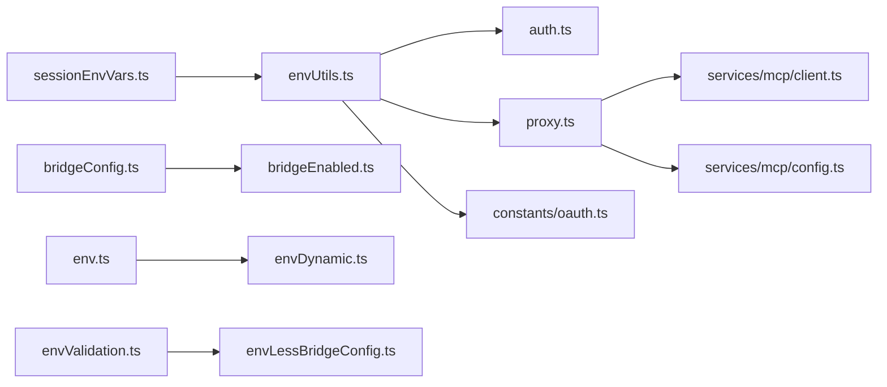
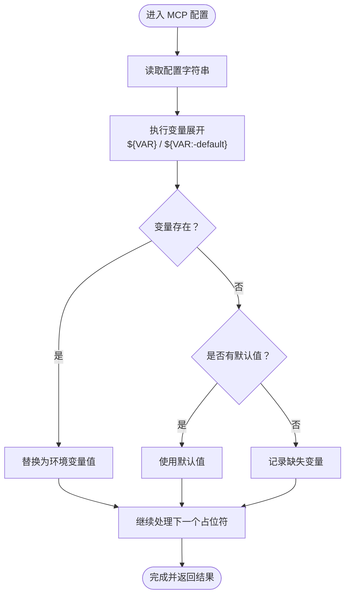

# 环境变量配置

<cite>
**本文引用的文件**
- [src/utils/env.ts](file://src/utils/env.ts)
- [src/utils/envDynamic.ts](file://src/utils/envDynamic.ts)
- [src/utils/envUtils.ts](file://src/utils/envUtils.ts)
- [src/utils/envValidation.ts](file://src/utils/envValidation.ts)
- [src/utils/envLessBridgeConfig.ts](file://src/utils/envLessBridgeConfig.ts)
- [src/services/mcp/envExpansion.ts](file://src/services/mcp/envExpansion.ts)
- [src/utils/sessionEnvVars.ts](file://src/utils/sessionEnvVars.ts)
- [src/QueryEngine.ts](file://src/QueryEngine.ts)
- [src/bridge/bridgeConfig.ts](file://src/bridge/bridgeConfig.ts)
- [src/bridge/bridgeEnabled.ts](file://src/bridge/bridgeEnabled.ts)
- [src/utils/proxy.ts](file://src/utils/proxy.ts)
- [src/upstreamproxy/upstreamproxy.ts](file://src/upstreamproxy/upstreamproxy.ts)
- [src/utils/debug.ts](file://src/utils/debug.ts)
- [src/utils/debugFilter.ts](file://src/utils/debugFilter.ts)
- [src/services/internalLogging.ts](file://src/services/internalLogging.ts)
- [src/utils/auth.ts](file://src/utils/auth.ts)
- [src/services/api/client.ts](file://src/services/api/client.ts)
- [src/services/api/errors.ts](file://src/services/api/errors.ts)
- [src/constants/oauth.ts](file://src/constants/oauth.ts)
- [src/services/mcp/client.ts](file://src/services/mcp/client.ts)
- [src/services/mcp/config.ts](file://src/services/mcp/config.ts)
- [src/cli/remoteIO.ts](file://src/cli/remoteIO.ts)
- [src/commands/remote-setup/api.ts](file://src/commands/remote-setup/api.ts)
- [src/commands/review/reviewRemote.ts](file://src/commands/review/reviewRemote.ts)
- [src/context.ts](file://src/context.ts)
- [src/hooks/useDynamicConfig.ts](file://src/hooks/useDynamicConfig.ts)
- [src/hooks/useNotifyAfterTimeout.ts](file://src/hooks/useNotifyAfterTimeout.ts)
- [src/ink/reconciler.ts](file://src/ink/reconciler.ts)
- [src/services/analytics/config.ts](file://src/services/analytics/config.ts)
- [src/services/analytics/datadog.ts](file://src/services/analytics/datadog.ts)
</cite>

## 目录
1. [简介](#简介)
2. [项目结构](#项目结构)
3. [核心组件](#核心组件)
4. [架构总览](#架构总览)
5. [详细组件分析](#详细组件分析)
6. [依赖关系分析](#依赖关系分析)
7. [性能考量](#性能考量)
8. [故障排查指南](#故障排查指南)
9. [结论](#结论)
10. [附录](#附录)

## 简介
本文件系统性梳理 Claude Code 的环境变量配置体系，覆盖以下方面：
- 支持的环境变量清单（API 密钥、代理、日志、桥接、部署平台、MCP、调试等）
- 变量优先级与作用范围（进程级、会话级、运行时动态检测）
- 与配置文件的协同方式（CLI 参数、设置文件、OAuth 配置）
- 安全相关配置（API 密钥来源、访问控制、沙箱与容器内限制）
- 开发与调试相关配置（调试开关、日志级别、过滤器）
- 部署环境特殊配置（生产、测试、CI、云平台、容器/沙箱）
- 验证机制与错误处理（边界值校验、缺失变量报告）
- 不同部署场景的最佳实践与示例

## 项目结构
围绕环境变量的关键模块分布如下：
- 工具层：环境探测、动态检测、解析与校验
- 桥接层：桥接认证与 URL 解析、桥接能力开关
- 代理层：HTTP(S)/WS 代理、NO_PROXY、mTLS、CA 证书
- 日志与调试：调试开关、日志级别、调试过滤器
- 安全与认证：API 密钥来源、OAuth、受限命名空间
- 部署与平台：部署环境识别、主机平台覆盖、CI/CD 平台识别
- MCP 与会话：MCP 配置中的变量展开、会话级环境变量

**图表来源**
- [src/utils/env.ts:316-333](file://src/utils/env.ts#L316-L333)
- [src/utils/envDynamic.ts:142-151](file://src/utils/envDynamic.ts#L142-L151)
- [src/utils/envUtils.ts:1-184](file://src/utils/envUtils.ts#L1-L184)
- [src/utils/envValidation.ts:1-39](file://src/utils/envValidation.ts#L1-L39)
- [src/utils/sessionEnvVars.ts:1-22](file://src/utils/sessionEnvVars.ts#L1-L22)
- [src/bridge/bridgeConfig.ts:1-49](file://src/bridge/bridgeConfig.ts#L1-L49)
- [src/bridge/bridgeEnabled.ts:1-203](file://src/bridge/bridgeEnabled.ts#L1-L203)
- [src/utils/proxy.ts:77-377](file://src/utils/proxy.ts#L77-L377)
- [src/upstreamproxy/upstreamproxy.ts:1-218](file://src/upstreamproxy/upstreamproxy.ts#L1-L218)
- [src/utils/debug.ts:42-83](file://src/utils/debug.ts#L42-L83)
- [src/utils/debugFilter.ts:1-157](file://src/utils/debugFilter.ts#L1-L157)
- [src/utils/auth.ts:250-290](file://src/utils/auth.ts#L250-L290)
- [src/services/mcp/client.ts:794-796](file://src/services/mcp/client.ts#L794-L796)
- [src/services/mcp/config.ts:170-182](file://src/services/mcp/config.ts#L170-L182)
- [src/constants/oauth.ts:78-171](file://src/constants/oauth.ts#L78-L171)

**章节来源**
- [src/utils/env.ts:316-333](file://src/utils/env.ts#L316-L333)
- [src/utils/envDynamic.ts:142-151](file://src/utils/envDynamic.ts#L142-L151)
- [src/utils/envUtils.ts:1-184](file://src/utils/envUtils.ts#L1-L184)

## 核心组件
- 环境探测与平台识别：提供静态与动态环境信息，包括终端类型、平台、SSH、容器/沙箱、CI/CD 平台、部署环境等。
- 通用工具：布尔值解析、AWS/Vertex 区域获取、工作目录维护策略、受保护命名空间判断、模型区域覆盖等。
- 边界值校验：对带上限的数值型环境变量进行解析、校验与裁剪，并记录调试日志。
- 会话级环境变量：在 REPL/子进程环境中注入的临时变量，不污染主进程。
- 桥接配置与能力：桥接认证令牌与基础 URL 的优先解析、桥接能力开关、无环境变量桥接配置。
- 代理与网络：全局代理、NO_PROXY 规则、mTLS、CA 证书、WebSocket 代理、上游代理注入。
- 调试与日志：调试开关、日志级别、调试消息过滤。
- 安全与认证：API 密钥来源（直接环境变量、OAuth）、受限命名空间、内部日志上下文。

**章节来源**
- [src/utils/env.ts:240-305](file://src/utils/env.ts#L240-L305)
- [src/utils/envUtils.ts:32-184](file://src/utils/envUtils.ts#L32-L184)
- [src/utils/envValidation.ts:9-38](file://src/utils/envValidation.ts#L9-L38)
- [src/utils/sessionEnvVars.ts:1-22](file://src/utils/sessionEnvVars.ts#L1-L22)
- [src/bridge/bridgeConfig.ts:17-48](file://src/bridge/bridgeConfig.ts#L17-L48)
- [src/bridge/bridgeEnabled.ts:28-130](file://src/bridge/bridgeEnabled.ts#L28-L130)
- [src/utils/proxy.ts:77-377](file://src/utils/proxy.ts#L77-L377)
- [src/utils/debug.ts:42-83](file://src/utils/debug.ts#L42-L83)
- [src/utils/debugFilter.ts:1-157](file://src/utils/debugFilter.ts#L1-L157)
- [src/utils/auth.ts:250-290](file://src/utils/auth.ts#L250-L290)
- [src/services/internalLogging.ts:68-90](file://src/services/internalLogging.ts#L68-L90)

## 架构总览
下图展示环境变量在系统中的关键交互路径：从进程环境到工具层解析，再到桥接、代理、调试、安全与部署识别的分层调用。

**图表来源**
- [src/utils/envUtils.ts:32-184](file://src/utils/envUtils.ts#L32-L184)
- [src/utils/env.ts:240-333](file://src/utils/env.ts#L240-L333)
- [src/utils/envDynamic.ts:11-151](file://src/utils/envDynamic.ts#L11-L151)
- [src/bridge/bridgeConfig.ts:17-48](file://src/bridge/bridgeConfig.ts#L17-L48)
- [src/bridge/bridgeEnabled.ts:28-130](file://src/bridge/bridgeEnabled.ts#L28-L130)
- [src/utils/proxy.ts:77-377](file://src/utils/proxy.ts#L77-L377)
- [src/utils/debug.ts:42-83](file://src/utils/debug.ts#L42-L83)
- [src/utils/debugFilter.ts:1-157](file://src/utils/debugFilter.ts#L1-L157)
- [src/utils/auth.ts:250-290](file://src/utils/auth.ts#L250-L290)
- [src/services/mcp/client.ts:794-796](file://src/services/mcp/client.ts#L794-L796)

## 详细组件分析

### 环境变量清单与作用范围
- API 密钥与认证
  - ANTHROPIC_API_KEY：直接 API 访问所需；在特定环境下会被覆盖或禁用。
  - CLAUDE_CODE_OAUTH_TOKEN / CLAUDE_CODE_OAUTH_TOKEN_FILE_DESCRIPTOR：OAuth 令牌来源。
  - CLAUDE_BRIDGE_OAUTH_TOKEN / CLAUDE_BRIDGE_BASE_URL：桥接开发覆盖（仅 ant 用户）。
  - CI/NODE_ENV/test：在 CI 或测试环境强制要求通过文件描述符或 OAuth 提供密钥。
- 代理与网络
  - HTTP_PROXY / HTTPS_PROXY / NO_PROXY / no_proxy：标准代理与绕过规则。
  - CLAUDE_CODE_PROXY_RESOLVES_HOSTS：在代理环境下跳过本地 DNS。
  - CCR_UPSTREAM_PROXY_ENABLED：启用上游代理并注入 CA 证书与代理环境变量。
  - MCP_PROXY_URL / MCP_PROXY_PATH：MCP 代理服务地址与路径模板。
- 日志与调试
  - DEBUG / DEBUG_SDK：开启调试模式。
  - CLAUDE_CODE_DEBUG_LOG_LEVEL：日志级别（结合工具层逻辑）。
  - CLAUDE_CODE_DEBUG_REPAINTS：渲染调试开关。
  - --debug=pattern：命令行调试过滤器。
- 桥接与远程控制
  - CLAUDE_CODE_CCR_MIRROR：镜像模式开关。
  - CLAUDE_CODE_ENVIRONMENT_KIND / CLAUDE_CODE_ENVIRONMENT_RUNNER_VERSION：环境类型与版本标识。
  - tengu_ccr_bridge / tengu_bridge_repl_v2：功能门控与 v2 桥接开关。
- 部署与平台
  - NODE_ENV：开发/生产/测试区分。
  - CI / GITHUB_ACTIONS / GITLAB_CI / CIRCLECI / BUILDKITE 等：CI/CD 平台识别。
  - CODESPACES / GITPOD / REPLIT / GLITCH / VERCEL / RAILWAY / RENDER / NETLIFY / HEROKU / FLY / CF_PAGES / DENO_DEPLOY / AWS_* / GCP_* / AZURE_* / DIGITALOCEAN_APP_PLATFORM / HUGGINGFACE_SPACES：云平台与容器编排识别。
  - CLAUDE_CODE_HOST_PLATFORM：覆盖主机平台用于分析上报。
- 会话与运行时
  - /env 设置的会话级环境变量（仅影响子进程，不影响 REPL 进程本身）。
  - CLAUDE_CODE_EAGER_FLUSH / CLAUDE_CODE_IS_COWORK：查询引擎行为控制。
  - CLAUDE_BASH_MAINTAIN_PROJECT_WORKING_DIR：bash 命令工作目录策略。
- MCP 与配置
  - ${VAR} 与 ${VAR:-default}：MCP 配置中的变量展开。
  - CLOUD_ML_REGION / AWS_REGION / AWS_DEFAULT_REGION：区域回退策略。
  - VERTEX_REGION_CLAUDE_*：模型区域覆盖映射。

**章节来源**
- [src/utils/auth.ts:250-290](file://src/utils/auth.ts#L250-L290)
- [src/bridge/bridgeConfig.ts:17-48](file://src/bridge/bridgeConfig.ts#L17-L48)
- [src/utils/proxy.ts:77-377](file://src/utils/proxy.ts#L77-L377)
- [src/upstreamproxy/upstreamproxy.ts:91-198](file://src/upstreamproxy/upstreamproxy.ts#L91-L198)
- [src/constants/oauth.ts:78-171](file://src/constants/oauth.ts#L78-L171)
- [src/utils/debug.ts:42-83](file://src/utils/debug.ts#L42-L83)
- [src/utils/env.ts:240-305](file://src/utils/env.ts#L240-L305)
- [src/utils/envUtils.ts:96-123](file://src/utils/envUtils.ts#L96-L123)
- [src/utils/sessionEnvVars.ts:1-22](file://src/utils/sessionEnvVars.ts#L1-L22)
- [src/QueryEngine.ts:456-462](file://src/QueryEngine.ts#L456-L462)
- [src/services/mcp/envExpansion.ts:10-38](file://src/services/mcp/envExpansion.ts#L10-L38)
- [src/services/mcp/client.ts:794-796](file://src/services/mcp/client.ts#L794-L796)
- [src/services/mcp/config.ts:170-182](file://src/services/mcp/config.ts#L170-L182)

### 优先级与作用范围
- 优先级顺序（从高到低）：
  1) 运行时参数（如 --debug、--bare 等）与会话级环境变量（/env 注入）。
  2) 环境变量（含默认值展开）。
  3) 配置文件与 OAuth 存储（如 CLAUDE_CODE_OAUTH_TOKEN）。
  4) 平台/部署环境自动探测（CI/CD、容器、云平台）。
- 作用范围：
  - 进程级：影响整个进程生命周期（如 NODE_ENV、HTTP_PROXY、DEBUG）。
  - 会话级：仅影响当前 REPL/子进程（/env 注入的变量）。
  - 运行时动态：根据父进程、容器状态、mTLS 等动态决定（如终端类型、容器/沙箱）。

**章节来源**
- [src/utils/envUtils.ts:60-65](file://src/utils/envUtils.ts#L60-L65)
- [src/utils/sessionEnvVars.ts:1-22](file://src/utils/sessionEnvVars.ts#L1-L22)
- [src/bridge/bridgeConfig.ts:17-48](file://src/bridge/bridgeConfig.ts#L17-L48)
- [src/utils/proxy.ts:77-377](file://src/utils/proxy.ts#L77-L377)

### 与配置文件的协同
- CLI 参数与环境变量共同决定行为（如 --bare 同时设置 CLAUDE_CODE_SIMPLE）。
- OAuth 配置与 MCP 代理默认值来自常量文件，可通过环境变量覆盖。
- MCP 配置支持变量展开，缺失变量会记录并保留原样以便调试。
- 部署环境识别用于选择合适的默认行为（如 CI 下的严格密钥检查）。

**章节来源**
- [src/utils/envUtils.ts:60-65](file://src/utils/envUtils.ts#L60-L65)
- [src/constants/oauth.ts:78-171](file://src/constants/oauth.ts#L78-L171)
- [src/services/mcp/envExpansion.ts:10-38](file://src/services/mcp/envExpansion.ts#L10-L38)
- [src/context.ts:36-36](file://src/context.ts#L36-L36)
- [src/hooks/useDynamicConfig.ts:10-11](file://src/hooks/useDynamicConfig.ts#L10-L11)
- [src/hooks/useNotifyAfterTimeout.ts:19-19](file://src/hooks/useNotifyAfterTimeout.ts#L19-L19)

### 安全相关配置
- API 密钥来源与覆盖：
  - 在非 Homespace 环境优先使用 ANTHROPIC_API_KEY；在 Homespace 强制禁用直接 API Key。
  - 测试/CI 环境要求通过文件描述符或 OAuth 提供密钥，否则抛出错误。
  - OAuth 令牌优先于直接 API Key 使用。
- 访问控制与受限命名空间：
  - 受保护命名空间保守判断（信号模糊时按“受保护”处理），用于遥测统计。
  - 内部日志记录命名空间与容器 ID（仅 ant 用户）。
- 代理与证书：
  - 上游代理可注入 HTTPS_PROXY、SSL_CERT_FILE、NODE_EXTRA_CA_CERTS 等，便于沙箱/受限网络。
  - NO_PROXY 支持通配与域名后缀匹配，避免对本地/私有地址走代理。

**章节来源**
- [src/utils/auth.ts:250-290](file://src/utils/auth.ts#L250-L290)
- [src/utils/envUtils.ts:118-147](file://src/utils/envUtils.ts#L118-L147)
- [src/services/internalLogging.ts:68-90](file://src/services/internalLogging.ts#L68-L90)
- [src/upstreamproxy/upstreamproxy.ts:91-198](file://src/upstreamproxy/upstreamproxy.ts#L91-L198)
- [src/utils/proxy.ts:77-129](file://src/utils/proxy.ts#L77-L129)

### 开发与调试相关配置
- 调试开关：
  - DEBUG / DEBUG_SDK 或命令行 --debug/-d/--debug=pattern。
  - 运行时可启用调试（如 /debug 技能），无需重启。
- 日志级别与过滤：
  - CLAUDE_CODE_DEBUG_LOG_LEVEL 控制日志级别（结合工具层逻辑）。
  - 调试过滤器支持包含/排除模式，混合模式将被忽略。
- 渲染调试：
  - CLAUDE_CODE_DEBUG_REPAINTS 控制渲染调试链路。

**章节来源**
- [src/utils/debug.ts:42-83](file://src/utils/debug.ts#L42-L83)
- [src/utils/debugFilter.ts:1-157](file://src/utils/debugFilter.ts#L1-L157)
- [src/ink/reconciler.ts:32-34](file://src/ink/reconciler.ts#L32-L34)

### 部署环境特殊配置
- 生产/测试/开发：
  - NODE_ENV 控制开发/测试/生产分支行为（如通知策略、遥测）。
  - 测试环境强制严格密钥检查与禁用某些功能。
- CI/CD：
  - 自动识别 GitHub Actions、GitLab CI、CircleCI、Buildkite 等，适配 CI 行为。
- 云平台与容器：
  - 自动识别 Codespaces、Gitpod、Replit、Vercel、Railway、Render、Netlify、Heroku、Fly.io、Cloudflare Pages、Deno Deploy、AWS Lambda/Fargate/EC2、GCP Cloud Run/GCP、Azure App Service/Functions、DigitalOcean App Platform、Hugging Face Spaces。
  - 容器/沙箱中可启用上游代理与 mTLS，确保网络连通性。
- 主机平台覆盖：
  - CLAUDE_CODE_HOST_PLATFORM 可覆盖分析上报的主机平台。

**章节来源**
- [src/utils/env.ts:240-305](file://src/utils/env.ts#L240-L305)
- [src/services/analytics/config.ts:14-36](file://src/services/analytics/config.ts#L14-L36)
- [src/services/analytics/datadog.ts:163-163](file://src/services/analytics/datadog.ts#L163-L163)
- [src/upstreamproxy/upstreamproxy.ts:91-198](file://src/upstreamproxy/upstreamproxy.ts#L91-L198)

### 验证机制与错误处理
- 边界值校验：
  - 对数值型环境变量进行解析、非法与越界处理，并返回有效值与状态（valid/capped/invalid）。
- 缺失变量报告：
  - MCP 配置变量展开时记录缺失变量，保留原始占位符以便调试。
- 错误提示：
  - API 密钥缺失或无效时抛出明确错误信息，指引用户使用 OAuth 登录或设置正确的密钥。

**章节来源**
- [src/utils/envValidation.ts:9-38](file://src/utils/envValidation.ts#L9-L38)
- [src/services/mcp/envExpansion.ts:10-38](file://src/services/mcp/envExpansion.ts#L10-L38)
- [src/utils/auth.ts:265-283](file://src/utils/auth.ts#L265-L283)
- [src/services/api/errors.ts:158-160](file://src/services/api/errors.ts#L158-L160)

### 不同部署场景下的配置示例与最佳实践
- 本地开发
  - 设置 DEBUG/DEBUG_SDK 开启调试；使用 CLAUDE_CODE_DEBUG_LOG_LEVEL 控制级别。
  - 如需代理，设置 HTTP_PROXY/HTTPS_PROXY/NO_PROXY；必要时启用 CLAUDE_CODE_PROXY_RESOLVES_HOSTS。
- CI/CD
  - 强制通过 CLAUDE_CODE_OAUTH_TOKEN 或文件描述符提供密钥；避免在公共日志中打印密钥。
  - 使用 CLAUDE_CODE_ENVIRONMENT_KIND 标识环境类型，便于审计与统计。
- 云端/容器
  - 在受限网络中启用 CCR_UPSTREAM_PROXY_ENABLED 并注入 CA 证书；合理配置 NO_PROXY。
  - 使用 CLAUDE_CODE_HOST_PLATFORM 覆盖主机平台，确保遥测准确。
- 桥接/远程控制
  - 通过 CLAUDE_CODE_CCR_MIRROR 开启镜像模式；确认 tengu_ccr_bridge 与 tengu_bridge_repl_v2 功能门控。
  - 在 Homespace 环境禁用直接 API Key，改用 OAuth。

**章节来源**
- [src/utils/debug.ts:42-83](file://src/utils/debug.ts#L42-L83)
- [src/utils/proxy.ts:77-377](file://src/utils/proxy.ts#L77-L377)
- [src/upstreamproxy/upstreamproxy.ts:91-198](file://src/upstreamproxy/upstreamproxy.ts#L91-L198)
- [src/bridge/bridgeEnabled.ts:197-202](file://src/bridge/bridgeEnabled.ts#L197-L202)
- [src/utils/auth.ts:250-290](file://src/utils/auth.ts#L250-L290)
- [src/cli/remoteIO.ts:65-95](file://src/cli/remoteIO.ts#L65-L95)
- [src/commands/remote-setup/api.ts:112-112](file://src/commands/remote-setup/api.ts#L112-L112)
- [src/commands/review/reviewRemote.ts:133-133](file://src/commands/review/reviewRemote.ts#L133-L133)

## 依赖关系分析
- 组件耦合与内聚：
  - env.ts 与 envDynamic.ts 分离静态与动态探测，降低耦合。
  - envUtils.ts 作为通用工具，被多处模块复用（认证、代理、区域）。
  - bridgeConfig.ts 与 bridgeEnabled.ts 协作提供桥接能力与覆盖。
  - proxy.ts 与 upstreamproxy.ts 共同处理代理与证书注入。
- 外部依赖与集成点：
  - axios/undici 用于网络请求与代理拦截。
  - GrowthBook 用于功能门控与版本最小值检查。
  - OAuth 配置提供 MCP 代理默认值与认证头。

**图表来源**
- [src/utils/envUtils.ts:1-184](file://src/utils/envUtils.ts#L1-L184)
- [src/utils/auth.ts:250-290](file://src/utils/auth.ts#L250-L290)
- [src/utils/proxy.ts:77-377](file://src/utils/proxy.ts#L77-L377)
- [src/constants/oauth.ts:78-171](file://src/constants/oauth.ts#L78-L171)
- [src/bridge/bridgeConfig.ts:1-49](file://src/bridge/bridgeConfig.ts#L1-L49)
- [src/bridge/bridgeEnabled.ts:1-203](file://src/bridge/bridgeEnabled.ts#L1-L203)
- [src/services/mcp/client.ts:794-796](file://src/services/mcp/client.ts#L794-L796)
- [src/services/mcp/config.ts:170-182](file://src/services/mcp/config.ts#L170-L182)
- [src/utils/env.ts:240-305](file://src/utils/env.ts#L240-L305)
- [src/utils/envDynamic.ts:11-151](file://src/utils/envDynamic.ts#L11-L151)
- [src/utils/envValidation.ts:1-39](file://src/utils/envValidation.ts#L1-L39)
- [src/utils/sessionEnvVars.ts:1-22](file://src/utils/sessionEnvVars.ts#L1-L22)

**章节来源**
- [src/utils/env.ts:240-305](file://src/utils/env.ts#L240-L305)
- [src/utils/envDynamic.ts:11-151](file://src/utils/envDynamic.ts#L11-L151)
- [src/utils/envUtils.ts:1-184](file://src/utils/envUtils.ts#L1-L184)
- [src/bridge/bridgeConfig.ts:1-49](file://src/bridge/bridgeConfig.ts#L1-L49)
- [src/bridge/bridgeEnabled.ts:1-203](file://src/bridge/bridgeEnabled.ts#L1-L203)
- [src/utils/proxy.ts:77-377](file://src/utils/proxy.ts#L77-L377)
- [src/services/mcp/client.ts:794-796](file://src/services/mcp/client.ts#L794-L796)
- [src/services/mcp/config.ts:170-182](file://src/services/mcp/config.ts#L170-L182)

## 性能考量
- 缓存与记忆化：大量环境探测函数采用 memoize，减少重复计算与 I/O。
- 代理与连接池：全局代理与连接器缓存，避免重复初始化。
- 调试开销控制：调试过滤器与级别控制，避免在生产环境产生过多日志。
- 会话级变量隔离：仅影响子进程，避免对主进程性能造成影响。

[本节为通用指导，不直接分析具体文件]

## 故障排查指南
- API 密钥问题
  - 症状：登录失败或 API 请求报错。
  - 排查：确认 ANTHROPIC_API_KEY/OAuth 设置；在 CI/测试环境检查文件描述符；查看错误信息中是否提示密钥来源。
- 代理与网络问题
  - 症状：无法访问外部服务或 MCP。
  - 排查：检查 HTTP_PROXY/HTTPS_PROXY/NO_PROXY；在受限网络启用 CCR_UPSTREAM_PROXY_ENABLED；确认 mTLS/CA 证书配置。
- 调试与日志问题
  - 症状：日志过多或过少。
  - 排查：调整 CLAUDE_CODE_DEBUG_LOG_LEVEL；使用 --debug=pattern 过滤类别；确认渲染调试开关。
- 桥接/远程控制问题
  - 症状：Remote Control 不可用或版本过旧。
  - 排查：确认功能门控与版本最小值；检查 CLAUDE_CODE_CCR_MIRROR 与环境类型；更新客户端版本。

**章节来源**
- [src/utils/auth.ts:265-283](file://src/utils/auth.ts#L265-L283)
- [src/services/api/errors.ts:158-160](file://src/services/api/errors.ts#L158-L160)
- [src/utils/proxy.ts:77-377](file://src/utils/proxy.ts#L77-L377)
- [src/upstreamproxy/upstreamproxy.ts:91-198](file://src/upstreamproxy/upstreamproxy.ts#L91-L198)
- [src/utils/debug.ts:42-83](file://src/utils/debug.ts#L42-L83)
- [src/bridge/bridgeEnabled.ts:160-173](file://src/bridge/bridgeEnabled.ts#L160-L173)

## 结论
Claude Code 的环境变量体系以“优先级清晰、作用域明确、可缓存、可验证”为核心设计原则，覆盖认证、网络、调试、桥接、部署与 MCP 等关键领域。通过与配置文件、OAuth、功能门控与平台识别的协同，系统在不同部署场景下均能稳定运行并具备良好的可观测性与安全性。

[本节为总结性内容，不直接分析具体文件]

## 附录
- 关键流程图：MCP 配置变量展开与缺失变量报告

**图表来源**
- [src/services/mcp/envExpansion.ts:10-38](file://src/services/mcp/envExpansion.ts#L10-L38)