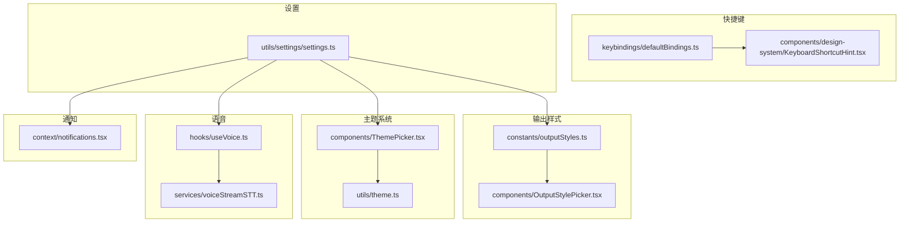
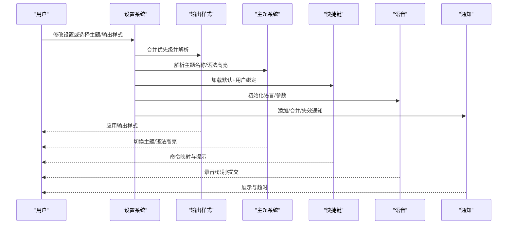
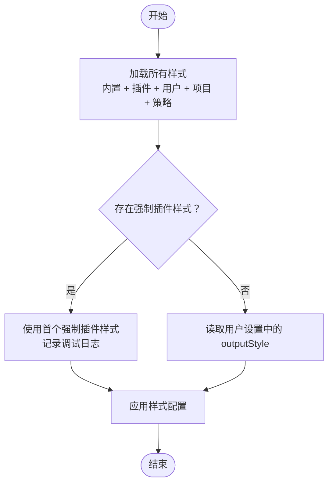
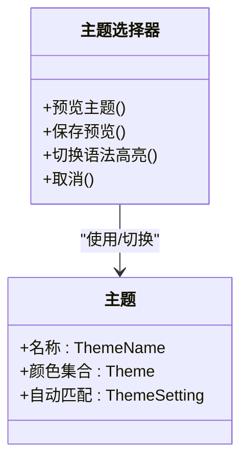
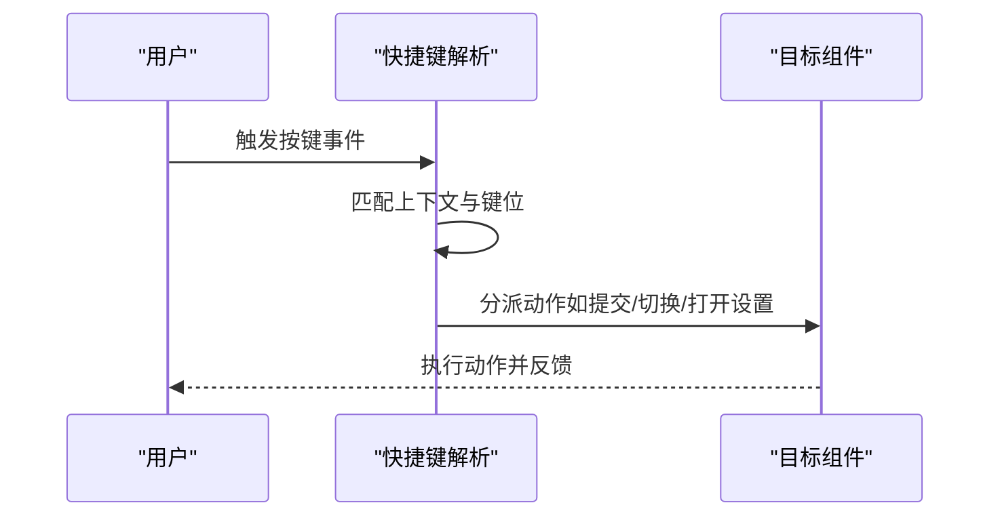
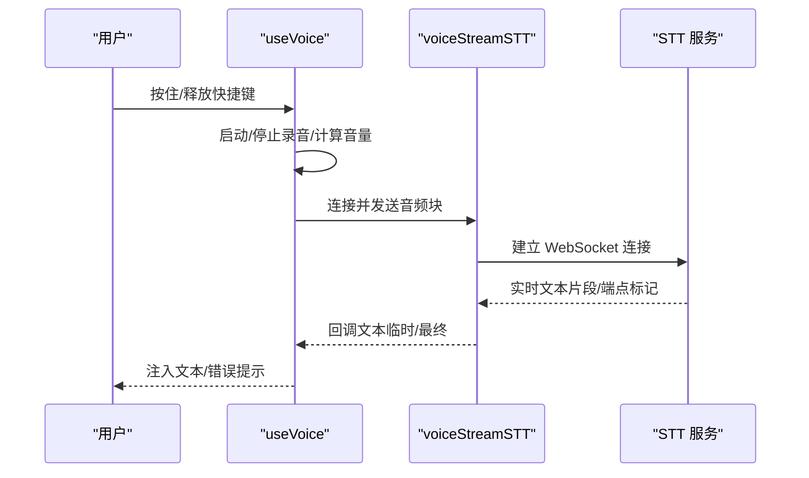
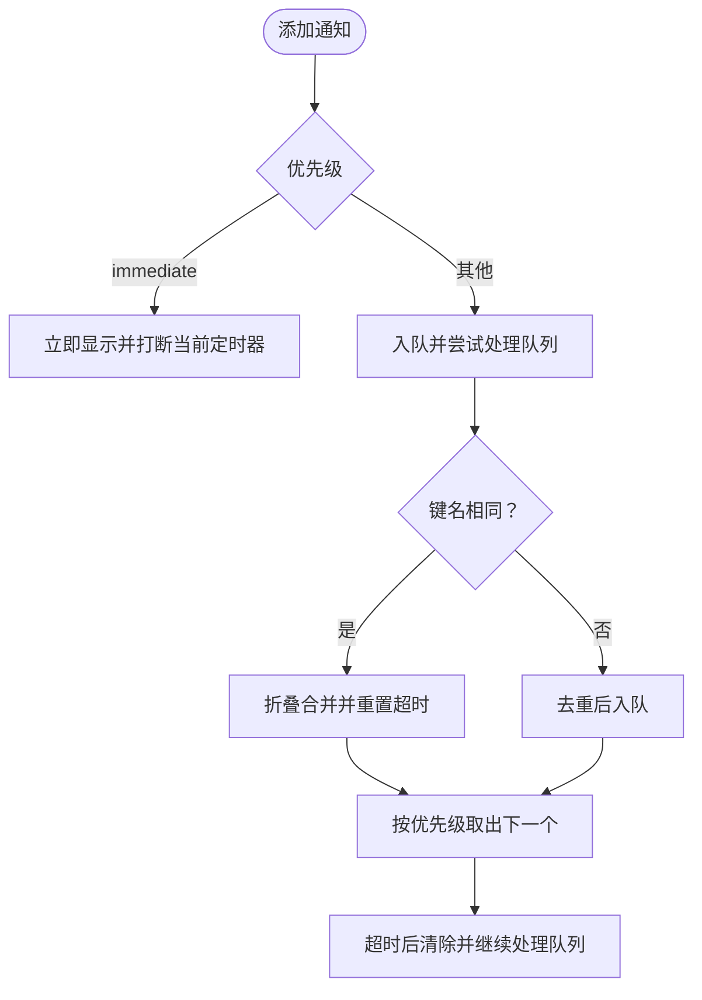
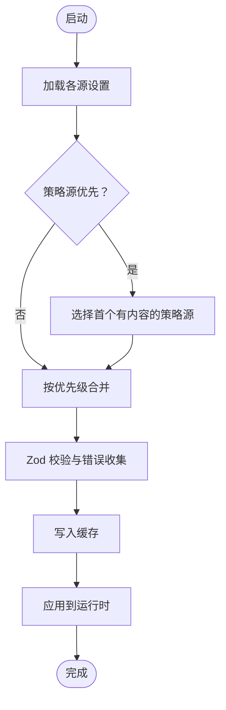
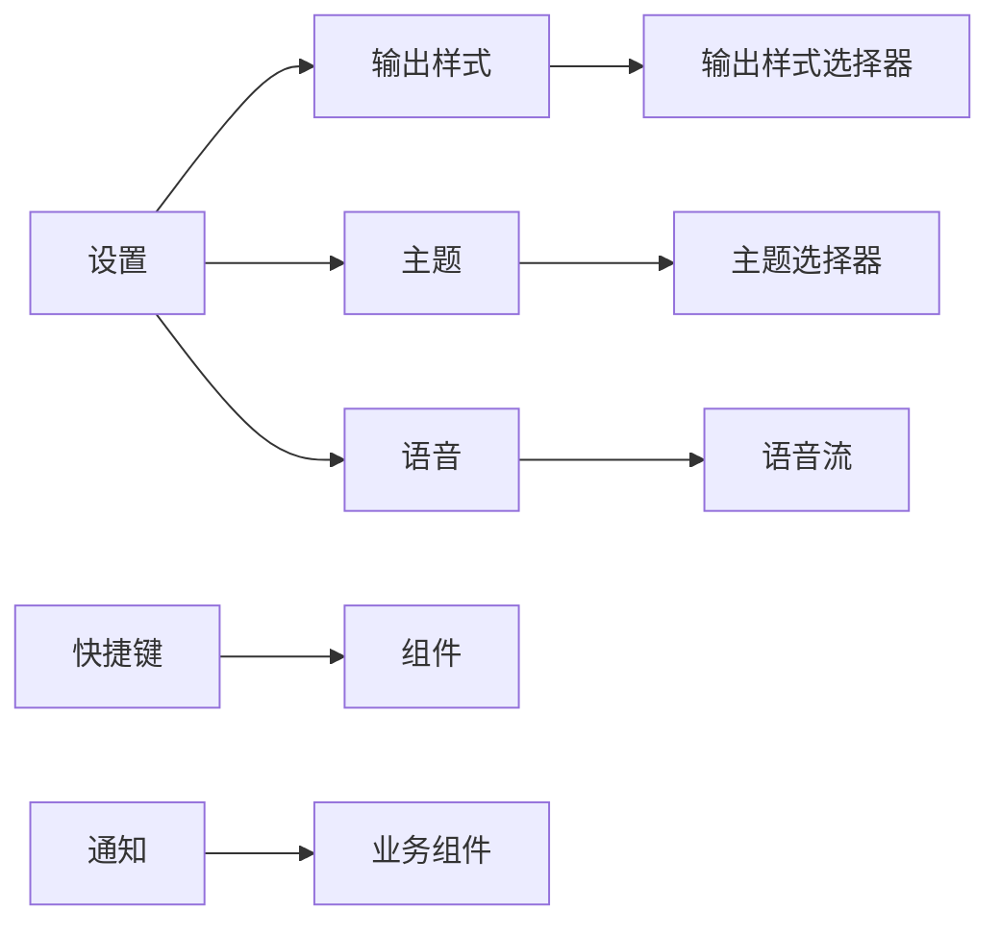

# 界面与交互配置

<cite>
**本文档引用的文件**
- [outputStyles.ts](file://src/constants/outputStyles.ts)
- [defaultBindings.ts](file://src/keybindings/defaultBindings.ts)
- [ThemePicker.tsx](file://src/components/ThemePicker.tsx)
- [theme.ts](file://src/utils/theme.ts)
- [OutputStylePicker.tsx](file://src/components/OutputStylePicker.tsx)
- [useVoice.ts](file://src/hooks/useVoice.ts)
- [voiceStreamSTT.ts](file://src/services/voiceStreamSTT.ts)
- [notifications.tsx](file://src/context/notifications.tsx)
- [KeyboardShortcutHint.tsx](file://src/components/design-system/KeyboardShortcutHint.tsx)
- [settings.ts](file://src/utils/settings/settings.ts)
</cite>

## 目录
1. [简介](#简介)
2. [项目结构](#项目结构)
3. [核心组件](#核心组件)
4. [架构总览](#架构总览)
5. [详细组件分析](#详细组件分析)
6. [依赖关系分析](#依赖关系分析)
7. [性能考虑](#性能考虑)
8. [故障排除指南](#故障排除指南)
9. [结论](#结论)
10. [附录](#附录)

## 简介
本文件系统性梳理 Claude Code 的界面与交互配置，覆盖以下方面：
- 输出样式（代码高亮、表格显示、消息格式）的配置与扩展机制
- 主题系统（配色方案、语法高亮开关、自定义主题方法）
- 键盘快捷键（默认绑定、用户覆盖、新增快捷键）
- 界面布局（窗口大小、面板布局、显示密度）的可配置项
- 语音功能（语音模式启用、Hold-to-Talk 参数、语言设置）
- 通知与提示（优先级、超时、折叠合并、失效策略）
- 个性化定制最佳实践与常见场景

## 项目结构
围绕界面与交互配置的关键目录与文件：
- 输出样式：constants/outputStyles.ts、components/OutputStylePicker.tsx
- 主题系统：components/ThemePicker.tsx、utils/theme.ts
- 快捷键：keybindings/defaultBindings.ts、components/design-system/KeyboardShortcutHint.tsx
- 语音：hooks/useVoice.ts、services/voiceStreamSTT.ts
- 通知：context/notifications.tsx
- 设置与配置：utils/settings/settings.ts

**图表来源**
- [outputStyles.ts](file://src/constants/outputStyles.ts)
- [OutputStylePicker.tsx](file://src/components/OutputStylePicker.tsx)
- [ThemePicker.tsx](file://src/components/ThemePicker.tsx)
- [theme.ts](file://src/utils/theme.ts)
- [defaultBindings.ts](file://src/keybindings/defaultBindings.ts)
- [KeyboardShortcutHint.tsx](file://src/components/design-system/KeyboardShortcutHint.tsx)
- [useVoice.ts](file://src/hooks/useVoice.ts)
- [voiceStreamSTT.ts](file://src/services/voiceStreamSTT.ts)
- [notifications.tsx](file://src/context/notifications.tsx)
- [settings.ts](file://src/utils/settings/settings.ts)

**章节来源**
- [outputStyles.ts](file://src/constants/outputStyles.ts)
- [ThemePicker.tsx](file://src/components/ThemePicker.tsx)
- [theme.ts](file://src/utils/theme.ts)
- [defaultBindings.ts](file://src/keybindings/defaultBindings.ts)
- [KeyboardShortcutHint.tsx](file://src/components/design-system/KeyboardShortcutHint.tsx)
- [useVoice.ts](file://src/hooks/useVoice.ts)
- [voiceStreamSTT.ts](file://src/services/voiceStreamSTT.ts)
- [notifications.tsx](file://src/context/notifications.tsx)
- [settings.ts](file://src/utils/settings/settings.ts)

## 核心组件
- 输出样式：内置 Explanatory/Learning 等风格，支持插件与项目级自定义，动态加载与合并优先级。
- 主题系统：多套主题（深浅/色弱/仅 ANSI），支持自动匹配终端、语法高亮开关、运行时切换。
- 快捷键：全局/聊天/设置/确认/标签页/转录/历史搜索/任务/主题选择/滚动/帮助/附件/底部指示器/消息选择/差异对话框/模型选择/选择组件/插件等上下文绑定。
- 语音：Hold-to-Talk 模式，自动重连与静音丢包重试，语言归一化，焦点模式自动录音。
- 通知：优先级队列、超时控制、折叠合并、失效策略、立即显示。
- 设置：多源合并（用户/项目/本地/策略/标志），缓存与校验，写入与回退。

**章节来源**
- [outputStyles.ts](file://src/constants/outputStyles.ts)
- [ThemePicker.tsx](file://src/components/ThemePicker.tsx)
- [theme.ts](file://src/utils/theme.ts)
- [defaultBindings.ts](file://src/keybindings/defaultBindings.ts)
- [useVoice.ts](file://src/hooks/useVoice.ts)
- [voiceStreamSTT.ts](file://src/services/voiceStreamSTT.ts)
- [notifications.tsx](file://src/context/notifications.tsx)
- [settings.ts](file://src/utils/settings/settings.ts)

## 架构总览
界面与交互配置由“配置源 + 运行时解析 + 组件渲染”三层构成：
- 配置源：内置常量、插件输出样式、项目/用户设置、策略/标志设置
- 解析层：统一加载、合并、优先级排序、缓存与校验
- 渲染层：主题选择器、输出样式选择器、快捷键提示、语音状态、通知队列

**图表来源**
- [settings.ts](file://src/utils/settings/settings.ts)
- [outputStyles.ts](file://src/constants/outputStyles.ts)
- [ThemePicker.tsx](file://src/components/ThemePicker.tsx)
- [defaultBindings.ts](file://src/keybindings/defaultBindings.ts)
- [useVoice.ts](file://src/hooks/useVoice.ts)
- [notifications.tsx](file://src/context/notifications.tsx)

## 详细组件分析

### 输出样式配置与扩展
- 内置样式：default/null、Explanatory、Learning；可通过 keepCodingInstructions 控制是否保留编码指令。
- 插件与项目扩展：支持从插件与项目目录加载自定义样式，按优先级合并（插件 > 用户 > 项目 > 策略）。
- 动态加载：使用缓存函数一次性加载，避免重复 IO；强制插件样式优先于其他来源。
- 选择器：OutputStylePicker 提供 UI 选择，支持“独立命令”模式与描述展示。

**图表来源**
- [outputStyles.ts](file://src/constants/outputStyles.ts)
- [OutputStylePicker.tsx](file://src/components/OutputStylePicker.tsx)

**章节来源**
- [outputStyles.ts](file://src/constants/outputStyles.ts)
- [OutputStylePicker.tsx](file://src/components/OutputStylePicker.tsx)

### 主题系统与语法高亮
- 主题类型：dark/light/dark-daltonized/light-daltonized/dark-ansi/light-ansi
- 自动匹配：支持根据系统主题自动切换
- 语法高亮：通过设置项控制开启/关闭，运行时可预览与保存
- 主题选择器：提供预览、按键提示、颜色模块可用性检测、差异对比示例

**图表来源**
- [theme.ts](file://src/utils/theme.ts)
- [ThemePicker.tsx](file://src/components/ThemePicker.tsx)

**章节来源**
- [theme.ts](file://src/utils/theme.ts)
- [ThemePicker.tsx](file://src/components/ThemePicker.tsx)

### 键盘快捷键系统
- 默认绑定：按上下文分组（全局/聊天/设置/确认/标签页/转录/历史搜索/任务/主题选择/滚动/帮助/附件/底部指示器/消息选择/差异对话框/模型选择/选择组件/插件）
- 平台适配：Windows/VTE 模式、模式循环键、图像粘贴键、终端面板开关等
- 快捷键提示：KeyboardShortcutHint 支持括号包裹、加粗、多提示组合
- 可扩展性：在对应上下文中新增绑定，遵循“默认先于用户”的覆盖规则

**图表来源**
- [defaultBindings.ts](file://src/keybindings/defaultBindings.ts)
- [KeyboardShortcutHint.tsx](file://src/components/design-system/KeyboardShortcutHint.tsx)

**章节来源**
- [defaultBindings.ts](file://src/keybindings/defaultBindings.ts)
- [KeyboardShortcutHint.tsx](file://src/components/design-system/KeyboardShortcutHint.tsx)

### 语音功能配置
- 模式：Hold-to-Talk，按住触发录音，释放提交
- 语言：支持多语言，自动归一化到服务端允许列表，不支持时回退至默认
- 焦点模式：终端聚焦时自动开始/结束录音，空闲超时自动结束
- 容错：首次连接失败自动重试，静音丢包场景重放音频缓冲
- 连接：基于 WebSocket voice_stream，支持代理与 mTLS

**图表来源**
- [useVoice.ts](file://src/hooks/useVoice.ts)
- [voiceStreamSTT.ts](file://src/services/voiceStreamSTT.ts)

**章节来源**
- [useVoice.ts](file://src/hooks/useVoice.ts)
- [voiceStreamSTT.ts](file://src/services/voiceStreamSTT.ts)

### 通知与提示系统
- 类型：文本通知/JSX 通知
- 优先级：immediate/high/medium/low
- 行为：立即通知打断当前定时器；非立即通知入队后按优先级出队；支持折叠合并与失效
- 超时：默认超时时间，可按通知单独设置；当前显示时会清理并重新计时

**图表来源**
- [notifications.tsx](file://src/context/notifications.tsx)

**章节来源**
- [notifications.tsx](file://src/context/notifications.tsx)

### 设置与配置合并
- 多源合并：插件基础设置、策略设置（远程/HKLM/plist/文件/HKCU）、用户设置、项目/本地设置、标志设置
- 缓存与校验：文件解析缓存、Zod Schema 校验、错误收集与去重
- 写入与回退：支持删除键（设为 undefined）、数组替换、写入后重置会话缓存

**图表来源**
- [settings.ts](file://src/utils/settings/settings.ts)

**章节来源**
- [settings.ts](file://src/utils/settings/settings.ts)

## 依赖关系分析
- 输出样式依赖设置系统以读取用户偏好与插件样式
- 主题系统被主题选择器消费，同时受设置影响（如语法高亮）
- 快捷键系统贯穿各 UI 组件，提供一致的交互体验
- 语音功能依赖设置中的语言与认证信息
- 通知系统作为横切关注点，被多个业务流程复用

**图表来源**
- [settings.ts](file://src/utils/settings/settings.ts)
- [outputStyles.ts](file://src/constants/outputStyles.ts)
- [ThemePicker.tsx](file://src/components/ThemePicker.tsx)
- [defaultBindings.ts](file://src/keybindings/defaultBindings.ts)
- [useVoice.ts](file://src/hooks/useVoice.ts)
- [voiceStreamSTT.ts](file://src/services/voiceStreamSTT.ts)
- [notifications.tsx](file://src/context/notifications.tsx)

**章节来源**
- [settings.ts](file://src/utils/settings/settings.ts)
- [outputStyles.ts](file://src/constants/outputStyles.ts)
- [ThemePicker.tsx](file://src/components/ThemePicker.tsx)
- [defaultBindings.ts](file://src/keybindings/defaultBindings.ts)
- [useVoice.ts](file://src/hooks/useVoice.ts)
- [voiceStreamSTT.ts](file://src/services/voiceStreamSTT.ts)
- [notifications.tsx](file://src/context/notifications.tsx)

## 性能考虑
- 输出样式与设置采用缓存，避免重复 IO 与解析
- 语音连接与音频缓冲采用异步与背压策略，减少阻塞
- 通知队列按优先级处理，避免 UI 卡顿
- 主题切换与语法高亮开关为轻量操作，建议在设置中批量更新

## 故障排除指南
- 语音无法连接
  - 检查认证状态与网络代理
  - 查看 WebSocket 升级拒绝与错误码
  - 尝试重试或更换 STT 提供商
- 通知未显示或提前消失
  - 确认优先级与超时设置
  - 检查是否被更高优先级通知失效
- 主题切换无效
  - 确认设置源与语法高亮开关
  - 检查颜色模块环境变量限制
- 快捷键冲突
  - 检查默认绑定与用户覆盖
  - 在对应上下文中调整键位

**章节来源**
- [useVoice.ts](file://src/hooks/useVoice.ts)
- [voiceStreamSTT.ts](file://src/services/voiceStreamSTT.ts)
- [notifications.tsx](file://src/context/notifications.tsx)
- [ThemePicker.tsx](file://src/components/ThemePicker.tsx)
- [defaultBindings.ts](file://src/keybindings/defaultBindings.ts)

## 结论
本系统通过“多源配置 + 运行时解析 + 组件渲染”的架构，提供了灵活且可扩展的界面与交互配置能力。输出样式、主题、快捷键、语音与通知均具备清晰的优先级与容错机制，适合在不同终端与工作流中稳定使用。

## 附录
- 常见配置场景
  - 开发者偏好：选择 Explanatory 风格 + 深色主题 + 语法高亮
  - 团队策略：通过策略设置统一主题与输出样式
  - 无障碍：使用色弱友好主题与高对比度配色
  - 语音优化：设置语言、启用焦点模式、配置代理与 mTLS