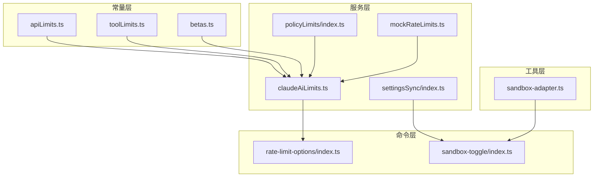
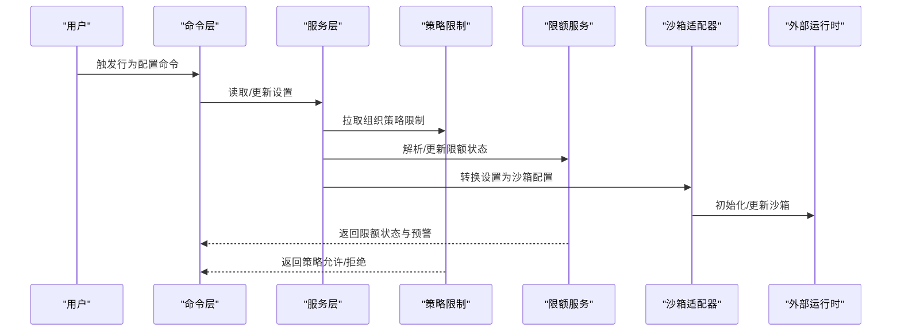
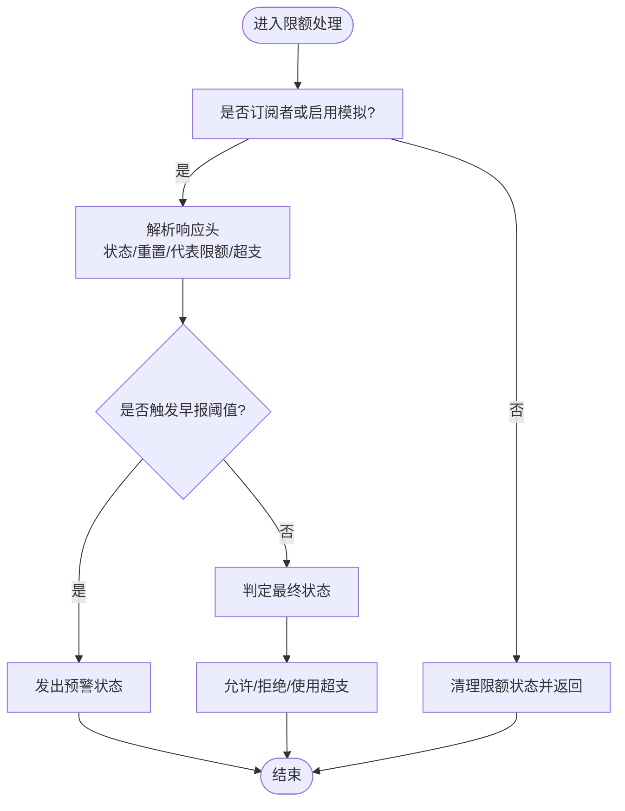
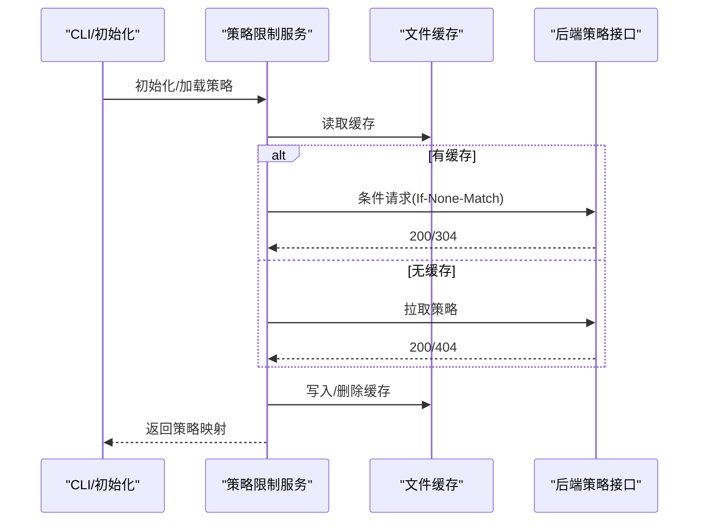
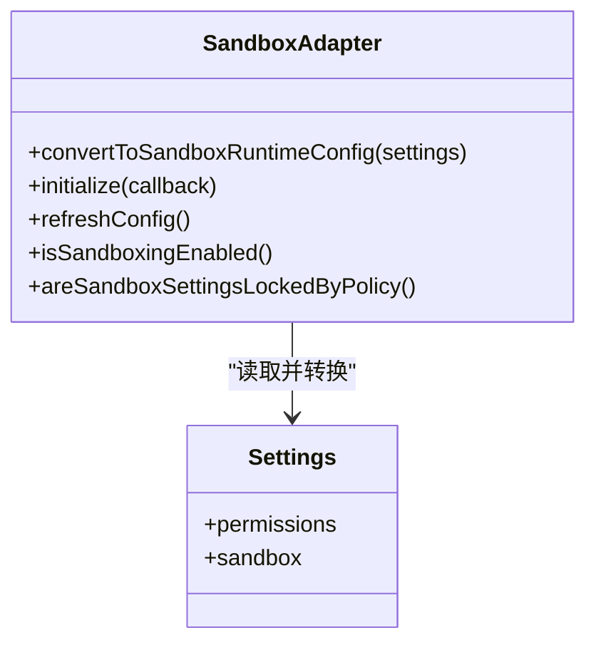
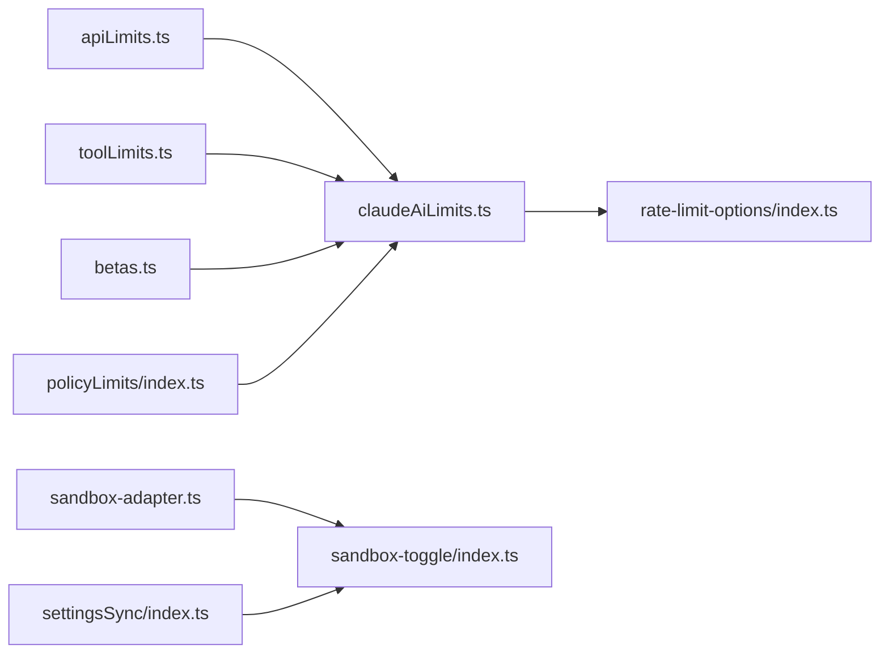

# 行为与策略配置

<cite>
**本文引用的文件**
- [apiLimits.ts](file://src/constants/apiLimits.ts)
- [toolLimits.ts](file://src/constants/toolLimits.ts)
- [betas.ts](file://src/constants/betas.ts)
- [policyLimits/index.ts](file://src/services/policyLimits/index.ts)
- [claudeAiLimits.ts](file://src/services/claudeAiLimits.ts)
- [mockRateLimits.ts](file://src/services/mockRateLimits.ts)
- [rate-limit-options/index.ts](file://src/commands/rate-limit-options/index.ts)
- [sandbox-toggle/index.ts](file://src/commands/sandbox-toggle/index.ts)
- [sandbox-adapter.ts](file://src/utils/sandbox/sandbox-adapter.ts)
- [settingsSync/index.ts](file://src/services/settingsSync/index.ts)
</cite>

## 目录
1. [简介](#简介)
2. [项目结构](#项目结构)
3. [核心组件](#核心组件)
4. [架构总览](#架构总览)
5. [详细组件分析](#详细组件分析)
6. [依赖关系分析](#依赖关系分析)
7. [性能考量](#性能考量)
8. [故障排查指南](#故障排查指南)
9. [结论](#结论)
10. [附录](#附录)

## 简介
本文件系统化梳理 Claude Code 的“行为与策略配置”，覆盖以下主题：
- API 限制：请求频率限制、并发连接数限制、速率限制的配置与检测
- 工具使用限制：工具结果大小上限、消息内聚合上限、摘要长度等
- 权限策略：文件访问、命令执行、网络访问的控制与策略覆盖
- 实验性功能：Beta 头部开关与平台支持范围
- 安全策略：沙箱模式、代码审查与敏感信息保护
- 会话行为：会话超时、自动保存与恢复机制
- 使用场景建议与安全最佳实践

## 项目结构
围绕行为与策略配置的关键模块分布如下：
- 常量层：定义 API 限制、工具限制、Beta 标识
- 服务层：组织策略拉取（策略限制）、限额状态（限额服务）、模拟限额（测试）
- 命令层：提供交互式开关与诊断命令（如沙箱切换、限额选项）
- 工具层：沙箱适配器封装外部运行时，统一转换用户设置为沙箱配置
- 同步层：设置同步服务，跨环境同步用户设置与记忆文件

图表来源
- [apiLimits.ts](file://src/constants/apiLimits.ts)
- [toolLimits.ts](file://src/constants/toolLimits.ts)
- [betas.ts](file://src/constants/betas.ts)
- [policyLimits/index.ts](file://src/services/policyLimits/index.ts)
- [claudeAiLimits.ts](file://src/services/claudeAiLimits.ts)
- [mockRateLimits.ts](file://src/services/mockRateLimits.ts)
- [rate-limit-options/index.ts](file://src/commands/rate-limit-options/index.ts)
- [sandbox-toggle/index.ts](file://src/commands/sandbox-toggle/index.ts)
- [sandbox-adapter.ts](file://src/utils/sandbox/sandbox-adapter.ts)
- [settingsSync/index.ts](file://src/services/settingsSync/index.ts)

章节来源
- [apiLimits.ts](file://src/constants/apiLimits.ts)
- [toolLimits.ts](file://src/constants/toolLimits.ts)
- [betas.ts](file://src/constants/betas.ts)
- [policyLimits/index.ts](file://src/services/policyLimits/index.ts)
- [claudeAiLimits.ts](file://src/services/claudeAiLimits.ts)
- [mockRateLimits.ts](file://src/services/mockRateLimits.ts)
- [rate-limit-options/index.ts](file://src/commands/rate-limit-options/index.ts)
- [sandbox-toggle/index.ts](file://src/commands/sandbox-toggle/index.ts)
- [sandbox-adapter.ts](file://src/utils/sandbox/sandbox-adapter.ts)
- [settingsSync/index.ts](file://src/services/settingsSync/index.ts)

## 核心组件
- API 限制常量：定义图片、PDF、媒体等上传与处理的硬性阈值，用于客户端校验与提示
- 工具限制常量：定义工具结果字符上限、令牌上限、消息内聚合上限、摘要长度等
- Beta 标识常量：集中维护各实验性功能的头部标识与平台支持集合
- 策略限制服务：从后端拉取组织级策略限制，支持缓存、轮询、失败开路
- 限额服务：解析并跟踪限额状态（会话/周/模型专项），支持早报预警与降级回退
- 沙箱适配器：将用户设置转换为沙箱运行时配置，统一文件系统、网络域、代理等约束
- 设置同步服务：在多环境间同步用户设置与记忆文件，支持增量上传与下载

章节来源
- [apiLimits.ts](file://src/constants/apiLimits.ts)
- [toolLimits.ts](file://src/constants/toolLimits.ts)
- [betas.ts](file://src/constants/betas.ts)
- [policyLimits/index.ts](file://src/services/policyLimits/index.ts)
- [claudeAiLimits.ts](file://src/services/claudeAiLimits.ts)
- [sandbox-adapter.ts](file://src/utils/sandbox/sandbox-adapter.ts)
- [settingsSync/index.ts](file://src/services/settingsSync/index.ts)

## 架构总览
下图展示“策略与行为”在系统中的交互路径：用户通过命令与设置影响行为；服务层负责策略拉取与限额状态；工具层负责安全隔离；常量层提供边界约束。

图表来源
- [policyLimits/index.ts](file://src/services/policyLimits/index.ts)
- [claudeAiLimits.ts](file://src/services/claudeAiLimits.ts)
- [sandbox-adapter.ts](file://src/utils/sandbox/sandbox-adapter.ts)
- [rate-limit-options/index.ts](file://src/commands/rate-limit-options/index.ts)
- [sandbox-toggle/index.ts](file://src/commands/sandbox-toggle/index.ts)

## 详细组件分析

### API 限制配置
- 图片限制：最大 base64 长度、目标原始尺寸、客户端重采样尺寸上限
- PDF 限制：目标原始大小、最大页数、提取阈值、最大提取大小、单次读取页数、@提及内联阈值
- 媒体限制：每请求最多媒体项数量，客户端侧校验以避免误导错误

这些常量用于前端校验与提示，确保请求在服务端可接受范围内。

章节来源
- [apiLimits.ts](file://src/constants/apiLimits.ts)

### 工具使用限制配置
- 默认工具结果字符上限与令牌上限，以及字节上限
- 单条消息内工具结果聚合上限（按字符计），防止并行工具结果导致上下文爆炸
- 工具摘要字符串的最大长度，用于紧凑视图截断

章节来源
- [toolLimits.ts](file://src/constants/toolLimits.ts)

### 权限策略配置（文件/命令/网络）
- 文件系统：读写白名单/黑名单、临时目录、设置文件保护、Git 裸仓库防护
- 网络访问：允许/拒绝域名列表、Unix 套接字、本地绑定、HTTP/SOCKS 代理端口
- 自动放行 Bash：仅在沙箱启用且满足平台条件时生效
- 策略锁定：当策略设置覆盖本地设置时，本地修改无效

章节来源
- [sandbox-adapter.ts](file://src/utils/sandbox/sandbox-adapter.ts)
- [sandbox-toggle/index.ts](file://src/commands/sandbox-toggle/index.ts)

### 实验性功能开关配置
- Beta 头部集中定义，涵盖思维链、上下文扩展、结构化输出、工具搜索、任务预算、快速模式等
- 平台支持集合：部分头部仅在特定平台或通过额外参数传递
- Vertex 计数令牌允许的 Beta 子集：限制某些头部在该平台的可用性

章节来源
- [betas.ts](file://src/constants/betas.ts)

### 限额与速率限制（含模拟）
- 限额类型：会话窗口、周窗口、模型专项（Opus/Sonnet）、超支额度
- 早报预警：基于服务器阈值头与客户端时间相对阈值双重检测
- 状态变更：允许/警告/拒绝，支持降级回退与代表限额声明
- 模拟限额：内部测试专用，可设置多种场景（会话/周/模型专项/超支等）与早报阈值

图表来源
- [claudeAiLimits.ts](file://src/services/claudeAiLimits.ts)
- [mockRateLimits.ts](file://src/services/mockRateLimits.ts)

章节来源
- [claudeAiLimits.ts](file://src/services/claudeAiLimits.ts)
- [mockRateLimits.ts](file://src/services/mockRateLimits.ts)

### 策略限制（组织级策略）
- 获取资格：仅第一方、Anthropic 基础 URL、具备访问推断作用域的团队/企业用户
- 加载流程：失败开路（不阻塞）、ETag 缓存、文件缓存、后台轮询
- 策略查询：支持 304、404 场景，未知策略默认允许
- 早到策略：隐私严格模式下，缺失缓存时对特定策略默认拒绝

图表来源
- [policyLimits/index.ts](file://src/services/policyLimits/index.ts)

章节来源
- [policyLimits/index.ts](file://src/services/policyLimits/index.ts)

### 沙箱模式与安全策略
- 启用条件：平台支持、依赖检查、用户设置、平台白名单
- 配置转换：将权限规则与沙箱设置映射为运行时配置（文件系统/网络/代理/ripgrep）
- 安全加固：禁止写入设置文件、Git 裸仓库防护、工作树主仓库路径处理
- 策略锁定：当策略设置覆盖本地设置时，本地更改被忽略

图表来源
- [sandbox-adapter.ts](file://src/utils/sandbox/sandbox-adapter.ts)

章节来源
- [sandbox-adapter.ts](file://src/utils/sandbox/sandbox-adapter.ts)
- [sandbox-toggle/index.ts](file://src/commands/sandbox-toggle/index.ts)

### 会话行为与设置同步
- 设置同步：增量上传本地设置、下载远程设置、大小限制、失败开路
- 适用范围：交互式 CLI 上传、CCR 下载、OAuth 用户限定
- 缓存与一致性：写入本地文件后失效相关缓存，保证后续读取最新内容

章节来源
- [settingsSync/index.ts](file://src/services/settingsSync/index.ts)

## 依赖关系分析
- 常量依赖：API/工具限制常量被限额服务与工具层使用
- 服务耦合：策略限制服务与限额服务相互独立但共享认证与缓存模式
- 命令依赖：限额选项与沙箱切换命令依赖对应服务的状态与能力
- 工具依赖：沙箱适配器依赖设置系统与外部运行时

图表来源
- [apiLimits.ts](file://src/constants/apiLimits.ts)
- [toolLimits.ts](file://src/constants/toolLimits.ts)
- [betas.ts](file://src/constants/betas.ts)
- [policyLimits/index.ts](file://src/services/policyLimits/index.ts)
- [claudeAiLimits.ts](file://src/services/claudeAiLimits.ts)
- [rate-limit-options/index.ts](file://src/commands/rate-limit-options/index.ts)
- [sandbox-adapter.ts](file://src/utils/sandbox/sandbox-adapter.ts)
- [sandbox-toggle/index.ts](file://src/commands/sandbox-toggle/index.ts)
- [settingsSync/index.ts](file://src/services/settingsSync/index.ts)

章节来源
- [apiLimits.ts](file://src/constants/apiLimits.ts)
- [toolLimits.ts](file://src/constants/toolLimits.ts)
- [betas.ts](file://src/constants/betas.ts)
- [policyLimits/index.ts](file://src/services/policyLimits/index.ts)
- [claudeAiLimits.ts](file://src/services/claudeAiLimits.ts)
- [rate-limit-options/index.ts](file://src/commands/rate-limit-options/index.ts)
- [sandbox-adapter.ts](file://src/utils/sandbox/sandbox-adapter.ts)
- [sandbox-toggle/index.ts](file://src/commands/sandbox-toggle/index.ts)
- [settingsSync/index.ts](file://src/services/settingsSync/index.ts)

## 性能考量
- 限额状态解析：仅在必要时发起最小请求，避免非必要网络开销
- 策略限制：ETag 缓存与后台轮询降低重复拉取成本
- 沙箱配置：依赖缓存与变更订阅，减少重复初始化与配置转换
- 工具结果：字符/令牌/聚合上限限制，避免上下文膨胀导致的性能退化

## 故障排查指南
- 限额相关
  - 若出现早报预警或拒绝，检查服务器阈值头与客户端时间相对阈值逻辑
  - 使用模拟限额场景进行端到端验证（仅内部）
- 策略限制
  - 确认用户资格（第一方、Anthropic 基础 URL、具备推断作用域）
  - 查看缓存文件是否存在与格式是否正确
  - 关注隐私严格模式下的缺省行为
- 沙箱
  - 平台支持与依赖检查：确认平台与依赖满足要求
  - 策略锁定：若本地设置未生效，检查策略设置来源
  - Git 裸仓库防护：注意可能的文件清理与路径差异
- 设置同步
  - OAuth 令牌有效性与作用域
  - 文件大小限制与空内容过滤
  - 失败开路与重试策略

章节来源
- [claudeAiLimits.ts](file://src/services/claudeAiLimits.ts)
- [mockRateLimits.ts](file://src/services/mockRateLimits.ts)
- [policyLimits/index.ts](file://src/services/policyLimits/index.ts)
- [sandbox-adapter.ts](file://src/utils/sandbox/sandbox-adapter.ts)
- [settingsSync/index.ts](file://src/services/settingsSync/index.ts)

## 结论
本文件将 Claude Code 的行为与策略配置拆解为常量、服务、命令与工具四个层面，形成“边界约束—策略拉取—行为执行—安全隔离”的闭环。通过限额与策略的双轨设计、沙箱的安全隔离与严格的依赖检查，系统在保障安全的同时兼顾易用性与可观测性。建议在生产环境中优先启用沙箱与策略限制，并结合限额早报预警优化资源使用节奏。

## 附录
- 使用场景建议
  - 开发/测试：启用沙箱并配置网络域名白名单；使用模拟限额验证路径
  - 团队/企业：开启策略限制服务，利用组织级策略统一管控；配合设置同步实现跨环境一致
  - 高负载：合理设置工具结果上限与消息聚合上限，避免上下文膨胀
- 安全最佳实践
  - 默认启用沙箱，避免直接执行不受控命令
  - 严格控制文件系统与网络访问范围，定期审计权限规则
  - 在隐私严格模式下，谨慎处理策略缺失时的行为
  - 对超支与限额拒绝场景，提供清晰的用户提示与降级回退路径