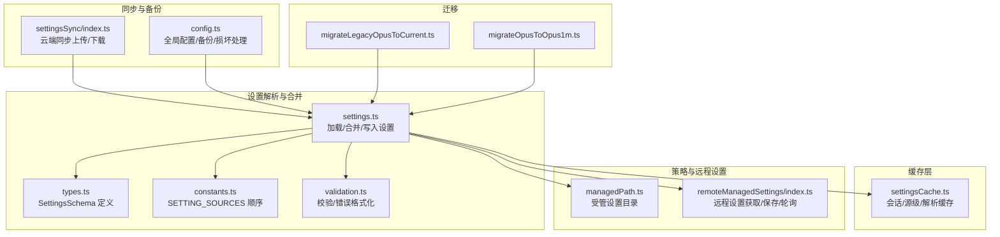
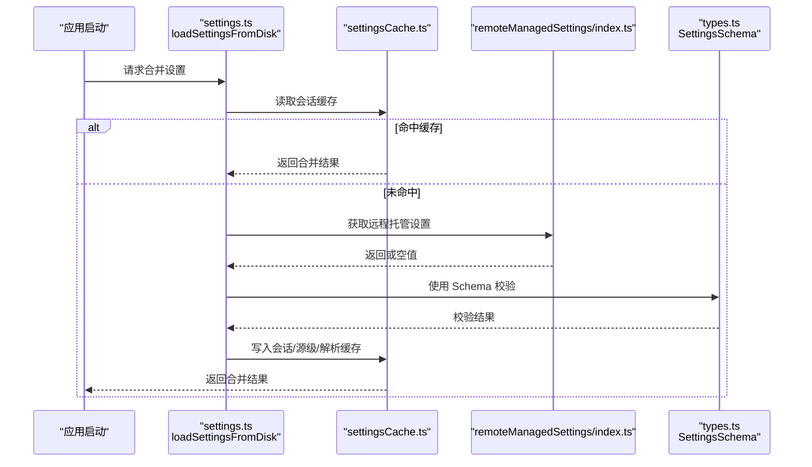
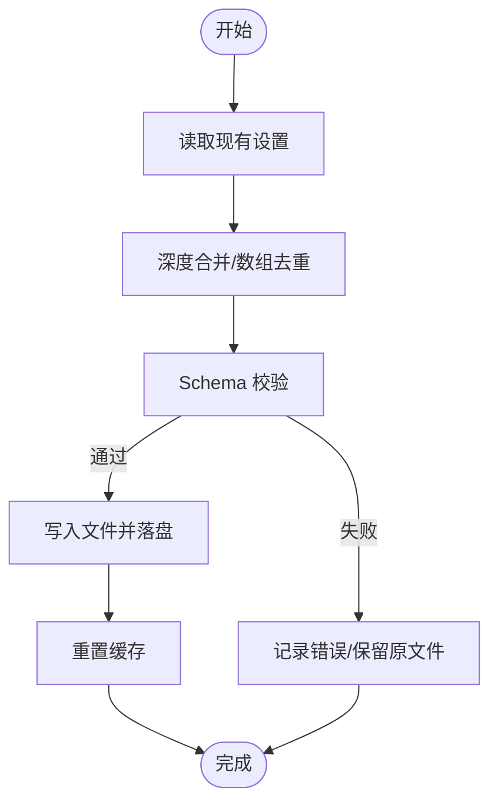
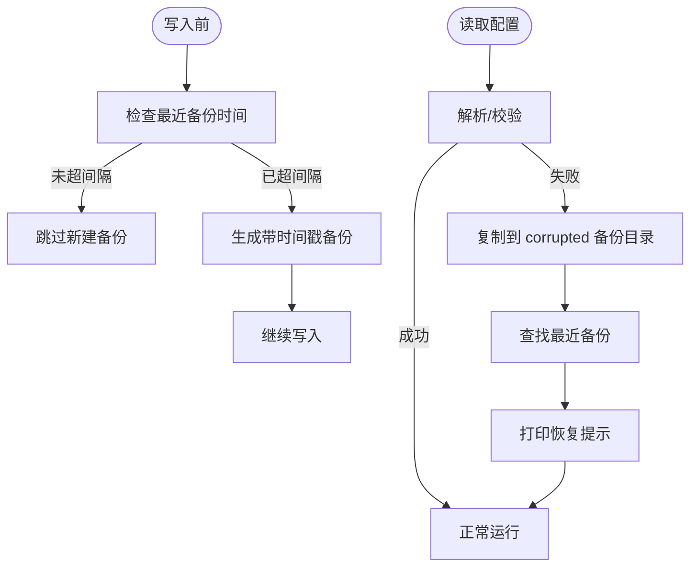
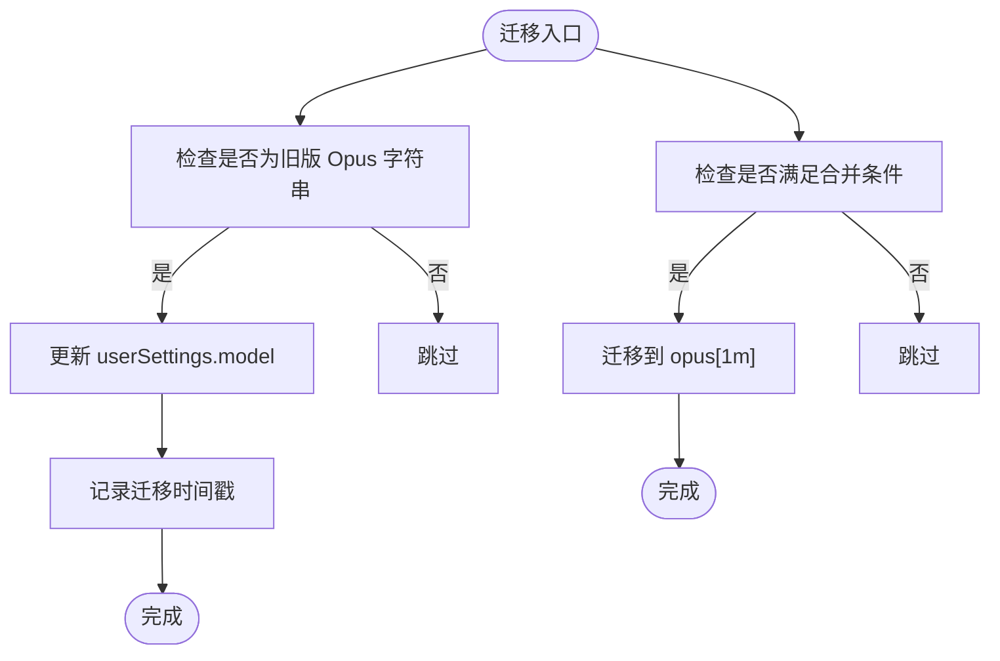
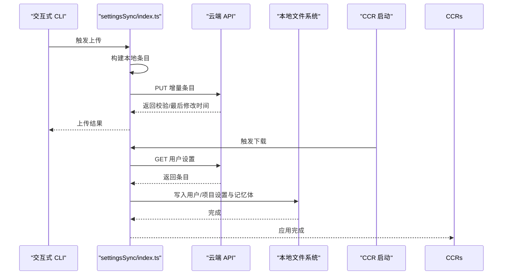
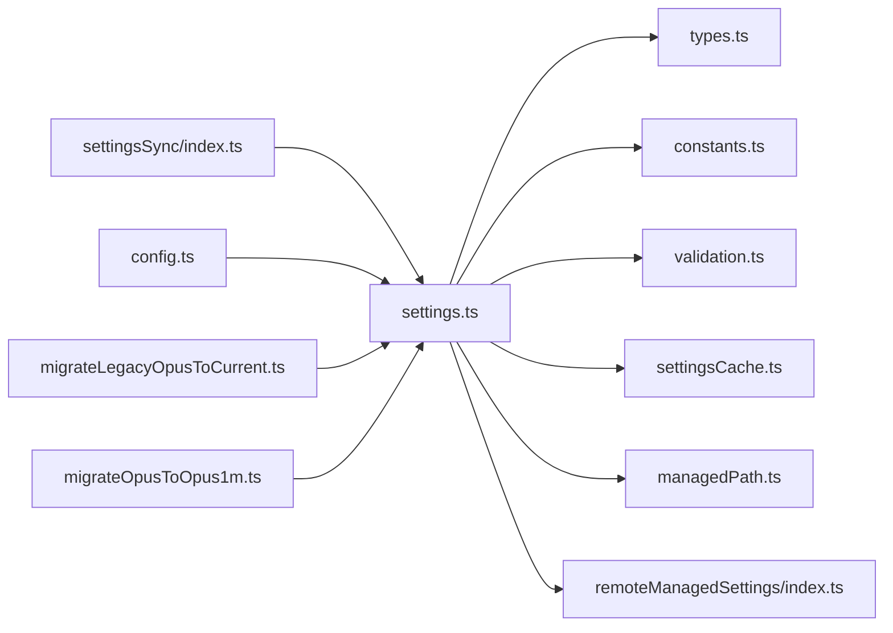

# 设置持久化与管理

<cite>
**本文引用的文件**
- [settings.ts](file://src/utils/settings/settings.ts)
- [types.ts](file://src/utils/settings/types.ts)
- [settingsCache.ts](file://src/utils/settings/settingsCache.ts)
- [managedPath.ts](file://src/utils/settings/managedPath.ts)
- [constants.ts](file://src/utils/settings/constants.ts)
- [validation.ts](file://src/utils/settings/validation.ts)
- [index.ts](file://src/services/remoteManagedSettings/index.ts)
- [settingsSync/index.ts](file://src/services/settingsSync/index.ts)
- [config.ts](file://src/utils/config.ts)
- [migrateLegacyOpusToCurrent.ts](file://src/migrations/migrateLegacyOpusToCurrent.ts)
- [migrateOpusToOpus1m.ts](file://src/migrations/migrateOpusToOpus1m.ts)
</cite>

## 目录
1. [简介](#简介)
2. [项目结构](#项目结构)
3. [核心组件](#核心组件)
4. [架构总览](#架构总览)
5. [详细组件分析](#详细组件分析)
6. [依赖关系分析](#依赖关系分析)
7. [性能考量](#性能考量)
8. [故障排查指南](#故障排查指南)
9. [结论](#结论)
10. [附录](#附录)

## 简介
本文件系统性阐述 Claude Code 的设置持久化与管理机制，覆盖以下关键主题：
- 设置存储位置与文件格式：用户设置、项目设置、本地设置、策略设置（远程/企业）及协同设置的路径与结构。
- 持久化机制：如何通过缓存与变更检测确保设置在应用重启后仍有效。
- 备份与恢复：自动备份策略、备份查找与恢复流程。
- 迁移机制：版本升级时的自动迁移与兼容性处理。
- 导入导出与跨设备同步：基于云端的设置同步服务。
- 缓存策略与性能优化：减少磁盘 I/O 的多级缓存设计。
- 最佳实践：版本控制与团队共享配置。

## 项目结构
设置系统由“设置解析与合并”“缓存层”“策略与远程设置”“同步服务”“备份与迁移”等模块组成，采用分层与职责分离的设计，保证可维护性与性能。

图示来源
- [settings.ts:641-796](file://src/utils/settings/settings.ts#L641-L796)
- [types.ts:255-800](file://src/utils/settings/types.ts#L255-L800)
- [constants.ts:7-22](file://src/utils/settings/constants.ts#L7-L22)
- [validation.ts:97-173](file://src/utils/settings/validation.ts#L97-L173)
- [settingsCache.ts:1-81](file://src/utils/settings/settingsCache.ts#L1-L81)
- [managedPath.ts:8-34](file://src/utils/settings/managedPath.ts#L8-L34)
- [index.ts:126-443](file://src/services/remoteManagedSettings/index.ts#L126-L443)
- [settingsSync/index.ts:1-202](file://src/services/settingsSync/index.ts#L1-L202)
- [config.ts:1249-1585](file://src/utils/config.ts#L1249-L1585)
- [migrateLegacyOpusToCurrent.ts:29-57](file://src/migrations/migrateLegacyOpusToCurrent.ts#L29-L57)
- [migrateOpusToOpus1m.ts:24-43](file://src/migrations/migrateOpusToOpus1m.ts#L24-L43)

章节来源
- [settings.ts:641-796](file://src/utils/settings/settings.ts#L641-L796)
- [types.ts:255-800](file://src/utils/settings/types.ts#L255-L800)
- [constants.ts:7-22](file://src/utils/settings/constants.ts#L7-L22)
- [settingsCache.ts:1-81](file://src/utils/settings/settingsCache.ts#L1-L81)
- [managedPath.ts:8-34](file://src/utils/settings/managedPath.ts#L8-L34)
- [index.ts:126-443](file://src/services/remoteManagedSettings/index.ts#L126-L443)
- [settingsSync/index.ts:1-202](file://src/services/settingsSync/index.ts#L1-L202)
- [config.ts:1249-1585](file://src/utils/config.ts#L1249-L1585)
- [migrateLegacyOpusToCurrent.ts:29-57](file://src/migrations/migrateLegacyOpusToCurrent.ts#L29-L57)
- [migrateOpusToOpus1m.ts:24-43](file://src/migrations/migrateOpusToOpus1m.ts#L24-L43)

## 核心组件
- 设置解析与合并：负责从多个来源读取设置、进行深度合并、校验并返回最终设置快照。
- 缓存层：提供会话级、按源级、按文件解析的多级缓存，避免重复磁盘 I/O。
- 策略与远程设置：支持企业策略（HKLM/HKCU/文件）、远程托管设置，并提供轮询与保存能力。
- 同步服务：提供云端设置与记忆体文件的增量上传/下载，支持 CCR 场景。
- 备份与恢复：自动备份、最小间隔去抖、损坏文件备份与提示、历史备份查找。
- 迁移：面向模型别名等场景的自动迁移，保持向后兼容。

章节来源
- [settings.ts:641-796](file://src/utils/settings/settings.ts#L641-L796)
- [settingsCache.ts:55-81](file://src/utils/settings/settingsCache.ts#L55-L81)
- [index.ts:363-408](file://src/services/remoteManagedSettings/index.ts#L363-L408)
- [settingsSync/index.ts:60-111](file://src/services/settingsSync/index.ts#L60-L111)
- [config.ts:1249-1585](file://src/utils/config.ts#L1249-L1585)
- [migrateLegacyOpusToCurrent.ts:29-57](file://src/migrations/migrateLegacyOpusToCurrent.ts#L29-L57)
- [migrateOpusToOpus1m.ts:24-43](file://src/migrations/migrateOpusToOpus1m.ts#L24-L43)

## 架构总览
设置系统遵循“来源优先级合并”的原则，结合缓存与变更通知，实现高性能与高可靠性的持久化与管理。

图示来源
- [settings.ts:641-796](file://src/utils/settings/settings.ts#L641-L796)
- [settingsCache.ts:55-81](file://src/utils/settings/settingsCache.ts#L55-L81)
- [index.ts:415-443](file://src/services/remoteManagedSettings/index.ts#L415-L443)
- [types.ts:255-800](file://src/utils/settings/types.ts#L255-L800)

## 详细组件分析

### 设置存储位置与文件格式
- 用户设置（全局）
  - 文件名：settings.json 或 cowork_settings.json（协作模式下）。
  - 路径：位于用户配置目录下，具体位置由平台决定。
  - 结构：遵循 SettingsSchema，支持 JSON Schema 引用与字段扩展。
- 项目设置（共享）
  - 文件名：.claude/settings.json。
  - 路径：工作目录根（原始 CWD）。
- 本地设置（忽略版本控制）
  - 文件名：.claude/settings.local.json。
  - 路径：工作目录根。
- 策略设置（企业/远程）
  - 文件：managed-settings.json 及其 drop-in 目录 managed-settings.d/。
  - 远程：通过 API 获取托管设置，落地为 settings.json 并带校验。
- 协同设置（云端）
  - 通过 settingsSync 服务上传/下载，支持增量同步与大小限制。

章节来源
- [settings.ts:264-307](file://src/utils/settings/settings.ts#L264-L307)
- [settings.ts:347-368](file://src/utils/settings/settings.ts#L347-L368)
- [managedPath.ts:8-34](file://src/utils/settings/managedPath.ts#L8-L34)
- [index.ts:367-386](file://src/services/remoteManagedSettings/index.ts#L367-L386)
- [settingsSync/index.ts:418-459](file://src/services/settingsSync/index.ts#L418-L459)

### 设置持久化机制与重启有效性
- 写入流程
  - 更新特定来源设置时，先读取现有内容，进行合并与数组去重，再写入文件并落盘。
  - 写入前标记内部写入，写入后重置缓存，确保后续读取命中最新数据。
- 重启保障
  - 启动时按优先级顺序加载各来源设置，使用缓存避免重复 I/O。
  - 远程托管设置支持失败开脱（拉取失败时使用旧缓存），保证启动可用性。

图示来源
- [settings.ts:416-524](file://src/utils/settings/settings.ts#L416-L524)

章节来源
- [settings.ts:416-524](file://src/utils/settings/settings.ts#L416-L524)
- [settingsCache.ts:55-81](file://src/utils/settings/settingsCache.ts#L55-L81)

### 备份与恢复
- 自动备份
  - 在写入前检查最近备份时间，若超过最小间隔则生成带时间戳的新备份。
  - 支持新旧备份目录与历史遗留备份文件的查找。
- 损坏处理
  - 读取配置时如遇损坏，自动复制一份到“corrupted”备份目录，并提示用户可用的备份路径与恢复命令。
- 恢复流程
  - 手动执行提示的 cp 命令替换当前配置文件；或选择最近一次备份文件进行恢复。

图示来源
- [config.ts:1249-1281](file://src/utils/config.ts#L1249-L1281)
- [config.ts:1377-1419](file://src/utils/config.ts#L1377-L1419)
- [config.ts:1545-1584](file://src/utils/config.ts#L1545-L1584)

章节来源
- [config.ts:1249-1585](file://src/utils/config.ts#L1249-L1585)

### 迁移机制
- 面向模型别名的迁移
  - 将旧版显式 Opus 版本字符串迁移到当前默认别名，并记录迁移时间戳。
  - 在满足条件时将“opus”迁移到“opus[1m]”，保持幂等。
- 兼容性策略
  - SettingsSchema 明确允许的向后兼容变更，类型宽松化与 passthrough 保留未知字段，避免破坏性更新导致配置丢失。

图示来源
- [migrateLegacyOpusToCurrent.ts:29-57](file://src/migrations/migrateLegacyOpusToCurrent.ts#L29-L57)
- [migrateOpusToOpus1m.ts:24-43](file://src/migrations/migrateOpusToOpus1m.ts#L24-L43)
- [types.ts:210-241](file://src/utils/settings/types.ts#L210-L241)

章节来源
- [migrateLegacyOpusToCurrent.ts:29-57](file://src/migrations/migrateLegacyOpusToCurrent.ts#L29-L57)
- [migrateOpusToOpus1m.ts:24-43](file://src/migrations/migrateOpusToOpus1m.ts#L24-L43)
- [types.ts:210-241](file://src/utils/settings/types.ts#L210-L241)

### 导入导出与跨设备同步
- 导出（上传）
  - 交互式 CLI 仅在满足特性开关、OAuth 条件且存在变更时上传增量条目。
- 导入（下载）
  - CCR 模式在启动阶段或插件安装前拉取云端设置，应用到本地对应文件。
- 同步范围
  - 用户设置、用户记忆体、项目本地设置与项目本地记忆体（当存在项目 ID 时）。
- 错误与重试
  - 统一错误分类与指数退避重试，失败时采用“失败开脱”策略不阻塞启动。

图示来源
- [settingsSync/index.ts:60-111](file://src/services/settingsSync/index.ts#L60-L111)
- [settingsSync/index.ts:129-202](file://src/services/settingsSync/index.ts#L129-L202)
- [settingsSync/index.ts:315-345](file://src/services/settingsSync/index.ts#L315-L345)
- [settingsSync/index.ts:418-459](file://src/services/settingsSync/index.ts#L418-L459)
- [settingsSync/index.ts:488-581](file://src/services/settingsSync/index.ts#L488-L581)

章节来源
- [settingsSync/index.ts:1-582](file://src/services/settingsSync/index.ts#L1-L582)

### 缓存策略与性能优化
- 三级缓存
  - 会话级缓存：一次性合并结果缓存，避免重复全量加载。
  - 源级缓存：按来源（user/project/local/policy/flag）缓存解析结果。
  - 解析级缓存：对同一文件路径的解析结果缓存。
- 变更检测
  - 写入后统一重置缓存，防止竞态；监听器集中触发，避免多次全量读取。
- I/O 优化
  - 写入前最小间隔去抖备份，减少磁盘压力。
  - 读取时先查缓存，再查文件系统，避免重复解析。

章节来源
- [settingsCache.ts:55-81](file://src/utils/settings/settingsCache.ts#L55-L81)
- [settings.ts:641-796](file://src/utils/settings/settings.ts#L641-L796)
- [config.ts:1263-1277](file://src/utils/config.ts#L1263-L1277)
- [changeDetector.ts:437-450](file://src/utils/settings/changeDetector.ts#L437-L450)

### 设置的版本管理与兼容性
- JSON Schema 引用与字段扩展
  - SettingsSchema 提供 JSON Schema 引用，支持新增可选字段与枚举值扩展。
- 向后兼容策略
  - 允许添加新字段、放宽约束、union 类型渐进迁移；禁止删除字段、移除枚举值、使必填变可选等破坏性变更。
- 迁移测试
  - 通过专用测试文件确保变更不会破坏现有配置。

章节来源
- [types.ts:210-241](file://src/utils/settings/types.ts#L210-L241)
- [types.ts:255-800](file://src/utils/settings/types.ts#L255-L800)

## 依赖关系分析

图示来源
- [settings.ts:1-100](file://src/utils/settings/settings.ts#L1-L100)
- [types.ts:1-50](file://src/utils/settings/types.ts#L1-L50)
- [constants.ts:1-40](file://src/utils/settings/constants.ts#L1-L40)
- [validation.ts:1-40](file://src/utils/settings/validation.ts#L1-L40)
- [settingsCache.ts:1-40](file://src/utils/settings/settingsCache.ts#L1-L40)
- [managedPath.ts:1-20](file://src/utils/settings/managedPath.ts#L1-L20)
- [index.ts:1-40](file://src/services/remoteManagedSettings/index.ts#L1-L40)
- [settingsSync/index.ts:1-50](file://src/services/settingsSync/index.ts#L1-L50)
- [config.ts:1-40](file://src/utils/config.ts#L1-L40)
- [migrateLegacyOpusToCurrent.ts:1-20](file://src/migrations/migrateLegacyOpusToCurrent.ts#L1-L20)
- [migrateOpusToOpus1m.ts:1-20](file://src/migrations/migrateOpusToOpus1m.ts#L1-L20)

章节来源
- [settings.ts:1-100](file://src/utils/settings/settings.ts#L1-L100)
- [settingsSync/index.ts:1-50](file://src/services/settingsSync/index.ts#L1-L50)
- [config.ts:1-40](file://src/utils/config.ts#L1-L40)
- [migrateLegacyOpusToCurrent.ts:1-20](file://src/migrations/migrateLegacyOpusToCurrent.ts#L1-L20)
- [migrateOpusToOpus1m.ts:1-20](file://src/migrations/migrateOpusToOpus1m.ts#L1-L20)

## 性能考量
- 缓存优先：所有读取均优先命中缓存，写入后统一失效，避免多消费者重复 I/O。
- 合并成本控制：数组合并采用去重与自定义合并器，减少深层对象遍历次数。
- 失败开脱：远程托管与云端同步失败时不阻塞启动，降低冷启动风险。
- I/O 去抖：备份与写入之间增加最小间隔，避免高频写入造成磁盘压力。

## 故障排查指南
- 设置文件损坏
  - 系统会自动备份损坏文件并在 stderr 输出恢复指引；请根据提示执行 cp 命令恢复。
- 云端同步失败
  - 查看日志中的错误分类（认证/超时/网络），确认 OAuth 凭据与网络连通性；必要时重试。
- 远程托管设置不可用
  - 若拉取失败，系统将回退到本地缓存；可在网络恢复后重启应用以重新拉取。
- 验证错误
  - 使用 validateSettingsFileContent 获取完整 Schema 与错误列表，定位字段问题。

章节来源
- [config.ts:1545-1584](file://src/utils/config.ts#L1545-L1584)
- [settingsSync/index.ts:296-313](file://src/services/settingsSync/index.ts#L296-L313)
- [index.ts:428-443](file://src/services/remoteManagedSettings/index.ts#L428-L443)
- [validation.ts:179-217](file://src/utils/settings/validation.ts#L179-L217)

## 结论
该设置系统通过“来源优先级合并 + 多级缓存 + 变更检测 + 失败开脱 + 云端同步 + 自动备份 + 迁移测试”的组合，实现了高可靠性、高性能与易维护的配置管理。团队可基于此框架安全地进行配置共享与版本演进。

## 附录
- 最佳实践
  - 使用协作模式下的 cowork_settings.json 管理共享配置。
  - 对于敏感信息，优先使用远程托管设置或安全存储，避免直接写入 settings.json。
  - 在团队内约定配置命名与字段规范，配合 SettingsSchema 与校验工具提升一致性。
  - 定期检查备份目录，确保备份策略生效；在重大变更前建议手动备份。
  - 利用云端同步在多设备间保持一致的开发环境。