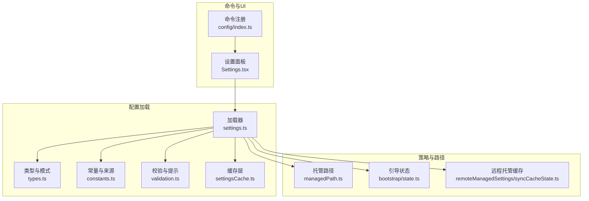
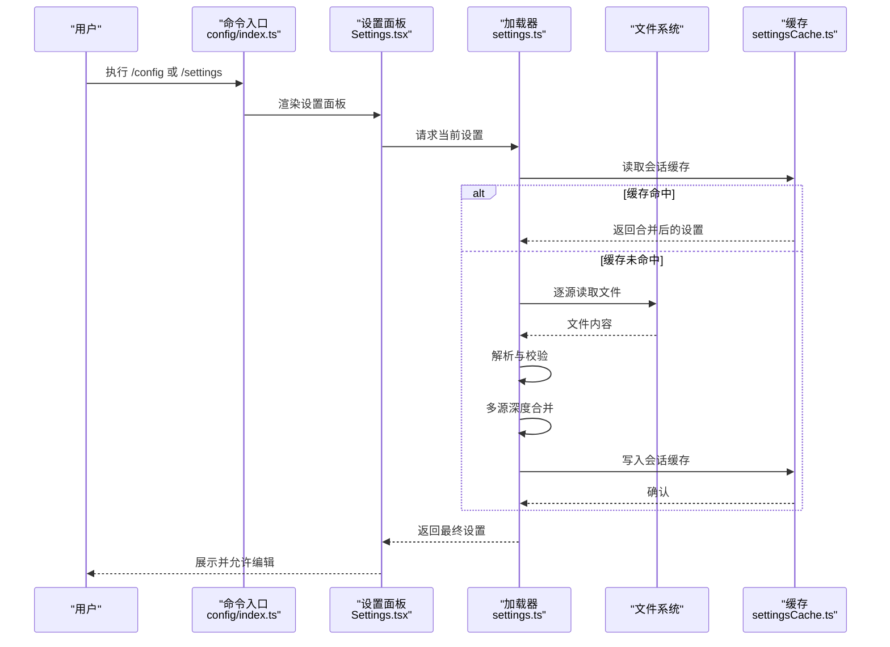
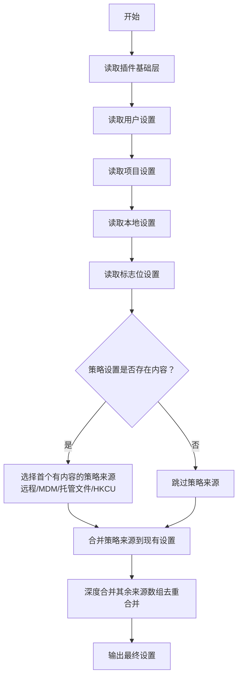
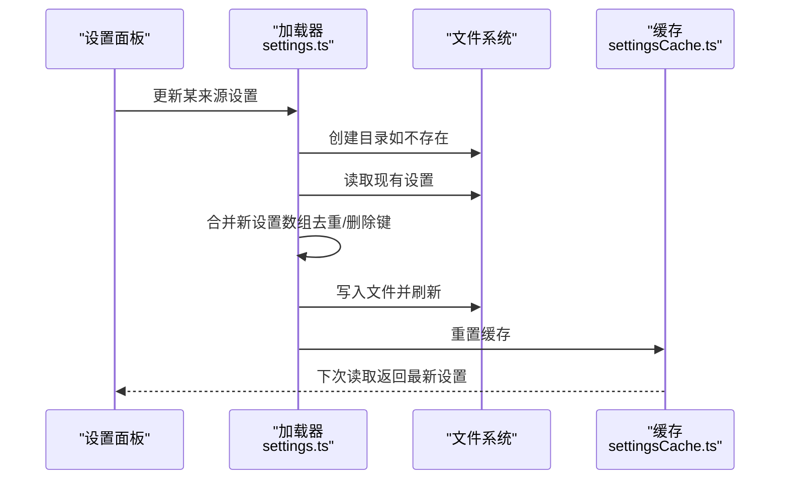
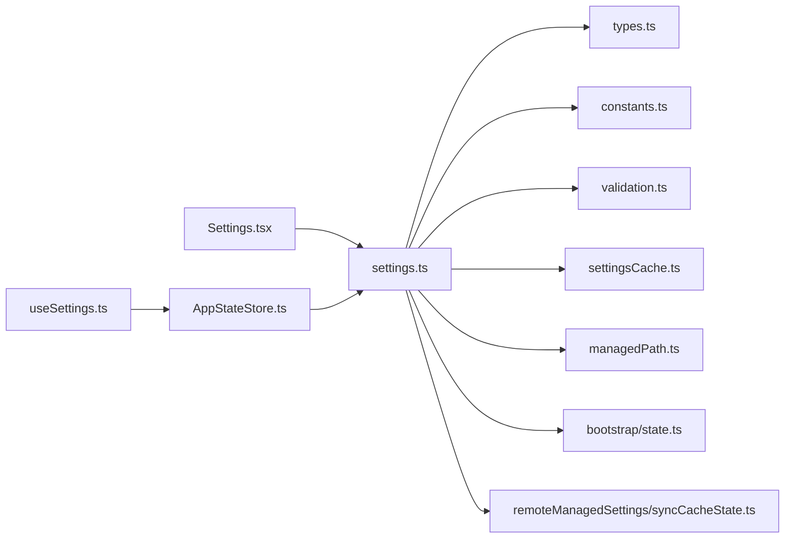

# 配置与定制

<cite>
**本文引用的文件**
- [src/commands/config/index.ts](file://src/commands/config/index.ts)
- [src/commands/config/config.tsx](file://src/commands/config/config.tsx)
- [src/components/Settings/Settings.tsx](file://src/components/Settings/Settings.tsx)
- [src/hooks/useSettings.ts](file://src/hooks/useSettings.ts)
- [src/state/AppStateStore.ts](file://src/state/AppStateStore.ts)
- [src/utils/settings/settings.ts](file://src/utils/settings/settings.ts)
- [src/utils/settings/types.ts](file://src/utils/settings/types.ts)
- [src/utils/settings/constants.ts](file://src/utils/settings/constants.ts)
- [src/utils/settings/validation.ts](file://src/utils/settings/validation.ts)
- [src/utils/settings/managedPath.ts](file://src/utils/settings/managedPath.ts)
- [src/utils/settings/settingsCache.ts](file://src/utils/settings/settingsCache.ts)
- [src/utils/settings/mdm/settings.ts](file://src/utils/settings/mdm/settings.ts)
- [src/bootstrap/state.ts](file://src/bootstrap/state.ts)
- [src/services/remoteManagedSettings/syncCacheState.ts](file://src/services/remoteManagedSettings/syncCacheState.ts)
- [src/utils/envUtils.ts](file://src/utils/envUtils.ts)
- [src/utils/file.ts](file://src/utils/file.ts)
- [src/utils/fsOperations.ts](file://src/utils/fsOperations.ts)
- [src/utils/gitignore.ts](file://src/utils/gitignore.ts)
- [src/utils/json.ts](file://src/utils/json.ts)
- [src/utils/log.ts](file://src/utils/log.ts)
- [src/utils/platform.ts](file://src/utils/platform.ts)
- [src/utils/startupProfiler.ts](file://src/utils/startupProfiler.ts)
- [src/utils/lazySchema.ts](file://src/utils/lazySchema.ts)
- [src/schemas/hooks.ts](file://src/schemas/hooks.ts)
- [src/utils/plugins/schemas.ts](file://src/utils/plugins/schemas.ts)
- [src/utils/permissions/PermissionMode.ts](file://src/utils/permissions/PermissionMode.ts)
- [src/utils/thinking.ts](file://src/utils/thinking.ts)
- [src/utils/settings/internalWrites.ts](file://src/utils/settings/internalWrites.ts)
- [src/utils/settings/permissionValidation.ts](file://src/utils/settings/permissionValidation.ts)
- [src/utils/settings/schemaOutput.ts](file://src/utils/settings/schemaOutput.ts)
- [src/utils/settings/validationTips.ts](file://src/utils/settings/validationTips.ts)
- [src/utils/array.ts](file://src/utils/array.ts)
- [src/utils/stringUtils.ts](file://src/utils/stringUtils.ts)
- [src/utils/errors.ts](file://src/utils/errors.ts)
- [src/utils/fileRead.ts](file://src/utils/fileRead.ts)
- [src/utils/diagLogs.ts](file://src/utils/diagLogs.ts)
- [src/utils/debug.ts](file://src/utils/debug.ts)
- [src/utils/slowOperations.ts](file://src/utils/slowOperations.ts)
- [src/utils/permissions/denialTracking.ts](file://src/utils/permissions/denialTracking.ts)
- [src/utils/teammate.ts](file://src/utils/teammate.ts)
- [src/utils/PromptSuggestion/promptSuggestion.ts](file://src/utils/PromptSuggestion/promptSuggestion.ts)
- [src/utils/model/model.ts](file://src/utils/model/model.ts)
- [src/utils/settings/getInitialSettings.ts](file://src/utils/settings/getInitialSettings.ts)
- [src/utils/settings/getEmptyToolPermissionContext.ts](file://src/utils/settings/getEmptyToolPermissionContext.ts)
- [src/utils/settings/getOriginalCwd.ts](file://src/utils/settings/getOriginalCwd.ts)
- [src/utils/settings/getFlagSettingsInline.ts](file://src/utils/settings/getFlagSettingsInline.ts)
- [src/utils/settings/getFlagSettingsPath.ts](file://src/utils/settings/getFlagSettingsPath.ts)
- [src/utils/settings/getUseCoworkPlugins.ts](file://src/utils/settings/getUseCoworkPlugins.ts)
- [src/utils/settings/isEnvTruthy.ts](file://src/utils/settings/isEnvTruthy.ts)
- [src/utils/settings/getClaudeConfigHomeDir.ts](file://src/utils/settings/getClaudeConfigHomeDir.ts)
- [src/utils/settings/getManagedSettingsDropInDir.ts](file://src/utils/settings/getManagedSettingsDropInDir.ts)
- [src/utils/settings/getManagedFilePath.ts](file://src/utils/settings/getManagedFilePath.ts)
- [src/utils/settings/getHkcuSettings.ts](file://src/utils/settings/getHkcuSettings.ts)
- [src/utils/settings/getMdmSettings.ts](file://src/utils/settings/getMdmSettings.ts)
- [src/utils/settings/getRemoteManagedSettingsSyncFromCache.ts](file://src/utils/settings/getRemoteManagedSettingsSyncFromCache.ts)
- [src/utils/settings/getSettingsRootPathForSource.ts](file://src/utils/settings/getSettingsRootPathForSource.ts)
- [src/utils/settings/getSettingsFilePathForSource.ts](file://src/utils/settings/getSettingsFilePathForSource.ts)
- [src/utils/settings/getRelativeSettingsFilePathForSource.ts](file://src/utils/settings/getRelativeSettingsFilePathForSource.ts)
- [src/utils/settings/getSettingsForSource.ts](file://src/utils/settings/getSettingsForSource.ts)
- [src/utils/settings/getPolicySettingsOrigin.ts](file://src/utils/settings/getPolicySettingsOrigin.ts)
- [src/utils/settings/updateSettingsForSource.ts](file://src/utils/settings/updateSettingsForSource.ts)
- [src/utils/settings/settingsMergeCustomizer.ts](file://src/utils/settings/settingsMergeCustomizer.ts)
- [src/utils/settings/getManagedSettingsKeysForLogging.ts](file://src/utils/settings/getManagedSettingsKeysForLogging.ts)
- [src/utils/settings/loadSettingsFromDisk.ts](file://src/utils/settings/loadSettingsFromDisk.ts)
- [src/utils/settings/parseSettingsFile.ts](file://src/utils/settings/parseSettingsFile.ts)
- [src/utils/settings/loadManagedFileSettings.ts](file://src/utils/settings/loadManagedFileSettings.ts)
- [src/utils/settings/getManagedFileSettingsPresence.ts](file://src/utils/settings/getManagedFileSettingsPresence.ts)
- [src/utils/settings/handleFileSystemError.ts](file://src/utils/settings/handleFileSystemError.ts)
- [src/utils/settings/getSettingsRootPathForSource.ts](file://src/utils/settings/getSettingsRootPathForSource.ts)
- [src/utils/settings/getUserSettingsFilePath.ts](file://src/utils/settings/getUserSettingsFilePath.ts)
- [src/utils/settings/getSettingsForSourceUncached.ts](file://src/utils/settings/getSettingsForSourceUncached.ts)
- [src/utils/settings/getPolicySettingsOrigin.ts](file://src/utils/settings/getPolicySettingsOrigin.ts)
- [src/utils/settings/updateSettingsForSource.ts](file://src/utils/settings/updateSettingsForSource.ts)
- [src/utils/settings/settingsMergeCustomizer.ts](file://src/utils/settings/settingsMergeCustomizer.ts)
- [src/utils/settings/getManagedSettingsKeysForLogging.ts](file://src/utils/settings/getManagedSettingsKeysForLogging.ts)
- [src/utils/settings/loadSettingsFromDisk.ts](file://src/utils/settings/loadSettingsFromDisk.ts)
- [src/utils/settings/parseSettingsFile.ts](file://src/utils/settings/parseSettingsFile.ts)
- [src/utils/settings/loadManagedFileSettings.ts](file://src/utils/settings/loadManagedFileSettings.ts)
- [src/utils/settings/getManagedFileSettingsPresence.ts](file://src/utils/settings/getManagedFileSettingsPresence.ts)
- [src/utils/settings/handleFileSystemError.ts](file://src/utils/settings/handleFileSystemError.ts)
</cite>

## 目录
1. [简介](#简介)
2. [项目结构](#项目结构)
3. [核心组件](#核心组件)
4. [架构总览](#架构总览)
5. [详细组件分析](#详细组件分析)
6. [依赖关系分析](#依赖关系分析)
7. [性能考量](#性能考量)
8. [故障排查指南](#故障排查指南)
9. [结论](#结论)
10. [附录](#附录)

## 简介
本文件系统性阐述 Claude Code 的配置与定制体系：涵盖配置架构、配置项分类与优先级、持久化机制、文件格式与位置、环境变量使用方式、导入导出与备份迁移、最佳实践与常见场景示例。目标是帮助用户在不同层级（个人、项目、企业策略）灵活定制工具行为，同时确保可维护性与安全性。

## 项目结构
配置系统围绕“源（Source）—合并（Merge）—应用（Apply）”展开，主要涉及以下模块：
- 命令入口与 UI：命令注册、设置面板入口、React 设置组件
- 源与路径：用户、项目、本地、策略（托管）、标志位（CLI/SDK）等来源的定位与读取
- 解析与校验：JSON 解析、Zod 校验、错误格式化与提示
- 合并与缓存：按优先级合并、会话级缓存、路径级缓存
- 写入与变更检测：写入持久化、内部写入标记、变更触发重算
- 远程与策略：远程托管设置、MDM/HKCU/HKLM、企业白/黑名单
- 类型与模式：SettingsSchema 定义、Hook/Marketplace/权限规则等子模式

**图表来源**
- [src/commands/config/index.ts](file://src/commands/config/index.ts)
- [src/commands/config/config.tsx](file://src/commands/config/config.tsx)
- [src/components/Settings/Settings.tsx](file://src/components/Settings/Settings.tsx)
- [src/utils/settings/settings.ts](file://src/utils/settings/settings.ts)
- [src/utils/settings/types.ts](file://src/utils/settings/types.ts)
- [src/utils/settings/constants.ts](file://src/utils/settings/constants.ts)
- [src/utils/settings/validation.ts](file://src/utils/settings/validation.ts)
- [src/utils/settings/settingsCache.ts](file://src/utils/settings/settingsCache.ts)
- [src/utils/settings/managedPath.ts](file://src/utils/settings/managedPath.ts)
- [src/bootstrap/state.ts](file://src/bootstrap/state.ts)
- [src/services/remoteManagedSettings/syncCacheState.ts](file://src/services/remoteManagedSettings/syncCacheState.ts)

**章节来源**
- [src/commands/config/index.ts](file://src/commands/config/index.ts)
- [src/commands/config/config.tsx](file://src/commands/config/config.tsx)
- [src/components/Settings/Settings.tsx](file://src/components/Settings/Settings.tsx)
- [src/utils/settings/settings.ts](file://src/utils/settings/settings.ts)
- [src/utils/settings/types.ts](file://src/utils/settings/types.ts)
- [src/utils/settings/constants.ts](file://src/utils/settings/constants.ts)
- [src/utils/settings/validation.ts](file://src/utils/settings/validation.ts)
- [src/utils/settings/settingsCache.ts](file://src/utils/settings/settingsCache.ts)
- [src/utils/settings/managedPath.ts](file://src/utils/settings/managedPath.ts)
- [src/bootstrap/state.ts](file://src/bootstrap/state.ts)
- [src/services/remoteManagedSettings/syncCacheState.ts](file://src/services/remoteManagedSettings/syncCacheState.ts)

## 核心组件
- 命令入口与设置面板
  - 命令注册：将“config”命令映射到设置面板组件，支持别名“settings”
  - 设置面板：以“Config”为默认标签页打开，作为用户交互入口
- 应用状态与设置访问
  - AppState 中包含 settings 字段；useSettings 提供 React Hook 访问，支持文件变更时自动更新
- 配置加载与合并
  - 加载器负责从多源读取、解析、校验、合并，并生成最终设置
  - 支持插件基础层、用户、项目、本地、标志位、策略（托管/远程）等来源
- 缓存与性能
  - 会话级缓存、按来源缓存、路径级解析缓存，避免重复 IO 与解析
- 写入与变更
  - 更新某来源设置会写入对应文件，触发缓存失效与后续重计算
- 策略与企业控制
  - 远程托管、MDM/HKCU/HKLM、托管文件（含 drop-in）、企业 MCP 白/黑名单、权限规则等

**章节来源**
- [src/commands/config/index.ts](file://src/commands/config/index.ts)
- [src/commands/config/config.tsx](file://src/commands/config/config.tsx)
- [src/hooks/useSettings.ts](file://src/hooks/useSettings.ts)
- [src/state/AppStateStore.ts](file://src/state/AppStateStore.ts)
- [src/utils/settings/settings.ts](file://src/utils/settings/settings.ts)
- [src/utils/settings/settingsCache.ts](file://src/utils/settings/settingsCache.ts)

## 架构总览
配置系统采用“多源分层、严格优先级、深度合并”的架构。优先级从低到高依次为：插件基础层 → 用户设置 → 项目设置 → 本地设置 → 标志位设置 → 策略设置（远程/MDM/托管文件/HKCU）。其中策略设置遵循“首个有内容即胜出”的原则，且始终参与合并但不被用户直接修改。

**图表来源**
- [src/commands/config/index.ts](file://src/commands/config/index.ts)
- [src/commands/config/config.tsx](file://src/commands/config/config.tsx)
- [src/utils/settings/settings.ts](file://src/utils/settings/settings.ts)
- [src/utils/settings/settingsCache.ts](file://src/utils/settings/settingsCache.ts)

**章节来源**
- [src/utils/settings/settings.ts](file://src/utils/settings/settings.ts)
- [src/utils/settings/constants.ts](file://src/utils/settings/constants.ts)

## 详细组件分析

### 配置来源与优先级
- 来源列表（按优先级从低到高）
  - 插件基础层：由插件加载器写入的基础设置，最低优先级
  - 用户设置：用户主目录下的 settings.json（或 cowork_settings.json）
  - 项目设置：工作目录 .claude/settings.json
  - 本地设置：工作目录 .claude/settings.local.json（会被 .gitignore 忽略）
  - 标志位设置：CLI --settings 文件路径或 SDK 内联设置
  - 策略设置：远程托管、MDM/HKLM/plist、托管文件（managed-settings.json 及 drop-in）、HKCU
- 策略设置“首个有内容即胜出”：优先返回第一个存在内容的来源（远程 > MDM > 托管文件 > HKCU），随后再与其他来源合并
- 可用来源可通过 CLI 控制，策略与标志位始终参与合并

**图表来源**
- [src/utils/settings/settings.ts](file://src/utils/settings/settings.ts)
- [src/utils/settings/constants.ts](file://src/utils/settings/constants.ts)
- [src/utils/settings/managedPath.ts](file://src/utils/settings/managedPath.ts)
- [src/bootstrap/state.ts](file://src/bootstrap/state.ts)
- [src/services/remoteManagedSettings/syncCacheState.ts](file://src/services/remoteManagedSettings/syncCacheState.ts)

**章节来源**
- [src/utils/settings/constants.ts](file://src/utils/settings/constants.ts)
- [src/utils/settings/settings.ts](file://src/utils/settings/settings.ts)
- [src/utils/settings/managedPath.ts](file://src/utils/settings/managedPath.ts)
- [src/bootstrap/state.ts](file://src/bootstrap/state.ts)
- [src/services/remoteManagedSettings/syncCacheState.ts](file://src/services/remoteManagedSettings/syncCacheState.ts)

### 配置文件格式与位置
- 文件格式
  - JSON，使用 Zod Schema 校验，支持未知字段保留、类型强制转换、数组去重合并
- 文件位置
  - 用户设置：用户主目录下的 settings.json 或 cowork_settings.json（受 cowork 模式影响）
  - 项目设置：工作目录 .claude/settings.json
  - 本地设置：工作目录 .claude/settings.local.json（自动加入 .gitignore）
  - 策略设置：平台特定目录下的 managed-settings.json 与 managed-settings.d/ 子文件
  - 标志位设置：CLI --settings 指定的路径或 SDK 内联设置
- 路径解析
  - 使用安全解析与平台适配，支持符号链接与不存在文件的容错处理

**章节来源**
- [src/utils/settings/settings.ts](file://src/utils/settings/settings.ts)
- [src/utils/settings/managedPath.ts](file://src/utils/settings/managedPath.ts)
- [src/utils/settings/getUserSettingsFilePath.ts](file://src/utils/settings/getUserSettingsFilePath.ts)
- [src/utils/settings/getSettingsFilePathForSource.ts](file://src/utils/settings/getSettingsFilePathForSource.ts)
- [src/utils/settings/getRelativeSettingsFilePathForSource.ts](file://src/utils/settings/getRelativeSettingsFilePathForSource.ts)
- [src/utils/settings/getSettingsRootPathForSource.ts](file://src/utils/settings/getSettingsRootPathForSource.ts)
- [src/utils/settings/loadManagedFileSettings.ts](file://src/utils/settings/loadManagedFileSettings.ts)
- [src/utils/settings/getManagedFileSettingsPresence.ts](file://src/utils/settings/getManagedFileSettingsPresence.ts)
- [src/utils/settings/handleFileSystemError.ts](file://src/utils/settings/handleFileSystemError.ts)

### 配置项分类与作用域
- 模型与输出
  - model：覆盖默认模型
  - availableModels：企业模型白名单
  - modelOverrides：模型 ID 映射（如 Bedrock 推理配置 ARN）
  - outputStyle：响应输出风格
  - language：首选语言
  - advisorModel：服务器端 advisor 工具使用的模型
  - fastMode/fastModePerSessionOptIn：快速模式开关与会话内开关
- 行为与体验
  - cleanupPeriodDays：聊天记录保留天数（0 表示禁用持久化）
  - respectGitignore：文件选择器是否尊重 .gitignore
  - feedbackSurveyRate：反馈调查出现概率
  - spinnerTipsEnabled/spinnerVerbs/spinnerTipsOverride：旋转提示与动词自定义
  - syntaxHighlightingDisabled：禁用差异语法高亮
  - terminalTitleFromRename：重命名是否更新终端标题
  - alwaysThinkingEnabled：思考模式开关
  - effortLevel：努力级别
  - promptSuggestionEnabled：提示建议开关
  - showClearContextOnPlanAccept：计划接受时显示“清空上下文”选项
  - companyAnnouncements：启动公告
- 权限与沙箱
  - permissions：工具使用权限规则（allow/deny/ask/defaultMode/disableBypassPermissionsMode/disableAutoMode/additionalDirectories）
  - sandbox：沙箱策略（启用/失败回退/网络/文件系统/违规忽略/命令白名单等）
- 插件与市场
  - enabledPlugins：插件启用清单（支持扩展格式）
  - extraKnownMarketplaces：仓库额外可用市场
  - strictKnownMarketplaces/blockedMarketplaces：企业市场白/黑名单
  - pluginConfigs：按插件维度的 MCP 服务器与选项配置
- MCP 服务器
  - enableAllProjectMcpServers/enabledMcpjsonServers/disabledMcpjsonServers：项目 MCP 服务器批准/拒绝
  - allowedMcpServers/deniedMcpServers：企业 MCP 服务器白/黑名单
- 钩子与状态行
  - hooks：工具执行前后钩子
  - statusLine：自定义状态行命令
  - disableAllHooks：禁用所有钩子与状态行
  - allowManagedHooksOnly：仅运行托管钩子
  - allowedHttpHookUrls/httpHookAllowedEnvVars：HTTP 钩子 URL 与环境变量白名单
- Git 工作树
  - worktree.symlinkDirectories/worktree.sparsePaths：工作树符号链接与稀疏检出
- 登录与认证
  - forceLoginMethod/forceLoginOrgUUID：强制登录方式与组织 UUID
  - apiKeyHelper/awsCredentialExport/awsAuthRefresh/gcpAuthRefresh/xaaIdp：认证辅助脚本与 OIDC 配置
- 其他
  - env：会话环境变量
  - attribution/includeGitInstructions/includeCoAuthoredBy：提交/PR 归属与说明
  - otelHeadersHelper：OpenTelemetry 头部辅助脚本
  - defaultShell：输入框 ! 命令默认 Shell
  - skipWebFetchPreflight：跳过 WebFetch 黑名单预检（企业环境）

**章节来源**
- [src/utils/settings/types.ts](file://src/utils/settings/types.ts)
- [src/utils/settings/settings.ts](file://src/utils/settings/settings.ts)
- [src/schemas/hooks.ts](file://src/schemas/hooks.ts)
- [src/utils/plugins/schemas.ts](file://src/utils/plugins/schemas.ts)
- [src/utils/permissions/PermissionMode.ts](file://src/utils/permissions/PermissionMode.ts)

### 环境变量与外部注入
- 环境变量
  - 通过 env 字段注入到会话环境中；部分内置特性通过环境变量开关（如 XAA）
- 标志位设置
  - CLI --settings 指定文件路径；SDK 内联设置通过标志位来源合并
- 内部写入标记
  - 写入设置文件前标记内部写入，避免循环监听与误判

**章节来源**
- [src/utils/settings/types.ts](file://src/utils/settings/types.ts)
- [src/utils/settings/getFlagSettingsInline.ts](file://src/utils/settings/getFlagSettingsInline.ts)
- [src/utils/settings/getFlagSettingsPath.ts](file://src/utils/settings/getFlagSettingsPath.ts)
- [src/utils/settings/internalWrites.ts](file://src/utils/settings/internalWrites.ts)

### 导入导出与备份迁移
- 导入/导出
  - 存在“export”命令入口，用于将当前对话导出到文件或剪贴板
  - “config”命令入口提供设置面板，便于查看与编辑
- 备份与迁移
  - 用户设置位于用户主目录，可直接复制 settings.json 或 cowork_settings.json 进行迁移
  - 项目设置位于 .claude/settings.json，随仓库迁移
  - 本地设置 settings.local.json 默认被 .gitignore 忽略，适合存放敏感或本地化配置
  - 策略设置位于平台特定目录，需管理员权限管理（macOS plist/HKLM/Windows 注册表/HKCU）

**章节来源**
- [src/commands/export/index.ts](file://src/commands/export/index.ts)
- [src/commands/config/index.ts](file://src/commands/config/index.ts)
- [src/utils/settings/getUserSettingsFilePath.ts](file://src/utils/settings/getUserSettingsFilePath.ts)
- [src/utils/settings/managedPath.ts](file://src/utils/settings/managedPath.ts)

### 写入流程与变更检测
- 写入流程
  - 仅允许对可编辑来源（用户/项目/本地/插件）写入；策略与标志位来源为只读
  - 写入前创建目录，读取现有设置并进行合并（数组去重、undefined 删除键）
  - 写入后刷新缓存，必要时将本地设置文件加入 .gitignore
- 变更检测
  - 文件变更触发设置变更检测，驱动 UI 与业务逻辑更新

**图表来源**
- [src/utils/settings/settings.ts](file://src/utils/settings/settings.ts)
- [src/utils/settings/updateSettingsForSource.ts](file://src/utils/settings/updateSettingsForSource.ts)
- [src/utils/settings/settingsCache.ts](file://src/utils/settings/settingsCache.ts)
- [src/utils/gitignore.ts](file://src/utils/gitignore.ts)

**章节来源**
- [src/utils/settings/settings.ts](file://src/utils/settings/settings.ts)
- [src/utils/settings/updateSettingsForSource.ts](file://src/utils/settings/updateSettingsForSource.ts)
- [src/utils/settings/settingsCache.ts](file://src/utils/settings/settingsCache.ts)
- [src/utils/gitignore.ts](file://src/utils/gitignore.ts)

### 错误处理与校验
- 解析与校验
  - JSON 解析失败：记录错误并返回空设置
  - Zod 校验失败：格式化错误信息（含字段路径、期望值、建议、文档链接）
  - 权限规则过滤：单条无效规则会被跳过并给出警告，避免整文件被拒
- 日志与诊断
  - 诊断日志记录设置加载开始/结束、耗时、来源数量、错误数量
  - 调试日志记录断链/缺失文件等异常

**章节来源**
- [src/utils/settings/validation.ts](file://src/utils/settings/validation.ts)
- [src/utils/settings/parseSettingsFile.ts](file://src/utils/settings/parseSettingsFile.ts)
- [src/utils/settings/parseSettingsFileUncached.ts](file://src/utils/settings/parseSettingsFileUncached.ts)
- [src/utils/settings/filterInvalidPermissionRules.ts](file://src/utils/settings/filterInvalidPermissionRules.ts)
- [src/utils/settings/handleFileSystemError.ts](file://src/utils/settings/handleFileSystemError.ts)
- [src/utils/diagLogs.ts](file://src/utils/diagLogs.ts)
- [src/utils/debug.ts](file://src/utils/debug.ts)

### 最佳实践
- 分层治理
  - 个人偏好放用户设置；团队共享放项目设置；本地敏感放本地设置；企业策略统一通过托管/远程/MCM/HKCU/HKLM 管控
- 安全与合规
  - 企业 MCP 服务器使用白/黑名单控制；权限规则仅在托管中生效时，可开启“仅托管规则”限制
  - 严格插件定制：通过策略锁定非插件来源，确保企业可控
- 性能与稳定性
  - 合理使用缓存与最小化写入；避免频繁切换 fastMode；谨慎调整 hooks 与状态行
- 可观测性
  - 使用 /status 查看托管设置存在情况；利用诊断日志定位问题

**章节来源**
- [src/utils/settings/constants.ts](file://src/utils/settings/constants.ts)
- [src/utils/settings/types.ts](file://src/utils/settings/types.ts)
- [src/utils/settings/getManagedFileSettingsPresence.ts](file://src/utils/settings/getManagedFileSettingsPresence.ts)
- [src/utils/diagLogs.ts](file://src/utils/diagLogs.ts)

## 依赖关系分析

**图表来源**
- [src/utils/settings/settings.ts](file://src/utils/settings/settings.ts)
- [src/utils/settings/types.ts](file://src/utils/settings/types.ts)
- [src/utils/settings/constants.ts](file://src/utils/settings/constants.ts)
- [src/utils/settings/validation.ts](file://src/utils/settings/validation.ts)
- [src/utils/settings/settingsCache.ts](file://src/utils/settings/settingsCache.ts)
- [src/utils/settings/managedPath.ts](file://src/utils/settings/managedPath.ts)
- [src/bootstrap/state.ts](file://src/bootstrap/state.ts)
- [src/services/remoteManagedSettings/syncCacheState.ts](file://src/services/remoteManagedSettings/syncCacheState.ts)
- [src/components/Settings/Settings.tsx](file://src/components/Settings/Settings.tsx)
- [src/hooks/useSettings.ts](file://src/hooks/useSettings.ts)
- [src/state/AppStateStore.ts](file://src/state/AppStateStore.ts)

**章节来源**
- [src/utils/settings/settings.ts](file://src/utils/settings/settings.ts)
- [src/components/Settings/Settings.tsx](file://src/components/Settings/Settings.tsx)
- [src/hooks/useSettings.ts](file://src/hooks/useSettings.ts)
- [src/state/AppStateStore.ts](file://src/state/AppStateStore.ts)

## 性能考量
- 缓存策略
  - 会话级缓存：避免重复合并
  - 按来源缓存：减少重复读取
  - 路径级解析缓存：避免重复解析同一文件
- 启动性能
  - 启动剖析记录设置加载阶段耗时；仅在必要时进行深度合并与校验
- I/O 优化
  - 写入采用同步刷新与原子写入策略，减少碎片与竞态

**章节来源**
- [src/utils/settings/settingsCache.ts](file://src/utils/settings/settingsCache.ts)
- [src/utils/startupProfiler.ts](file://src/utils/startupProfiler.ts)
- [src/utils/file.ts](file://src/utils/file.ts)

## 故障排查指南
- JSON 语法错误
  - 现象：设置文件无法解析
  - 处理：修复 JSON 语法；若解析失败但文件存在，系统会尝试读取原始内容并记录调试日志
- 字段类型/枚举错误
  - 现象：字段类型不符或枚举值不在允许集合
  - 处理：根据格式化错误提示修正；可参考完整 Schema 与文档链接
- 权限规则无效
  - 现象：单条权限规则被跳过
  - 处理：检查规则格式与合法性；其他规则不受影响
- 文件系统异常
  - 现象：符号链接断链或目录不存在
  - 处理：记录调试日志；确认路径与权限
- 策略来源冲突
  - 现象：多个策略来源同时存在
  - 处理：遵循“首个有内容即胜出”原则；通过 /status 查看来源

**章节来源**
- [src/utils/settings/validation.ts](file://src/utils/settings/validation.ts)
- [src/utils/settings/parseSettingsFile.ts](file://src/utils/settings/parseSettingsFile.ts)
- [src/utils/settings/handleFileSystemError.ts](file://src/utils/settings/handleFileSystemError.ts)
- [src/utils/settings/getManagedFileSettingsPresence.ts](file://src/utils/settings/getManagedFileSettingsPresence.ts)

## 结论
Claude Code 的配置系统以“多源分层、严格优先级、深度合并”为核心，结合缓存与可观测性，既满足个人定制，又支持企业策略管控。通过清晰的来源划分、完善的校验与错误提示、以及便捷的导入导出能力，用户可以在保证安全与稳定的同时，灵活调整工具行为，提升开发效率。

## 附录

### 常见配置场景示例
- 企业模型白名单与模型映射
  - 在托管设置中配置 availableModels 与 modelOverrides，限制可用模型并映射到企业后端资源
- MCP 服务器白/黑名单
  - 使用 allowedMcpServers/deniedMcpServers 控制可连接的 MCP 服务器，保障网络安全
- 权限与沙箱策略
  - 在 permissions 中设置 allow/deny/ask 与 additionalDirectories；在 sandbox 中细化网络/文件系统隔离
- 输出风格与语言
  - 通过 outputStyle 与 language 统一团队响应风格与语言
- 快速模式与思考模式
  - 使用 fastMode 与 alwaysThinkingEnabled 调整性能与思考行为
- 插件与市场
  - 通过 enabledPlugins 与 extraKnownMarketplaces 管理插件生态；strictKnownMarketplaces/blockedMarketplaces 控制来源

**章节来源**
- [src/utils/settings/types.ts](file://src/utils/settings/types.ts)
- [src/utils/settings/settings.ts](file://src/utils/settings/settings.ts)