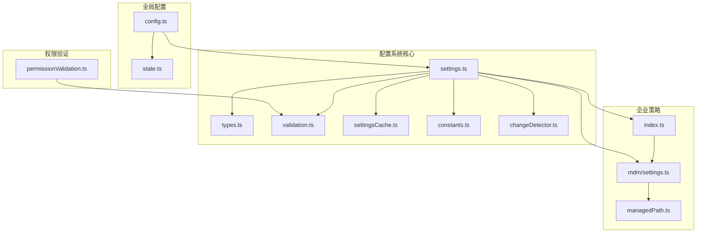
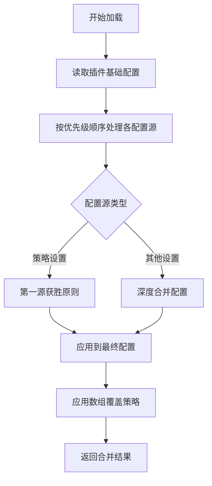
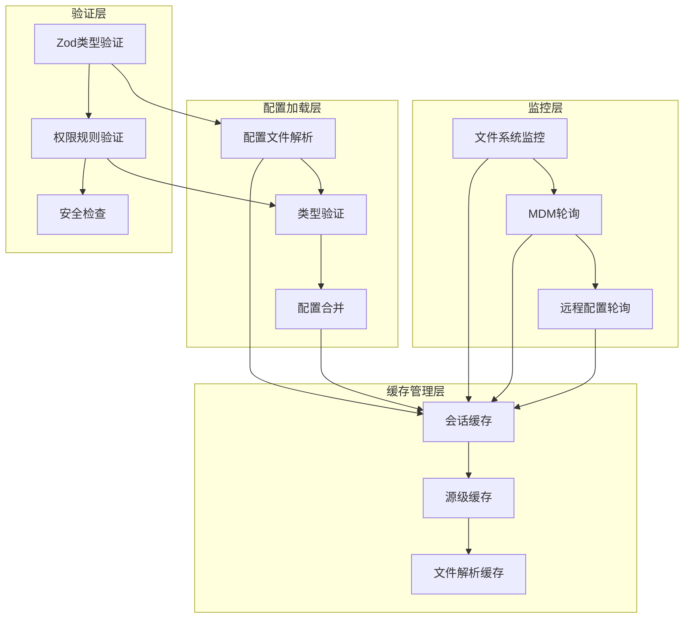
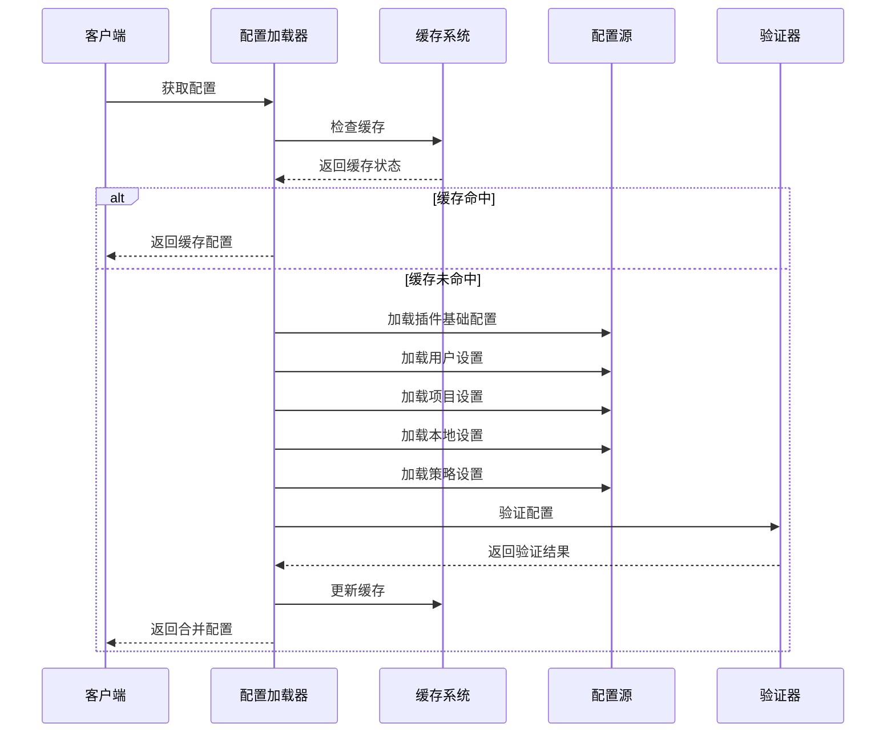
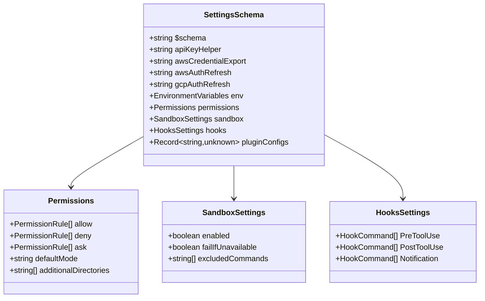
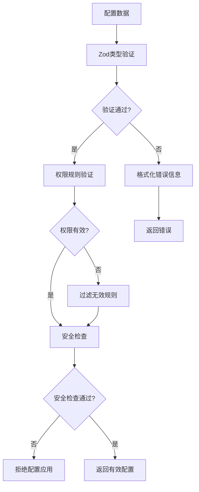
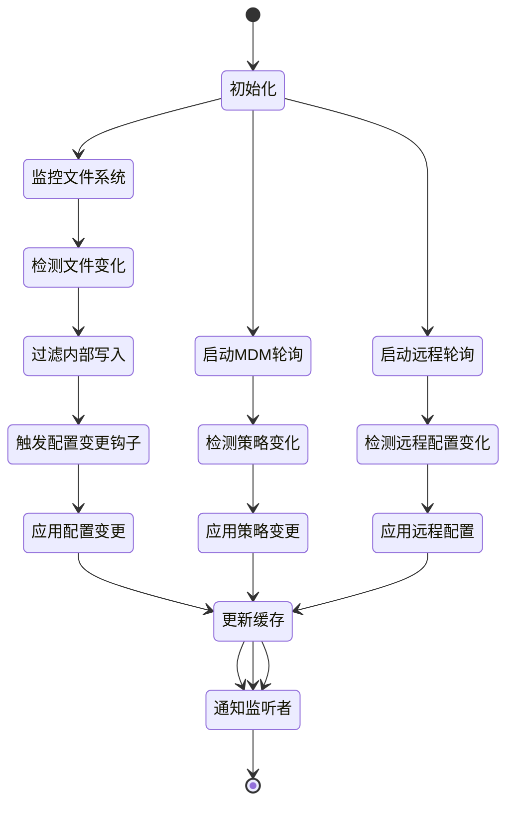
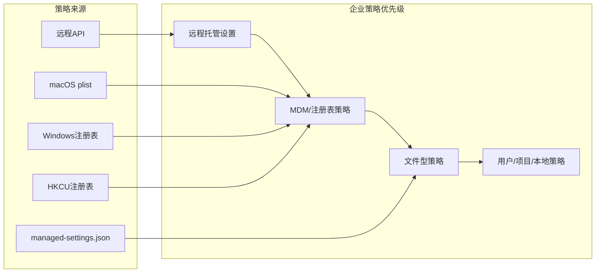
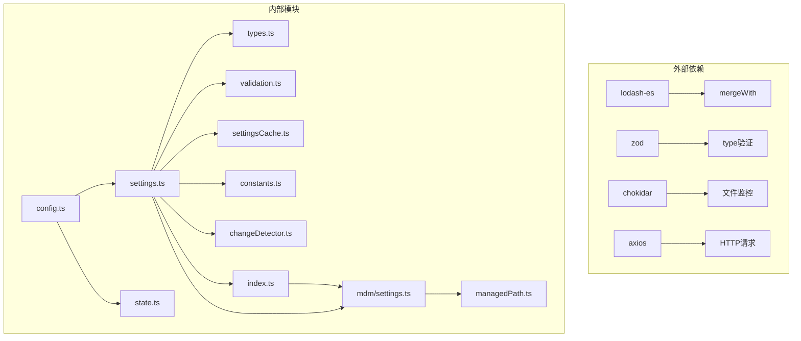

# 配置系统架构

<cite>
**本文档引用的文件**
- [settings.ts](file://src/utils/settings/settings.ts)
- [types.ts](file://src/utils/settings/types.ts)
- [validation.ts](file://src/utils/settings/validation.ts)
- [settingsCache.ts](file://src/utils/settings/settingsCache.ts)
- [constants.ts](file://src/utils/settings/constants.ts)
- [changeDetector.ts](file://src/utils/settings/changeDetector.ts)
- [mdm/settings.ts](file://src/utils/settings/mdm/settings.ts)
- [managedPath.ts](file://src/utils/settings/managedPath.ts)
- [index.ts](file://src/services/remoteManagedSettings/index.ts)
- [config.ts](file://src/utils/config.ts)
- [state.ts](file://src/bootstrap/state.ts)
- [permissionValidation.ts](file://src/utils/settings/permissionValidation.ts)
</cite>

## 目录
1. [简介](#简介)
2. [项目结构](#项目结构)
3. [核心组件](#核心组件)
4. [架构总览](#架构总览)
5. [详细组件分析](#详细组件分析)
6. [依赖关系分析](#依赖关系分析)
7. [性能考虑](#性能考虑)
8. [故障排除指南](#故障排除指南)
9. [结论](#结论)

## 简介

Claude Code 的配置系统是一个多层次、高可靠性的配置管理框架，支持从默认配置到用户配置再到企业策略的完整优先级链路。该系统采用声明式架构，通过严格的类型验证、智能缓存和热重载机制，确保配置的一致性和实时性。

系统的核心特性包括：
- 分层配置优先级：从插件基础配置到用户本地配置，再到企业策略配置
- 强类型的配置验证：基于 Zod 的运行时类型检查和编译时类型推导
- 智能缓存策略：多级缓存避免重复解析和磁盘访问
- 实时热重载：文件系统监控和远程配置轮询
- 安全的企业策略：MDM/注册表/远程配置的严格优先级控制

## 项目结构

配置系统主要分布在以下目录中：

**图表来源**
- [settings.ts:1-1016](file://src/utils/settings/settings.ts#L1-L1016)
- [types.ts:1-1149](file://src/utils/settings/types.ts#L1-L1149)
- [mdm/settings.ts:1-317](file://src/utils/settings/mdm/settings.ts#L1-L317)

**章节来源**
- [settings.ts:1-1016](file://src/utils/settings/settings.ts#L1-L1016)
- [types.ts:1-1149](file://src/utils/settings/types.ts#L1-L1149)

## 核心组件

### 配置源层次结构

配置系统采用五层优先级架构：

1. **插件基础配置** (最低优先级)
   - 来自已加载插件的允许字段
   - 作为所有其他配置的基础层

2. **用户设置** (用户主目录)
   - `~/.claude/settings.json` 或 `~/.claude/cowork_settings.json`
   - 支持协作模式切换

3. **项目设置** (工作目录共享)
   - `$PROJECT/.claude/settings.json`
   - 团队共享配置

4. **本地设置** (忽略版本控制)
   - `$PROJECT/.claude/settings.local.json`
   - 个人私有配置

5. **策略设置** (最高优先级)
   - 远程托管设置
   - MDM/注册表策略
   - 文件型策略 (`managed-settings.json` + drop-in)

6. **命令行设置** (始终包含)
   - `--settings` 标志
   - 内联设置参数

### 配置合并策略

系统使用深度合并策略处理配置冲突：

**图表来源**
- [settings.ts:645-796](file://src/utils/settings/settings.ts#L645-L796)
- [settings.ts:416-524](file://src/utils/settings/settings.ts#L416-L524)

**章节来源**
- [settings.ts:645-796](file://src/utils/settings/settings.ts#L645-L796)
- [constants.ts:1-203](file://src/utils/settings/constants.ts#L1-L203)

## 架构总览

配置系统采用模块化架构，每个组件职责明确：

**图表来源**
- [settingsCache.ts:1-81](file://src/utils/settings/settingsCache.ts#L1-L81)
- [changeDetector.ts:1-489](file://src/utils/settings/changeDetector.ts#L1-L489)
- [validation.ts:1-266](file://src/utils/settings/validation.ts#L1-L266)

## 详细组件分析

### 配置加载引擎

配置加载引擎是系统的核心，负责协调各个配置源的加载和合并：

**图表来源**
- [settings.ts:645-796](file://src/utils/settings/settings.ts#L645-L796)
- [settingsCache.ts:55-59](file://src/utils/settings/settingsCache.ts#L55-L59)

### 类型系统架构

配置系统采用强类型设计，确保配置的完整性和安全性：

**图表来源**
- [types.ts:255-800](file://src/utils/settings/types.ts#L255-L800)
- [types.ts:42-85](file://src/utils/settings/types.ts#L42-L85)

### 验证系统

验证系统确保配置的有效性和安全性：

**图表来源**
- [validation.ts:97-173](file://src/utils/settings/validation.ts#L97-L173)
- [permissionValidation.ts:58-239](file://src/utils/settings/permissionValidation.ts#L58-L239)

**章节来源**
- [validation.ts:1-266](file://src/utils/settings/validation.ts#L1-L266)
- [permissionValidation.ts:1-263](file://src/utils/settings/permissionValidation.ts#L1-L263)

### 缓存策略

系统采用多级缓存策略优化性能：

| 缓存层级 | 缓存内容 | 生命周期 | 清除触发 |
|---------|---------|----------|----------|
| 会话缓存 | 合并后的完整配置 | 整个进程生命周期 | 配置写入、策略变化 |
| 源级缓存 | 单个配置源的解析结果 | 整个进程生命周期 | 配置写入、策略变化 |
| 文件解析缓存 | 文件解析结果 | 整个进程生命周期 | 配置写入、策略变化 |
| MDM缓存 | 企业策略缓存 | 整个进程生命周期 | 轮询更新 |

**章节来源**
- [settingsCache.ts:1-81](file://src/utils/settings/settingsCache.ts#L1-L81)

### 热重载机制

系统通过多种方式实现实时配置更新：

**图表来源**
- [changeDetector.ts:84-168](file://src/utils/settings/changeDetector.ts#L84-L168)
- [changeDetector.ts:437-440](file://src/utils/settings/changeDetector.ts#L437-L440)

**章节来源**
- [changeDetector.ts:1-489](file://src/utils/settings/changeDetector.ts#L1-L489)

### 企业策略管理

企业策略通过多种渠道提供，具有最高的优先级：

**图表来源**
- [mdm/settings.ts:11-14](file://src/utils/settings/mdm/settings.ts#L11-L14)
- [index.ts:8-13](file://src/services/remoteManagedSettings/index.ts#L8-L13)

**章节来源**
- [mdm/settings.ts:1-317](file://src/utils/settings/mdm/settings.ts#L1-L317)
- [index.ts:1-639](file://src/services/remoteManagedSettings/index.ts#L1-L639)

## 依赖关系分析

配置系统的关键依赖关系如下：

**图表来源**
- [settings.ts:1-54](file://src/utils/settings/settings.ts#L1-L54)
- [mdm/settings.ts:21-47](file://src/utils/settings/mdm/settings.ts#L21-L47)

**章节来源**
- [settings.ts:1-54](file://src/utils/settings/settings.ts#L1-L54)
- [mdm/settings.ts:21-47](file://src/utils/settings/mdm/settings.ts#L21-L47)

## 性能考虑

配置系统在多个层面进行了性能优化：

### 缓存优化
- **多级缓存**：避免重复的文件读取和解析
- **懒加载**：仅在需要时才解析配置文件
- **缓存失效**：精确的缓存失效策略，避免过期数据

### 并发处理
- **异步加载**：MDM设置的异步加载不阻塞启动过程
- **并发安全**：使用原子操作确保缓存一致性
- **资源管理**：及时清理不再使用的资源

### I/O优化
- **批量读取**：启动时批量读取相关文件
- **去重处理**：避免重复的文件监控事件
- **延迟初始化**：按需初始化监控器

## 故障排除指南

### 常见问题及解决方案

#### 配置加载失败
**症状**：配置无法正确加载或显示默认值
**排查步骤**：
1. 检查配置文件语法是否正确
2. 验证配置字段是否符合类型要求
3. 查看错误日志中的具体错误信息
4. 确认文件权限是否正确

#### 配置验证错误
**症状**：配置文件存在但被拒绝应用
**排查步骤**：
1. 检查权限规则格式是否正确
2. 验证MCP服务器配置是否有效
3. 确认数组合并策略是否符合预期
4. 查看具体的验证错误信息

#### 热重载不生效
**症状**：修改配置后系统未响应
**排查步骤**：
1. 确认文件监控是否正常工作
2. 检查是否有内部写入标记
3. 验证配置变更钩子是否被阻塞
4. 查看变更检测器的日志

**章节来源**
- [validation.ts:97-173](file://src/utils/settings/validation.ts#L97-L173)
- [changeDetector.ts:268-302](file://src/utils/settings/changeDetector.ts#L268-L302)

## 结论

Claude Code 的配置系统通过精心设计的架构实现了高可靠性、高性能和高可用性的配置管理。系统的核心优势包括：

1. **清晰的层次结构**：从插件基础到企业策略的明确优先级
2. **强类型保障**：基于 Zod 的完整类型系统确保配置有效性
3. **智能缓存**：多级缓存策略优化性能表现
4. **实时响应**：文件监控和远程轮询实现配置热重载
5. **企业级安全**：严格的策略优先级和安全检查机制

该系统为开发者提供了强大的扩展能力，支持自定义配置项的添加和企业级配置管理需求。通过模块化的架构设计，系统既保证了功能的完整性，又保持了良好的可维护性。