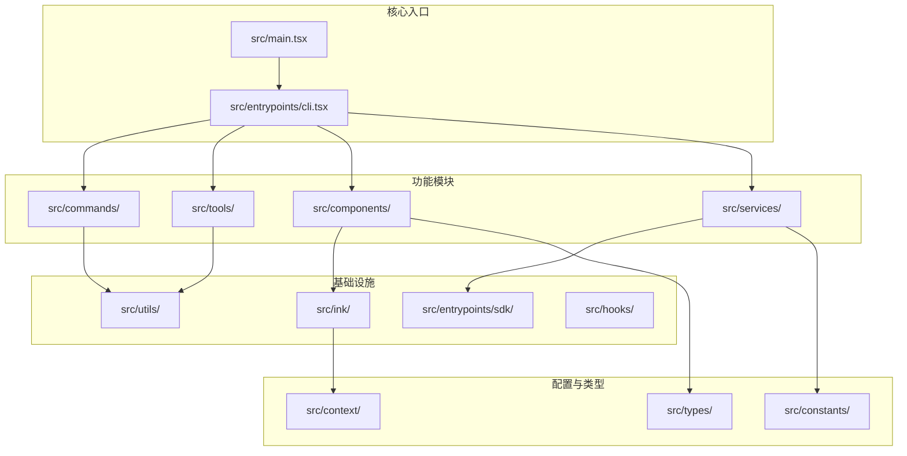
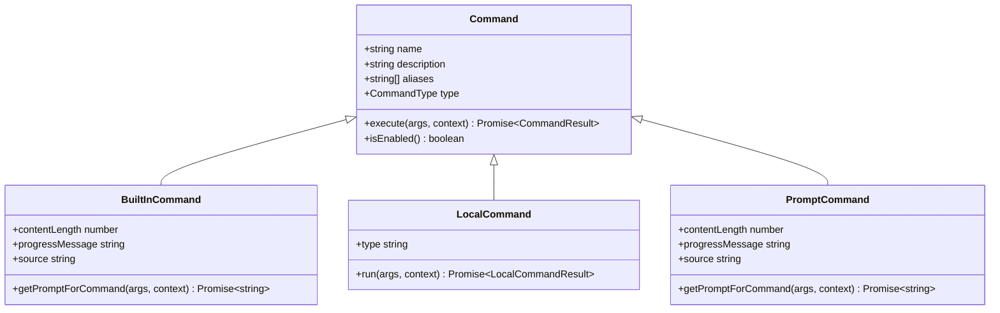
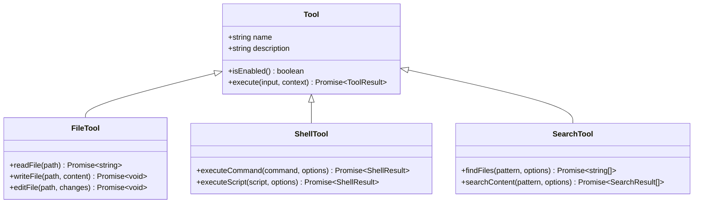
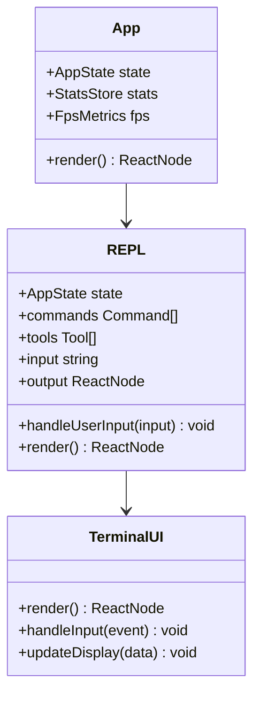
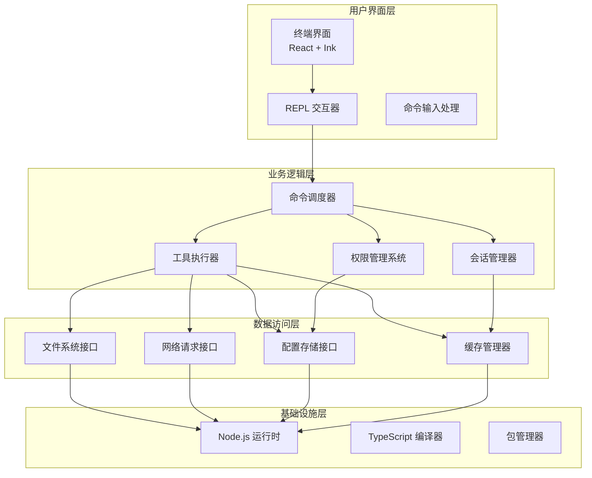
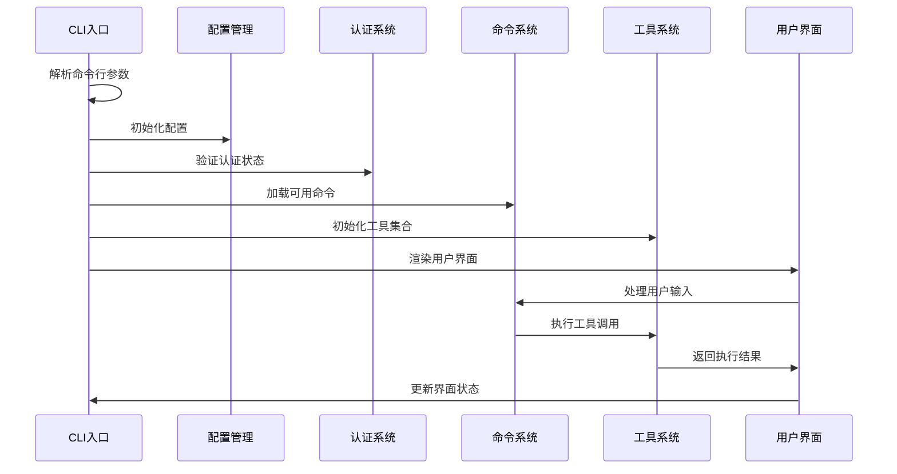
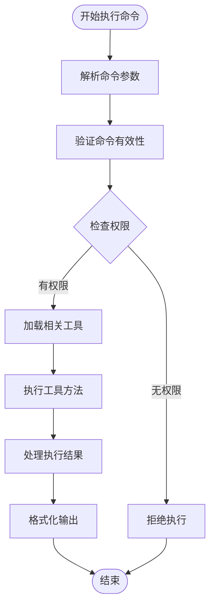
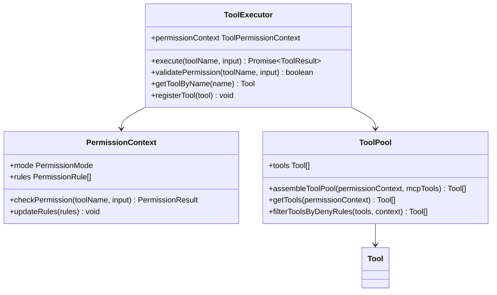
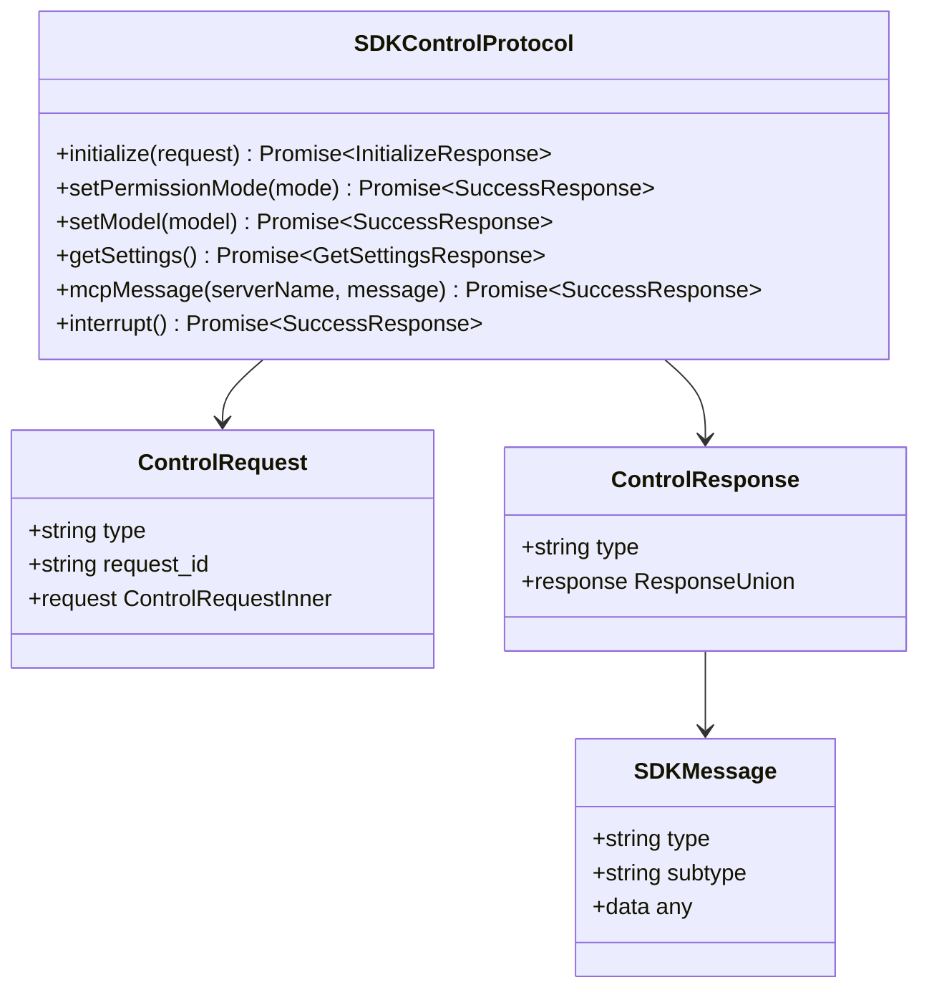
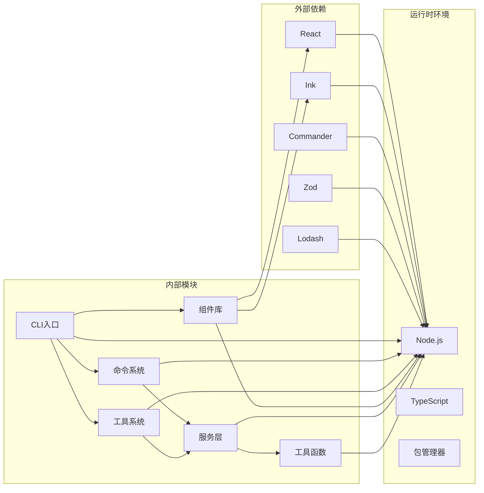

# 项目概述

<cite>
**本文档引用的文件**
- [README.md](file://README.md)
- [package.json](file://package.json)
- [src/main.tsx](file://src/main.tsx)
- [src/entrypoints/cli.tsx](file://src/entrypoints/cli.tsx)
- [src/components/App.tsx](file://src/components/App.tsx)
- [src/commands.ts](file://src/commands.ts)
- [src/tools.ts](file://src/tools.ts)
- [src/entrypoints/sdk/controlSchemas.ts](file://src/entrypoints/sdk/controlSchemas.ts)
- [src/entrypoints/sdk/coreSchemas.ts](file://src/entrypoints/sdk/coreSchemas.ts)
- [src/entrypoints/sdk/coreTypes.ts](file://src/entrypoints/sdk/coreTypes.ts)
- [src/ink.ts](file://src/ink.ts)
- [src/replLauncher.tsx](file://src/replLauncher.tsx)
</cite>

## 目录
1. [项目简介](#项目简介)
2. [项目结构](#项目结构)
3. [核心组件](#核心组件)
4. [架构总览](#架构总览)
5. [详细组件分析](#详细组件分析)
6. [依赖关系分析](#依赖关系分析)
7. [性能考虑](#性能考虑)
8. [故障排除指南](#故障排除指南)
9. [结论](#结论)

## 项目简介

Claude Code 是一个基于 Node.js 的命令行工具，结合了桌面应用程序特性的 AI 辅助开发工具。该项目并非 Anthropic 官方仓库，而是通过解析官方 npm 包中的源码映射文件提取出的 TypeScript 源代码。

### 核心价值主张

- **终端集成的 AI 协作**：直接在终端中与 Claude AI 助手交互，无需切换到浏览器或桌面应用
- **全栈工程能力**：支持代码编辑、文件操作、命令执行、代码搜索、Git 工作流管理等软件工程任务
- **丰富的工具生态**：内置多种工具（Bash、文件读写、搜索、Web 访问等）和可扩展的插件系统
- **跨平台兼容**：支持 macOS、Windows、Linux 等主流操作系统

### 技术架构特点

- **TypeScript + React + Ink 框架**：采用现代前端技术栈构建交互式终端界面
- **模块化设计**：清晰的分层架构，便于维护和扩展
- **插件化架构**：支持动态加载和管理第三方插件
- **MCP（Model Context Protocol）支持**：提供标准化的模型上下文协议接口

### 项目背景

该项目来源于 Anthropic Claude Code CLI 工具的源码泄露事件。源代码通过解析 npm 包中的 `cli.js.map` 文件获得，包含了完整的 TypeScript 源码内容。

### 主要功能特性

- **命令系统**：超过 150 个内置命令，涵盖代码编辑、文件管理、项目导航等
- **工具系统**：提供文件操作、搜索、执行、编辑等核心工具
- **会话管理**：支持多会话管理和历史记录追踪
- **权限控制**：细粒度的工具使用权限管理和安全控制
- **远程协作**：支持远程会话和团队协作功能

### 技术栈选择原因

- **TypeScript**：提供类型安全和更好的开发体验
- **React + Ink**：构建现代化的终端用户界面
- **模块化架构**：便于功能扩展和维护
- **MCP 协议**：标准化的模型交互接口，便于集成各种 AI 服务

## 项目结构

项目采用模块化的目录结构，按照功能领域进行组织：

**图表来源**
- [src/main.tsx:1-800](file://src/main.tsx#L1-L800)
- [src/entrypoints/cli.tsx:1-303](file://src/entrypoints/cli.tsx#L1-L303)

### 目录结构说明

- **src/**：源代码主目录
  - **cli/**：CLI 入口点和参数解析
  - **commands/**：命令实现模块
  - **components/**：React 组件库
  - **services/**：核心服务层
  - **tools/**：工具实现模块
  - **entrypoints/**：SDK 和其他入口点
  - **ink/**：自定义终端 UI 框架
  - **utils/**：通用工具函数
  - **hooks/**：React 自定义钩子
  - **types/**：TypeScript 类型定义
  - **constants/**：常量定义
  - **context/**：上下文管理

**章节来源**
- [README.md:95-114](file://README.md#L95-L114)

## 核心组件

### 命令系统

命令系统是 Claude Code 的核心功能模块，提供了丰富的软件工程任务自动化能力：

**图表来源**
- [src/commands.ts:207-222](file://src/commands.ts#L207-L222)

### 工具系统

工具系统提供了底层的操作能力，支持文件编辑、命令执行、搜索等功能：

**图表来源**
- [src/tools.ts:1-390](file://src/tools.ts#L1-L390)

### 组件架构

应用采用 React + Ink 架构构建交互式终端界面：

**图表来源**
- [src/components/App.tsx:1-56](file://src/components/App.tsx#L1-L56)
- [src/replLauncher.tsx:1-23](file://src/replLauncher.tsx#L1-L23)

**章节来源**
- [src/commands.ts:258-346](file://src/commands.ts#L258-L346)
- [src/tools.ts:193-251](file://src/tools.ts#L193-L251)
- [src/components/App.tsx:1-56](file://src/components/App.tsx#L1-L56)

## 架构总览

Claude Code 采用了分层架构设计，从底层的工具层到顶层的用户界面层形成了清晰的功能层次：

**图表来源**
- [src/main.tsx:585-800](file://src/main.tsx#L585-L800)
- [src/entrypoints/cli.tsx:33-299](file://src/entrypoints/cli.tsx#L33-L299)

### 核心流程

1. **启动流程**：CLI 入口点解析参数，初始化配置和环境
2. **命令解析**：根据用户输入识别并验证目标命令
3. **权限检查**：评估工具使用权限和安全策略
4. **工具执行**：调用相应工具执行具体任务
5. **结果输出**：格式化并显示执行结果

**章节来源**
- [src/main.tsx:585-800](file://src/main.tsx#L585-L800)
- [src/entrypoints/cli.tsx:33-299](file://src/entrypoints/cli.tsx#L33-L299)

## 详细组件分析

### CLI 启动器

CLI 启动器负责处理命令行参数并协调整个应用的初始化过程：

**图表来源**
- [src/entrypoints/cli.tsx:33-299](file://src/entrypoints/cli.tsx#L33-L299)

### 命令执行引擎

命令执行引擎提供了统一的命令处理框架：

**图表来源**
- [src/commands.ts:476-517](file://src/commands.ts#L476-L517)

### 工具执行器

工具执行器负责管理各种工具的生命周期和执行上下文：

**图表来源**
- [src/tools.ts:271-327](file://src/tools.ts#L271-L327)

**章节来源**
- [src/entrypoints/cli.tsx:33-299](file://src/entrypoints/cli.tsx#L33-L299)
- [src/commands.ts:476-517](file://src/commands.ts#L476-L517)
- [src/tools.ts:271-327](file://src/tools.ts#L271-L327)

### SDK 接口层

SDK 接口层提供了标准化的数据交换协议：

**图表来源**
- [src/entrypoints/sdk/controlSchemas.ts:552-610](file://src/entrypoints/sdk/controlSchemas.ts#L552-L610)

**章节来源**
- [src/entrypoints/sdk/controlSchemas.ts:1-664](file://src/entrypoints/sdk/controlSchemas.ts#L1-L664)
- [src/entrypoints/sdk/coreSchemas.ts:1-800](file://src/entrypoints/sdk/coreSchemas.ts#L1-L800)
- [src/entrypoints/sdk/coreTypes.ts:1-63](file://src/entrypoints/sdk/coreTypes.ts#L1-L63)

## 依赖关系分析

项目采用了模块化的依赖管理策略，通过清晰的边界划分实现了良好的内聚性和低耦合性：

**图表来源**
- [package.json:1-34](file://package.json#L1-L34)

### 关键依赖说明

- **React + Ink**：构建终端用户界面的核心框架
- **Commander**：命令行参数解析和处理
- **Zod**：运行时类型验证和数据校验
- **Lodash**：实用工具函数集合
- **Bun**：构建时的条件编译支持

**章节来源**
- [package.json:1-34](file://package.json#L1-L34)

## 性能考虑

### 启动性能优化

项目采用了多种启动性能优化策略：

1. **延迟加载**：非关键模块采用动态导入，减少初始启动时间
2. **缓存机制**：命令和工具列表使用内存缓存
3. **并行初始化**：多个初始化任务并行执行
4. **条件编译**：通过特征标志移除不使用的代码

### 内存管理

- **垃圾回收优化**：避免创建不必要的临时对象
- **资源清理**：及时释放文件句柄和网络连接
- **缓存策略**：智能的缓存失效和更新机制

### 网络性能

- **请求合并**：批量处理相似的 API 请求
- **超时控制**：合理的超时设置防止阻塞
- **重试机制**：失败请求的自动重试策略

## 故障排除指南

### 常见问题诊断

1. **启动失败**
   - 检查 Node.js 版本是否满足要求（>= 18.0.0）
   - 验证依赖包安装完整性
   - 查看详细的错误日志信息

2. **命令执行异常**
   - 确认用户权限和工具许可
   - 检查工作目录和文件路径
   - 验证网络连接状态

3. **界面显示问题**
   - 检查终端兼容性
   - 验证 ANSI 转义序列支持
   - 确认字体和编码设置

### 调试技巧

- 使用 `--debug` 标志启用详细日志
- 检查配置文件的正确性
- 验证环境变量设置
- 使用最小化配置重现问题

**章节来源**
- [src/main.tsx:265-271](file://src/main.tsx#L265-L271)
- [src/entrypoints/cli.tsx:283-285](file://src/entrypoints/cli.tsx#L283-L285)

## 结论

Claude Code 项目展现了现代 CLI 工具的优秀设计实践，通过模块化架构、丰富的功能特性和优雅的用户体验，为开发者提供了一个强大而易用的 AI 辅助开发平台。

### 项目优势

- **技术先进性**：采用最新的前端技术和架构模式
- **功能完整性**：覆盖软件工程的各个方面
- **扩展性强**：模块化设计便于功能扩展
- **用户体验好**：直观的命令行界面和交互设计

### 发展方向

- **性能优化**：持续改进启动速度和执行效率
- **功能增强**：添加更多实用的开发工具和命令
- **生态建设**：完善插件生态系统和第三方集成
- **平台扩展**：支持更多的开发环境和工具链

该项目为开源社区提供了一个优秀的参考案例，展示了如何将复杂的 AI 功能封装成简洁易用的命令行工具，值得学习和借鉴。